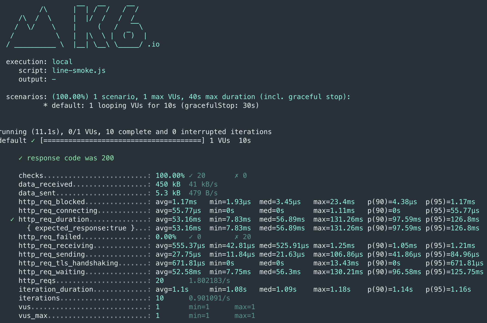
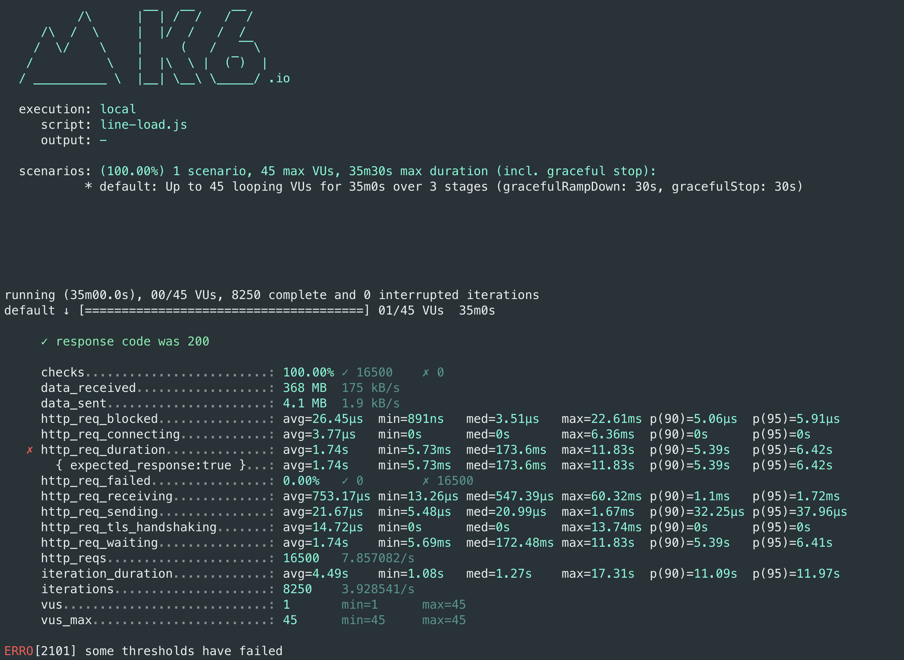
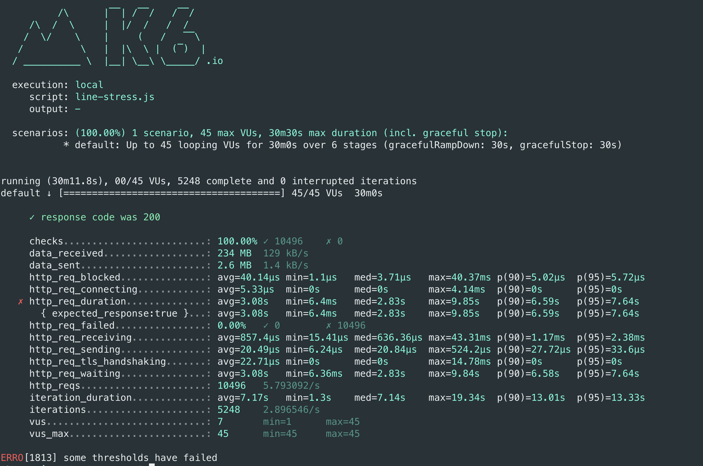

## 노선관리 페이지 부하 테스트 결과

- Smoke Test Script

    ```jsx
    import http from 'k6/http';
    import { check, group, sleep, fail } from 'k6';
    
    export let options = {
      vus: 1, // 1 user looping for 1 minute
      duration: '10s',
    
      thresholds: {
        http_req_duration: ['p(99)<200'], // 99% of requests must complete below 1.5s
      },
    };
    
    const BASE_URL = 'https://wgs-runningmap.kro.kr/';
    
    export default function ()  {
    
      var payload = JSON.stringify({
    		id:19,
    		name:"용인경전철",
    		color:"purple darken-3","stations":[],
    		createdDate:"2021-01-06T09:32:00.901126",
    		modifiedDate:"2021-05-20T17:30:31.890515"
    });
    
      var params = {
        headers: {
          'Content-Type': 'application/json',
        },
      };
    
      let updateRes = http.put(`${BASE_URL}/lines/19`, payload, params);
    
      check(updateRes, {
        'response code was 200': (res) => res.status == 200,
      });
  
      let getRes = http.get(`${BASE_URL}/lines`, params);
    
      check(getRes, {
        'response code was 200': (res) => res.status == 200,
      });
    
      sleep(1);
    };
    ```
- Smoke Test Result
  

- Load Test Script

    ```jsx
    import http from 'k6/http';
    import { check, group, sleep, fail } from 'k6';
    
    export let options = {
      stages: [
        { duration: '10m', target: 4 }, // simulate ramp-up of traffic from 1 to 100 users over 5 minutes.
        { duration: '20m', target: 45 }, // stay at 100 users for 10 minutes
        { duration: '5m', target: 0 }, // ramp-down to 0 users
      ],
      thresholds: {
        http_req_duration: ['p(99)<200'], // 99% of requests must complete below 1.5s
        'response code was 200': ['p(99)<200'], // 99% of requests must complete below 1.5s
      },
    };
    
    const BASE_URL = 'https://wgs-runningmap.kro.kr/';
    
    export default function ()  {
    
      var payload = JSON.stringify({
    		id:19,
    		name:"용인경전철",
    		color:"purple darken-3","stations":[],
    		createdDate:"2021-01-06T09:32:00.901126",
    		modifiedDate:"2021-05-20T17:30:31.890515"
    });
    
      var params = {
        headers: {
          'Content-Type': 'application/json',
        },
      };
    
      let updateRes = http.put(`${BASE_URL}/lines/19`, payload, params);
    
      check(updateRes, {
        'response code was 200': (res) => res.status == 200,
      });
  
      let getRes = http.get(`${BASE_URL}/lines`, params);
    
      check(getRes, {
        'response code was 200': (res) => res.status == 200,
      });
    
      sleep(1);
    };
    ```
- Load Test Result
  
- Stress Test Script

    ```jsx
    import http from 'k6/http';
    import { check, group, sleep, fail } from 'k6';
    
    export let options = {
      stages: [
        { duration: '5m', target: 4 }, // simulate ramp-up of traffic from 1 to 100 users over 5 minutes.
        { duration: '5m', target: 4 }, // stay at 100 users for 10 minutes
        { duration: '5m', target: 25 }, // ramp-down to 0 users
    	{ duration: '5m', target: 25 },
    	{ duration: '5m', target: 45 },
        { duration: '5m', target: 45 },
      ],
      thresholds: {
        http_req_duration: ['p(99)<200'], // 99% of requests must complete below 1.5s
        'response code was 200': ['p(99)<200'], // 99% of requests must complete below 1.5s
      },
    };
    
    const BASE_URL = 'https://wgs-runningmap.kro.kr/';
    
    export default function ()  {
    
      var payload = JSON.stringify({
    		id:19,
    		name:"용인경전철",
    		color:"purple darken-3","stations":[],
    		createdDate:"2021-01-06T09:32:00.901126",
    		modifiedDate:"2021-05-20T17:30:31.890515"
    });
    
      var params = {
        headers: {
          'Content-Type': 'application/json',
        },
      };
    
      let updateRes = http.put(`${BASE_URL}/lines/19`, payload, params);
    
      check(updateRes, {
        'response code was 200': (res) => res.status == 200,
      });
  
      let getRes = http.get(`${BASE_URL}/lines`, params);
    
      check(getRes, {
        'response code was 200': (res) => res.status == 200,
      });
    
      sleep(1);
    };
    ```
  - Stress Test Result
    
