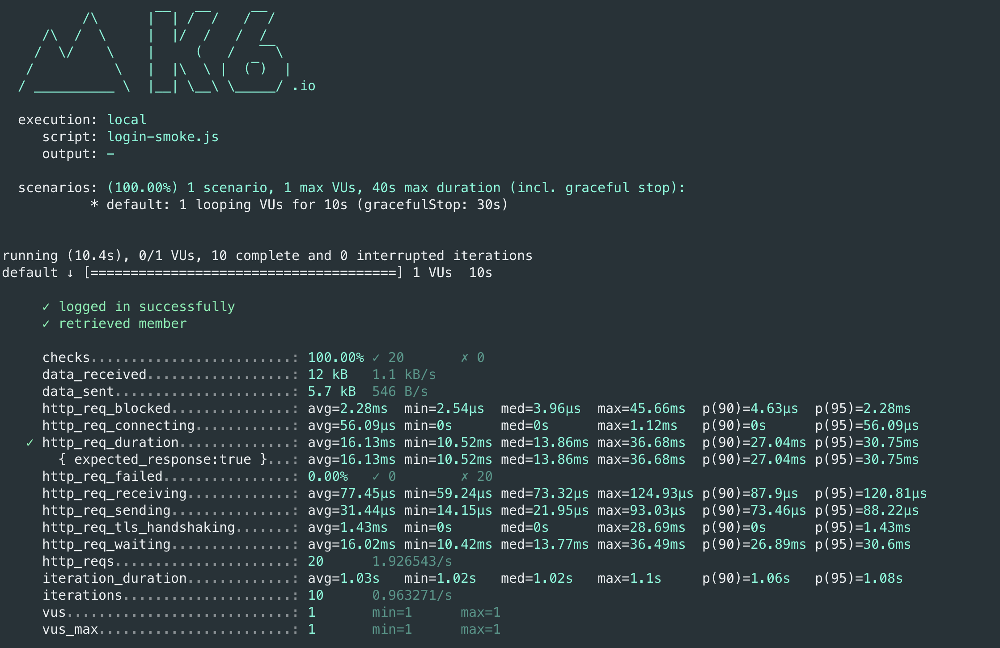
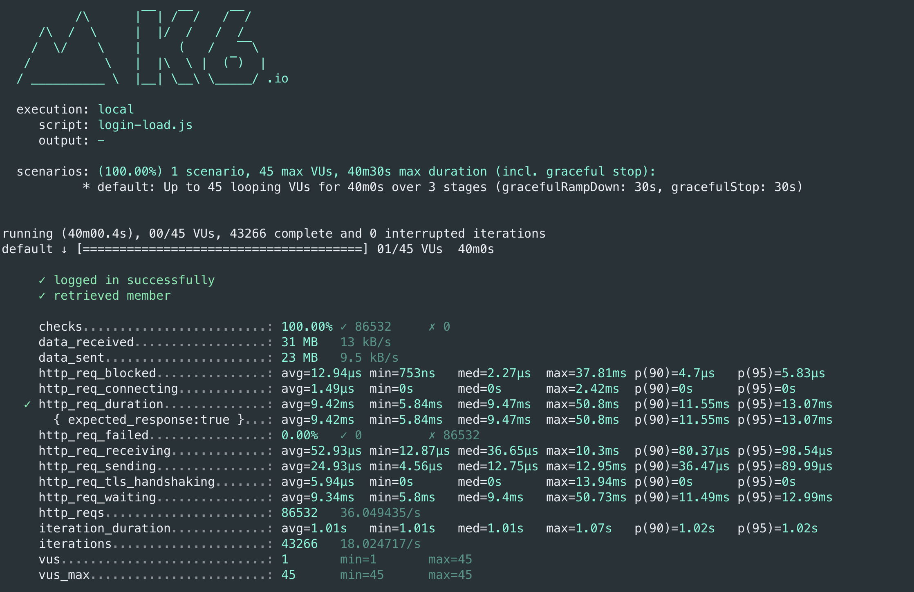
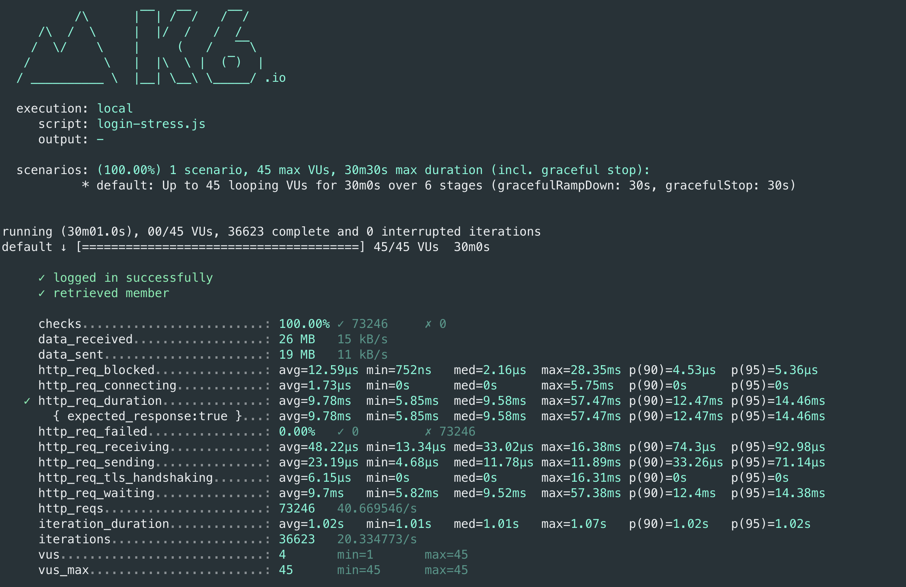

##로그인 페이지 부하테스트 결과
- Smoke Test Script

    ```jsx
    import http from 'k6/http';
    import { check, group, sleep, fail } from 'k6';
    
    export let options = {
      vus: 1, // 1 user looping for 1 minute
      duration: '10s',
    
      thresholds: {
        http_req_duration: ['p(99)<200'], // 99% of requests must complete below 1.5s
      },
    };
    
    const BASE_URL = 'https://wgs-runningmap.kro.kr/';
    const USERNAME = 'ugs1575@naver.com';
    const PASSWORD = 'secret';
    
    export default function ()  {
    
      var payload = JSON.stringify({
        email: USERNAME,
        password: PASSWORD,
      });
    
      var params = {
        headers: {
          'Content-Type': 'application/json',
        },
      };
    
      let loginRes = http.post(`${BASE_URL}/login/token`, payload, params);
    
      check(loginRes, {
        'logged in successfully': (resp) => resp.json('accessToken') !== '',
      });
    
      let authHeaders = {
        headers: {
          Authorization: `Bearer ${loginRes.json('accessToken')}`,
        },
      };
      let myObjects = http.get(`${BASE_URL}/members/me`, authHeaders).json();
      check(myObjects, { 'retrieved member': (obj) => obj.id != 0 });
      sleep(1);
    };
    ```
- Smoke Test Result


- Load Test Script 

    ```jsx
    import http from 'k6/http';
    import { check, group, sleep, fail } from 'k6';
    
    export let options = {
      stages: [
        { duration: '10m', target: 4 }, // simulate ramp-up of traffic from 1 to 100 users over 5 minutes.
        { duration: '20m', target: 45 }, // stay at 100 users for 10 minutes
        { duration: '5m', target: 0 }, // ramp-down to 0 users
      ],
      thresholds: {
        http_req_duration: ['p(99)<200'], // 99% of requests must complete below 1.5s
        'logged in successfully': ['p(99)<200'], // 99% of requests must complete below 1.5s
      },
    };
    
    const BASE_URL = 'https://wgs-runningmap.kro.kr/';
    const USERNAME = 'ugs1575@naver.com';
    const PASSWORD = 'secret';
    
    export default function ()  {
    
      var payload = JSON.stringify({
        email: USERNAME,
        password: PASSWORD,
      });
    
      var params = {
        headers: {
          'Content-Type': 'application/json',
        },
      };
    
      let loginRes = http.post(`${BASE_URL}/login/token`, payload, params);
    
      check(loginRes, {
        'logged in successfully': (resp) => resp.json('accessToken') !== '',
      });
    
      let authHeaders = {
        headers: {
          Authorization: `Bearer ${loginRes.json('accessToken')}`,
        },
      };
      let myObjects = http.get(`${BASE_URL}/members/me`, authHeaders).json();
      check(myObjects, { 'retrieved member': (obj) => obj.id != 0 });
      sleep(1);
    };
    ```
- Load Test Result
  
- Stress Test Script

    ```jsx
    import http from 'k6/http';
    import { check, group, sleep, fail } from 'k6';
    
    export let options = {
      stages: [
        { duration: '5m', target: 4 }, // simulate ramp-up of traffic from 1 to 100 users over 5 minutes.
        { duration: '5m', target: 4 }, // stay at 100 users for 10 minutes
        { duration: '5m', target: 25 }, // ramp-down to 0 users
    	{ duration: '5m', target: 25 },
    	{ duration: '5m', target: 45 },
        { duration: '5m', target: 45 },
      ],
      thresholds: {
        http_req_duration: ['p(99)<200'], // 99% of requests must complete below 1.5s
        'logged in successfully': ['p(99)<200'], // 99% of requests must complete below 1.5s
      },
    };
    
    const BASE_URL = 'https://wgs-runningmap.kro.kr/';
    const USERNAME = 'ugs1575@naver.com';
    const PASSWORD = 'secret';
    
    export default function ()  {
    
      var payload = JSON.stringify({
        email: USERNAME,
        password: PASSWORD,
      });
    
      var params = {
        headers: {
          'Content-Type': 'application/json',
        },
      };
    
      let loginRes = http.post(`${BASE_URL}/login/token`, payload, params);
    
      check(loginRes, {
        'logged in successfully': (resp) => resp.json('accessToken') !== '',
      });
    
      let authHeaders = {
        headers: {
          Authorization: `Bearer ${loginRes.json('accessToken')}`,
        },
      };
      let myObjects = http.get(`${BASE_URL}/members/me`, authHeaders).json();
      check(myObjects, { 'retrieved member': (obj) => obj.id != 0 });
      sleep(1);
    };
    ```
- Stress Test Result
  