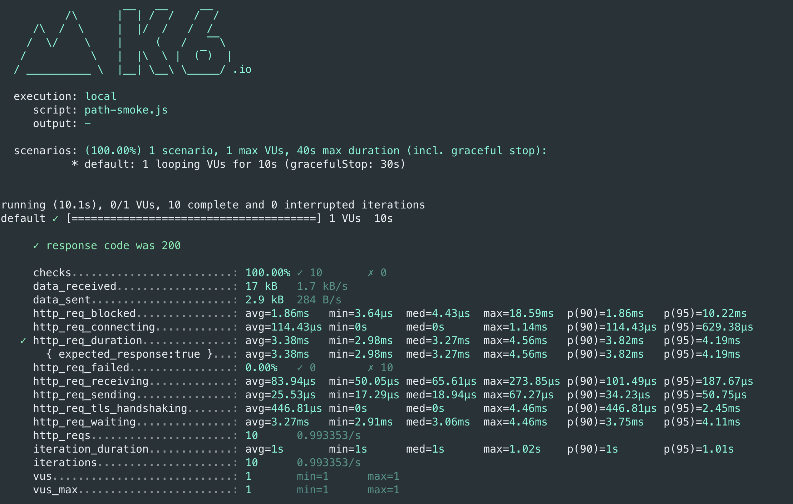
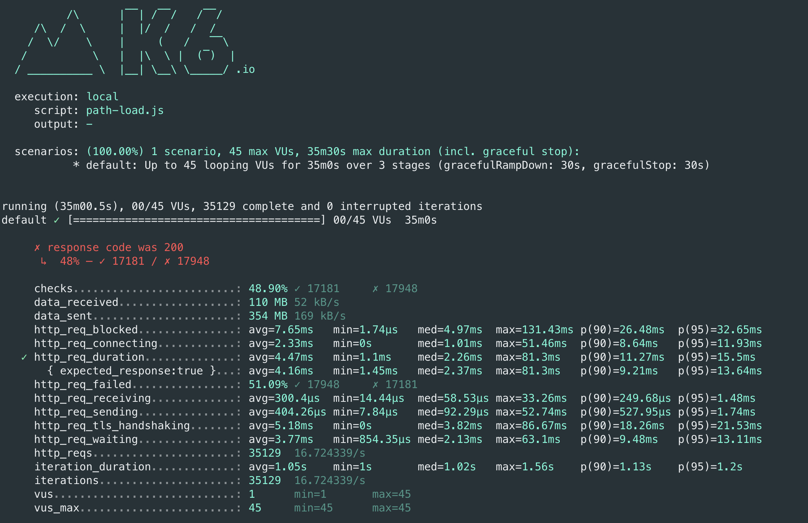
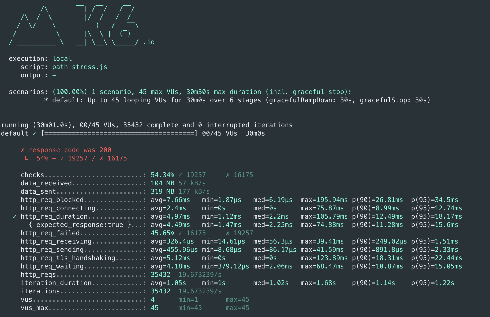

## 경로검색 페이지 부하 테스트 결과
- Smoke Test Script

     ```jsx
    import { URL } from 'https://jslib.k6.io/url/1.0.0/index.js';
    import http from 'k6/http';
    import { check, group, sleep, fail } from 'k6';
    
    export let options = {
      vus: 1, // 1 user looping for 1 minute
      duration: '10s',
    
      thresholds: {
        http_req_duration: ['p(99)<100'], // 99% of requests must complete below 1.5s
      },
    };
    
    const url = new URL('https://wgs-runningmap.kro.kr/');
    
    export default function ()  {
      url.searchParams.append('source', '3');
      url.searchParams.append('target', '5');
  
      var params = {
        headers: {
          'Content-Type': 'application/json',
        },
      };
      
      let getRes = http.get(url.toString(), params);
    
      check(getRes, {
        'response code was 200': (res) => res.status == 200,
      });
    
      sleep(1);
    };
    ```
- Smoke Test Result
  
- Load Test Script
  ```jsx
    import { URL } from 'https://jslib.k6.io/url/1.0.0/index.js';
    import http from 'k6/http';
    import { check, group, sleep, fail } from 'k6';
    
    export let options = {
      stages: [
        { duration: '10m', target: 4 }, // simulate ramp-up of traffic from 1 to 100 users over 5 minutes.
        { duration: '20m', target: 45 }, // stay at 100 users for 10 minutes
        { duration: '5m', target: 0 }, // ramp-down to 0 users
      ],
      thresholds: {
        http_req_duration: ['p(99)<100'], // 99% of requests must complete below 1.5s
        'response code was 200': ['p(99)<100'], // 99% of requests must complete below 1.5s
      },
    };
    
    const url = new URL('https://wgs-runningmap.kro.kr/');
    
    export default function ()  {
      url.searchParams.append('source', '3');
      url.searchParams.append('target', '5');
  
      var params = {
        headers: {
          'Content-Type': 'application/json',
        },
      };
    
      let getRes = http.get(url.toString(), params);
    
      check(getRes, {
        'response code was 200': (res) => res.status == 200,
      });
    
      sleep(1);
    };
    ```
  
- Load Test Result
  
- Stress Test Script

    ```jsx
    import { URL } from 'https://jslib.k6.io/url/1.0.0/index.js';
    import http from 'k6/http';
    import { check, group, sleep, fail } from 'k6';
    
    export let options = {
      stages: [
        { duration: '5m', target: 4 }, // simulate ramp-up of traffic from 1 to 100 users over 5 minutes.
        { duration: '5m', target: 4 }, // stay at 100 users for 10 minutes
        { duration: '5m', target: 25 }, // ramp-down to 0 users
    	{ duration: '5m', target: 25 },
    	{ duration: '5m', target: 45 },
        { duration: '5m', target: 45 },
      ],
      thresholds: {
        http_req_duration: ['p(99)<100'], // 99% of requests must complete below 1.5s
        'response code was 200': ['p(99)<100'], // 99% of requests must complete below 1.5s
      },
    };
    
    const url = new URL('https://wgs-runningmap.kro.kr/');
    
    export default function ()  {
      url.searchParams.append('source', '3');
      url.searchParams.append('target', '5');
    
      var params = {
        headers: {
          'Content-Type': 'application/json',
        },
      };
    
      let getRes = http.get(url.toString(), params);
    
      check(getRes, {
        'response code was 200': (res) => res.status == 200,
      });
    
      sleep(1);
    };
    ```
  - Stress Test Result
    