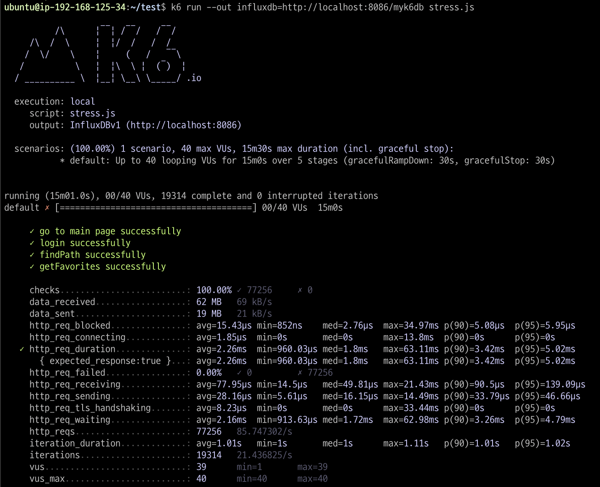

<p align="center">
    
</p>
<p align="center">
  
  
  <a href="https://edu.nextstep.camp/c/R89PYi5H" alt="nextstep atdd">
    
  </a>
  
</p>

<br>

# 인프라공방 샘플 서비스 - 지하철 노선도

<br>

## 🚀 Getting Started

### Install

#### npm 설치

```
cd frontend
npm install
```

> `frontend` 디렉토리에서 수행해야 합니다.

### Usage

#### webpack server 구동

```
npm run dev
```

#### application 구동

```
./gradlew clean build
```

<br>

### 1단계 - 웹 성능 테스트

1. 웹 성능예산은 어느정도가 적당하다고 생각하시나요

- 내 사이트 : http://woody-log.kro.kr
- 경쟁사 분석

| 구분       | FCP   | TTI   | SP    | TBT    | LCP  | CLS   |
|----------|-------|-------|-------|--------|------|-------|
| 서울교통공사   | 6.5s  | 9.2s  | 11.9s | 0.187s | 6.7s | 0     |
| 네이버 지도   | 2.2s  | 6.5s  | 5.4s  | 0.34s  | 8.1s | 0.03  |
| 카카오맵     | 1.7s  | 4.2s  | 7.1s  | 0.05s  | 6.4s | 0.005 |
| 내 사이트    | 14.3s | 14.9s | 14.3s | 0.48s  | 15s  | 0.042 |

- 이용자에게 정보를 제공하는것이 목적인 애플리케이션이기 때문에
- FCP, LCP의 개선이 중요하다고 생각됩니다.
- 목표 FCP : 1.7s (3사 비교 가장 빠른 카카오 기준)
- 목표 LCP : 6.4s (3사 비교 가장 빠른 카카오 기준)

2. 웹 성능예산을 바탕으로 현재 지하철 노선도 서비스는 어떤 부분을 개선하면 좋을까요

- 캐시 설정
- keep-alive 설정
- gzip 압축, 이미지 압축
- 불필요한 다운로드 제거(사용하지 않는 js 파일 제거)

---

### 2단계 - 부하 테스트

1. 부하테스트 전제조건은 어느정도로 설정하셨나요

* 대상시스템 범위
    * 메인페이지
    * 로그인
    * 경로검색
    * 즐겨찾기

2020년 기준 일 평균 이용고객 대략 700만명 지하철 어플 이용고객을 대략 전체 이용고객의 10% 이하로 산정 대략 50만명 최대 트랙픽은 평소 트래픽에 3배로 가정

* 1일 총 접속 수 : 500,000 * 10 = 5,000,000
* 1일 평균 rps : 5,000,000 / 86,400 = 58rps
* 최대 트래픽 : 3,750,000
* 평소 트래픽 : 1,250,000
* 1일 최대 rps : 58 * (3,750,000 / 1,250,000) = 174 rps

2. Smoke, Load, Stress 테스트 스크립트와 결과를 공유해주세요

* smoke test
  

* load test
  

* stress test
  

---

### 3단계 - 로깅, 모니터링

1. 각 서버내 로깅 경로를 알려주세요

```
~/subway-infra-deploy/log/file.log
~/subway-infra-deploy/log/json.log  
/var/log/nginx/syslog.log
/var/log/nginx/access.log  
/var/log/nginx/error.log  
```

2. Cloudwatch 대시보드 URL을 알려주세요
   https://ap-northeast-2.console.aws.amazon.com/cloudwatch/home?region=ap-northeast-2#dashboards:name=woody-log-dashboard
