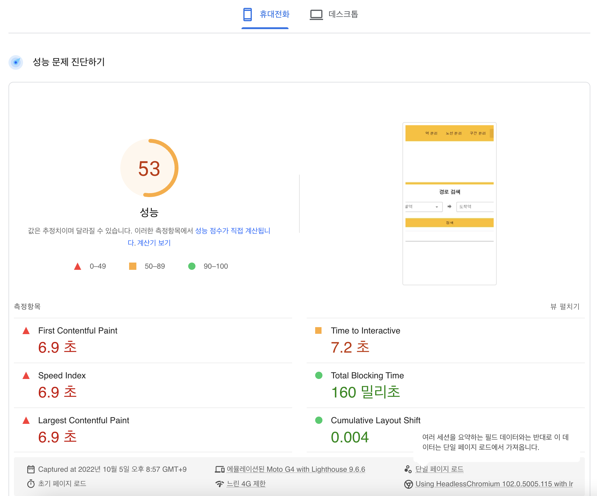
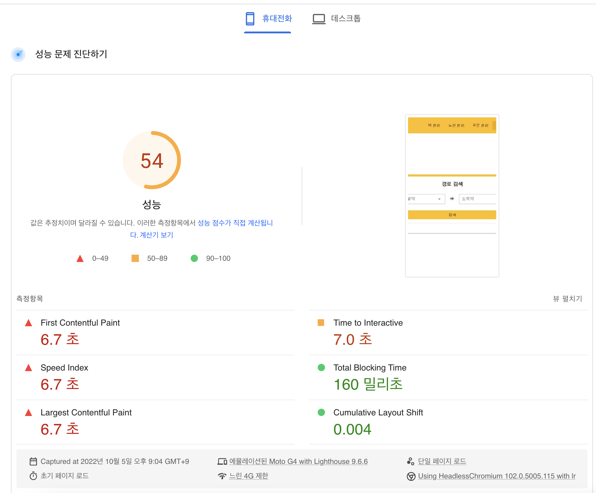
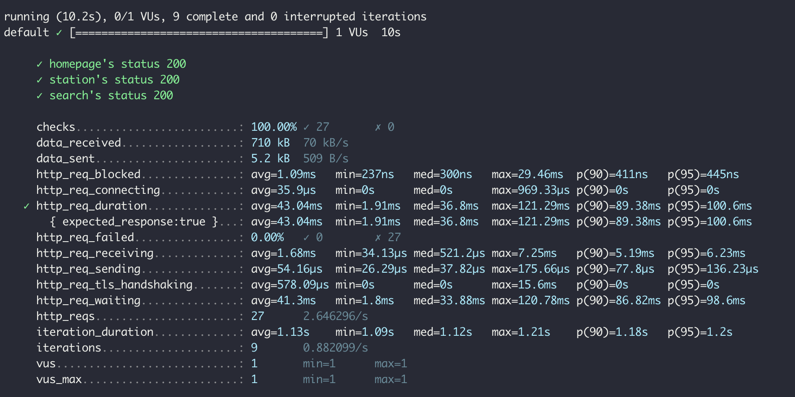
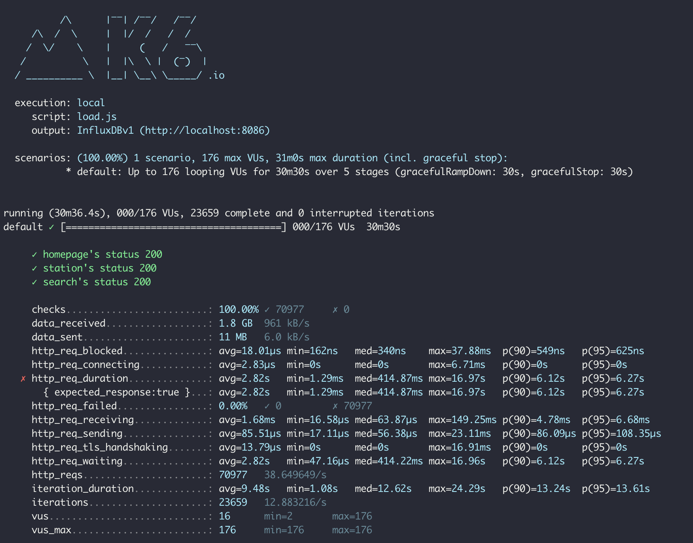
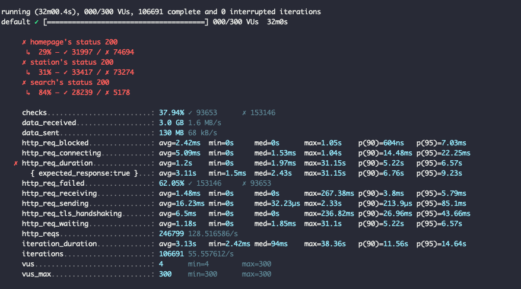

<p align="center">
    
</p>
<p align="center">
  
  
  <a href="https://edu.nextstep.camp/c/R89PYi5H" alt="nextstep atdd">
    
  </a>
  
</p>

<br>

# 인프라공방 샘플 서비스 - 지하철 노선도

<br>

## 🚀 Getting Started

### Install
#### npm 설치
```
cd frontend
npm install
```
> `frontend` 디렉토리에서 수행해야 합니다.

### Usage
#### webpack server 구동
```
npm run dev
```
#### application 구동
```
./gradlew clean build
```
<br>


### 1단계 - 화면 응답 개선하기
1. 웹 성능예산은 어느정도가 적당하다고 생각하시나요. 이 때, 서버 목표 응답시간은 어떻게 되나요?

* 응답 개선 url : https://www.infra-subway-deploy.kro.kr/path
* 비교군 url : https://m.map.kakao.com/ (경쟁사 : 카카오맵)
* 성능 예산 : 모바일 기기의 Time to Interactive는 5초 미만 (경로 검색이 주요 핵심 도메인이라 판단했기 때문)
* 목표 응답 시간 : TTI 5초 미만

2. 성능 개선 결과를 공유해주세요

* 성능 개선 전 TTI : 15.2초
* gzip 적용 후 TTI : 7.2초 (대폭 개선)
   * 
* http 2.0 && cache 적용 후 TTI : 7.0초 (소폭 개선)
   * 

3. 어떤 부분을 개선해보셨나요? 과정을 설명해주세요

* nginx에 gzip 적용
* nginx에 정적 리소스 cache 적용
   * 다만, 캐시 적용 됐는지가 의문 (nginx 캐시 저장 디렉토리가 비어있음)
* https 2.0 적용

---

### 2단계 - 부하 테스트 
1. 부하테스트 전제조건은 어느정도로 설정하셨나요
* 목표 rps 구하기
  a. 우선 예상 1일 사용자 수(DAU)를 정해봅니다. : 2,000,000
  b. 피크 시간대의 집중률을 예상해봅니다. (최대 트래픽 / 평소 트래픽) : 10
  c. 1명당 1일 평균 접속 혹은 요청수를 예상해봅니다. : 2
  d. 이를 바탕으로 Throughput을 계산합니다. 
     - 1일 사용자 수(DAU) x 1명당 1일 평균 접속 수 = 1일 총 접속 수 : 4,000,000 (2,000,000 * 2)
     - 1일 총 접속 수 / 86,400 (초/일) = 1일 평균 rps : 약 46 rps (4,000,000 / 86,400)
     - 1일 평균 rps x (최대 트래픽 / 평소 트래픽) = 1일 최대 rps : 약 460 rps (46 * 10)

* VUser 구하기
  a. R = 3 (홈페이지 접속 > 경로 검색 탭 접근 > 출발역 & 도착역 선택 후 검색)
  b. T = 1.15 (3 (R) * 0.05 (http_req_duration)) + 1s
  c. VUser = 176 (460 (목표 rps) * 1.15 (T)) / 3 (R)

2. Smoke, Load, Stress 테스트 스크립트와 결과를 공유해주세요

* Smoke Test
  * 스크립트 : ./loadtest/smoke.js
  * 결과
    * 

* Load Test
  * 스크립트 : ./loadtest/load.js
  * 결과
    * 

* Stress Test
  * 스크립트 : ./loadtest/stress.js
  * 결과
    * 
  
---

### 3단계 - 스케일 아웃

1. Launch Template 링크를 공유해주세요.

2. cpu 부하 실행 후 EC2 추가생성 결과를 공유해주세요. (Cloudwatch 캡쳐)

```sh
$ stress -c 2
```

---

### [추가] 로깅, 모니터링
1. 각 서버내 로깅 경로를 알려주세요

2. Cloudwatch 대시보드 URL을 알려주세요
---

### [추가] WAS 개선하기
1. 성능 개선 결과를 공유해주세요 (Smoke, Load, Stress 테스트 결과)

2. 어떤 부분을 개선해보셨나요? 과정을 설명해주세요
