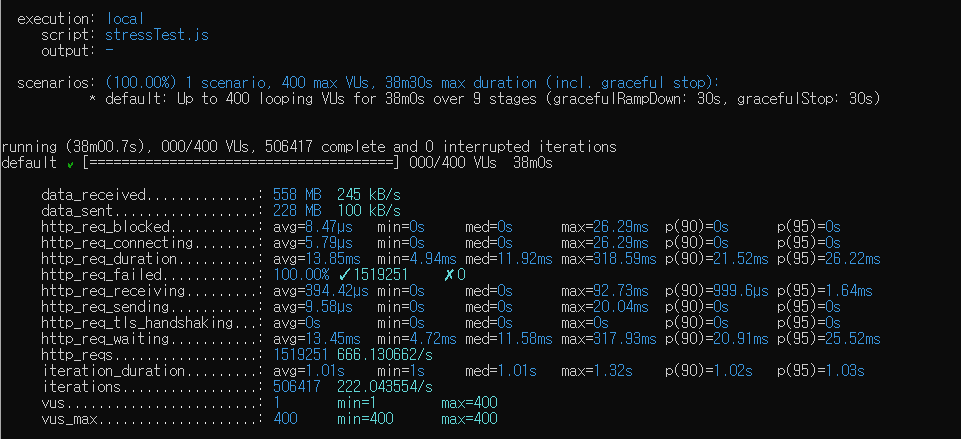

<p align="center">
    
</p>
<p align="center">
  
  
  <a href="https://edu.nextstep.camp/c/R89PYi5H" alt="nextstep atdd">
    
  </a>
  
</p>

<br>

# 인프라공방 샘플 서비스 - 지하철 노선도

<br>

## 🚀 Getting Started

### Install
#### npm 설치
```
cd frontend
npm install
```
> `frontend` 디렉토리에서 수행해야 합니다.

### Usage
#### webpack server 구동
```
npm run dev
```
#### application 구동
```
./gradlew clean build
```
<br>

## 미션

* 미션 진행 후에 아래 질문의 답을 작성하여 PR을 보내주세요.

### 1단계 - 인프라 운영하기
1. 각 서버내 로깅 경로를 알려주세요
   - external-server
     - nginx
       - /var/log/nginx/ access.log , error.log
     - web-app 
       - /var/log/app/prod/error_log.log, prod_log
       - 
2. Cloudwatch 대시보드 URL을 알려주세요
   https://ap-northeast-2.console.aws.amazon.com/cloudwatch/home?region=ap-northeast-2#dashboards:name=seunghoona-dashboard

#### 요구사항정의
- [x] 애플리케이션 진단하기 실습을 진행해보고 문제가 되는 코드를 수정
- [x] 로그 설정하기
- [x] CloudWatch 모니터링

#### 로그 설정하기
- [x] Application Log 파일로 저장하기
    - [x] 회원가입
    - [x] 로그인
    - [x] 최단거리 조회 등의 이벤트에 로깅을 설정
- [x] Nginx Access Log 설정하기
- [x] Cloudwatch로 모니터링
    - [x] CloudWatch 로그 수집하기
    - [x] CloudWatch 메트릭 수집하기

---
- [ ] 웹 성능 테스트
    - [ ] 웹 성능 예산을 작성
    - [x] WebPageTest, PageSpeed 등 테스트해보고 개선이 필요한 부분을 파악

- [x] 부하 테스트
    - [x] 테스트 전제조건 정리
        - [x] 대상 시스템 범위
        - [x] 목푯값 설정 (latency, throughput, 부하 유지기간)
        - [x] 부하 테스트 시 저장될 데이터 건수 및 크기
    - [x] 각 시나리오에 맞춰 스크립트 작성
        - [x] 접속 빈도가 높은 페이지
        - [x] 데이터를 갱신하는 페이지
        - [x] 데이터를 조회하는데 여러 데이터를 참조하는 페이지
    - [x] Smoke, Load, Stress 테스트 후 결과를 기록

### 2단계 - 성능 테스트
1. 웹 성능예산은 어느정도가 적당하다고 생각하시나요
   경쟁사 네이버
   https://m.map.naver.com/subway/subwayLine.naver?region=1000


|1|N 경쟁사|우리제품|
|:---:|:---:|:---:|
|FCP| 2.2|14.9초|
|TTI|7.2초|15.6초|
|TBT|450ms|630ms|
|LCP|7.8초|15.6|
|점수|61점|29점|
### 성능 예산 
- FCP 3초 미만 
- TTI 5초 미만
- 글꼴 최대 2개까지 사용 
- 압축된 리소스 최대 크기 200KB 미만
- 이미지 확장자 avif사용 
  - 500px 30kb
  - 1000px 90kb
  - 1500px 160kb

- Lighthouse 성능 감사에서 80점이상을 목표로 한다.

2. 웹 성능예산을 바탕으로 현재 지하철 노선도 서비스는 어떤 부분을 개선하면 좋을까요
   - 사용하지 않는 CSS 삭제
   - 자바스크립트 gzip 사용
   - 웹 글꼴 미리로드
   - 이미지 파일 크기 제한
   - HTML 문서 파싱후에 실행되도록  defer 추가
   - CDN 사용하기
   - 이미지 캐싱
   - 스크립트 요청을 하나로 합쳐서 처리

3. 부하테스트 전제조건은 어느정도로 설정하셨나요
-----------
###대상 시스템 범위
|시스템범위|was|db|
|:---:|:---:|:---:|
------------------
## 목푯값 설정
### latency
- 100m
### Throughput
1. 대조군 사이트 `네이버 지하철앱`
    - 1392만명의 월 활성 이용자가 존재한다.
    - 해당 유저의 10분의 1인 139만을 기준으로 근거를 제시한다 .
    - **일 평균 이용자 46000 = (139/30일)**
2. 평균 하루 유저가 접속할 페이지 수
    - 메인화면 - 경로찾기 - 로그인 -경로찾기화면 - 경로찾기  5회 호출
    - 하루 평균 3번정도 접속한다는 가정을한다.
```javascript
   5*3 = 15번
```

|총 접속 수(DAU) | 1인당 하루에 몇번 접속|
|:---:|:---:|
|46000|15번|

|이름|계산식| 결과|
|:---:|:---:|:---:|
|1일평균 rps|46000 * 15 / 86400 |8rps
|최대트래픽/최소트래픽|기준모르겠네요 ..|10|
|1일 최대 rps|8rps * 10|80rps|


4. Smoke, Load, Stress 테스트 스크립트와 결과를 공유해주세요

### 접속빈도가 높은 페이지 
```javascript
import http from 'k6/http';
import { check, group, sleep, fail } from 'k6';

export let options = {
  vus: 1, // 1 user looping for 1 minute
  duration: '10s',
  thresholds: {
    http_req_duration: ['p(99)<1500'], // 99% of requests must complete below 1.5s
  },
};

const BASE_URL = 'http://seunghoona-alb-174439830.ap-northeast-2.elb.amazonaws.com';
const USERNAME = 'test@gmail.com';
const PASSWORD = 'rndrmagody';

export default function ()  {

  const payload = JSON.stringify({
    email: USERNAME,
    password: PASSWORD,
  });

  const params = {
    headers: {
      'Content-Type': 'application/json',
    },
  };


  const loginRes = http.post(`${BASE_URL}/login/token`, payload, params);

  check(loginRes, {
    'logged in successfully': (resp) => resp.json('accessToken') !== '',
  });


  const authHeaders = {
    headers: {
      Authorization: `Bearer ${loginRes.json('accessToken')}`,
    },
  };

  const myObjects = http.get(`${BASE_URL}/members/me`, authHeaders).json();
  check(myObjects, { 'retrieved member': (obj) => obj.id !== 0 });
  sleep(1);
};
```

```shell

          /\      |‾‾| /‾‾/   /‾‾/
     /\  /  \     |  |/  /   /  /
    /  \/    \    |     (   /   ‾‾\
   /          \   |  |\  \ |  (‾)  |
  / __________ \  |__| \__\ \_____/ .io

  execution: local
     script: smoke.js
     output: -

  scenarios: (100.00%) 1 scenario, 1 max VUs, 40s max duration (incl. graceful stop):
           * default: 1 looping VUs for 10s (gracefulStop: 30s)


running (10.6s), 0/1 VUs, 10 complete and 0 interrupted iterations
default ✓ [======================================] 1 VUs  10s

     ✓ logged in successfully
     ✓ retrieved member

     checks.........................: 100.00% ✓ 20       ✗ 0
     data_received..................: 5.0 kB  475 B/s
     data_sent......................: 5.4 kB  509 B/s
     http_req_blocked...............: avg=756.45µs min=0s      med=0s      max=15.12ms p(90)=0s       p(95)=756.45µs
     http_req_connecting............: avg=356.19µs min=0s      med=0s      max=7.12ms  p(90)=0s       p(95)=356.19µs
   ✓ http_req_duration..............: avg=23.27ms  min=15.35ms med=22.09ms max=51.48ms p(90)=27.3ms   p(95)=48.77ms
       { expected_response:true }...: avg=23.27ms  min=15.35ms med=22.09ms max=51.48ms p(90)=27.3ms   p(95)=48.77ms
     http_req_failed................: 0.00%   ✓ 0        ✗ 20
     http_req_receiving.............: avg=183.31µs min=0s      med=53.45µs max=779.7µs p(90)=561.55µs p(95)=666.93µs
     http_req_sending...............: avg=46.16µs  min=0s      med=0s      max=503.4µs p(90)=143.74µs p(95)=303.14µs
     http_req_tls_handshaking.......: avg=0s       min=0s      med=0s      max=0s      p(90)=0s       p(95)=0s
     http_req_waiting...............: avg=23.04ms  min=15.08ms med=22.09ms max=50.58ms p(90)=27.28ms  p(95)=48.53ms
     http_reqs......................: 20      1.894205/s
     iteration_duration.............: avg=1.05s    min=1.04s   med=1.05s   max=1.12s   p(90)=1.06s    p(95)=1.09s
     iterations.....................: 10      0.947103/s
     vus............................: 1       min=1      max=1
     vus_max........................: 1       min=1      max=1

```
### 데이터를 갱신하는 페이지 [LOAD-TEST]
```javascript
import http from 'k6/http';
import { check, group, sleep } from 'k6';

export const options = {
  stages: [

    { duration: '1m', target: 100 }, // 5분동안 1명의 사용자에서 100의 사용자로 증가
    { duration: '2m', target: 100 }, // 10분동안 100명
    { duration: '1m', target: 0 }, // 0명으로감소
  ],
  thresholds: {
    'http_req_duration': ['p(99)<1500'], // 요청의 99%는 1.5초 이내에 해결
    'logged in successfully': ['p(99)<1500'], // 요청의 99% 1.5 이내에 완료해야한다.
  },
};

const BASE_URL = 'http://seunghoona-alb-174439830.ap-northeast-2.elb.amazonaws.com';
const USERNAME = 'test@gmail.com';
const PASSWORD = 'rndrmagody';
const NEWUSERNAME = 'newTest@gamil.com'
const NEWPASSWORD = 'newPassword'

export default function ()  {

  const payload = JSON.stringify({
    email: USERNAME,
    password: PASSWORD,
  });

  const params = {
    headers: {
      'Content-Type': 'application/json',
    },
  };


  const loginRes = http.post(`${BASE_URL}/login/token`, payload, params);

  check(loginRes, {
    'logged in successfully': (resp) => resp.json('accessToken') !== '',
  });


  const authHeaders = {
    headers: {
      Authorization: `Bearer ${loginRes.json('accessToken')}`,
    },
  };

  const updateParams = {
    email: NEWUSERNAME,
    password: NEWPASSWORD,
  }

  const myObjects = http.put(`${BASE_URL}/members/me`, authHeaders, updateParams).json();
  check(myObjects, { 'retrieved member': (obj) => obj.id !== 0 });
  sleep(1);
};

```
```shell

          /\      |‾‾| /‾‾/   /‾‾/
     /\  /  \     |  |/  /   /  /
    /  \/    \    |     (   /   ‾‾\
   /          \   |  |\  \ |  (‾)  |
  / __________ \  |__| \__\ \_____/ .io

  execution: local
     script: loadTest.js
     output: -

  scenarios: (100.00%) 1 scenario, 100 max VUs, 4m30s max duration (incl. graceful stop):
           * default: Up to 100 looping VUs for 4m0s over 3 stages (gracefulRampDown: 30s, gracefulStop: 30s)


running (4m01.0s), 000/100 VUs, 17470 complete and 0 interrupted iterations
default ✓ [======================================] 000/100 VUs  4m0s

     ✓ logged in successfully
     ✓ retrieved member

     checks.........................: 100.00% ✓ 34940     ✗ 0
     data_received..................: 10 MB   42 kB/s
     data_sent......................: 11 MB   45 kB/s
     http_req_blocked...............: avg=21.75µs  min=0s     med=0s      max=16.64ms  p(90)=0s       p(95)=0s
     http_req_connecting............: avg=19.04µs  min=0s     med=0s      max=9.54ms   p(90)=0s       p(95)=0s
   ✓ http_req_duration..............: avg=15.11ms  min=6.91ms med=14.15ms max=235.54ms p(90)=21ms     p(95)=24.27ms
       { expected_response:true }...: avg=18.09ms  min=10.1ms med=16.69ms max=235.54ms p(90)=23.74ms  p(95)=28.03ms
     http_req_failed................: 50.00%  ✓ 17470     ✗ 17470
     http_req_receiving.............: avg=329.81µs min=0s     med=0s      max=29.08ms  p(90)=947.92µs p(95)=1.13ms
     http_req_sending...............: avg=11.93µs  min=0s     med=0s      max=1.25ms   p(90)=0s       p(95)=0s
     http_req_tls_handshaking.......: avg=0s       min=0s     med=0s      max=0s       p(90)=0s       p(95)=0s
     http_req_waiting...............: avg=14.77ms  min=6.68ms med=13.85ms max=230.02ms p(90)=20.58ms  p(95)=23.8ms
     http_reqs......................: 34940   144.99158/s
     iteration_duration.............: avg=1.03s    min=1.02s  med=1.03s   max=1.25s    p(90)=1.04s    p(95)=1.04s
     iterations.....................: 17470   72.49579/s
     vus............................: 1       min=1       max=100
     vus_max........................: 100     min=100     max=100

```
### 데이터를 조회하는데 여러 데이터를 참조하는 페이지 [STRESS-TEST]
```javascript
import http from 'k6/http';
import { sleep } from 'k6';

export const options = {
  stages: [
    { duration: '2m', target: 100 }, // below normal load
    { duration: '5m', target: 100 },
    { duration: '2m', target: 200 }, // normal load
    { duration: '5m', target: 200 },
    { duration: '2m', target: 300 }, // around the breaking point
    { duration: '5m', target: 300 },
    { duration: '2m', target: 400 }, // beyond the breaking point
    { duration: '5m', target: 400 },
    { duration: '10m', target: 0 }, // scale down. Recovery stage.
  ],
};

export default function () {
  const BASE_URL = 'http://seunghoona-alb-174439830.ap-northeast-2.elb.amazonaws.com'; // make sure this is not production

  const responses = http.batch([
    ['GET', `${BASE_URL}/paths/source=344&target=383`, null, { tags: { name: 'PublicCrocs' } }],
    ['GET', `${BASE_URL}/paths/source=344&target=380`, null, { tags: { name: 'PublicCrocs' } }],
    ['GET', `${BASE_URL}/paths/source=344&target=363`, null, { tags: { name: 'PublicCrocs' } }],
  ]);

  sleep(1);
}

```


