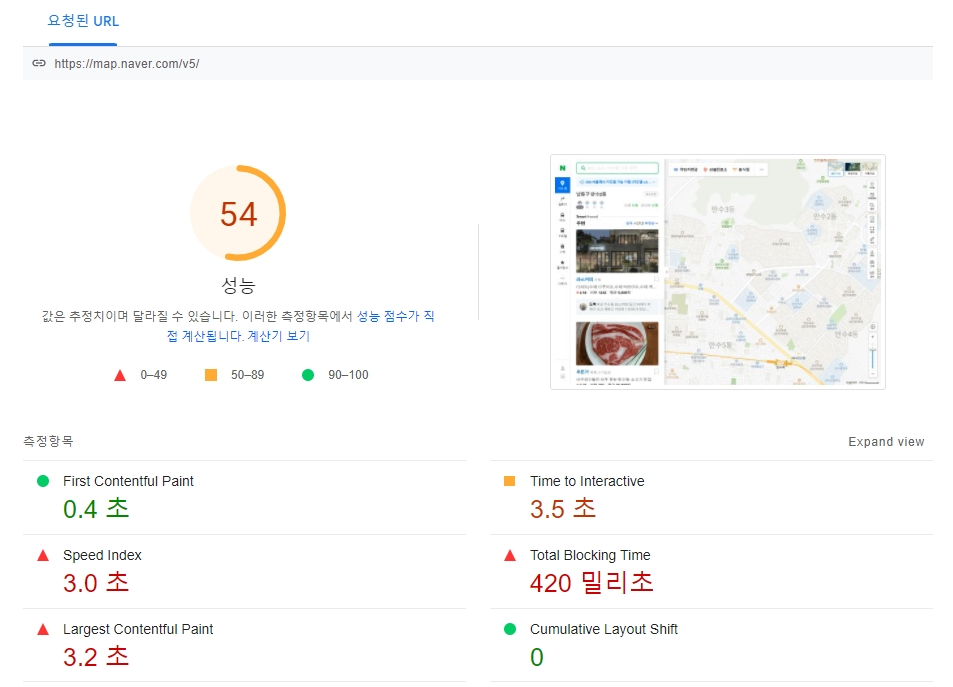
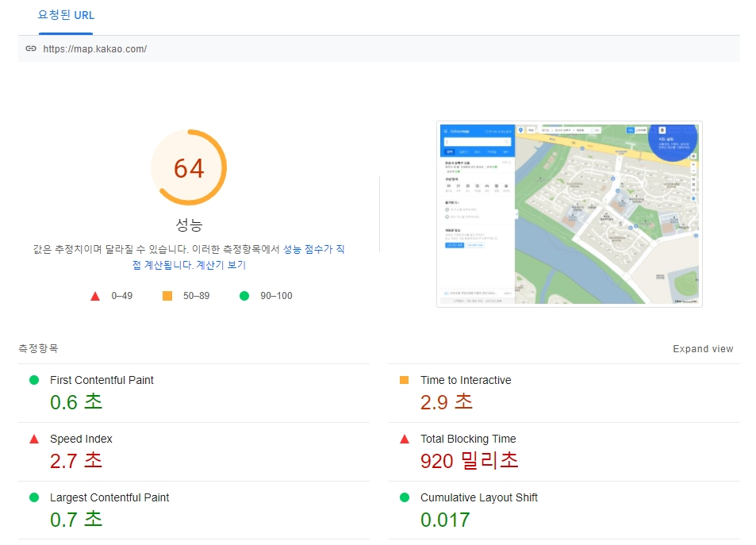
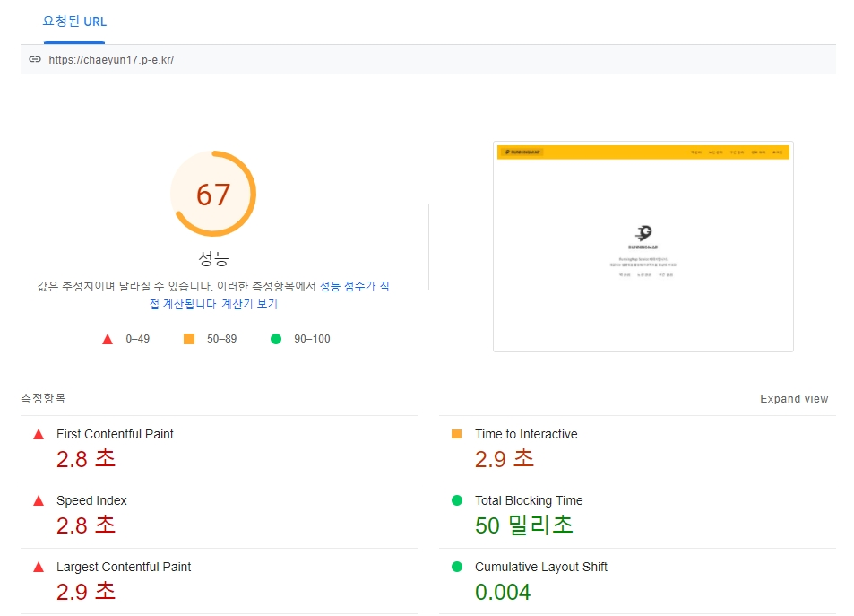
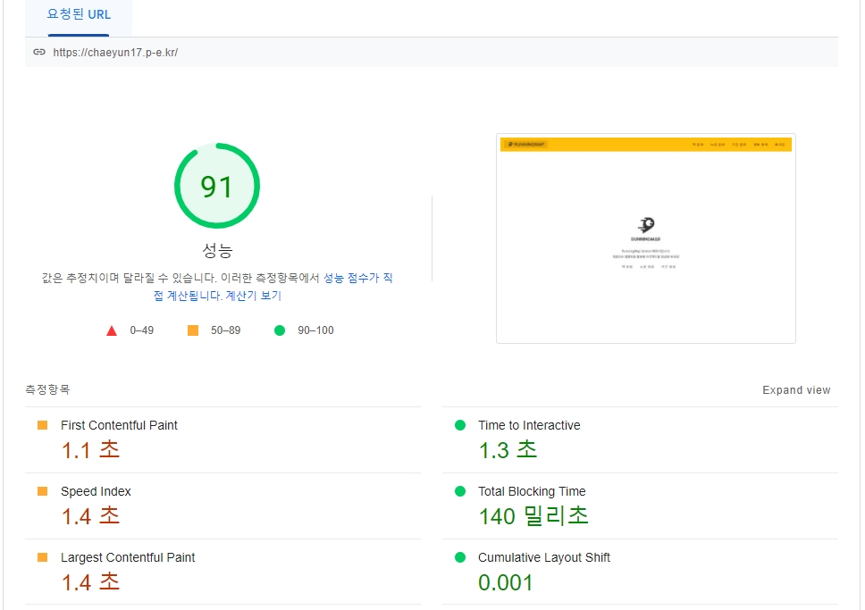

<p align="center">
    
</p>
<p align="center">
  
  
  <a href="https://edu.nextstep.camp/c/R89PYi5H" alt="nextstep atdd">
    
  </a>
  
</p>

<br>

# 인프라공방 샘플 서비스 - 지하철 노선도

<br>

## 🚀 Getting Started

### Install

#### npm 설치

```
cd frontend
npm install
```

> `frontend` 디렉토리에서 수행해야 합니다.

### Usage

#### webpack server 구동

```
npm run dev
```

#### application 구동

```
./gradlew clean build
```

<br>

## 미션

* 미션 진행 후에 아래 질문의 답을 작성하여 PR을 보내주세요.

### 1단계 - 인프라 운영하기

1. 각 서버내 로깅 경로를 알려주세요

- nginx:
    - access log: /home/ubuntu/nginx/access.log
    - error log: /home/ubuntu/nginx/error.log
- logPath: /home/ubuntu/infra-subway-monitoring-app/logs/infra-subway-monitoring.log
- WAS: 13.125.64.39

2. Cloudwatch 대시보드 URL을 알려주세요

- https://ap-northeast-2.console.aws.amazon.com/cloudwatch/home?region=ap-northeast-2#dashboards:name=DASHBOARD-chaeyun17

---

### 2단계 - 성능 테스트

1. 웹 성능예산은 어느정도가 적당하다고 생각하시나요

타 경쟁 사이트와 비교

네이버맵



카카오맵



현재 서비스



First Contentful Paint, Largest Contentful Paint 개선이 필요함을 확인함

3. 웹 성능예산을 바탕으로 현재 지하철 노선도 서비스는 어떤 부분을 개선하면 좋을까요

    - 텍스트 기반 리소스를 압축(gzip, deflate, brotli)
    - 이미지 요소에 명시적인 너비 및 높이를 설정
    - 이미지 파일 해상도 줄이기
    - 정적 파일 캐싱 설정
    - 웹 폰트 다이나믹 로딩 설정

67 -> 91 으로 개선



5. 부하테스트 전제조건은 어느정도로 설정하셨나요

    - 1일 총 접속수 = 1일 사용자 수 * 1명당 1일 평균 접속수
    - 1일 평균 rps = 1일 총 접속수 / 86400(초/일)
    - 1일 최대 rps = 1일 평균 rps * (최대 트래픽 / 최소 트래픽)

    - 네이버지도 한달 순이용자수: 1380만
    - 카카오지도 한달 순이용자수: 840만
    - 현 서비스 예상 한달 순이용자수: 100만 (1000만 의 10%)
    - 현 서비스의 예상 하루 순이용자수: 33,333명


    - 33,333명 (1일 사용자수) * 3 회(한명당 하루 접속수) => **9999 (1일 총 접속수)**
    - 99,999 회 (1일 총 접속수) / 86400 => **1.15(1일 평균 rps)**
    - 1.15 (1일 평균 rps) * (최대 트래픽/평소트래픽) => **10 (1일 최대 rps)**

7. Smoke, Load, Stress 테스트 스크립트와 결과를 공유해주세요

### 접속 빈도가 높은 페이지 - 메인페이지

<details>
 <summary>smoke</summary>

```javascript
import http from 'k6/http';
import {check, sleep} from 'k6';

export let options = {
  vus: 2,
  duration: '10s',

  thresholds: {
    http_req_duration: ['p(99)<1000'],
  },
};

const BASE_URL = 'https://chaeyun17.p-e.kr';

export default function () {
  const mainResponse = http.get(`${BASE_URL}`);
  check(mainResponse, {
    'load main page': response => response.status === 200
  });
  sleep(1);
}
```

```text

          /\      |‾‾| /‾‾/   /‾‾/
     /\  /  \     |  |/  /   /  /
    /  \/    \    |     (   /   ‾‾\
   /          \   |  |\  \ |  (‾)  |
  / __________ \  |__| \__\ \_____/ .io

  execution: local
     script: main-smoke.js
     output: -

  scenarios: (100.00%) 1 scenario, 2 max VUs, 40s max duration (incl. graceful stop):
           * default: 2 looping VUs for 10s (gracefulStop: 30s)


running (10.1s), 0/2 VUs, 20 complete and 0 interrupted iterations
default ✓ [======================================] 2 VUs  10s

     ✓ load main page

     checks.........................: 100.00% ✓ 20       ✗ 0
     data_received..................: 36 kB   3.6 kB/s
     data_sent......................: 3.0 kB  295 B/s
     http_req_blocked...............: avg=2.5ms   min=5.22µs  med=7.51µs  max=25.1ms   p(90)=2.49ms  p(95)=24.86ms
     http_req_connecting............: avg=54.45µs min=0s      med=0s      max=545.19µs p(90)=54.38µs p(95)=543.93µs
   ✓ http_req_duration..............: avg=4.44ms  min=2.71ms  med=4.07ms  max=8.35ms   p(90)=5.59ms  p(95)=5.73ms
       { expected_response:true }...: avg=4.44ms  min=2.71ms  med=4.07ms  max=8.35ms   p(90)=5.59ms  p(95)=5.73ms
     http_req_failed................: 0.00%   ✓ 0        ✗ 20
     http_req_receiving.............: avg=54.3µs  min=29.51µs med=52.8µs  max=105.82µs p(90)=71.33µs p(95)=88.17µs
     http_req_sending...............: avg=26.73µs min=14.96µs med=22.93µs max=91.55µs  p(90)=27.5µs  p(95)=51.02µs
     http_req_tls_handshaking.......: avg=1.62ms  min=0s      med=0s      max=16.41ms  p(90)=1.61ms  p(95)=16.18ms
     http_req_waiting...............: avg=4.36ms  min=2.65ms  med=4ms     max=8.3ms    p(90)=5.51ms  p(95)=5.67ms
     http_reqs......................: 20      1.983927/s
     iteration_duration.............: avg=1s      min=1s      med=1s      max=1.03s    p(90)=1.01s   p(95)=1.02s
     iterations.....................: 20      1.983927/s
     vus............................: 2       min=2      max=2
     vus_max........................: 2       min=2      max=2
```

</details>

<details>
 <summary>load</summary>

```javascript
import http from 'k6/http';
import {check, sleep} from 'k6';

export const options = {
  stages: [
    {duration: '5s', target: 50},
    {duration: '10s', target: 100},
    {duration: '20s', target: 100},
    {duration: '10s', target: 0},
  ],
  thresholds: {
    http_req_duration: ['p(99)<1000'],
  },
};

const BASE_URL = 'https://chaeyun17.p-e.kr';

export default function () {
  const mainResponse = http.get(`${BASE_URL}`);
  check(mainResponse, {
    'load main page': response => response.status === 200
  });
  sleep(1);
}
```

```text
          /\      |‾‾| /‾‾/   /‾‾/
     /\  /  \     |  |/  /   /  /
    /  \/    \    |     (   /   ‾‾\
   /          \   |  |\  \ |  (‾)  |
  / __________ \  |__| \__\ \_____/ .io

  execution: local
     script: main-load.js
     output: -

  scenarios: (100.00%) 1 scenario, 100 max VUs, 1m15s max duration (incl. graceful stop):
           * default: Up to 100 looping VUs for 45s over 4 stages (gracefulRampDown: 30s, gracefulStop: 30s)


running (0m45.6s), 000/100 VUs, 3416 complete and 0 interrupted iterations
default ✓ [======================================] 000/100 VUs  45s

     ✓ load main page

     checks.........................: 100.00% ✓ 3416      ✗ 0
     data_received..................: 5.1 MB  111 kB/s
     data_sent......................: 417 kB  9.2 kB/s
     http_req_blocked...............: avg=131.7µs  min=3.54µs  med=6.09µs  max=17.81ms p(90)=8.75µs  p(95)=19.08µs
     http_req_connecting............: avg=14.94µs  min=0s      med=0s      max=1.18ms  p(90)=0s      p(95)=0s
   ✓ http_req_duration..............: avg=1.91ms   min=1.11ms  med=1.56ms  max=25.11ms p(90)=2.75ms  p(95)=3.37ms
       { expected_response:true }...: avg=1.91ms   min=1.11ms  med=1.56ms  max=25.11ms p(90)=2.75ms  p(95)=3.37ms
     http_req_failed................: 0.00%   ✓ 0         ✗ 3416
     http_req_receiving.............: avg=72.58µs  min=24.3µs  med=54.93µs max=10.8ms  p(90)=94.53µs p(95)=113.27µs
     http_req_sending...............: avg=24.77µs  min=11.08µs med=16.28µs max=2.05ms  p(90)=34.3µs  p(95)=51.88µs
     http_req_tls_handshaking.......: avg=106.03µs min=0s      med=0s      max=16.21ms p(90)=0s      p(95)=0s
     http_req_waiting...............: avg=1.81ms   min=1.03ms  med=1.48ms  max=25.06ms p(90)=2.62ms  p(95)=3.23ms
     http_reqs......................: 3416    74.987085/s
     iteration_duration.............: avg=1s       min=1s      med=1s      max=1.02s   p(90)=1s      p(95)=1s
     iterations.....................: 3416    74.987085/s
     vus............................: 6       min=6       max=100
     vus_max........................: 100     min=100     max=100
```

</details>

<details>
 <summary>stress</summary>

```javascript
import http from 'k6/http';
import {sleep, check} from 'k6';

export const options = {
  stages: [
    {duration: '10s', target: 20},
    {duration: '10s', target: 50},
    {duration: '20s', target: 100},
    {duration: '10s', target: 150},
    {duration: '20s', target: 200},
    {duration: '10s', target: 100},
    {duration: '10s', target: 0},
  ],
  thresholds: {
    http_req_duration: ['p(99)<1000'],
  },
};

const BASE_URL = 'https://chaeyun17.p-e.kr';

export default function () {
  const mainResponse = http.get(`${BASE_URL}`);
  check(mainResponse, {
    'load main page': response => response.status === 200
  });
  sleep(1);
}
```

```text
          /\      |‾‾| /‾‾/   /‾‾/
     /\  /  \     |  |/  /   /  /
    /  \/    \    |     (   /   ‾‾\
   /          \   |  |\  \ |  (‾)  |
  / __________ \  |__| \__\ \_____/ .io

  execution: local
     script: main-stress.js
     output: -

  scenarios: (100.00%) 1 scenario, 200 max VUs, 2m0s max duration (incl. graceful stop):
           * default: Up to 200 looping VUs for 1m30s over 7 stages (gracefulRampDown: 30s, gracefulStop: 30s)


running (1m30.8s), 000/200 VUs, 8756 complete and 0 interrupted iterations
default ✓ [======================================] 000/200 VUs  1m30s

     ✓ load main page

     checks.........................: 100.00% ✓ 8756      ✗ 0
     data_received..................: 13 MB   141 kB/s
     data_sent......................: 1.0 MB  12 kB/s
     http_req_blocked...............: avg=107.79µs min=3.64µs   med=5.8µs   max=38.81ms p(90)=8.36µs   p(95)=19.41µs
     http_req_connecting............: avg=11.23µs  min=0s       med=0s      max=1.57ms  p(90)=0s       p(95)=0s
   ✓ http_req_duration..............: avg=1.68ms   min=940.28µs med=1.36ms  max=17.49ms p(90)=2.46ms   p(95)=3.25ms
       { expected_response:true }...: avg=1.68ms   min=940.28µs med=1.36ms  max=17.49ms p(90)=2.46ms   p(95)=3.25ms
     http_req_failed................: 0.00%   ✓ 0         ✗ 8756
     http_req_receiving.............: avg=89.25µs  min=18.93µs  med=53.59µs max=10.66ms p(90)=112.94µs p(95)=205.64µs
     http_req_sending...............: avg=32.85µs  min=10.06µs  med=15.65µs max=14.72ms p(90)=38.43µs  p(95)=65.5µs
     http_req_tls_handshaking.......: avg=82.18µs  min=0s       med=0s      max=17.52ms p(90)=0s       p(95)=0s
     http_req_waiting...............: avg=1.56ms   min=866.61µs med=1.25ms  max=17.4ms  p(90)=2.27ms   p(95)=3.02ms
     http_reqs......................: 8756    96.469874/s
     iteration_duration.............: avg=1s       min=1s       med=1s      max=1.04s   p(90)=1s       p(95)=1s
     iterations.....................: 8756    96.469874/s
     vus............................: 5       min=2       max=199
     vus_max........................: 200     min=200     max=200
```

</details>

### 데이터를 갱신하는 페이지 - 내 정보 수정

<details>
 <summary>smoke</summary>

```javascript
import http from 'k6/http';
import {check, sleep} from 'k6';

export let options = {
  vus: 2,
  duration: '10s',

  thresholds: {
    http_req_duration: ['p(99)<1000'],
  },
};


const BASE_URL = 'https://chaeyun17.p-e.kr';
const email = 'chaeyun17@github.com';
const password = '12345';
const params = {headers: {'Content-Type': 'application/json'}};
const loginPayload = JSON.stringify({email, password});

export default function () {
  const loginResponse = http.post(`${BASE_URL}/login/token`,
      loginPayload, params).json();
  check(loginResponse, {
    'logged in successfully': response => response.accessToken !== '',
  });

  const authHeaders = {
    headers: {
      Authorization: `Bearer ${loginResponse.accessToken}`,
      'Content-Type': 'application/json',
    }
  };
  const retrievedResponse = http.get(`${BASE_URL}/members/me`, authHeaders).json();
  check(retrievedResponse, {'retrieved member': obj => obj.id !== 0});

  const updatedResponse = http.put(`${BASE_URL}/members/me`,
      JSON.stringify({email, password, age: 10}), authHeaders);
  check(updatedResponse,
      {'updated member': response => response.status === 200}
  );
  sleep(1);
}
```

```text
          /\      |‾‾| /‾‾/   /‾‾/
     /\  /  \     |  |/  /   /  /
    /  \/    \    |     (   /   ‾‾\
   /          \   |  |\  \ |  (‾)  |
  / __________ \  |__| \__\ \_____/ .io

  execution: local
     script: update-smoke.js
     output: -

  scenarios: (100.00%) 1 scenario, 2 max VUs, 40s max duration (incl. graceful stop):
           * default: 2 looping VUs for 10s (gracefulStop: 30s)


running (10.5s), 0/2 VUs, 20 complete and 0 interrupted iterations
default ✓ [======================================] 2 VUs  10s

     ✓ logged in successfully
     ✓ retrieved member
     ✓ updated member

     checks.........................: 100.00% ✓ 60       ✗ 0
     data_received..................: 27 kB   2.6 kB/s
     data_sent......................: 20 kB   1.9 kB/s
     http_req_blocked...............: avg=573.24µs min=3.83µs  med=4.8µs   max=17.4ms   p(90)=7.68µs  p(95)=9.6µs
     http_req_connecting............: avg=15.95µs  min=0s      med=0s      max=515.46µs p(90)=0s      p(95)=0s
   ✓ http_req_duration..............: avg=15.86ms  min=8.93ms  med=14.78ms max=35.84ms  p(90)=19.24ms p(95)=30.46ms
       { expected_response:true }...: avg=15.86ms  min=8.93ms  med=14.78ms max=35.84ms  p(90)=19.24ms p(95)=30.46ms
     http_req_failed................: 0.00%   ✓ 0        ✗ 60
     http_req_receiving.............: avg=60.67µs  min=34.6µs  med=53.51µs max=130.31µs p(90)=91.51µs p(95)=104.85µs
     http_req_sending...............: avg=24.4µs   min=12.65µs med=19.2µs  max=79.74µs  p(90)=39.97µs p(95)=44.38µs
     http_req_tls_handshaking.......: avg=534.94µs min=0s      med=0s      max=16.49ms  p(90)=0s      p(95)=0s
     http_req_waiting...............: avg=15.77ms  min=8.86ms  med=14.7ms  max=35.78ms  p(90)=19.16ms p(95)=30.25ms
     http_reqs......................: 60      5.709813/s
     iteration_duration.............: avg=1.05s    min=1.03s   med=1.04s   max=1.1s     p(90)=1.05s   p(95)=1.1s
     iterations.....................: 20      1.903271/s
     vus............................: 2       min=2      max=2
     vus_max........................: 2       min=2      max=2
```

</details>

<details>
 <summary>load</summary>

```javascript
import http from 'k6/http';
import {check, sleep} from 'k6';

export const options = {
  stages: [
    {duration: '5s', target: 50},
    {duration: '10s', target: 100},
    {duration: '20s', target: 100},
    {duration: '10s', target: 0},
  ],
  thresholds: {
    http_req_duration: ['p(99)<1000'],
  },
};

const BASE_URL = 'https://chaeyun17.p-e.kr';
const email = 'chaeyun17@github.com';
const password = '12345';
const params = {headers: {'Content-Type': 'application/json'}};
const loginPayload = JSON.stringify({email, password});

export default function () {
  const loginResponse = http.post(`${BASE_URL}/login/token`,
      loginPayload, params).json();
  check(loginResponse, {
    'logged in successfully': response => response.accessToken !== '',
  });

  const authHeaders = {
    headers: {
      Authorization: `Bearer ${loginResponse.accessToken}`,
      'Content-Type': 'application/json',
    }
  };
  const retrievedResponse = http.get(`${BASE_URL}/members/me`, authHeaders).json();
  check(retrievedResponse, {'retrieved member': obj => obj.id !== 0});

  const updatedResponse = http.put(`${BASE_URL}/members/me`,
      JSON.stringify({email, password, age: 10}), authHeaders);
  check(updatedResponse,
      {'updated member': response => response.status === 200}
  );
  sleep(1);
}
```

```text

          /\      |‾‾| /‾‾/   /‾‾/
     /\  /  \     |  |/  /   /  /
    /  \/    \    |     (   /   ‾‾\
   /          \   |  |\  \ |  (‾)  |
  / __________ \  |__| \__\ \_____/ .io

  execution: local
     script: update-load.js
     output: -

  scenarios: (100.00%) 1 scenario, 100 max VUs, 1m15s max duration (incl. graceful stop):
           * default: Up to 100 looping VUs for 45s over 4 stages (gracefulRampDown: 30s, gracefulStop: 30s)


running (0m45.8s), 000/100 VUs, 3261 complete and 0 interrupted iterations
default ✓ [======================================] 000/100 VUs  45s

     ✓ logged in successfully
     ✓ retrieved member
     ✓ updated member

     checks.........................: 100.00% ✓ 9783       ✗ 0
     data_received..................: 3.4 MB  74 kB/s
     data_sent......................: 3.2 MB  69 kB/s
     http_req_blocked...............: avg=81.68µs  min=3.4µs   med=4.93µs  max=109.8ms  p(90)=7.46µs  p(95)=11.84µs
     http_req_connecting............: avg=8.95µs   min=0s      med=0s      max=9.17ms   p(90)=0s      p(95)=0s
   ✓ http_req_duration..............: avg=15.6ms   min=3.62ms  med=8.69ms  max=168.53ms p(90)=35.79ms p(95)=50.09ms
       { expected_response:true }...: avg=15.6ms   min=3.62ms  med=8.69ms  max=168.53ms p(90)=35.79ms p(95)=50.09ms
     http_req_failed................: 0.00%   ✓ 0          ✗ 9783
     http_req_receiving.............: avg=164.29µs min=15.84µs med=46.57µs max=53.53ms  p(90)=95.65µs p(95)=195.08µs
     http_req_sending...............: avg=185.22µs min=10.64µs med=18.23µs max=63.8ms   p(90)=42.8µs  p(95)=102.13µs
     http_req_tls_handshaking.......: avg=55.86µs  min=0s      med=0s      max=100.53ms p(90)=0s      p(95)=0s
     http_req_waiting...............: avg=15.25ms  min=3.49ms  med=8.53ms  max=168.49ms p(90)=35.1ms  p(95)=48.77ms
     http_reqs......................: 9783    213.568934/s
     iteration_duration.............: avg=1.05s    min=1.01s   med=1.03s   max=1.27s    p(90)=1.1s    p(95)=1.14s
     iterations.....................: 3261    71.189645/s
     vus............................: 6       min=6        max=100
     vus_max........................: 100     min=100      max=100

```

</details>

<details>
 <summary>stress</summary>

```javascript
import http from 'k6/http';
import {check, sleep} from 'k6';

export const options = {
  stages: [
    {duration: '10s', target: 20},
    {duration: '10s', target: 50},
    {duration: '20s', target: 100},
    {duration: '10s', target: 150},
    {duration: '20s', target: 200},
    {duration: '10s', target: 100},
    {duration: '10s', target: 0},
  ],
  thresholds: {
    http_req_duration: ['p(99)<1000'],
  },
};


const BASE_URL = 'https://chaeyun17.p-e.kr';
const email = 'chaeyun17@github.com';
const password = '12345';
const params = {headers: {'Content-Type': 'application/json'}};
const loginPayload = JSON.stringify({email, password});

export default function () {
  const loginResponse = http.post(`${BASE_URL}/login/token`,
      loginPayload, params).json();
  check(loginResponse, {
    'logged in successfully': response => response.accessToken !== '',
  });

  const authHeaders = {
    headers: {
      Authorization: `Bearer ${loginResponse.accessToken}`,
      'Content-Type': 'application/json',
    }
  };
  const retrievedResponse = http.get(`${BASE_URL}/members/me`, authHeaders).json();
  check(retrievedResponse, {'retrieved member': obj => obj.id !== 0});

  const updatedResponse = http.put(`${BASE_URL}/members/me`,
      JSON.stringify({email, password, age: 10}), authHeaders);
  check(updatedResponse,
      {'updated member': response => response.status === 200}
  );
  sleep(1);
}
```

```text
          /\      |‾‾| /‾‾/   /‾‾/
     /\  /  \     |  |/  /   /  /
    /  \/    \    |     (   /   ‾‾\
   /          \   |  |\  \ |  (‾)  |
  / __________ \  |__| \__\ \_____/ .io

  execution: local
     script: update-stress.js
     output: -

  scenarios: (100.00%) 1 scenario, 200 max VUs, 2m0s max duration (incl. graceful stop):
           * default: Up to 200 looping VUs for 1m30s over 7 stages (gracefulRampDown: 30s, gracefulStop: 30s)


running (1m30.8s), 000/200 VUs, 8488 complete and 0 interrupted iterations
default ✓ [======================================] 000/200 VUs  1m30s

     ✓ logged in successfully
     ✓ retrieved member
     ✓ updated member

     checks.........................: 100.00% ✓ 25464      ✗ 0
     data_received..................: 8.5 MB  94 kB/s
     data_sent......................: 8.2 MB  91 kB/s
     http_req_blocked...............: avg=83.86µs  min=3.48µs  med=4.98µs  max=61.65ms  p(90)=7.54µs   p(95)=19.73µs
     http_req_connecting............: avg=12.18µs  min=0s      med=0s      max=50.56ms  p(90)=0s       p(95)=0s
   ✓ http_req_duration..............: avg=10.69ms  min=3.33ms  med=6.86ms  max=199.54ms p(90)=21.26ms  p(95)=30.84ms
       { expected_response:true }...: avg=10.69ms  min=3.33ms  med=6.86ms  max=199.54ms p(90)=21.26ms  p(95)=30.84ms
     http_req_failed................: 0.00%   ✓ 0          ✗ 25464
     http_req_receiving.............: avg=179.06µs min=16.37µs med=43.35µs max=50.03ms  p(90)=129.75µs p(95)=502.34µs
     http_req_sending...............: avg=144.82µs min=10.48µs med=17.95µs max=47.96ms  p(90)=58.65µs  p(95)=300.98µs
     http_req_tls_handshaking.......: avg=42.98µs  min=0s      med=0s      max=33.39ms  p(90)=0s       p(95)=0s
     http_req_waiting...............: avg=10.37ms  min=3.25ms  med=6.7ms   max=199.48ms p(90)=20.53ms  p(95)=29.62ms
     http_reqs......................: 25464   280.543145/s
     iteration_duration.............: avg=1.03s    min=1.01s   med=1.02s   max=1.25s    p(90)=1.06s    p(95)=1.09s
     iterations.....................: 8488    93.514382/s
     vus............................: 4       min=2        max=200
     vus_max........................: 200     min=200      max=200

```

</details>

### 데이터를 조회하는데 여러 데이터를 참조하는 페이지 - 경로 찾기

<details>
 <summary>smoke</summary>

```javascript
import http from 'k6/http';
import {check, sleep} from 'k6';

export let options = {
  vus: 2,
  duration: '10s',

  thresholds: {
    http_req_duration: ['p(99)<1000'],
  },
};

const BASE_URL = 'https://chaeyun17.p-e.kr';
const PARAMS = {headers: {'Content-Type': 'application/json'}};

export default function () {
  const pathResponse = http.get(`${BASE_URL}/paths/?source=1&target=3`, PARAMS).json();
  check(pathResponse, {'find path': obj => obj.distance !== 0});
  sleep(1);
}
```

```text

          /\      |‾‾| /‾‾/   /‾‾/
     /\  /  \     |  |/  /   /  /
    /  \/    \    |     (   /   ‾‾\
   /          \   |  |\  \ |  (‾)  |
  / __________ \  |__| \__\ \_____/ .io

  execution: local
     script: path-smoke.js
     output: -

  scenarios: (100.00%) 1 scenario, 2 max VUs, 40s max duration (incl. graceful stop):
           * default: 2 looping VUs for 10s (gracefulStop: 30s)


running (10.3s), 0/2 VUs, 16 complete and 0 interrupted iterations
default ✓ [======================================] 2 VUs  10s

     ✓ find path

     checks.........................: 100.00% ✓ 16      ✗ 0
     data_received..................: 60 kB   5.8 kB/s
     data_sent......................: 3.4 kB  333 B/s
     http_req_blocked...............: avg=3.25ms   min=6.51µs   med=8.04µs   max=26.22ms  p(90)=12.85ms  p(95)=25.83ms
     http_req_connecting............: avg=70.32µs  min=0s       med=0s       max=576.06µs p(90)=274.6µs  p(95)=555.91µs
   ✓ http_req_duration..............: avg=278.2ms  min=166.94ms med=239.79ms max=558.84ms p(90)=428.23ms p(95)=543.26ms
       { expected_response:true }...: avg=278.2ms  min=166.94ms med=239.79ms max=558.84ms p(90)=428.23ms p(95)=543.26ms
     http_req_failed................: 0.00%   ✓ 0       ✗ 16
     http_req_receiving.............: avg=105.93µs min=52.61µs  med=107.75µs max=144.03µs p(90)=134.08µs p(95)=141.03µs
     http_req_sending...............: avg=34.42µs  min=19.65µs  med=26.89µs  max=128.73µs p(90)=42.24µs  p(95)=68.85µs
     http_req_tls_handshaking.......: avg=2.07ms   min=0s       med=0s       max=16.96ms  p(90)=8.15ms   p(95)=16.47ms
     http_req_waiting...............: avg=278.06ms min=166.83ms med=239.67ms max=558.67ms p(90)=428.06ms p(95)=543.03ms
     http_reqs......................: 16      1.55129/s
     iteration_duration.............: avg=1.28s    min=1.16s    med=1.24s    max=1.58s    p(90)=1.44s    p(95)=1.57s
     iterations.....................: 16      1.55129/s
     vus............................: 2       min=2     max=2
     vus_max........................: 2       min=2     max=2

```

</details>

<details>
 <summary>load</summary>

```javascript
import http from 'k6/http';
import {check, sleep} from 'k6';

export const options = {
  stages: [
    {duration: '5s', target: 50},
    {duration: '10s', target: 100},
    {duration: '20s', target: 100},
    {duration: '10s', target: 0},
  ],
  thresholds: {
    http_req_duration: ['p(99)<1000'],
  },
};

const BASE_URL = 'https://chaeyun17.p-e.kr';
const PARAMS = {headers: {'Content-Type': 'application/json'}};

export default function () {
  const pathResponse = http.get(`${BASE_URL}/paths/?source=1&target=3`, PARAMS).json();
  check(pathResponse, {'find path': obj => obj.distance !== 0});
  sleep(1);
}
```

```text

          /\      |‾‾| /‾‾/   /‾‾/
     /\  /  \     |  |/  /   /  /
    /  \/    \    |     (   /   ‾‾\
   /          \   |  |\  \ |  (‾)  |
  / __________ \  |__| \__\ \_____/ .io

  execution: local
     script: path-load.js
     output: -

  scenarios: (100.00%) 1 scenario, 100 max VUs, 1m15s max duration (incl. graceful stop):
           * default: Up to 100 looping VUs for 45s over 4 stages (gracefulRampDown: 30s, gracefulStop: 30s)


running (0m48.4s), 000/100 VUs, 527 complete and 0 interrupted iterations
default ✓ [======================================] 000/100 VUs  45s

     ✓ find path

     checks.........................: 100.00% ✓ 527       ✗ 0
     data_received..................: 2.1 MB  44 kB/s
     data_sent......................: 126 kB  2.6 kB/s
     http_req_blocked...............: avg=886.25µs min=5.51µs   med=8.74µs  max=17.28ms p(90)=4.09ms   p(95)=4.48ms
     http_req_connecting............: avg=113.9µs  min=0s       med=0s      max=4.82ms  p(90)=495.3µs  p(95)=525.8µs
   ✗ http_req_duration..............: avg=6.11s    min=126.4ms  med=7.48s   max=9.62s   p(90)=8.24s    p(95)=8.34s
       { expected_response:true }...: avg=6.11s    min=126.4ms  med=7.48s   max=9.62s   p(90)=8.24s    p(95)=8.34s
     http_req_failed................: 0.00%   ✓ 0         ✗ 527
     http_req_receiving.............: avg=112.08µs min=38.49µs  med=99.49µs max=1.96ms  p(90)=143.44µs p(95)=162.61µs
     http_req_sending...............: avg=37.04µs  min=13.24µs  med=27.75µs max=343.1µs p(90)=67.6µs   p(95)=89.25µs
     http_req_tls_handshaking.......: avg=744.45µs min=0s       med=0s      max=16.1ms  p(90)=3.49ms   p(95)=3.79ms
     http_req_waiting...............: avg=6.11s    min=126.12ms med=7.48s   max=9.62s   p(90)=8.24s    p(95)=8.34s
     http_reqs......................: 527     10.880971/s
     iteration_duration.............: avg=7.12s    min=1.13s    med=8.49s   max=10.62s  p(90)=9.24s    p(95)=9.34s
     iterations.....................: 527     10.880971/s
     vus............................: 11      min=10      max=100
     vus_max........................: 100     min=100     max=100

```

</details>

<details>
 <summary>stress</summary>

```javascript
import http from 'k6/http';
import {sleep, check} from 'k6';

export const options = {
  stages: [
    {duration: '10s', target: 20},
    {duration: '10s', target: 50},
    {duration: '20s', target: 100},
    {duration: '10s', target: 150},
    {duration: '20s', target: 200},
    {duration: '10s', target: 100},
    {duration: '10s', target: 0},
  ],
  thresholds: {
    http_req_duration: ['p(99)<1000'],
  },
};

const BASE_URL = 'https://chaeyun17.p-e.kr';
const PARAMS = {headers: {'Content-Type': 'application/json'}};

export default function () {
  const pathResponse = http.get(`${BASE_URL}/paths/?source=1&target=3`, PARAMS).json();
  check(pathResponse, {'find path': obj => obj.distance !== 0});
  sleep(1);
}

```

```text

          /\      |‾‾| /‾‾/   /‾‾/
     /\  /  \     |  |/  /   /  /
    /  \/    \    |     (   /   ‾‾\
   /          \   |  |\  \ |  (‾)  |
  / __________ \  |__| \__\ \_____/ .io

  execution: local
     script: path-stress.js
     output: -

  scenarios: (100.00%) 1 scenario, 200 max VUs, 2m0s max duration (incl. graceful stop):
           * default: Up to 200 looping VUs for 1m30s over 7 stages (gracefulRampDown: 30s, gracefulStop: 30s)


running (1m38.0s), 000/200 VUs, 1035 complete and 0 interrupted iterations
default ✓ [======================================] 000/200 VUs  1m30s

     ✓ find path

     checks.........................: 100.00% ✓ 1035      ✗ 0
     data_received..................: 4.2 MB  43 kB/s
     data_sent......................: 249 kB  2.5 kB/s
     http_req_blocked...............: avg=917.55µs min=5.39µs   med=8.54µs  max=31.54ms p(90)=4.12ms   p(95)=4.45ms
     http_req_connecting............: avg=114.63µs min=0s       med=0s      max=5.99ms  p(90)=502.13µs p(95)=537.56µs
   ✗ http_req_duration..............: avg=9.02s    min=115.05ms med=8.52s   max=22.29s  p(90)=16.77s   p(95)=17.27s
       { expected_response:true }...: avg=9.02s    min=115.05ms med=8.52s   max=22.29s  p(90)=16.77s   p(95)=17.27s
     http_req_failed................: 0.00%   ✓ 0         ✗ 1035
     http_req_receiving.............: avg=102.64µs min=37.97µs  med=93.43µs max=1.27ms  p(90)=136.3µs  p(95)=153.13µs
     http_req_sending...............: avg=38.29µs  min=13.64µs  med=27.75µs max=1.43ms  p(90)=67.22µs  p(95)=85.52µs
     http_req_tls_handshaking.......: avg=774.96µs min=0s       med=0s      max=30.42ms p(90)=3.49ms   p(95)=3.7ms
     http_req_waiting...............: avg=9.02s    min=114.82ms med=8.52s   max=22.29s  p(90)=16.77s   p(95)=17.27s
     http_reqs......................: 1035    10.562338/s
     iteration_duration.............: avg=10.03s   min=1.11s    med=9.52s   max=23.3s   p(90)=17.77s   p(95)=18.27s
     iterations.....................: 1035    10.562338/s
     vus............................: 17      min=2       max=200
     vus_max........................: 200     min=200     max=200
```

</details>
