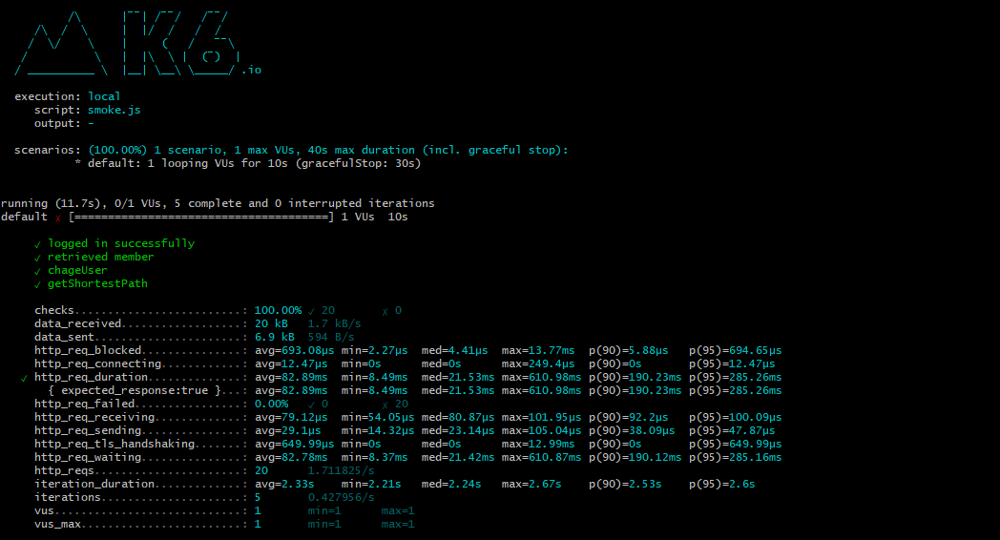
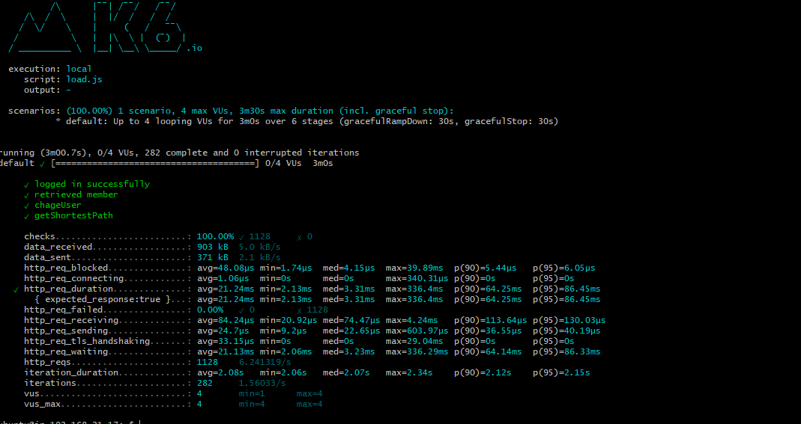
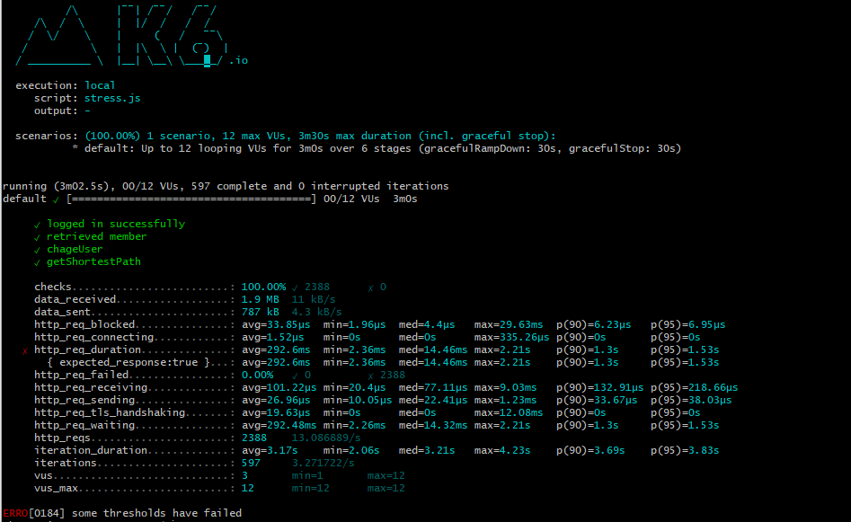

<p align="center">
    
</p>
<p align="center">
  
  
  <a href="https://edu.nextstep.camp/c/R89PYi5H" alt="nextstep atdd">
    
  </a>
  
</p>

<br>

# 인프라공방 샘플 서비스 - 지하철 노선도

<br>

## 🚀 Getting Started

### Install
#### npm 설치
```
cd frontend
npm install
```
> `frontend` 디렉토리에서 수행해야 합니다.

### Usage
#### webpack server 구동
```
npm run dev
```
#### application 구동
```
./gradlew clean build
```
<br>

### 성능 테스트 용어 정리

+ FCP(First Contentful Paint) : 페이지가 로드되기 시작한 시점부터 페이지 콘텐츠의 일부가 화면에 렌더링될 때까지의 시간을 측정
  

+ LCP(Largest Contentful Paint) : 페이지가 처음으로 로드를 시작한 시점을 기준으로 뷰포트 내에 있는 가장 큰 이미지 또는 텍스트 블록의 렌더링 시간
  

+ FID(First Input Delay) : 사용자가 페이지와 처음 상호 작용할 때부터 해당 상호 작용에 대한 응답으로 브라우저가 실제로 이벤트 핸들러 처리를 시작하기까지의 시간을 측정
  

+ INP(Interaction to Next Paint) : 사용자가 페이지를 방문할 때 발생하는 가장 긴 단일 상호작용 중 하나를 선택하여 페이지의 전체 상호작용 대기 시간 을 나타내는 것


+ CLS(Cumulative Layout Shift) : 전체 수명 동안 발생하는 모든 예기치 않은 레이아웃 이동에 대해 가장 큰 레이아웃 이동 점수 버스트 

  
+ TTFB(Time to First Byte) : 리소스 요청과 응답의 첫 번째 바이트가 도착하기 시작하는 시점 사이의 시간을 측정


+ TTI(Time to Interactive) : 사용자가 페이지에 도착한 후 페이지가 완전히 상호작용 하는 데 걸리는 시간


### 1단계 - 웹 성능 테스트
1. 웹 성능예산은 어느정도가 적당하다고 생각하시나요
   지하철 노선도 조회는 사용자에 빠른 응답이 필요 한다고 생각합니다.
   
   성능 분석표를 기준으로 FCP 값은 (웹: 1.8초 이내 모바일: 3초이내)
   TTI 값 타사 비교 80%성능을 가져야 경쟁령이 있음(웹: 2초 이내 모바일: 4초 이내)
   
   FCP /TTI 값 외에도 나머지 지표 들에 대해 아래 성능 분석표를 기반으로 설정
   

2. 웹 성능예산을 바탕으로 현재 지하철 노선도 서비스는 어떤 부분을 개선하면 좋을까요
  + 텍스트 압축 사용 (vendor.js / main.js) gzip 압축을 통해 성능 개선
  + 캐싱 정책을 통한 정적 애셋 제공 (verndor.js / main.js)
  + 사용 하지 않는 폰트 제거
  + 이미지 lazy load 및 압축을 통한 크기 조절
  + CDN 서버 사용


### 타사 성능 비교 표 

### 성능 분석 표


---

### 2단계 - 부하 테스트 
1. 부하테스트 전제조건은 어느정도로 설정하셨나요
   + 카카오 지하철: 1일 사용자 평균 접속 횟수: 3회 / MAU: 1,500,000 / DAU: 50,000 / 평균 RPS: 1.73
   + 지하철 종결자: 1일 사용자 평균 접속 횟수: 3회 / MAU: 5,000,000 / DAU: 165,000 / 평균 RPS: 2.88
   + 가장 많이 사용 하는 앱 과 현재 사용하고 있는 앱을 비교 하여 부하테스트를 작성
       * 1일 사용자 평균 접속횟수: 3회 / 일일 사용자 수: DAU : 100,000 / 부하 유지 시간 30초
       * 평균 RPS ((DAU)100,000 * (1일 접속 횟수)3) / 86,400초 = 3.47
       * 최대 RPS 10.4
       * VUser (목표 RPS * T(시나리오 왕복 시간)) /R(시나리오 요청 수)
          - T:  (R * 왕복시간(http_req_duration)) + 지연시간(내부망) (3 * 0.5) + 1 = 2.5
           평소 traffic VUser: (3.47 * 2.5) / 3  = 3 VUser
           최대 traffic VUser: 9 ~ 12 VUser
  -[x] 대상 시스템 범위
     -[x] 데이터를 조회하는데 여러 데이터를 참조하는 페이지: 지하철 경로 탐색
  -[x] 목푯값 설정(latency, throughput, 부하 유지 기간)
  -[x] 부하 테스트 시 저장될 데이터 건수 및 크기
2. Smoke, Load, Stress 테스트 스크립트와 결과를 공유해주세요
  -[x] 접속 빈도가 높은 페이지
  -[x] 데이터를 갱신하는 페이지
  -[x] 데이터르 조회하는데 여러 데이터를 참조하는 페이지
  -[x] Smoke, Load, Stress 테스트 결과 기록 (k6 폴더)
---
smoke test

load test

stress test


### 3단계 - 로깅, 모니터링
1. 각 서버내 로깅 경로를 알려주세요

2. Cloudwatch 대시보드 URL을 알려주세요
