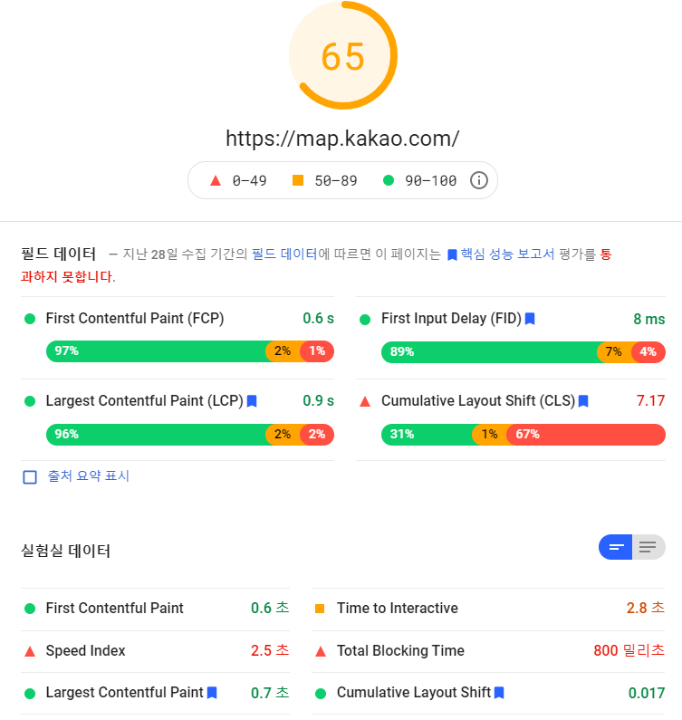

<p align="center">
    
</p>
<p align="center">
  
  
  <a href="https://edu.nextstep.camp/c/R89PYi5H" alt="nextstep atdd">
    
  </a>
  
</p>

<br>

# 인프라공방 샘플 서비스 - 지하철 노선도

<br>

## 🚀 Getting Started

### Install
#### npm 설치
```
cd frontend
npm install
```
> `frontend` 디렉토리에서 수행해야 합니다.

### Usage
#### webpack server 구동
```
npm run dev
```
#### application 구동
```
./gradlew clean build
```
<br>


### 1단계 - 화면 응답 개선하기
1. 웹 성능예산은 어느정도가 적당하다고 생각하시나요. 이 때, 서버 목표 응답시간은 어떻게 되나요?

**가장 중요한 페이지**

- 휴대폰을 이용한 지하철 경로 검색

**사용자 조사**

[서울시 대중교통 이용](https://www.bigdata-map.kr/datastory/traffic/seoul) 에서 조사한 시간 대 별 지하철 이용


- 출퇴근 시간 (8~9, 18~19)에 지도앱에 대한 수요가 많은 것으로 예측

**경쟁(유사) 사이트 비교**

| Web                   | FCP    | TTI   | Speed Index | TBT       | LCP  | CLS     | Score |
|-----------------------|------|------|-------|------|------|-------|:-----:|
| [서울 교통 공사](http://www.seoulmetro.co.kr/kr/cyberStation.do) | 6.4s | 8.0s | 11.4s | 640ms | 10.8s |0.001| 34 |
| [네이버 지도](https://m.map.naver.com/subway/subwayLine.naver?region=1000) | 2.2s | 6.6s | 6.1s | 340ms | 8.1s |.003 | 56 |
| [MY](https://hongeunbeen-infra.n-e.kr/path) | 16.2s | 17.1s | 16.2s | 180ms | 16.4s | 0.004 | 43 |

**우선 순위가 높은 지표**
- TTI: 사용자는 노선도를 보는 것 보다는 빠르게 검색 하고 싶어함
- FCP: 컨텐츠를 빠르게 노출되고 렌더링 하는 것 중요

**성능 예산**
- LTE 환경에서의 모바일 기기의 TTI는 5초 미만이어야 한다.
- 검색 페이지에는 2MB 미만의 이미지가 포함되어야합니다.

2. 성능 개선 결과를 공유해주세요

gzip 압축

| FCP    | TTI   | Speed Index | TBT       | LCP  | CLS     |
|------|------|-------|------|------|-------|
| 5.4s | 7.3s | 6.9s | 1080ms | 5.4s | 0.004 |

gzip 압축 + cache

| FCP    | TTI   | Speed Index | TBT       | LCP  | CLS     |
|------|------|-------|------|------|-------|
| 6.9s | 7.2s | 7.3s | 100ms | 6.9s | 0.004 |

gzip 압축 + cache + HTTP/2 (최종)

| FCP    | TTI   | Speed Index | TBT       | LCP  | CLS     |
|------|------|-------|------|------|-------|
| 5.3s | 5.9s | 5.8s | 510ms | 5.9s | 0.042 |


4. 어떤 부분을 개선해보셨나요? 과정을 설명해주세요

- nginx에서 http 수준의 gzip 압축 추가 (css, js, font, xml 등 정적 파일)
- nginx에서 캐시 설정 (css, js, 이미지)
- nginx에서 protocol HTTP/2로 변경
- webpack 번들 크기 줄이기, vue-router dynamic import 설정

---

### 2단계 - 부하 테스트 
1. 부하테스트 전제조건은 어느정도로 설정하셨나요

2. Smoke, Load, Stress 테스트 스크립트와 결과를 공유해주세요

---

### 3단계 - 스케일 아웃

1. Launch Template 링크를 공유해주세요.

2. cpu 부하 실행 후 EC2 추가생성 결과를 공유해주세요. (Cloudwatch 캡쳐)

```sh
$ stress -c 2
```

---

### [추가] 로깅, 모니터링
1. 각 서버내 로깅 경로를 알려주세요

2. Cloudwatch 대시보드 URL을 알려주세요
---

### [추가] WAS 개선하기
1. 성능 개선 결과를 공유해주세요 (Smoke, Load, Stress 테스트 결과)

2. 어떤 부분을 개선해보셨나요? 과정을 설명해주세요
