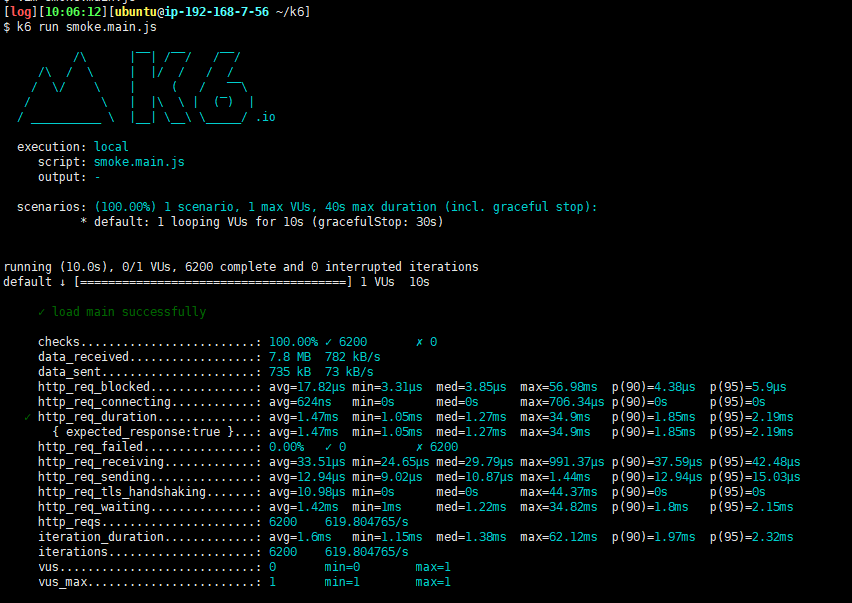
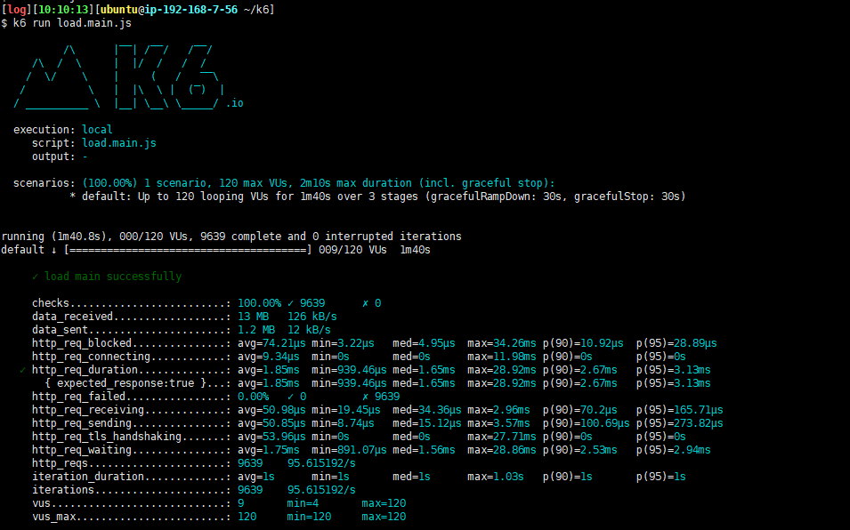
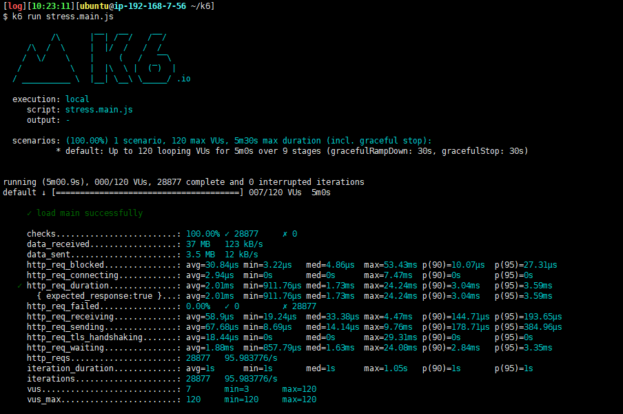
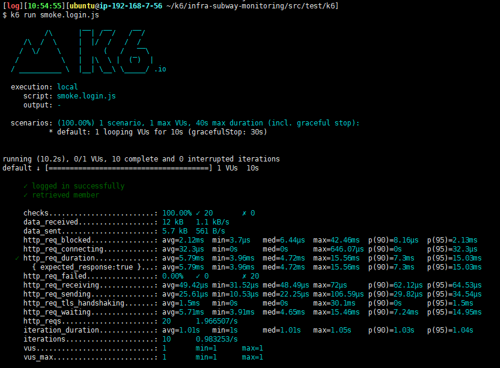
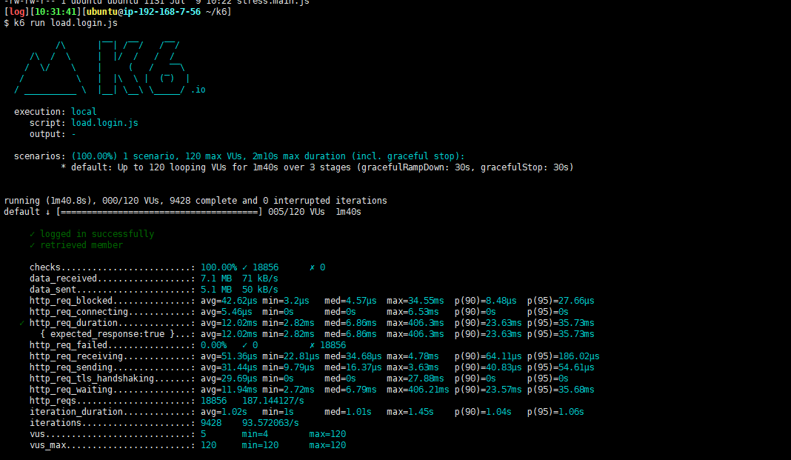
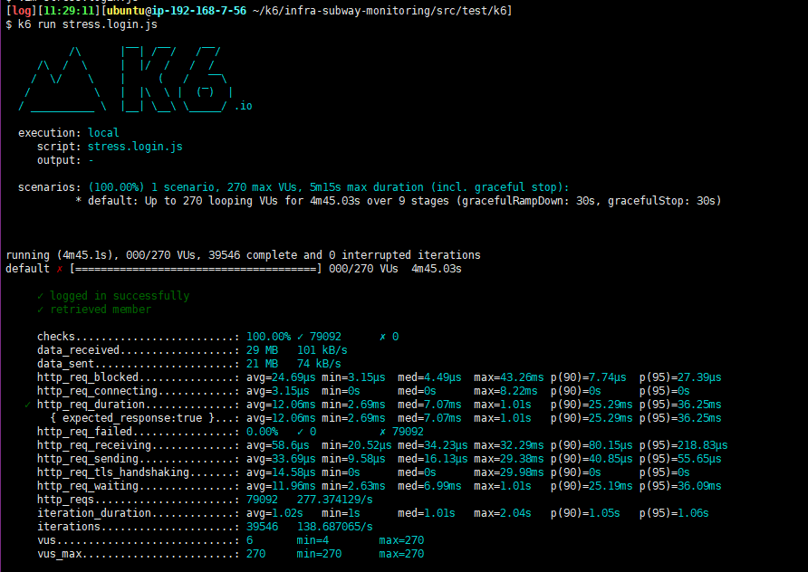

<p align="center">
    
</p>
<p align="center">
  
  
  <a href="https://edu.nextstep.camp/c/R89PYi5H" alt="nextstep atdd">
    
  </a>
  
</p>

<br>

# 인프라공방 샘플 서비스 - 지하철 노선도

<br>

## 🚀 Getting Started

### Install
#### npm 설치
```
cd frontend
npm install
```
> `frontend` 디렉토리에서 수행해야 합니다.

### Usage
#### webpack server 구동
```
npm run dev
```
#### application 구동
```
./gradlew clean build
```
<br>

## 참고 
- [WebPageTest](https://www.webpagetest.org/)
- [PageSpeed](https://developers.google.com/speed/pagespeed/insights/)
- [k6](https://k6.io/)

## 미션

* 미션 진행 후에 아래 질문의 답을 작성하여 PR을 보내주세요.

### 1단계 - 인프라 운영하기
1. 각 서버내 로깅 경로를 알려주세요
- 인스턴스 ID : i-08a748d693195fb4c
- app log   : /home/ubuntu/app/infra-subway-monitoring/build/libs/log
- nginx log : /var/log/nginx

2. Cloudwatch 대시보드 URL을 알려주세요
[CloudWatch](https://ap-northeast-2.console.aws.amazon.com/cloudwatch/home?region=ap-northeast-2#dashboards:name=ini8262-cloudwatch)
---

### 2단계 - 성능 테스트
1. 웹 성능예산은 어느정도가 적당하다고 생각하시나요
- `3초의 법칙`을 만족하는 정도

2. 웹 성능예산을 바탕으로 현재 지하철 노선도 서비스는 어떤 부분을 개선하면 좋을까요
- 자바스크립트 gzip 압축
- 사용하지 않는 자바스크립트 및 CSS 줄이기
- 랜더링 차단 리소스 제거하기

3. 부하테스트 전제조건은 어느정도로 설정하셨나요
- 방법
    - 1일 사용자 수 x 1명당 1일 평균 접속 수 = 1일 총 접속 수
    - 1일 총 접속 수 / 86400 (초/일) = 1일 평균 rps
    - 1일 평균 rps x (최대 트래픽 / 평소 트래픽) = 1일 최대 rps
    
- 계산
    - 1일 사용자 수 (DAU) = 549만 / 30 = 183,000
    - 1명당 1일 평균 접속 수 = 5회
    - 1일 총 접속 수 = 915,000
    - 1일 평균 rps = 10rps
    - 최대 트래픽 / 평소 트래픽 : 10
    - 1일 최대 rps = 10 x 10 = 100 rps
    - latency : 100ms

4. Smoke, Load, Stress 테스트 스크립트와 결과를 공유해주세요
- [메인 페이지 - smoke](src/test/resources/k6/js/smoke.main.js)


- [메인 페이지 - load](src/test/resources/k6/js/load.main.js)


- [메인 페이지 - stress](src/test/resources/k6/js/stress.main.js)


- [로그인 페이지 - smoke](src/test/resources/k6/js/smoke.login.js)


- [로그인 페이지 - load](src/test/resources/k6/js/load.login.js)


- [로그인 페이지 - stress](src/test/resources/k6/js/stress.login.js)
