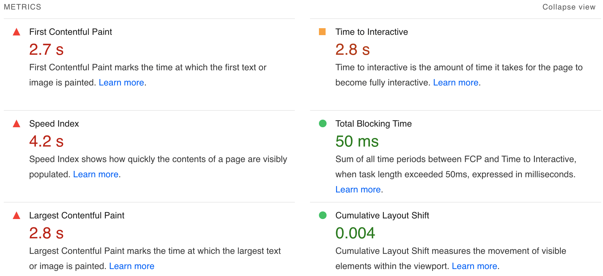
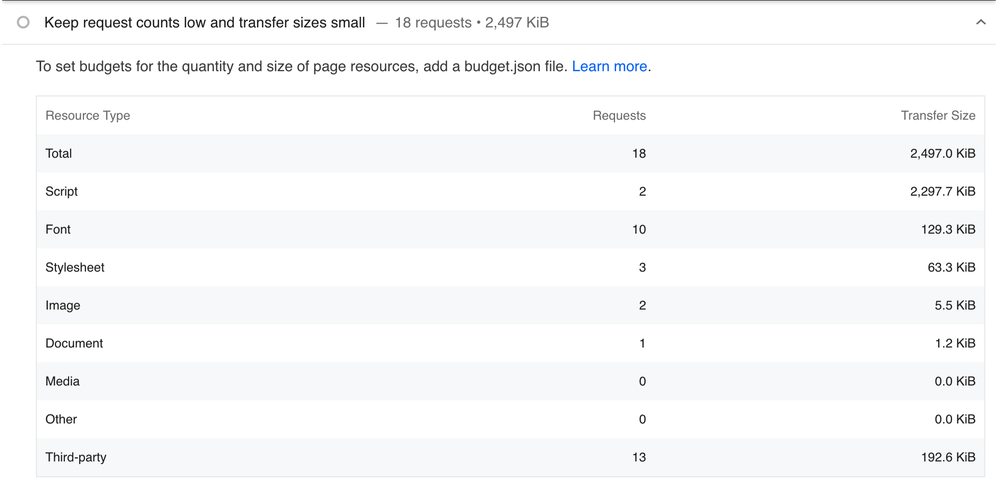
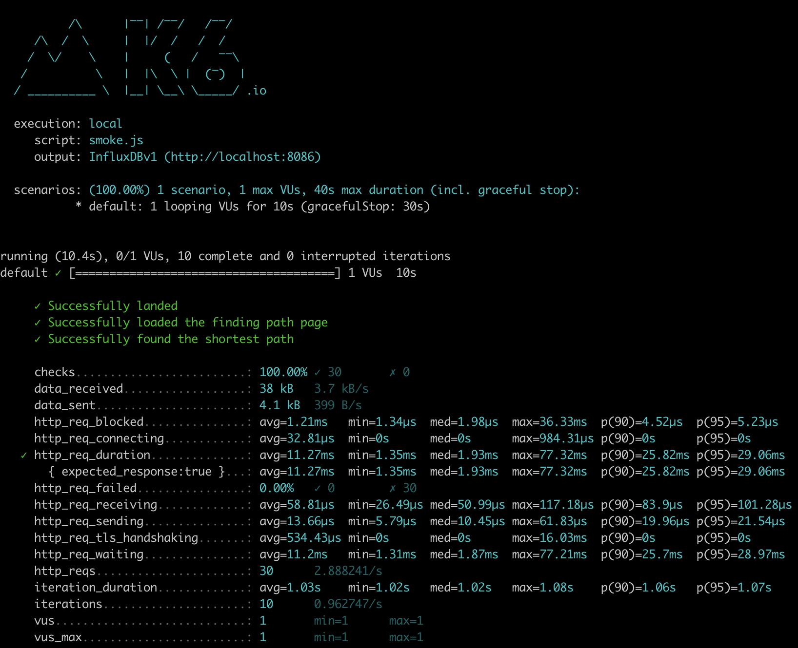
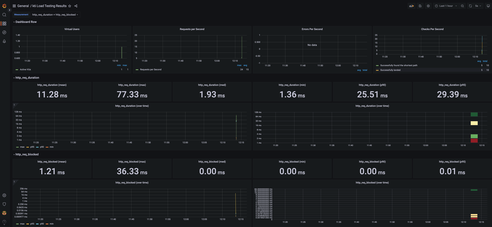
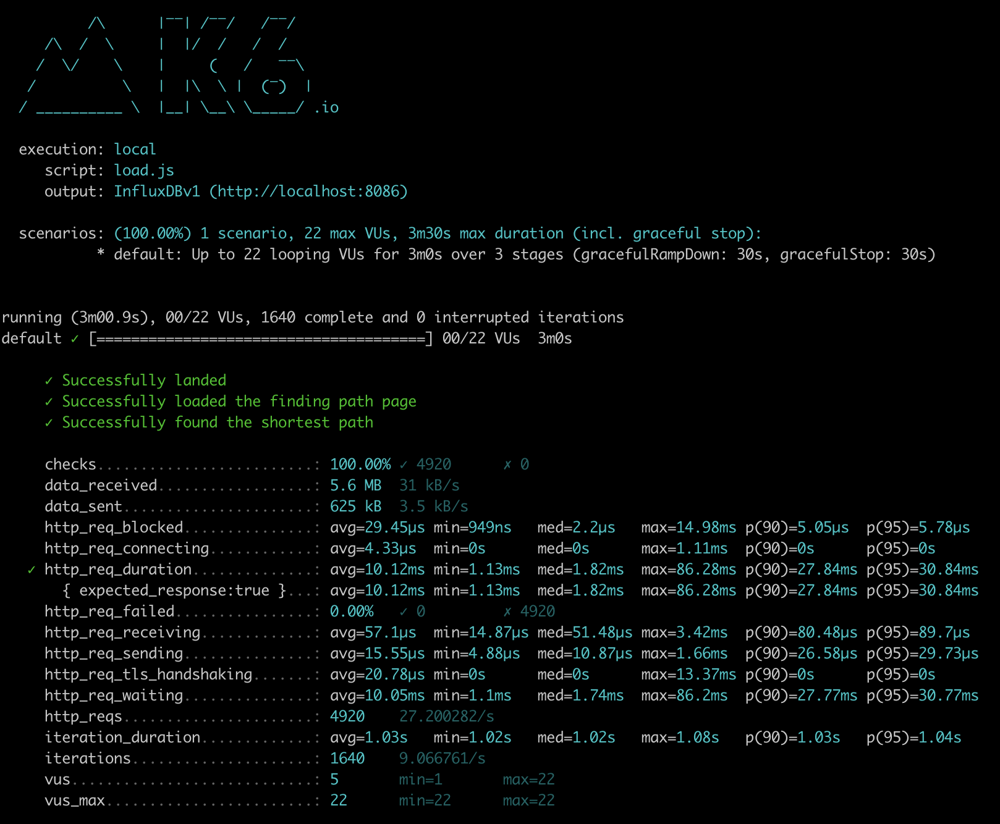
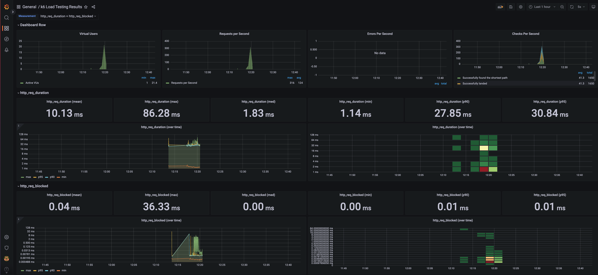
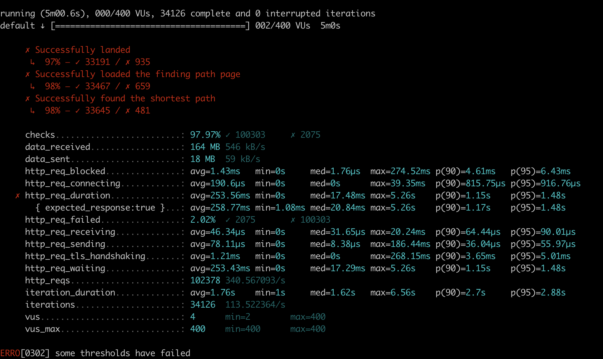
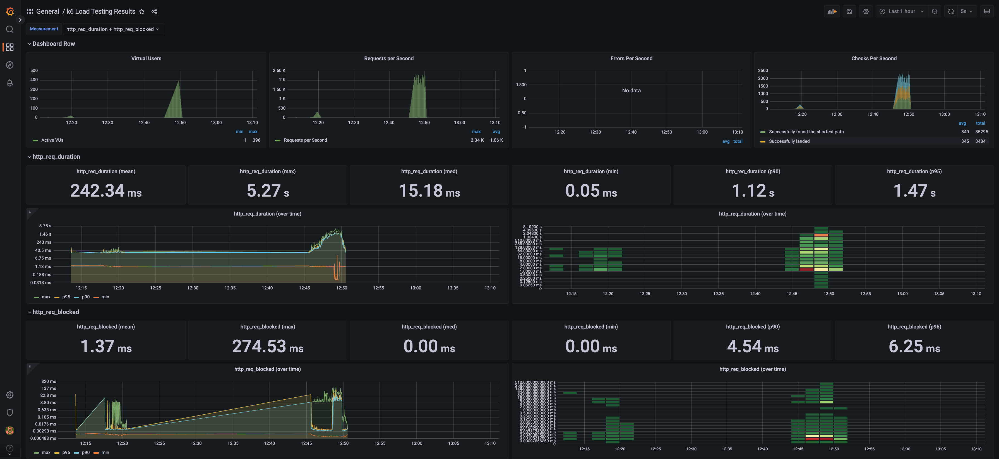

<p align="center">
    
</p>
<p align="center">
  
  
  <a href="https://edu.nextstep.camp/c/R89PYi5H" alt="nextstep atdd">
    
  </a>
  
</p>

<br>

# 인프라공방 샘플 서비스 - 지하철 노선도

<br>

## 🚀 Getting Started

### Install

#### npm 설치

```
cd frontend
npm install
```

> `frontend` 디렉토리에서 수행해야 합니다.

### Usage

#### webpack server 구동

```
npm run dev
```

#### application 구동

```
./gradlew clean build
```

<br>

### 1단계 - 웹 성능 테스트

1. 웹 성능예산은 어느정도가 적당하다고 생각하시나요

* 경쟁사

|  경쟁사   |  FCP  |   TTI   |   SI    |   TBT   |   LCP   |  CLS  |
|:------:|:-----:|:-------:|:-------:|:-------:|:-------:|:-----:|
| 서울교통공사 | 1.5 s | 2.0 s | 2.3 s | 240 ms | 3.6 s | 0.014 |
| 네이버지도  | 0.5 s | 0.7 s | 2.2 s | 0 ms   | 1.6 s | 0.006 |
|  카카오맵  | 0.5 s | 1.0 s | 2.2 s | 10 ms  | 1.4 s  | 0.039 |
|   평균   | 0.8 s | 1.2 s | 2.2 s | 83 ms | 2.2 s | 0.02  |
| 평균 80% | 0.7 s | 1.0 s | 1.8 s | 66 ms | 1.8 s | 0.016 |

* 지하철 노선도 서비스 성능 테스트 ([PageSpeed](https://developers.google.com/speed/pagespeed/insights/))

|      | FCP   |  TTI  |  SI   |  TBT  |  LCP  | CLS  |
|:----:|:-----:|:-----:|:-----:|:-----:|:----:|:-----:|
|  결과  | 3.0 s | 3.0 s | 3.0 s | 10 ms | 3.0 s |  0   |
| 평균대비 | 360 % | 243 % | 134 % | 12 % | 136 % | 0 % |



[Webpage Performance Test 결과 JSON](./docs/WebpagePerformanceTestJsonResult.json)

> 사용자가 가장 많이 사용하는 기능 (경로 검색)을 기준으로 웹페이지 성능 테스트를 진행한 결과,
> `FCP`, `TTI`, `SI`, `LCP`가 경쟁사 대비 많은 시간이 걸렸으며,
> 위 결과 이미지에서 보여주듯 `FCP`, `SI`, `LCP`의 경우 `Red (slow)`를 보여주며
> `TTI`의 경우 `Orange (moderate)` 나타내고 있습니다.
> 경쟁우위를 같기 위해 웹 성능예산은 `FCP`, `TTI`, `SI`, `LCP`에 대해 경쟁사 평균 대비
> 20% 단축한 아래의 값을 목표로 잡는것이 적당하다고 생각합니다.

|         |  FCP  |  TTI  |  SI   |  LCP  |
|:-------:|:-----:|:-----:|:-----:|:-----:|
|  성능예산   | 0.7 s | 1.0 s | 1.8 s | 1.8 s |

3. 웹 성능예산을 바탕으로 현재 지하철 노선도 서비스는 어떤 부분을 개선하면 좋을까요



* 텍스트 압축
    * /js/vendors.js(www.sangik-kim.kro.kr) (현재: 2,125.0 KiB, 예상: 1,716.5 KiB)
    * /js/main.js(www.sangik-kim.kro.kr) (현재: 172.0 KiB, 예상: 143.6 KiB)

* 브라우저 캐시 이용
    * (No max-age or expires) - https://www.sangik-kim.kro.kr/js/vendors.js
    * (No max-age or expires) - https://www.sangik-kim.kro.kr/js/main.js
    * (No max-age or expires) - https://www.sangik-kim.kro.kr/images/logo_small.png

* CDN 적용
    * https://www.sangik-kim.kro.kr/js/vendors.js
    * https://www.sangik-kim.kro.kr/js/main.js
    * https://www.sangik-kim.kro.kr/images/logo_small.png
    * https://www.sangik-kim.kro.kr/stations

* 지연로드를 통해 네트워크 전송 데이터량 줄이기
    * /js/vendors.js(www.sangik-kim.kro.kr) (현재: 2,125.0 KiB)
    * /js/main.js(www.sangik-kim.kro.kr) (현재: 172.0 KiB)

---

### 2단계 - 부하 테스트

1. 부하테스트 전제조건은 어느정도로 설정하셨나요

* 목표 RPS
    * 예상 1일 사용자 수 (DAU): **353,500**

  | 경쟁사    |    MAU     |   DAU   |
            |:----------:|:-------:|:-------:|
  | 네이버지도 | 13,920,000 | 464,000 |
  | 카카오맵  | 7,290,000  | 243,000 |
  | 평균     | 10,605,000 | 353,500 |

    * 피크 시간대 집중률: **5.36** (1,000,000 / 186,394)
        * 최대 예상 트래픽: 1,000,000 (출퇴근시간 지하철 이용자)
        * 평소 예상 트래픽: 186,394 (하루 평균 지하철 승차 인원 / 24 h = 4,473,454 / 24)
    * 1명당 1일 평균 접속 수: **2** (출근 / 퇴근)
    * Throughput: **8.18 ~ 43.9** (1일 평균 rps ~ 1일 최대 rps)
        * 1일 총 접속 수: 707,000 (DAU x 1명당 1일 평균 접속 수 = 353,500 x 2)
        * 1일 평균 rps: 8.18 (1일 총 접속수 / 86,400 = 707,000 / 86,400)
        * 1일 최대 rps: 43.9 (1일 평균 rps x 피크 시간대 집중률 = 8.18 x 5.36)
* VUser
    * T: 1.5 = (3 * 0.5) + 0
        * R (요청수): 3 (메인 / 경로찾기 / 검색)
        * 왕복시간: 0.5
        * 지연시간: 0
    * 평균 VUser: **4.1** = (8.18 x 1.5) / 3
    * 최대 VUser: **22** = (43.9 x 1.5) / 3

* 테스트 기간: **30분**

* 사용자가 검색하는 데이터 양
    * line: 23 rows
    * section: 340 rows
    * station: 616 rows
* 시나리오
    * 접속 빈도가 높은 페이지
        * 랜딩페이지, 경로검색 페이지
    * 데이터를 갱신하는 페이지
    * 데이터를 조회하는데 여러 데이터를 참조하는 페이지
        * 경로검색 페이지

2. Smoke, Load, Stress 테스트 스크립트와 결과를 공유해주세요

* Smoke
    * [Smoke Test Script](./loadtest/smoke.js)
      
      
* Load
    * [Load Test Script](./loadtest/load.js)
      
      
* Stress
    * [Stress Test Script](./loadtest/stress.js)
      
      

---

### 3단계 - 로깅, 모니터링

1. 각 서버내 로깅 경로를 알려주세요

- /home/ubuntu/app/infra-subway-monitoring/log
- /var/log/nginx/

* [X] Application Log 파일로 저장하기
    * 회원가입, 로그인 등의 이벤트에 로깅을 설정
    * 경로찾기 등의 이벤트 로그를 JSON으로 수집
* [X] Nginx Access Log 설정하기

2. Cloudwatch 대시보드 URL을 알려주세요

- https://ap-northeast-2.console.aws.amazon.com/cloudwatch/home?region=ap-northeast-2#dashboards:name=sangik-kim-dashboard

* [X] Cloudwatch로 로그 수집하기
* [ ] Cloudwatch로 메트릭 수집하기
* [ ] USE 방법론을 활용하기 용이하도록 대시보드 구성
