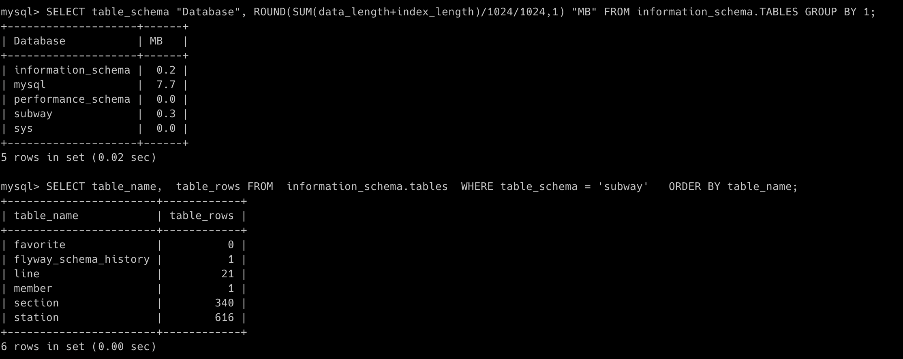
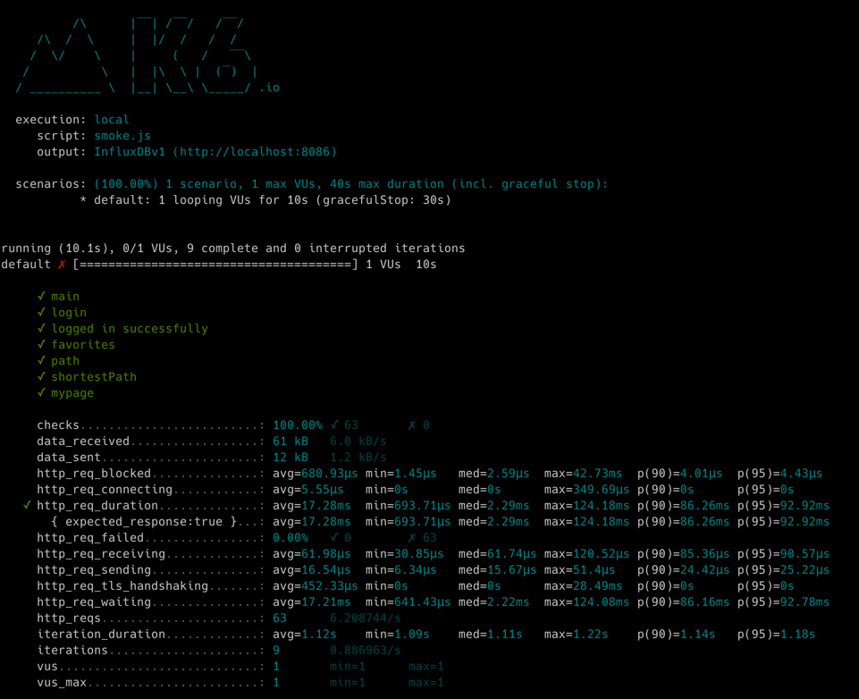
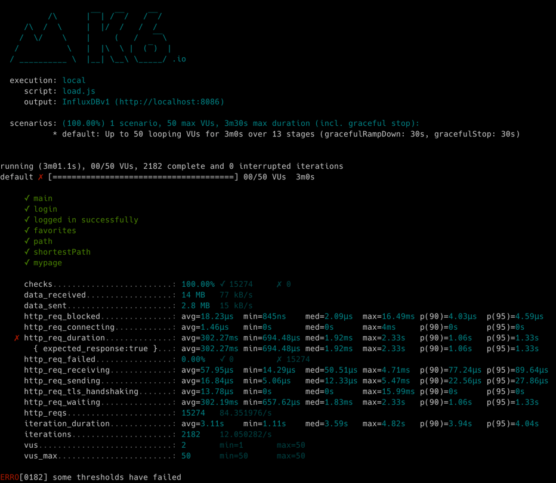
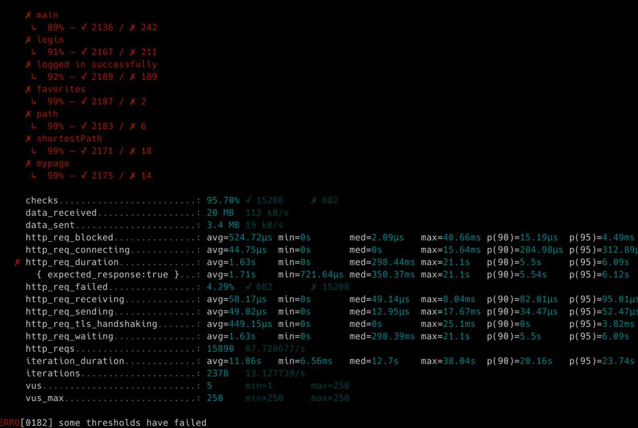
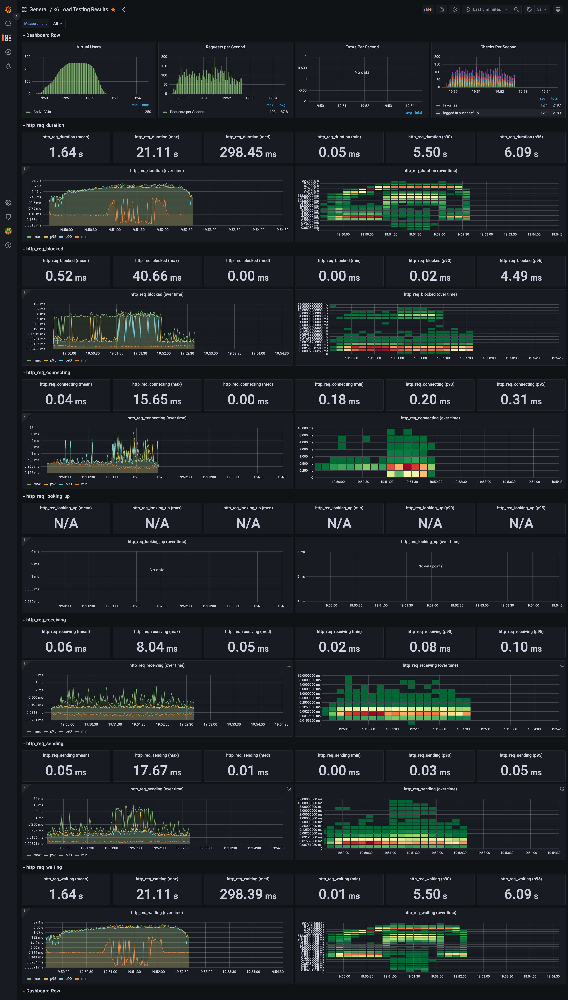

<p align="center">
    
</p>
<p align="center">
  
  
  <a href="https://edu.nextstep.camp/c/R89PYi5H" alt="nextstep atdd">
    
  </a>
  
</p>

<br>

# 인프라공방 샘플 서비스 - 지하철 노선도

<br>

## 🚀 Getting Started

### Install
#### npm 설치
```
cd frontend
npm install
```
> `frontend` 디렉토리에서 수행해야 합니다.

### Usage
#### webpack server 구동
```
npm run dev
```
#### application 구동
```
./gradlew clean build
```
<br>


### 1단계 - 웹 성능 테스트

#### 내 사이트(https://chj1768.p-e.kr/) 데스크톱

| 지표  | 수치    | 설명  |
|-----|-------|-----|
| FCP | 2.7s  | 콘텐츠가 포함된 첫 번째 텍스트 또는 이미지가 표시되는 시간   |
| TTI | 2.8s  | 완전히 페이지와 상호작용할 수 있게 될 때까지 걸리는 시간   |
| SI  | 2.7s  | 페이지 콘텐츠가 얼마나 빨리 표시되는지    |
| TBT | 50ms  | 마우스 클릭, 화면 탭 또는 키보드 누름과 같은 사용자 입력으로부터 페이지가 응답하지 못하도록 차단된 총 시간을 측정    |
| LCP | 2.8s  | 최대 텍스트 또는 이미지가 표시되는 시간    |
| CLS | 0.004 | 표시 영역 안에 보이는 요소의 이동을 측정    |

#### 경쟁사 1(네이버 지도 - https://map.naver.com/) 데스크톱
| 지표  | 수치 | 설명  |
|-----|---|-----|
| FCP | 0.8s |     |
| TTI | 4.1s |     |
| SI  | 3.1s |     |
| TBT | 830ms |     |
| LCP | 10.5s |     |
| CLS | 0 |     |

#### 경쟁사 2(카카오맵 - https://map.kakao.com/) 데스크톱
| 지표  | 수치    | 설명  |
|-----|-------|-----|
| FCP | 0.6s  |     |
| TTI | 2.5s  |     |
| SI  | 2.3s  |     |
| TBT | 320ms |     |
| LCP | 0.6s  |     |
| CLS | 0.018 |     |


1. 웹 성능예산은 어느정도가 적당하다고 생각하시나요
- 지하철 정보 컨텐츠를 제공하는 서비스다 보니, 컨텐츠를 빠르게 노출하고(FCP) 바로 사용할 수 있도록(TTI) 하는 지표가 경쟁사 보다 강화되어야 사용률을 높일 수 있을 것으로 보입니다.
     - FCP 1s 이내
     - TTI 2s 이내

2. 웹 성능예산을 바탕으로 현재 지하철 노선도 서비스는 어떤 부분을 개선하면 좋을까요
- 텍스트 기반 리소스를 압축(gzip, deflate, brotli)하여 제공. 네트워크 전송비용을 절감하여 전체적인 TTI, FCP를 개선할 수 있다.  
  - /js/vendors.js : 2,125.0 KiB (예상 절감 효과 - 1,716.5 KiB)
  - /js/main.js(chj1768.p-e.kr) : 172.0 KiB (예상 절감 효과 - 143.6 KiB)
- 메인 페이지에서 사용하지 않는 스크립트나 리소스 Lazy loading 처리 

---

### 2단계 - 부하 테스트 
1. 부하테스트 전제조건은 어느정도로 설정하셨나요

- 대상 시스템 범위: `사설 dns -> aws vpc -> ec2 webServer(nginx) -> ec2 was(embedded tomcat) -> ec2 db(docker)`
  - db 리소스 상태
  
  
- 목푯값 설정 (latency, throughput, 부하 유지기간)
    > Throughput : 1일 평균 rps ~ 1일 최대 rps <br/>
    언론 보도된 경쟁사 앱 DAU: 100~130만 <br/>
    1일 사용자 수(DAU) x 1명당 1일 평균 접속 수(5회로 가정) = 6500000 <br/> 
    1일 총 접속 수 / 86,400 (초/일) = 평균 RPS 75 <br/>
    1일 평균 rps x (최대 트래픽 / 평소 트래픽) = 최대 RPS 112
   
    > T = (R * http_req_duration) (+ 1s) <br/>
    (4 * 0.2) + 1 = 1.8 <br/>
    VUser = 33 ~ 50

- 부하 테스트 시 저장될 데이터 건수 및 크기
  - 새로 저장될 데이터는 없다. 이미 저장된 데이터(DB)에 대한 서비스 조회 성능을 확인해 본다.


2. Smoke, Load, Stress 테스트 스크립트와 결과를 공유해주세요
- smoke


- load


- stress



---

### 3단계 - 로깅, 모니터링
1. 각 서버내 로깅 경로를 알려주세요
웹서버 로그 - `/var/log/nginx`
application 로그 - `~/nextstep/infra-subway-monitoring/log`
2. Cloudwatch 대시보드 URL을 알려주세요
`https://ap-northeast-2.console.aws.amazon.com/cloudwatch/home?region=ap-northeast-2#dashboards:name=chj1768-dashboard
`
