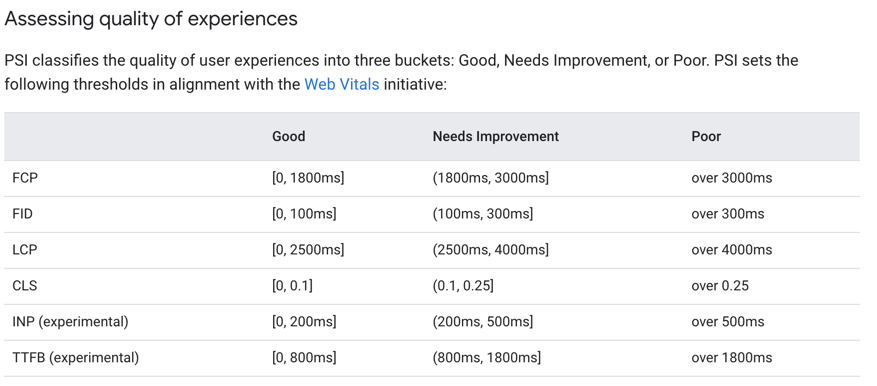
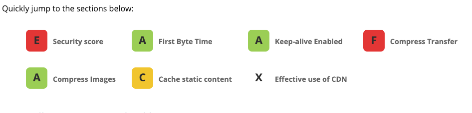
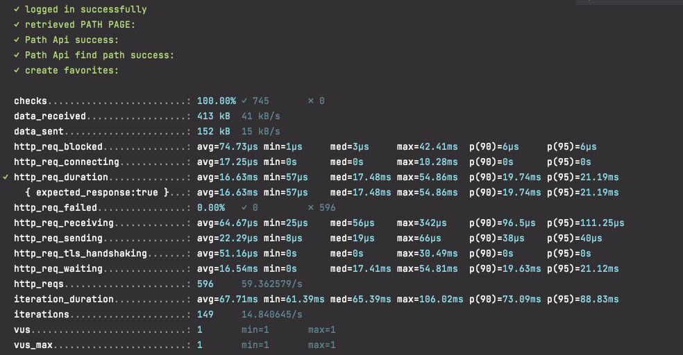
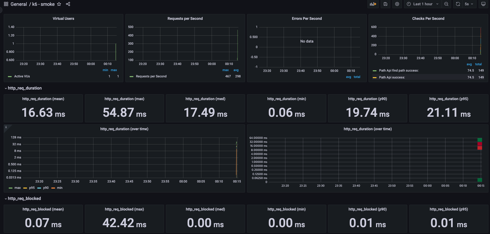
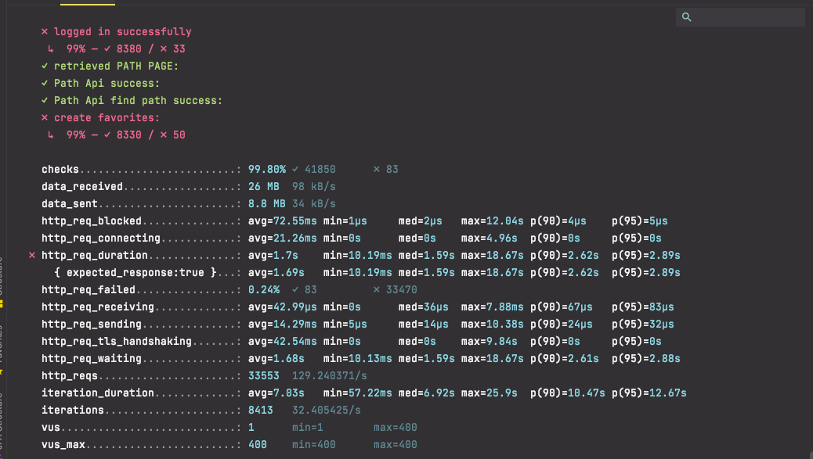
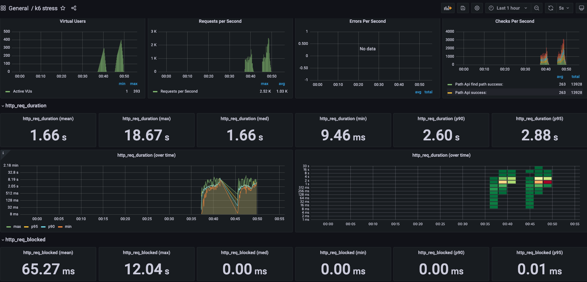
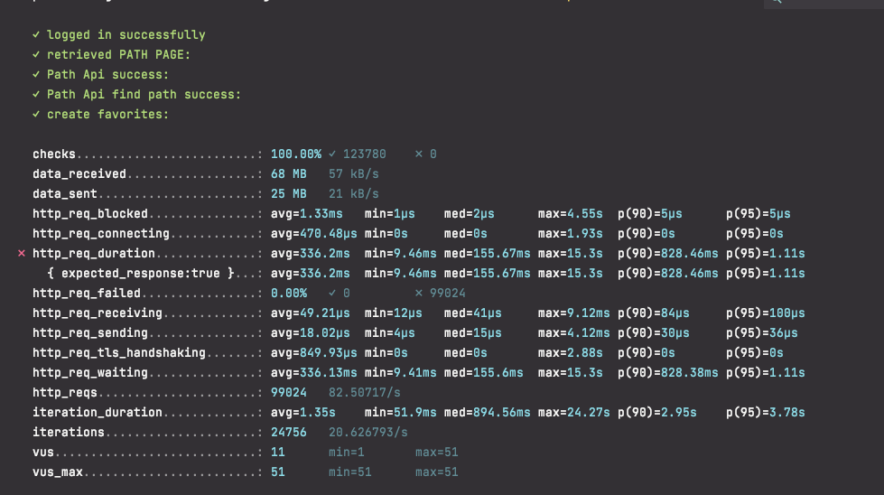
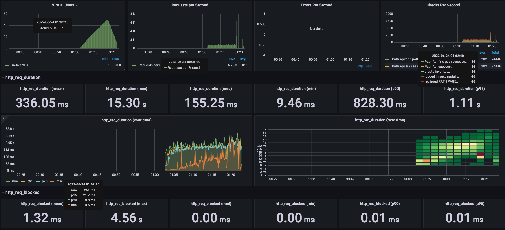

<p align="center">
    
</p>
<p align="center">
  
  
  <a href="https://edu.nextstep.camp/c/R89PYi5H" alt="nextstep atdd">
    
  </a>
  
</p>

<br>

# 인프라공방 샘플 서비스 - 지하철 노선도

<br>

## 🚀 Getting Started

### Install
#### npm 설치
```
cd frontend
npm install
```
> `frontend` 디렉토리에서 수행해야 합니다.

### Usage
#### webpack server 구동
```
npm run dev
```
#### application 구동
```
./gradlew clean build
```
<br>


### 1단계 - 웹 성능 테스트

* 요구사항 
- [X] 웹 성능 테스트
  - [X] 웹 성능 예산을 작성
  - [X] WebPageTest, PageSpeed 등 테스트해보고 개선이 필요한 부분을 파악


#### 성능 측정
* 지표 
  * [FCP](https://web.dev/fcp) (First Contentful Paint) 
  > 콘텐츠가 포함된 콘텐츠가 포함된 첫 페인트는 첫 번째 텍스트 또는 이미지가 표시되는 시간을 나타냅니다.
  * [TTI](https://web.dev/tti/) (Time to Interactive)
  > 사용할 수 있을 때까지 걸리는 시간은 완전히 페이지와 상호작용할 수 있게 될 때까지 걸리는 시간입니다.
  * [Speed Index](https://web.dev/speed-index) 
  > 속도 색인은 페이지 콘텐츠가 얼마나 빨리 표시되는지 보여줍니다
  * [TBT](https://web.dev/i18n/ko/tbt/) (Total Blocking Time)
  > FCP와 상호작용 시간 사이의 모든 시간의 합으로 작업 지속 시간이 50ms를 넘으면 밀리초 단위로 표현됩니다.
  * [LCP](https://web.dev/i18n/ko/lcp/) (Largest Contentful Paint)
  > 콘텐츠가 포함된 최대 페인트는 최대 텍스트 또는 이미지가 표시되는 시간을 나타냅니다
  * [CLS](https://web.dev/i18n/ko/cls/#-9) (Cumulative Layout Shift)  
  > 누적 레이아웃 변경은 표시 영역 안에 보이는 요소의 이동을 측정합니다.
  
  
* 내 사이트 성능 (https://www.kbh0581.r-e.kr/)
   
    |환경 |FCP    |TTI   |Speed Index|TBT    |LCP   |CLS|점수|
    |----|-------|------|-----------|-------|------|---|---|
    |모바일|14.6초 |15.3초 |14.6초     |550밀리초|15.2초|0.0041|33|
    |웹   |2.7초  |2.8초  |2.7초      |50밀리초 |2.8초 |0.004|68|
 
  

* 경쟁사 성능 
  * 서울교통공사
    
    |환경 |FCP    |TTI   |Speed Index|TBT    |LCP   |CLS|점수|
    |----|-------|------|-----------|-------|----- |---|---|
    |모바일|6.9초   |8.8초 |8.3초       |750밀리초|6.9초 |0.00|42|
    |웹   |1.6초  |2.0초  |2.3초       |150밀리초|3.6초 |0.0014|70|
  * 네이버지도
    * MAU : 1,392만 명

    |환경 |FCP    |TTI   |Speed Index|TBT    |LCP   |CLS| 점수|
    |----|-------|------|-----------|-------|----- |---| ---|
    |모바일|2.1초   |6.6초 |6.0초       |240밀리초|7.8초 |0.03|60|
    |웹   |0.5초  |0.5초  |2.3초       |0밀리초 |1.5초 |0.006|90|
    
  * 카카오맵
    * MAU : 729만명
    * 일 평균 실행 횟수 : 3.4

      |환경 |FCP    |TTI   |Speed Index|TBT    |LCP   |CLS| 점수|
      |----|-------|------|-----------|-------|----- |---| ---|
      |모바일|1.7초   |4.3초 |6.0초       |80밀리초|6.3초 |0.005|69|
      |웹   |0.5초  |0.6초  |2.2초       |0밀리초 |1.1초 |0.039|94|


* 질문 
  1. 웹 성능예산은 어느정도가 적당하다고 생각하시나요.
    - 사용자의 경험상 FCP와 TTI가 중요하다고 판단이 되어 두 가지를 중점으로 
    성능예산을 잡을려고 합나다.   
    또한, 지하철 노선컨텐츠를 사용자에게 컨텐츠를 빠르게 제공해야 한다고 생각하여 FCP를 우선순위로 잡으며
    
    - 예산 수치
      * FCP - 모바일 1.8초미만, 웹 1초 미만      
            
        기본적으로 경쟁사의 지표와 적당한 수치에 맞추며 FCP가 해당 프로젝트에 중요한 지표임으로
        모바일은 우선순위가 높은 지표로 Lighthouse의 지표의 좋음의 기준치로 잡을려고 합니다.  
        
      * TTI - 모바일 6초 미만, 웹 2초 미만  
        경쟁사 지표를 참고하여 수치에 맞추어 예산 측정
      
        
  2. 웹 성능예산을 바탕으로 현재 지하철 노선도 서비스는 어떤 부분을 개선하면 좋을까요
      - 텍스트 압축 사용 (gzip)   
        - /js/vendors.js 
          - 예상 절감치 1,716.5 KiB 
        - /js/main.js 
          - 예상 절감치 143.6 KiB
          
      - 랜더링 차단 리소스(CSS 레이지 로딩) 제거 :
        - /css?family=Roboto:100,300,400,500,700,900
          - 전송 크기 : 1.7 KiB
        - materialdesignicons.min.css
          - 전송 크기 38.2 KiB
      - 사용하지 않는 CSS 제거 
        - 절감 예상 : 101.9
      - 효율적인 캐시 정책을 사용하여 정적인 애셋 제공하기
        * /js/vendors.js
        * /js/main.js
        * /images/main_logo.png
        *  /images/logo_small.png
         
      - CDN 사용 : 네트워크 성능 개선 
    
---

### 2단계 - 부하 테스트 

- [X] 부하 테스트
  - [X] 테스트 전제조건 정리
    - [X] 대상 시스템 범위
    - [X] 목푯값 설정 (latency, throughput, 부하 유지기간)
    - [X] 부하 테스트 시 저장될 데이터 건수 및 크기
  - [X] 각 시나리오에 맞춰 스크립트 작성
    - [X] 접속 빈도가 높은 페이지 (메인 로그인)
    - [X] 데이터를 갱신하는 페이지 (즐겨찾기 추가)
    - [X] 데이터를 조회하는데 여러 데이터를 참조하는 페이지 (경로조회)
      - 경로 검색 
  - [X] Smoke, Load, Stress 테스트 후 결과를 기록

1. 부하테스트 전제조건은 어느정도로 설정하셨나요
   > 경쟁사 기준 (카카오 맵) 참조 하여 목표값을 설정 하였습니다.
   
    * 경쟁사 지표 
      - MAU : 729만명 
      - 일 평균 실행 횟수 : 3.4
   
    * 부하테스트 전재 조건
      * Throughput : 23 ~ 115 rps 
          - DAU : 60만
          - 1일 총 접속수 : 204만 (DAU * 일 평균 실행횟수)
          - 1일 평균 rps : 23 rps (1일 총접속수 / 86400)
          - 피크타임 : 5
          - 1일 최대 rps : 115 (1일평균 rps * (최대 트래픽 / 평소 트래픽))
      * 목표 rps : 115
      * VUser : 10 ~ 51
        T = (4 * 0.2) + 1 = 1.8
        VUser : 51  (1.8 * 115) / 4 
    
      

2. Smoke, Load, Stress 테스트 스크립트와 결과를 공유해주세요
    * Smoke
      * K6
        
      * grafana
        
    * Stress (MAX VUser : 392)
      * K6
        
      * grafana
        
    * load (VUser 10 ~ 51)
      * K6
        
      * grafana
        
---

### 3단계 - 로깅, 모니터링
1. 각 서버내 로깅 경로를 알려주세요

2. Cloudwatch 대시보드 URL을 알려주세요
