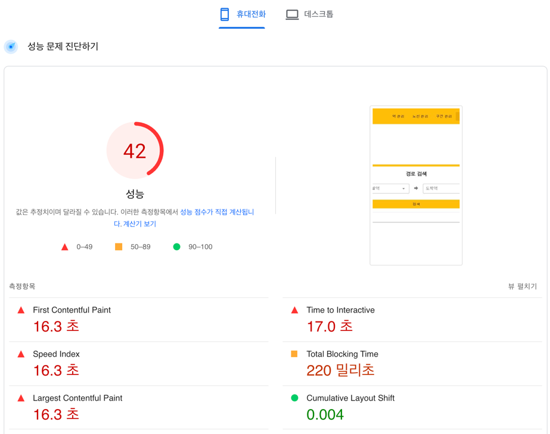
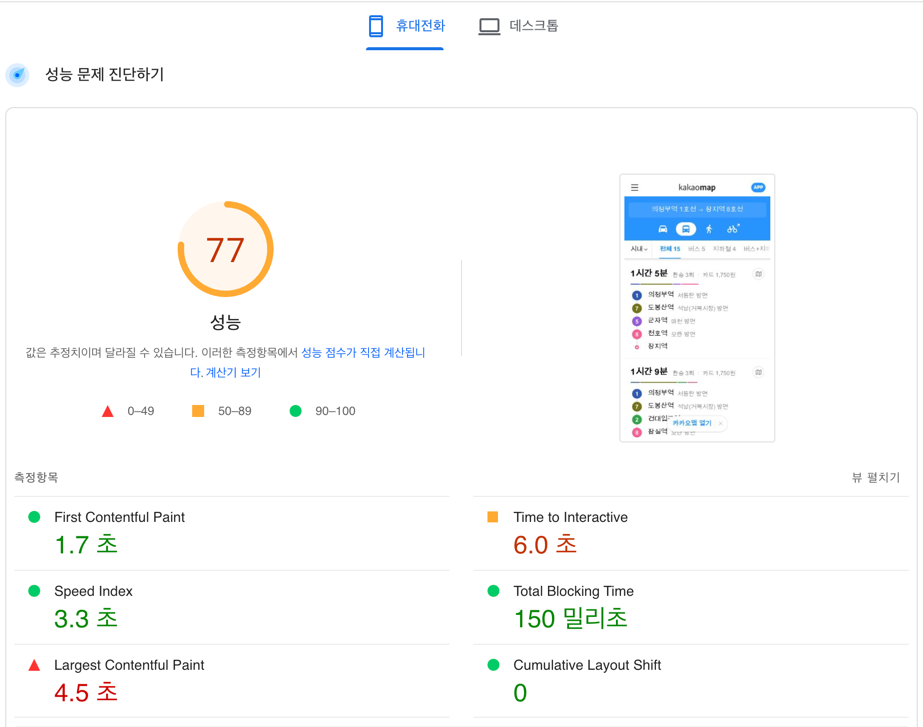
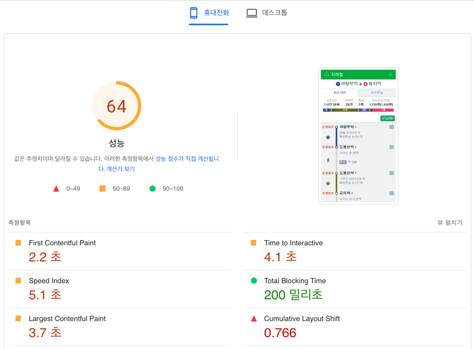
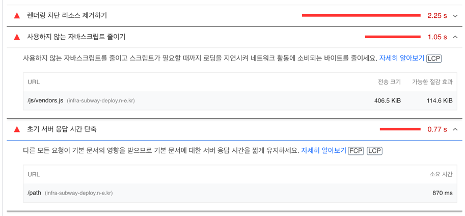
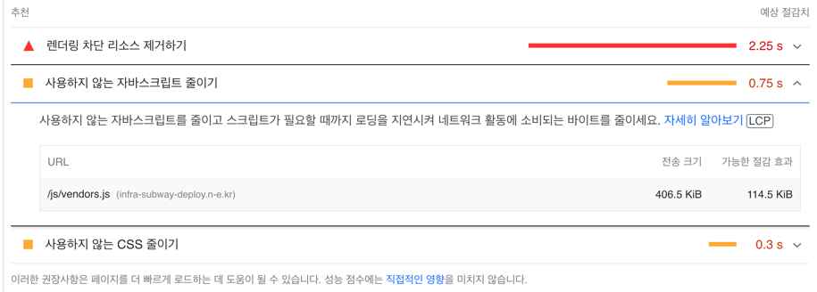
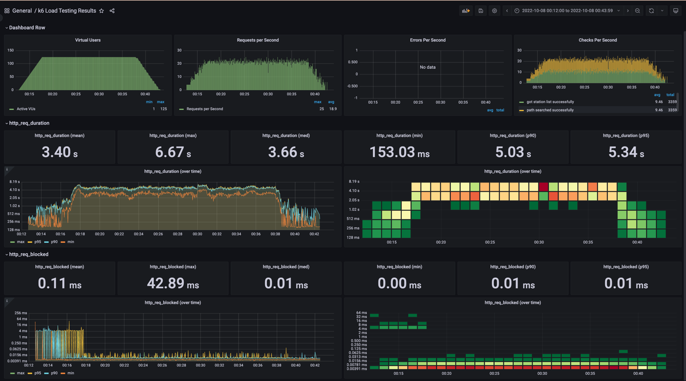
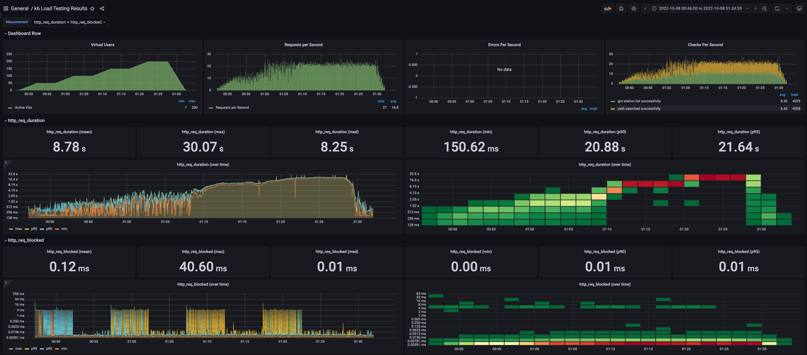

<p align="center">
    
</p>
<p align="center">
  
  
  <a href="https://edu.nextstep.camp/c/R89PYi5H" alt="nextstep atdd">
    
  </a>
  
</p>

<br>

# 인프라공방 샘플 서비스 - 지하철 노선도

<br>

## 🚀 Getting Started

### Install
#### npm 설치
```
cd frontend
npm install
```
> `frontend` 디렉토리에서 수행해야 합니다.

### Usage
#### webpack server 구동
```
npm run dev
```
#### application 구동
```
./gradlew clean build
```
<br>


### 1단계 - 화면 응답 개선하기
1. 웹 성능예산은 어느정도가 적당하다고 생각하시나요. 이 때, 서버 목표 응답시간은 어떻게 되나요?

`A. 예비 분석`

- 대상 페이지 : **경로 검색**
  - 역/노선/구간 관리, 로그인 페이지보다 **경로 검색** 페이지의 수요가 많을 것으로 생각
  - 참고: 언론보도
    - [데이터로보는 서울시 대중교통 이용](https://www.bigdata-map.kr/datastory/traffic/seoul)
    - [길찾기만 하루 1억건](https://news.mt.co.kr/mtview.php?no=2021090916014079809)

- 대상 환경: **mobile**
  - 지도앱 이용자 수로 보아 모바일 환경의 접속 수요가 많을 것으로 생각
  - 참고: 
    - [카카오 모바일 APP 현황](https://ko.lab.appa.pe/2016-09/kakao-korea.html)
    - [네이버 지도 MAU](https://blog.naver.com/rkwkrhspm/222515422896)

- 현 성능 지표 (Rule,Time based Metric)
  - 테스트 url: https://infra-subway-deploy.n-e.kr/path
  - 참고 툴: PageSpeed

```aidl
    - 성능점수 : 42
    - FCP    : 16.3초
    - TTI    : 17.0초
    - SI     : 16.3초
    - TBT    : 220밀리초
    - LCP    : 16.3초   
    - CLS    : 0.004
```
- 
  <details>
  <summary> pagespeed 결과 </summary>
  <div markdown="1">
    
  
  </div>
  </details> 

`B. 경쟁사 분석`
- (경쟁사) 카카오맵 성능지표
  - 테스트 페이지: [카카오맵경로검색](https://m.map.kakao.com/actions/publicRoute?startLoc=%EC%9D%98%EC%A0%95%EB%B6%80%EC%97%AD+1%ED%98%B8%EC%84%A0&sxEnc=MNNLNR&syEnc=QNQRPML&endLoc=%EC%9E%A5%EC%A7%80%EC%97%AD+8%ED%98%B8%EC%84%A0&exEnc=MMQTLL&eyEnc=QNNPOPN&ids=P21160452%2CP21161044&service=) 
```aidl
    - 성능점수 : 77
    - FCP    : 1.7초 
    - TTI    : 6.0초
 ```
- 
    <details>
    <summary> pagespeed 결과 </summary>
    <div markdown="1">
    
    
    </div>
    </details>


- (경쟁사) 네이버지도 성능지표
  - 테스트 페이지: [네이버지도경로검색](https://m.map.naver.com/subway/subwayPath.naver?region=1000&departureId=111&arrivalId=819&pathType=1) 
```aidl
    - 성능점수 : 64
    - FCP    : 2.2초 
    - TTI    : 4.1초
 ``` 

- 
    <details>
    <summary> pagespeed 결과 </summary>
    <div markdown="1">
    
    
    </div>
    </details>

- => 경쟁사들 대비 응답시간이 20% 이상 차이남.

`C. 성능 기준 설정`
- 기준 페이지 : 경로 검색
- 기준 환경 : 모바일 
- 시간 기반 성능 기준
  - 페이지로드 3초 미만
  - TTI 5초 미만


2. 성능 개선 결과를 공유해주세요

| 조치       | FCP   | TTI   |
|----------|-------|-------|
| 초기       | 16.3초 | 17.0초 |
| gzip     | 6.9초  | 7.3초  |
| cache    | 7.0초  | 7.4초  |
| cache 원복 | 6.9초  | 7.3초  |

3. 어떤 부분을 개선해보셨나요? 과정을 설명해주세요

reverse proxy (/etc/nginx/nginx.conf) 변경

  - gzip 압축 활성화 -> FCP, TTI 감소
  - cache 설정 -> FCP, TTI 소폭 증가
    - (?) 응답 시간 증가한 이유를 모르겠음~
    - pagespeed는 항상 최초 요청을 기준으로 검사하기 때문일까?
    <details>
    <summary> pagespeed 추천 조치 사항 </summary>
    <div markdown="1">

    
    </div>
    </details>

  - 그래서 cache 원복
    <details>
    <summary> pagespeed 추천 조치 사항 </summary>
    <div markdown="1">

    
    </div>
    </details>


  - http2.0과 이전버전도 비교해보고 싶었으나 이미 설정되어 있어 패스 


---

### 2단계 - 부하 테스트 
1. 부하테스트 전제조건은 어느정도로 설정하셨나요

- 우선 예상 1일 사용자 수(DAU)를 정해봅니다.
  - `백만`
- 피크 시간대의 집중률을 예상해봅니다. (최대 트래픽 / 평소 트래픽)
  - `2.2`
- 1명당 1일 평균 접속 혹은 요청수를 예상해봅니다.
  - `2`
- 이를 바탕으로 Throughput을 계산합니다.
  - Throughtput: 1일 평균 rps ~ 1일 최대 rps : `57 ~ 125`
- rps 계산식 
    ```
    1일 사용자 수(DAU) x 1명당 1일 평균 접속 수 = 1일 총 접속 수
    ->  백만 x 2 = 오백만
    1일 총 접속 수 / 86,400 (초/일) = 1일 평균 rps
    -> 오백만 / 86400 = 57
    1일 평균 rps x (최대 트래픽 / 평소 트래픽) = 1일 최대 rps
    -> 57 x 2.2 = 125
    ```
- T = `(R * http_req_duration) (+ 1s)` = `(2 * 1) + 0` = `2`
- VUser = `(목표 rps * T) / R` = `125 * 2 / 2` = `125`
- Latency: `50 ms`


2. Smoke, Load, Stress 테스트 스크립트와 결과를 공유해주세요

- 2-1) smoke
  - 1VUS, 10s
  - 
       <details>
       <summary>result</summary>
    
       ```
    
                 /\      |‾‾| /‾‾/   /‾‾/
            /\  /  \     |  |/  /   /  /
           /  \/    \    |     (   /   ‾‾\
          /          \   |  |\  \ |  (‾)  |
         / __________ \  |__| \__\ \_____/ .io
    
         execution: local
            script: smoke.js
            output: -
    
         scenarios: (100.00%) 1 scenario, 2 max VUs, 40s max duration (incl. graceful stop):
                  * default: 2 looping VUs for 10s (gracefulStop: 30s)
    
       running (11.1s), 0/2 VUs, 14 complete and 0 interrupted iterations
       default ✓ [======================================] 2 VUs  10s
    
            ✓ got station list successfully
            ✓ path searched successfully
    
            checks.........................: 100.00% ✓ 28       ✗ 0
            data_received..................: 1.0 MB  94 kB/s
            data_sent......................: 4.6 kB  417 B/s
            http_req_blocked...............: avg=1.29ms   min=4.79µs  med=6.18µs   max=18.04ms p(90)=7.81µs   p(95)=11.7ms
            http_req_connecting............: avg=83.19µs  min=0s      med=0s       max=1.21ms  p(90)=0s       p(95)=723.39µs
          ✓ http_req_duration..............: avg=289.93ms min=74.96ms med=191.06ms max=1.18s   p(90)=566.34ms p(95)=971.35ms
              { expected_response:true }...: avg=289.93ms min=74.96ms med=191.06ms max=1.18s   p(90)=566.34ms p(95)=971.35ms
            http_req_failed................: 0.00%   ✓ 0        ✗ 28
            http_req_receiving.............: avg=9.17ms   min=66.96µs med=679µs    max=60.3ms  p(90)=22.37ms  p(95)=42.99ms
            http_req_sending...............: avg=25.13µs  min=14.48µs med=21.04µs  max=110.2µs p(90)=30.28µs  p(95)=37.16µs
            http_req_tls_handshaking.......: avg=1.13ms   min=0s      med=0s       max=15.9ms  p(90)=0s       p(95)=10.31ms
            http_req_waiting...............: avg=280.73ms min=61.29ms med=188.76ms max=1.13s   p(90)=566.23ms p(95)=932.05ms
            http_reqs......................: 28      2.518443/s
            iteration_duration.............: avg=1.58s    min=1.26s   med=1.41s    max=2.77s   p(90)=2.39s    p(95)=2.77s
            iterations.....................: 14      1.259222/s
            vus............................: 2       min=2      max=2
            vus_max........................: 2       min=2      max=2
       ```
       </details>

- 2-2) load
  - 0~125VUS, 30m
  - 
    <details>
    <summary>result</summary>
      
    ```
              /\      |‾‾| /‾‾/   /‾‾/
         /\  /  \     |  |/  /   /  /
        /  \/    \    |     (   /   ‾‾\
       /          \   |  |\  \ |  (‾)  |
      / __________ \  |__| \__\ \_____/ .io
    
      execution: local
         script: test/load.js
         output: InfluxDBv1 (http://localhost:8086)
    
      scenarios: (100.00%) 1 scenario, 125 max VUs, 30m30s max duration (incl. graceful stop):
               * default: Up to 125 looping VUs for 30m0s over 3 stages (gracefulRampDown: 30s, gracefulStop: 30s)
    
    running (30m30.0s), 000/125 VUs, 3311 complete and 48 interrupted iterations
    default ✓ [======================================] 000/125 VUs  30m0s
    
         ✓ got station list successfully
         ✓ path searched successfully
    
         checks.........................: 100.00% ✓ 6718     ✗ 0
         data_received..................: 248 MB  136 kB/s
         data_sent......................: 975 kB  533 B/s
         http_req_blocked...............: avg=110.31µs min=3.96µs   med=6.95µs   max=42.88ms p(90)=8.59µs  p(95)=10.82µs
         http_req_connecting............: avg=17.09µs  min=0s       med=0s       max=10.12ms p(90)=0s      p(95)=0s
       ✗ http_req_duration..............: avg=3.39s    min=153.03ms med=3.65s    max=6.66s   p(90)=5.03s   p(95)=5.33s
           { expected_response:true }...: avg=3.39s    min=153.03ms med=3.65s    max=6.66s   p(90)=5.03s   p(95)=5.33s
         http_req_failed................: 0.00%   ✓ 0        ✗ 6718
         http_req_receiving.............: avg=1.87ms   min=48.85µs  med=270.42µs max=65.75ms p(90)=4.01ms  p(95)=6.93ms
         http_req_sending...............: avg=30.17µs  min=12.1µs   med=22.93µs  max=10.05ms p(90)=33.84µs p(95)=42.06µs
         http_req_tls_handshaking.......: avg=82.62µs  min=0s       med=0s       max=32.66ms p(90)=0s      p(95)=0s
         http_req_waiting...............: avg=3.39s    min=151.26ms med=3.65s    max=6.66s   p(90)=5.03s   p(95)=5.33s
         http_reqs......................: 6718    3.671035/s
         iteration_duration.............: avg=56.86s   min=50.42s   med=57.76s   max=1m1s    p(90)=59.01s  p(95)=59.58s
         iterations.....................: 3311    1.809288/s
         vus............................: 1       min=1      max=125
         vus_max........................: 125     min=125    max=125
    
    ERRO[1831] some thresholds have failed
    ```
    
    </details>

- 2-3) stress
  - 0~300VUS, 40m
  -  
      <details>
      <summary>result</summary>

      ```
                /\      |‾‾| /‾‾/   /‾‾/
           /\  /  \     |  |/  /   /  /
          /  \/    \    |     (   /   ‾‾\
         /          \   |  |\  \ |  (‾)  |
        / __________ \  |__| \__\ \_____/ .io
    
        execution: local
           script: test/stress.js
           output: InfluxDBv1 (http://localhost:8086)
    
        scenarios: (100.00%) 1 scenario, 200 max VUs, 45m30s max duration (incl. graceful stop):
                 * default: Up to 200 looping VUs for 45m0s over 9 stages (gracefulRampDown: 30s, gracefulStop: 30s)
    
      ERRO[2378] TypeError: Cannot read property 'length' of undefined
      running at path searched successfully (file:///home/ubuntu/nextstep/infra-subway-monitoring/script/test/stress.js:33:70(5))
      default at go.k6.io/k6/js/modules/k6.(*K6).Check-fm (native)
      at file:///home/ubuntu/nextstep/infra-subway-monitoring/script/test/stress.js:32:19(34)
      at native  executor=ramping-vus scenario=default source=stacktrace
      ERRO[2396] TypeError: Cannot read property 'length' of undefined
      running at path searched successfully (file:///home/ubuntu/nextstep/infra-subway-monitoring/script/test/stress.js:33:70(5))
      default at go.k6.io/k6/js/modules/k6.(*K6).Check-fm (native)
      at file:///home/ubuntu/nextstep/infra-subway-monitoring/script/test/stress.js:32:19(34)
      at native  executor=ramping-vus scenario=default source=stacktrace
    
    
      running (45m30.0s), 000/200 VUs, 4427 complete and 108 interrupted iterations
      default ✓ [======================================] 000/200 VUs  45m0s
    
           ✗ got station list successfully
            ↳  99% — ✓ 4529 / ✗ 6
           ✗ path searched successfully
            ↳  99% — ✓ 4528 / ✗ 2
    
           checks.........................: 99.91% ✓ 9057    ✗ 8
           data_received..................: 335 MB 123 kB/s
           data_sent......................: 1.3 MB 487 B/s
           http_req_blocked...............: avg=121.94µs min=4.2µs    med=6.93µs   max=40.59ms p(90)=8.54µs  p(95)=11.57µs
           http_req_connecting............: avg=17.93µs  min=0s       med=0s       max=7.49ms  p(90)=0s      p(95)=0s
      ✗ http_req_duration..............: avg=8.77s    min=150.61ms med=8.24s    max=30.07s  p(90)=20.88s  p(95)=21.63s
      { expected_response:true }...: avg=8.75s    min=150.61ms med=8.22s    max=26.71s  p(90)=20.86s  p(95)=21.62s
      http_req_failed................: 0.08%  ✓ 8       ✗ 9057
      http_req_receiving.............: avg=1.8ms    min=40.94µs  med=234.47µs max=55.7ms  p(90)=3.93ms  p(95)=6.66ms
      http_req_sending...............: avg=27.8µs   min=10.77µs  med=23.04µs  max=4.29ms  p(90)=34.21µs p(95)=44.13µs
      http_req_tls_handshaking.......: avg=87.76µs  min=0s       med=0s       max=20.1ms  p(90)=0s      p(95)=0s
      http_req_waiting...............: avg=8.77s    min=149.37ms med=8.24s    max=30.07s  p(90)=20.87s  p(95)=21.63s
      http_reqs......................: 9065   3.32051/s
      iteration_duration.............: avg=1m7s     min=50.13s   med=1m7s     max=1m41s   p(90)=1m31s   p(95)=1m32s
      iterations.....................: 4427   1.62161/s
      vus............................: 1      min=1     max=200
      vus_max........................: 200    min=200   max=200
    
      ERRO[2731] some thresholds have failed
      ```
      
 
      </details>
    
---

### 3단계 - 스케일 아웃

1. Launch Template 링크를 공유해주세요.

2. cpu 부하 실행 후 EC2 추가생성 결과를 공유해주세요. (Cloudwatch 캡쳐)

```sh
$ stress -c 2
```

---

### [추가] 로깅, 모니터링
1. 각 서버내 로깅 경로를 알려주세요

2. Cloudwatch 대시보드 URL을 알려주세요
---

### [추가] WAS 개선하기
1. 성능 개선 결과를 공유해주세요 (Smoke, Load, Stress 테스트 결과)

2. 어떤 부분을 개선해보셨나요? 과정을 설명해주세요
