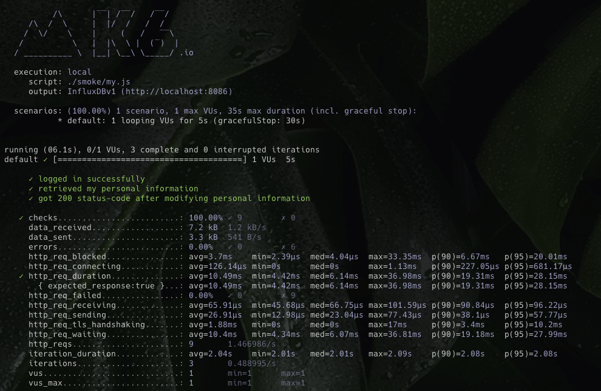
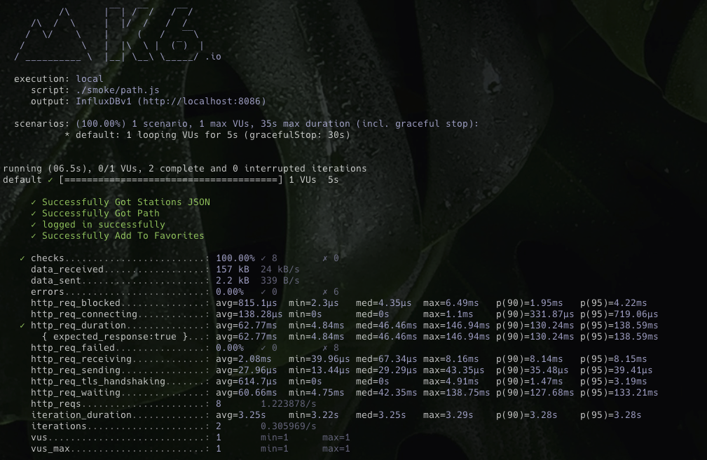
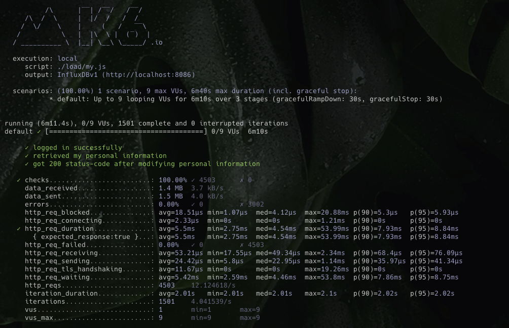
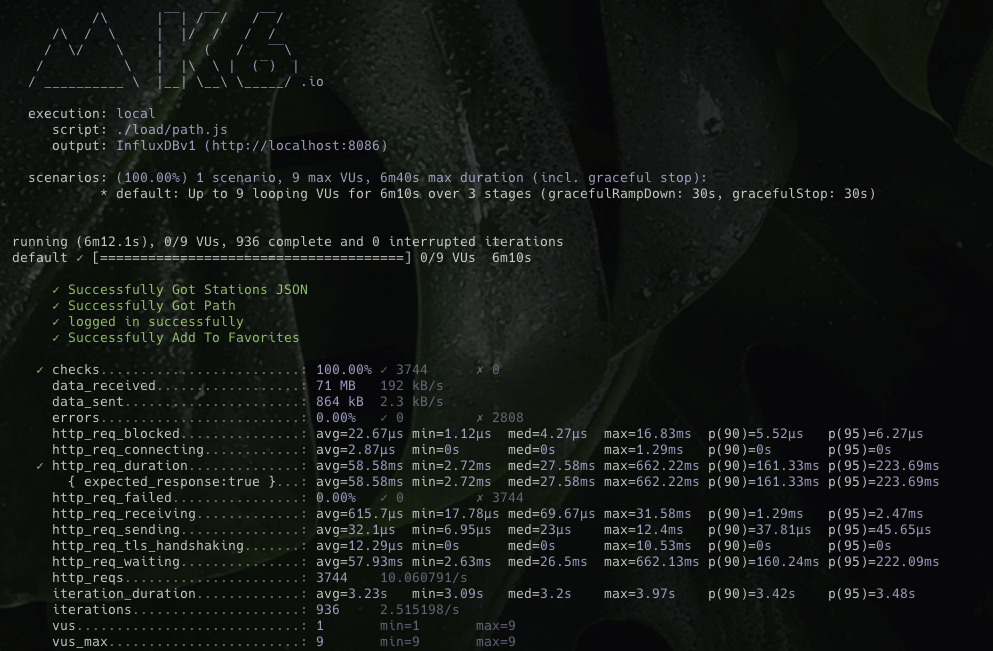
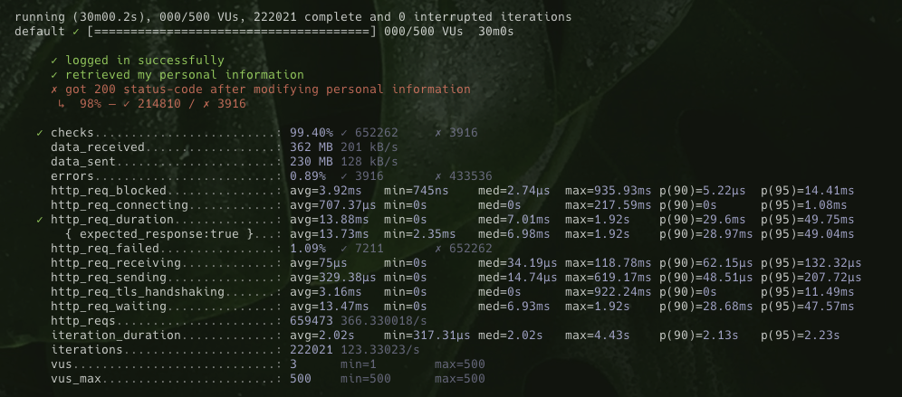
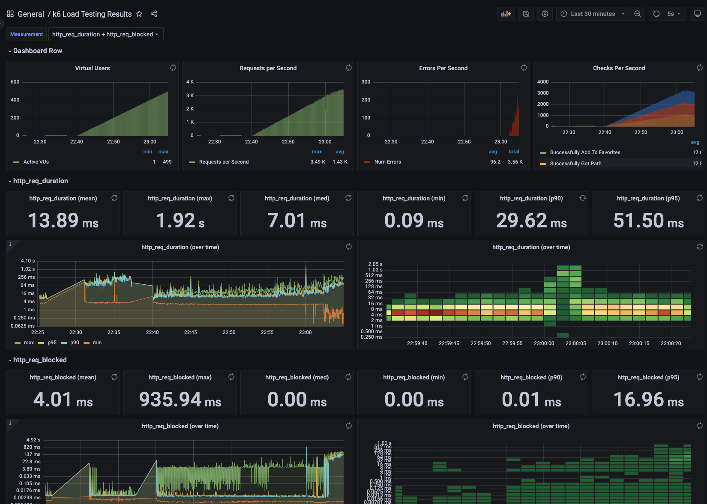
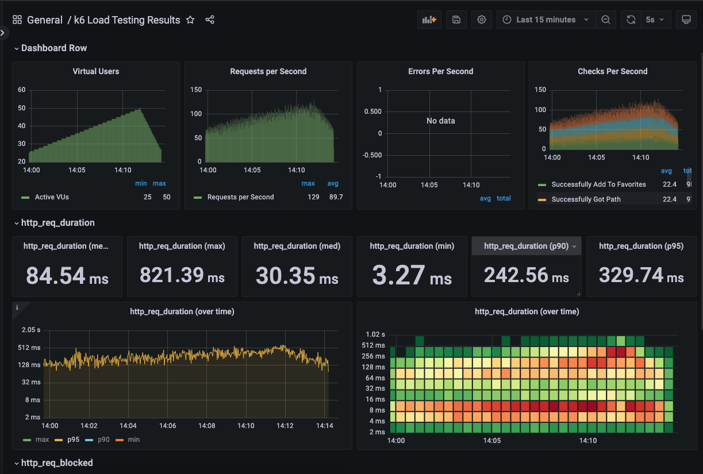

<p align="center">
    
</p>
<p align="center">
  
  
  <a href="https://edu.nextstep.camp/c/R89PYi5H" alt="nextstep atdd">
    
  </a>
  
</p>

<br>

# 인프라공방 샘플 서비스 - 지하철 노선도

<br>

## 🚀 Getting Started

### Install

#### npm 설치

```
cd frontend
npm install
```

> `frontend` 디렉토리에서 수행해야 합니다.

### Usage

#### webpack server 구동

```
npm run dev
```

#### application 구동

```
./gradlew clean build
```

<br>

### 1단계 - 웹 성능 테스트

1. 웹 성능예산은 어느정도가 적당하다고 생각하시나요

- 측정 :

| mobile       | FCP   | TTI   | LCP   | SCORE |
| ------------ | ----- | ----- | ----- | ----- |
| subway       | 15.1s | 15.7s | 15.6s | 30    |
| 서울도로공사 | 7.2s  | 10.9s | 12.8s | 33    |
| 네이버지도   | 2.2s  | 6.5s  | 8.2s  | 57    |
| 카카오맵     | 1.7s  | 4.2s  | 4.7s  | 74    |

| pc           | FCP  | TTI  | LCP  | SCORE |
| ------------ | ---- | ---- | ---- | ----- |
| subway       | 2.7s | 2.8s | 2.8s | 67    |
| 서울도로공사 | 1.7s | 2.2s | 4.0s | 63    |
| 네이버지도   | 0.5s | 0.7s | 1.7s | 87    |
| 카카오맵     | 0.5s | 0.7s | 1.1s | 92    |

- 목표 성능 예산 :
  - `서울교통공사`도 (개인적으로 생각하기에) 성능 예산이 좋지 않다고 판단하여 제외
  - `카카오맵`과 `네이버지도`가 상대적으로 성능 예산이 좋기때문에 이 두개와 비교하여 `목표 성능 예산`을 결정
    - `카카오맵`과 `네이버지도`의 성능 예산 범위 사이
    - `카카오맵`의 성능 예산과 `20%` 이상 차이 나지 않도록 잡음

| mobile | FCP   | TTI   | LCP   | SCORE |
| ------ | ----- | ----- | ----- | ----- |
| subway | <= 2s | <= 5s | <= 5s | >= 60 |

| pc     | FCP     | TTI     | LCP     | SCORE |
| ------ | ------- | ------- | ------- | ----- |
| subway | <= 0.5s | <= 0.7s | <= 1.4s | >= 90 |

2. 웹 성능예산을 바탕으로 현재 지하철 노선도 서비스는 어떤 부분을 개선하면 좋을까요

- 캐시 사용하기
  - js, css, png 등에 대해 캐시 사용하기
- resource (js, css, etc)에 대해 gzip 압축
- js 크기 줄이기
  - `/js/vendors.js`의 크기가 많이 크다고 생각됨. analyze 통해 줄일수 있는 부분 파악 필요.
- css 수정
  - `<style>` 대신 `<link rel="stylesheet">` 형태로 로드..? (너무 많은 <style> 태그로 나누어져 있는게 아닌지 생각됨)
- font 최적화
  - 웹폰트 크기가 너무 큰 경우, 페이지 로딩 속도가 늦어짐
  - google font (`&display=swap`), @font-face (`font-display: swap;`) 등 추가 (참고 : https://web.dev/font-display/?utm_source=lighthouse&utm_medium=lr)
- 리소스 lazy load
  - 첫페이지 로드에 필요하지 않은 리소스는 lazy-load나 parallel-load 로 불러오도록 수정

---

### 2단계 - 부하 테스트

1. 부하테스트 전제조건은 어느정도로 설정하셨나요

- 대상 시스템 범위
  - 접속 빈도가 높은 페이지 : 경로 검색 페이지
  - 데이터를 갱신하는 페이지 : 나의 정보 페이지 (나이 update)
  - 데이터를 조회하는데 여러 데이터를 참조하는 페이지 : 경로 검색 페이지
- 목표값 설정
  - latency : 없음
  - throughput :
    - 경쟁사인 카카오 MAU를 기준으로 산정
    - MAU : 150만
    - DAU : 약 5만 (MAU / 30)
    - 하루 평균 접속횟수 : 3번
    - 하루 총 접속횟수 : 15만번 (DAU x 하루 평균 접속횟수)
    - 하루 평균 rps : 1.73 (150,000 / 86,440)
    - 하루 최대 rps : 17.3 (peak시 10배로 가정)
    - average response time (목표) : 500ms
    - my 페이지 :
      - requests : login + me + modify = 3개
      - 평균 VUser : 1.73 x (3 x 0.5 + 0) / 3 = 0.865 = 1
      - 최대 VUser : 8.65 = 9
    - 경로 검색 페이지 :
      - requests : stations + path + login + favorite = 4개
      - 평균 VUser : 1.73 x (4 x 0.5 + 0) / 4 = 0.865 = 1
      - 최대 VUser : 8.65 = 9
  - 부하 테스트 시 저장될 데이터 건수 및 크기
    - 나의 정보 수정시
    - json 데이터 1건 (content-length: 61)

2. Smoke, Load, Stress 테스트 스크립트와 결과를 공유해주세요

- Smoke Test
  - [my smoke test](./k6/scripts/smoke/my.js)
  - 
  - [path smoke test](./k6/scripts/smoke/path.js)
  - 
- Load Test
  - [my smoke test](./k6/scripts/load/my.js)
  - 
  - [path smoke test](./k6/scripts/load/path.js)
  - 
- Stress Test
  - [my stress test](./k6/scripts/stress/my.js)
  - 
  - 
  - [path stress test](./k6/scripts/stress/path.js)
  - 

---

### 3단계 - 로깅, 모니터링

1. 각 서버내 로깅 경로를 알려주세요

2. Cloudwatch 대시보드 URL을 알려주세요
