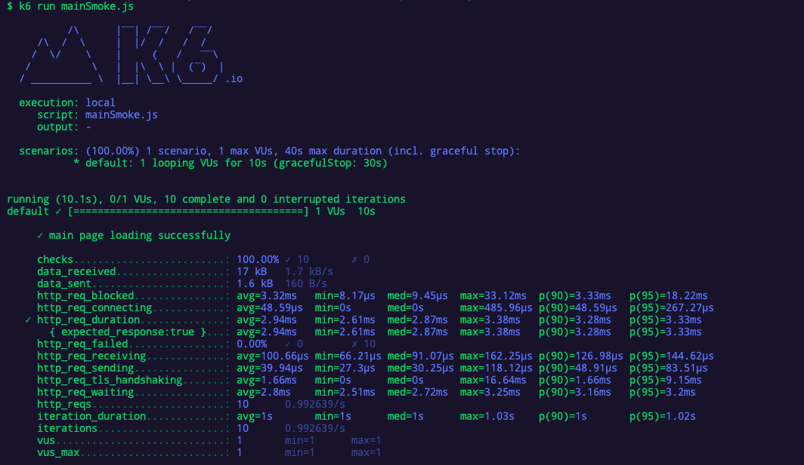
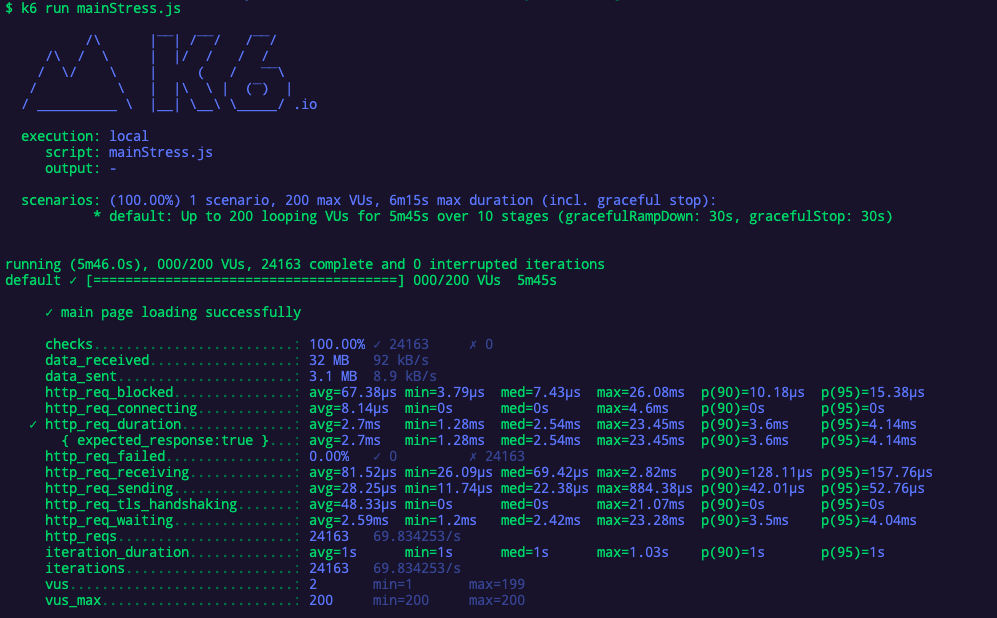
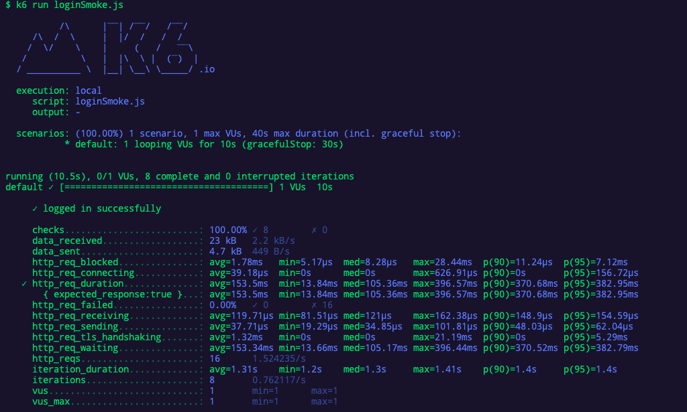
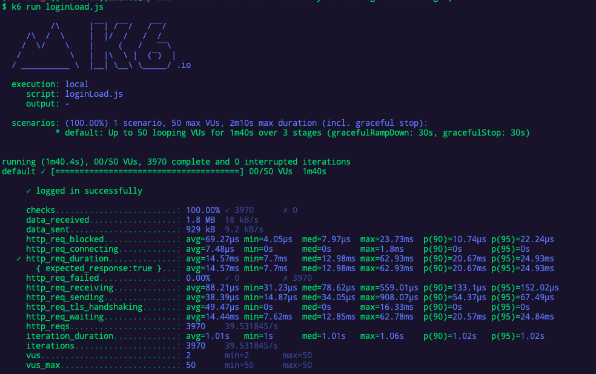
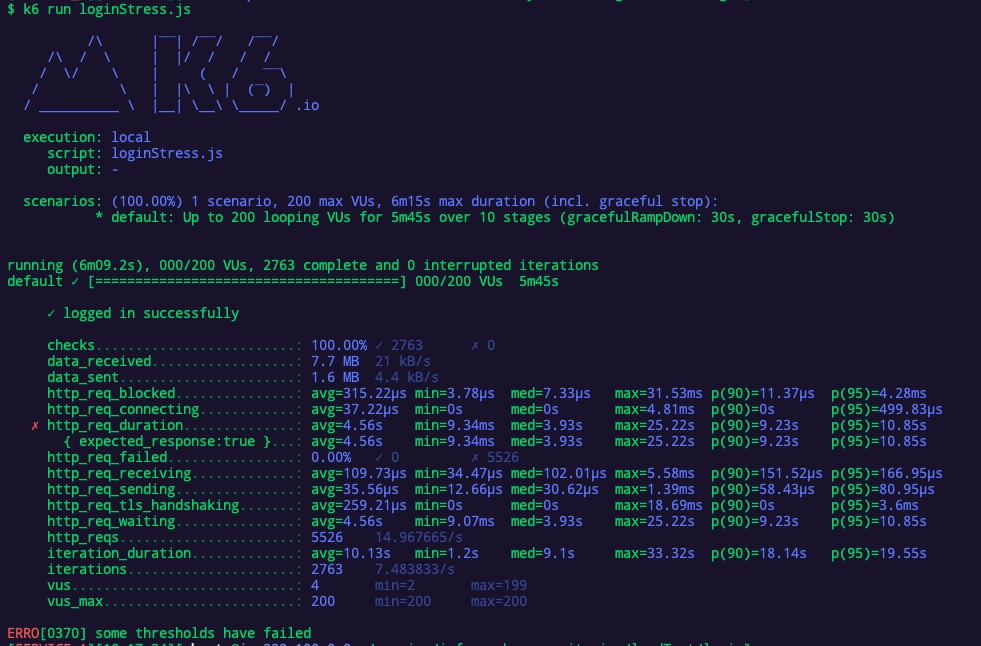
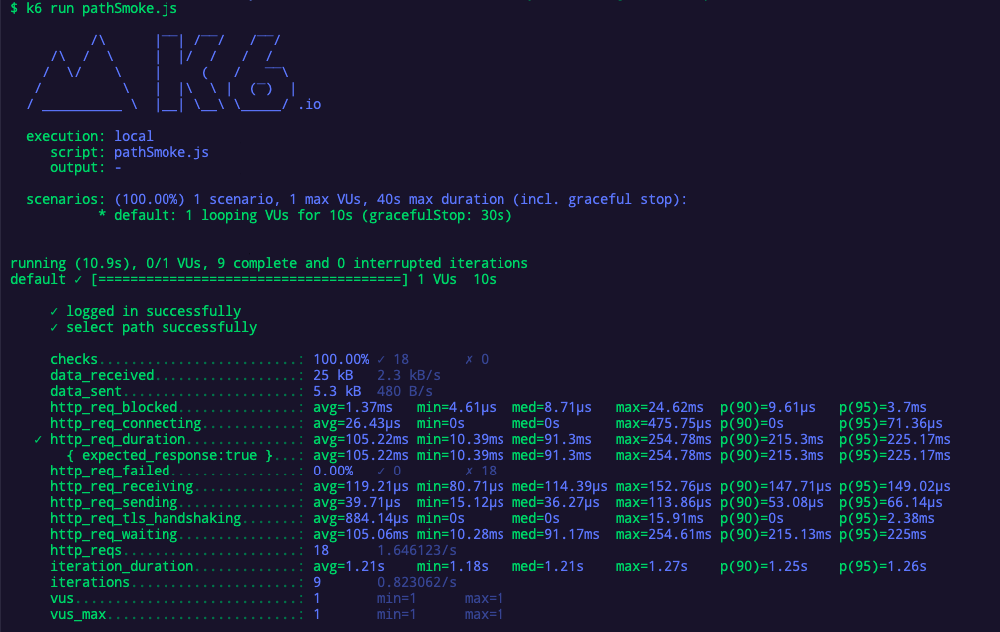
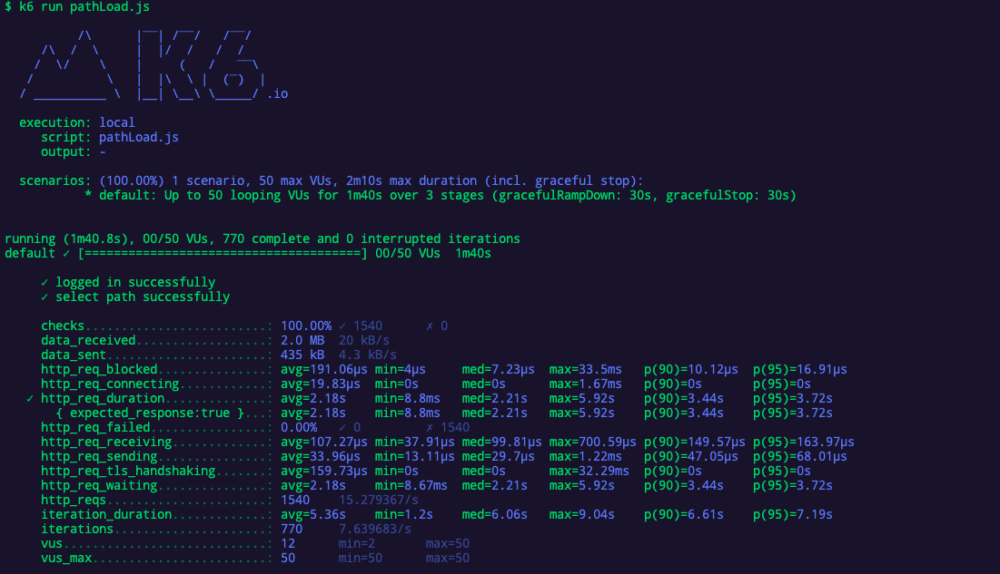
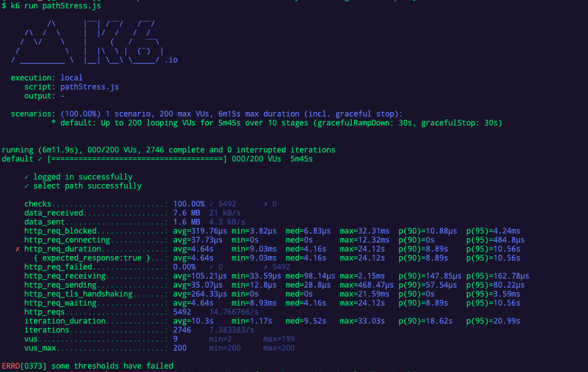

<p align="center">
    
</p>
<p align="center">
  
  
  <a href="https://edu.nextstep.camp/c/R89PYi5H" alt="nextstep atdd">
    
  </a>
  
</p>

<br>

# 인프라공방 샘플 서비스 - 지하철 노선도

<br>

## 🚀 Getting Started

### Install
#### npm 설치
```
cd frontend
npm install
```
> `frontend` 디렉토리에서 수행해야 합니다.

### Usage
#### webpack server 구동
```
npm run dev
```
#### application 구동
```
./gradlew clean build
```
<br>

## 미션

* 미션 진행 후에 아래 질문의 답을 작성하여 PR을 보내주세요.

### 1단계 - 인프라 운영하기
1. 각 서버내 로깅 경로를 알려주세요
nginx : /var/log/nginx/
was : /home/ubuntu/service/infra-subway-monitoring/log

2. Cloudwatch 대시보드 URL을 알려주세요
https://ap-northeast-2.console.aws.amazon.com/cloudwatch/home?region=ap-northeast-2#dashboards:name=DASHBOARD_nhs0912

---

### 2단계 - 성능 테스트
1. 웹 성능예산은 어느정도가 적당하다고 생각하시나요
### 성능지표
|   | 지하철노선도 | NAV** MAP| GOOG** MAP|
|---|:---:|---:|---:|
|First Contentful Paint|2.7 초|  2.8 초  |3.6 초 |
|Time to Interactive|2.8 초|  6.5 초  | 7.0 초 |
|Speed Index|2.7 초|  7.4 초  | 4.5 초|
|Total Blocking Time|50 밀리초|  250 밀리초  |910 밀리초 |
|Largest Contentful Paint|2.8초|  6.6 초  | 5.8 초|
|Cumulative Layout Shift|0.004 |  0.017  | 0|
  ---
|   | 지하철노선도 | NAV** MAP| GOOG** MAP|
|---|:---:|---:|---:|
| First Byte Time | A | B | B
| Keep-alive Enabled | A | A| A
| Compress Transfer | F |D|A
| Compress Images | A |A|A
| Cache static content | C | B|A
| Effective use of CDN | X | X| O
---

2. 웹 성능예산을 바탕으로 현재 지하철 노선도 서비스는 어떤 부분을 개선하면 좋을까요
  N사와 G사에 비해서 Compress Transfer항목이 제일 낮게 측정이 되었습니다.
  따라서 스크립트파일이 Content-Encoding으로 압축을 하면 개선이 될거 같습니다.

3. 부하테스트 전제조건은 어느정도로 설정하셨나요

* Throughput
  - 1일 사용자 수(DAU) x 1명당 1일 평균 접속 수 = 1일 총 접속 수
  - 1일 총 접속 수 / 86,400 (초/일) = 1일 평균 rps
  - 1일 평균 rps x (최대 트래픽 / 평소 트래픽) = 1일 최대 rps
- 예상치 도출
  - nav** map과 goog** map 트래픽 비교 [링크](https://www.similarweb.com/website/map.naver.com/?competitors=maps.google.co.kr)
  - 지난 6개월간 방문자 통계 nav** 약 448만명 and googl** 약 10만명
  - 경쟁업체를 기준으로 선정
  - 사용자가 보통 5번씩 사용한다고 가정(출퇴근 기준 & 약속장소)
    접속자가 많은 N사 기준
    ---------------------
  - 1일 총 접속수: 448만명 * 5 = 2240만회
  - 2240만 / 86,400 = 259rps (1일 평균 rps)
  - 2021-05~ 2021-10 : 평균 트래픽 -> 44,800,000
  - 2021-08 : 최대 트래픽 -> 46,200,000
  - 259rps * 1.03 = 약 267 rps(1일 최대 rps)
  - 사용자가 1분 내외로 사용한다고 가정.

4. Smoke, Load, Stress 테스트 스크립트와 결과를 공유해주세요

- main 페이지 - 접속 빈도가 높은 페이지
  * Smoke
  
  * Load
  
  * Stress
  

- login 페이지 - 데이터를 갱신하는 페이지
  * Smoke
  
  * Load
  
  * Stress
  

- path 페이지 - 데이터를 조회하는데 여러 데이터를 참조하는 페이지
  * Smoke
  
  * Load
  
  * Stress
  

