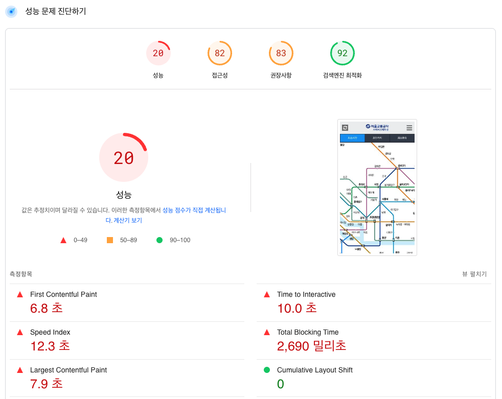
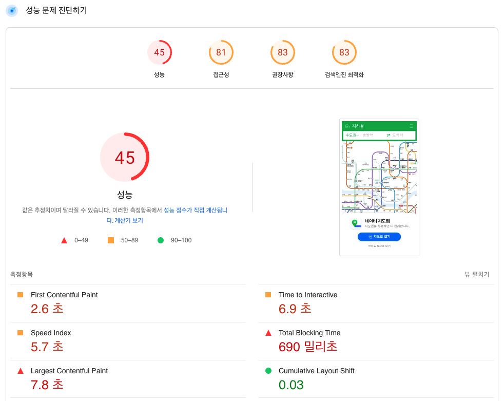
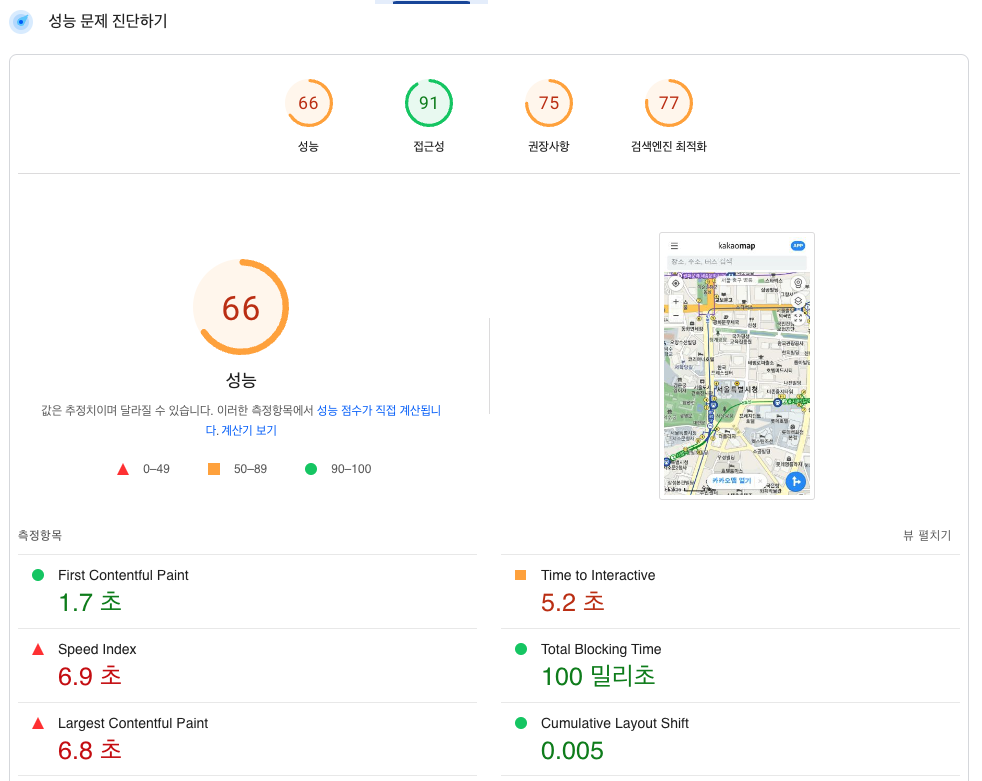

<p align="center">
    
</p>
<p align="center">
  
  
  <a href="https://edu.nextstep.camp/c/R89PYi5H" alt="nextstep atdd">
    
  </a>
  
</p>

<br>

# 인프라공방 샘플 서비스 - 지하철 노선도

<br>

## 🚀 Getting Started

### Install
#### npm 설치
```
cd frontend
npm install
```
> `frontend` 디렉토리에서 수행해야 합니다.

### Usage
#### webpack server 구동
```
npm run dev
```
#### application 구동
```
./gradlew clean build
```
<br>


### 1단계 - 웹 성능 테스트

#### 개념정리

- FCP(First Contentful Paint) : 첫 번째 텍스트 또는 이미지가 표시되는 시간
- TTI(Time to Interactive) : 완전히 페이지와 상호작용할 수 있게 될 때까지 걸리는 시간
- SI(Speed Index) : 페이지 콘텐츠가 얼마나 빨리 표시되는지 보여주는 수치
- TBT(Total Blocking Time) : FCP와 상호작용 시간 사이의 모든 시간의 합으로 작업 지속 시간이 50ms를 넘으면 밀리초 단위로 표현
- LCP(Large Contentful Paint) : 최대 텍스트 또는 이미지가 표시되는 시간
- CLS(Cumulative Layout Shift) : 표시 영역 안에 보이는 요소의 이동을 측정

#### 성능비교





|   사이트   | FCP   | TTI    | SI     | TBT      | LCP   |  CLS  |
|----------|-------|--------|--------|----------|-------|-------|
| 서울교통공사 | 6.8 초 | 10.0 초 | 12.3 초 | 2690 밀리초 | 7.9 초 |   0   |
|  네이버지도 | 2.6 초 | 6.9 초  | 5.7 초  | 690 밀리초  | 7.8 초 |  0.03  |
|  카카오지도 | 1.7 초 | 5.2 초  | 6.9 초  | 100 밀리초  | 6.8 초 |  0.005 |


1. 웹 성능예산은 어느정도가 적당하다고 생각하시나요

- 경쟁사의 평균치에 도달해야 한다.
- 유독 차이가 큰 성능예산들을 위주로 성능예산을 잡는다.
  - 서울교통공사 기준
    - FCP : 6.4초
    - TTI : 10.0초
    - SI : 12.3초
- 개선 방안 확인
  - 서울교통공사 기준
    - 텍스트 압축 : 6.0초
      - 텍스트 기반 리소스를 압축
    - 렌더링 차단 리소스 제거하기 : 4.43초
      - 중요하지 않은 자바스크립트 줄이기
    - 초기 서버 응답 시간 단축 : 1.57초
      - /kr/cyberStation.do 응답 속도 개선

2. 웹 성능예산을 바탕으로 현재 지하철 노선도 서비스의 서버 목표 응답시간 가설을 세워보세요.

웹성능 지표에 따르면 (텍스트 압축 + 렌더링 차단 리소스 + 리소스 조회 시간) 줄이면 큰 변화가 있을 것 같습니다. 
목표는 경쟁사의 평균보다 응답속도는 빠르고, 3초의 법칙을 감안하여 3초대는 넘지 않도록 설정합니다.

|   사이트   | FCP   | TTI   | SI    |    TBT   | LCP   |  CLS  |
|----------|-------|-------|-------|----------|-------|-------|
| 경쟁사 평균 | 3.7 초 | 7.3 초 | 8.3 초 |    -     | 7.5 초 |   -   |
| 목표응답시간 | 3.5 초 | 3.5 초 | 3.5 초 |    -     | 3.5 초 |   -   |

---

### 2단계 - 부하 테스트 
1. 부하테스트 전제조건은 어느정도로 설정하셨나요

2. Smoke, Load, Stress 테스트 스크립트와 결과를 공유해주세요

---

### 3단계 - 로깅, 모니터링
1. 각 서버내 로깅 경로를 알려주세요

2. Cloudwatch 대시보드 URL을 알려주세요
