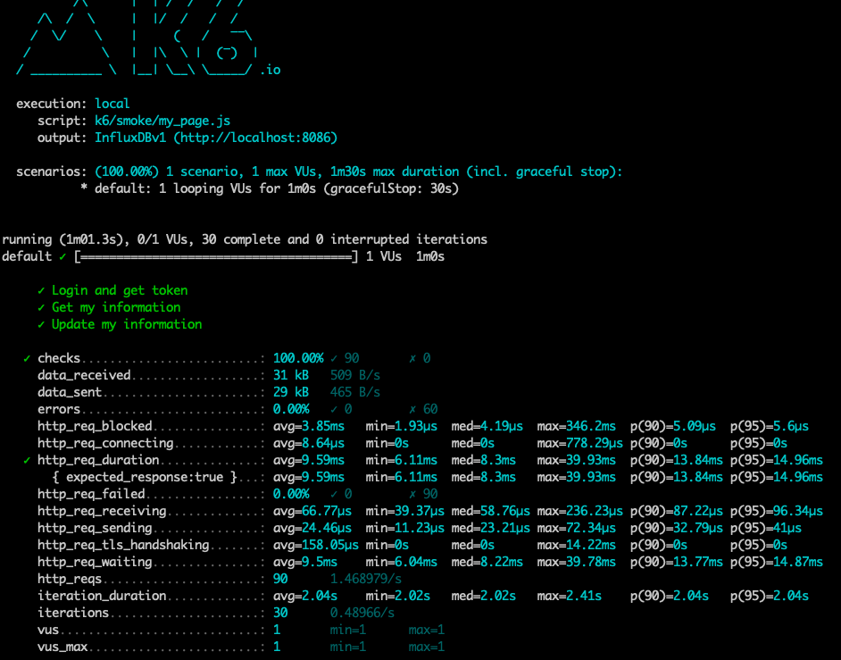
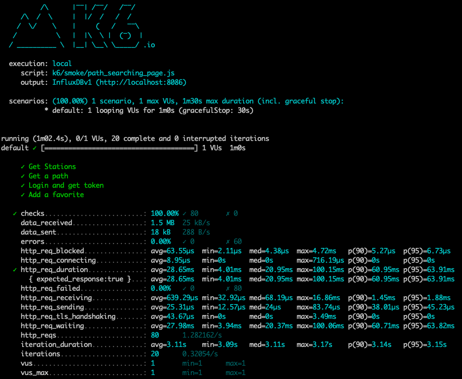

<p align="center">
    
</p>
<p align="center">
  
  
  <a href="https://edu.nextstep.camp/c/R89PYi5H" alt="nextstep atdd">
    
  </a>
  
</p>

<br>

# 인프라공방 샘플 서비스 - 지하철 노선도

<br>

## 🚀 Getting Started

### Install

#### npm 설치

```
cd frontend
npm install
```

> `frontend` 디렉토리에서 수행해야 합니다.

### Usage

#### webpack server 구동

```
npm run dev
```

#### application 구동

```
./gradlew clean build
```

<br>

### 웹 성능 진단 용어

```
- FCP (First Contentful Paint) : 페이지가 로드되기 시작한 시점부터 페이지 콘텐츠의 일부가 화면에 렌더링될 때까지의 시간
- TTI (Time to Interactive) : 페이지가 완전히 상호 작용 가능하게 되는 데 걸리는 시간
- SI (Speed Index) : 페이지 로드 중에 콘텐츠가 시각적으로 표시되는 속도
- TBT (Total Blocking Time) : 페이지가 안정적인 상호 작용 환경이 되기 전, 상호 작용이 불가능한 시간
- LCP (Largest Contentful Paint) : 초기 DOM 콘텐츠가 렌더링되는 데 걸리는 시간을 측정
- CLS (Cumulative Layout Shift) :  사용자가 예상치 못한 레이아웃 이동을 경험하는 빈도
```

### 웹 성능 진단 - 경쟁사 포함

#### 성능 진단 사이트

[웹 성능 진단 사이트 - PageSpeed Insights](https://pagespeed.web.dev)

#### 성능 진단 대상 사이트

- [RunningMap](https://orgojy.ga)
- [서울교통공사](http://www.seoulmetro.co.kr)
- [네이버맵](https://map.naver.com)
- [카카오맵](https://map.kakao.com)

#### 성능 진단 - 휴대전화

|            | FCP   | TTI   | SI    | TBT      | LCP   | CLS   | Performance |
|------------|-------|-------|-------|----------|-------|-------|-------------|
| RunningMap | 14.9s | 15.6s | 14.9s | 600ms    | 15.5s | 0.041 | 30          |
| 서울교통공사     | 7.2s  | 8.5s  | 20.6s | 260ms    | 17.3s | 0     | 44          |
| 네이버맵       | 2.2s  | 24.2s | 11.4s | 15,280ms | 17.7s | 0.017 | 23          |
| 카카오맵       | 1.7s  | 4.2s  | 6.6s  | 70ms     | 6.3s  | 0.139 | 65          |

#### 성능 진단 - 데스크톱

|            | FCP  | TTI  | SI   | TBT   | LCP  | CLS   | Performance |
|------------|------|------|------|-------|------|-------|-------------|
| RunningMap | 2.7s | 2.8s | 2.7s | 30ms  | 2.8s | 0.004 | 68          |
| 서울교통공사     | 1.7s | 2.3s | 7.6s | 70ms  | 3.7s | 0.229 | 57          |
| 네이버맵       | 0.4s | 3.5s | 3.1s | 630ms | 9.6s | 0     | 40          |
| 카카오맵       | 0.6s | 2.7s | 2.3s | 800ms | 0.7s | 0.018 | 66          |

### 1단계 - 웹 성능 테스트

#### 1. 웹 성능예산은 어느정도가 적당하다고 생각하시나요

**목표 : "카카오맵"과 같은 UX를 제공하기 위해 비슷한 수준인 80% 향상으로 성능예산을 책정합니다.**

**성능예산 - 휴대전화**

| Mobile | FCP   | TTI   | SI    | LCP   |
|--------|-------|-------|-------|-------|
| ASIS   | 14.9s | 15.6s | 14.9s | 15.5s |
| TOBE   | 약 2s  | 약 5s  | 약 7s  | 약 7s  |

**성능예산 - 데스크톱**

| Desktop | FCP  | TTI  | SI   | LCP  | 
|---------|------|------|------|------|
| ASIS    | 2.7s | 2.8s | 2.7s | 2.8s |
| TOBE    | 약 1s | 약 3s | 약 3s | 약 1s |

#### 2. 웹 성능예산을 바탕으로 현재 지하철 노선도 서비스는 어떤 부분을 개선하면 좋을까요

- 휴대전화에서 최적화될 수 있는 최적화된 사이즈의 리소스 파일로 압축합니다.
- 모든 웹 페이지의 각 페이지 내 포함된 자바스크립트 크기는 1MB를 넘지 않아야 합니다.
- 사용하지 않는 자바스크립트, CSS 를 제거 합니다.
- 사용하고 있는 브라우저의 캐시를 최대한 사용 합니다.
- 텍스트 기반 리소스를 압축(gzip, deflate, brotli)하여 제공 합니다.
- 메인 페이지의 모든 오브젝트 파일 크기는 10MB 미만으로 제한 합니다.

---

### 2단계 - 부하 테스트

1. 부하테스트 전제조건은 어느정도로 설정하셨나요

**대상 시스템 범위**

```
1. "경로 검색"
    * 역 리스트 조회, 경로 검색, 로그인, 즐겨찾기
2. "마이 페이지"
    * 로그인, 내 정보 조회, 내 정보 갱신
```

**예상 수치 설정**

```
* 1일 사용자 수(DAU): 1,500,000
    * 카카오맵 MAU의 20% 수준 예상(카카오맵 MAU: 7,290,000)
    * 피크 시간대의 집중률(최대 트래픽 / 평소 트래픽): 4.0
        * 피크 시간대: 오전 8 ~ 9시, 오후 6 ~ 7시
        * 최대 트래픽(지역별 평균): 1,000,000
        * 평소 트래픽(지역별 평균): 200,000
    * 1명당 1일 평균 접속 혹은 요청수
        * 1일 평균 접속: 총 3회 - 즐겨찾기 확인(출/퇴근), 경로 검색
        * 1회 접속시 요청: 총 4회 - 메인 페이지, 로그인 페이지, 로그인, 즐겨찾기 조회
```

**목표값 설정**

```
throughput
    * 현재 우리 비즈니스 목표와 개발 여건을 고려하여 설정 
    * MAU = 150만
    * DAU = MAU / 30 = 5만
    * 1일 평균 접속수 = 10회
    * 1일 총 접속수 = DAU x 1일 평균 접속횟수 = 50만회
    * 1일 평균 rps = 1일 총 접속수 / 1일 초의 총합 = 500,000 / 86,440 = 5.78
    * peek 시간대 집중률 = 최대 트래픽 / 평소 트래픽 = 1,000,000 / 200,000 = 5 
    * 1일 최대 rps = 1일 평균 rps x (peak시 5배로 가정) = 28.9
latency
    * 200ms
VUser
    * "My Page"
        * R(requests) = 로그인 + 내 정보 조회 + 내 정보 수정 = 3개
        * http_req_duration = R x latency = 3 x 0.2 = 0.6
        * 목표 응답시간 T(VU iteration) = R x http_req_duration + 지연시간 = (3 * 0.6s) + 0s = 1.8s 
        * 평균 VUser = (1일 평균 rps * T) / R = 5.78 x 1.8 / 3 = 3.468 ≒ 3
        * 최대 VUser = 평균 VUser x peek 시간대 집중률 = 3.468 x 5 = 17.34 ≒ 17
    * "Path Searching Page"
        * R(requests) = 역 리스트 조회 + 경로 검색 + 로그인 + 즐겨찾기 = 4개
        * http_req_duration = R x latency = 4 x 0.2 = 0.8 
        * 목표 응답시간 T(VU iteration) = R x http_req_duration + 지연시간 = (4 * 0.8s) + 0s = 3.2s
        * 평균 VUser = (1일 평균 rps * T) / R = 5.78 x 3.2 / 4 = 4.624 ≒ 5
        * 최대 VUser = 평균 VUser x peek 시간대 집중률 = 4.624 x 5 = 23.12 ≒ 23
부하 유지기간
    * smoke test
        * "My Page": (1m,1vus)
        * "Path Searching Page": (1m,1vus)
    * load test
        * "My Page": (1m,1vus)->(3m,3vus)->(5m,17vus)->(3m,3vus)->(10s,0vus)
        * "Path Searching Page": (1m,1vus)->(3m,5vus)->(5m,23vus)->(3m,5vus)->(10s,0vus)
    * stress test : 10m
        * "My Page": (3m,100vus)->(3m,200vus)->(3m,300vus)->(3m,400vus)->(3m,500vus)->(10s,0vus)
        * "Path Searching Page": (3m,100vus)->(3m,200vus)->(3m,300vus)->(3m,400vus)->(3m,400vus)->(3m,500vus)->(10s,0vus)
```

**테스트 실행 방식**

```
# 실행
k6 run smoke/path_searching_page.js
# 디버깅 실행
k6 run smoke/path_searching_page.js --http-debug="full"
```

2. Smoke, Load, Stress 테스트 스크립트와 결과를 공유해주세요

**Smoke Test**

["My Page" 테스트 시나리오 JS 파일](k6/smoke/my_page.js) 의 결과 화면

["Path Searching Page" 테스트 시나리오 JS 파일](k6/smoke/path_searching_page.js) 의 결과 화면


**Load Test**

["My Page" 테스트 시나리오 JS 파일](k6/load/my_page.js) 의 결과 화면

---

### 3단계 - 로깅, 모니터링

1. 각 서버내 로깅 경로를 알려주세요

2. Cloudwatch 대시보드 URL을 알려주세요
