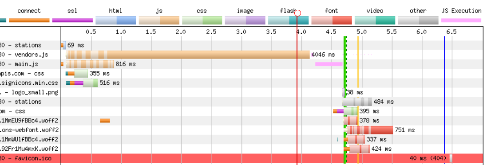

<p align="center">
    
</p>
<p align="center">
  
  
  <a href="https://edu.nextstep.camp/c/R89PYi5H" alt="nextstep atdd">
    
  </a>
  
</p>

<br>

# 인프라공방 샘플 서비스 - 지하철 노선도

<br>

## 🚀 Getting Started

### Install
#### npm 설치
```
cd frontend
npm install
```
> `frontend` 디렉토리에서 수행해야 합니다.

### Usage
#### webpack server 구동
```
npm run dev
```
#### application 구동
```
./gradlew clean build
```
<br>


### 1단계 - 웹 성능 테스트
1. 웹 성능예산은 어느정도가 적당하다고 생각하시나요
 
   * Infra-Subway/stations 데스크톱 기준

   | 사이트          | FCP  |  TTI  |  SI  |  TBT  |   LCP  |   CLS   |   Score  |
   |----------------|------|------|------|--------|--------| ------- |  :-----: |
   | Infra-Subway   | 2.9s | 4.7s | 2.9s | 1560ms |  2.9s  |   0.0   |    30    |
   | 서울교통공사     | 1.6s | 2.0s | 3.6s |  140ms |  3.6s  |  0.013  |    64    |
   | 네이버맵        | 0.5s | 0.7s | 2.1s |   0ms  |  1.6s  |  0.006  |    90    |
   | 카카오맵        | 1.7s | 4.3s | 7.7s |  90ms  |  5.0s  |  0.005  |    71    |


2. 웹 성능예산을 바탕으로 현재 지하철 노선도 서비스는 어떤 부분을 개선하면 좋을까요

WebpageTest, PageSpeed 로 확인 결과 전체적으로 타사 제품보다 성능이 떨어짐.



확인 결과, js, css, font 가 지연의 원인으로 보임

```
    * 텍스트 압축(gzip, deflate, brotli 등)을 사용
    * 사용하지 않는 자바스크립트 줄이기
        - /js/vendors.js
        - /js/main.js
```

---

### 2단계 - 부하 테스트 
1. 부하테스트 전제조건은 어느정도로 설정하셨나요

2. Smoke, Load, Stress 테스트 스크립트와 결과를 공유해주세요

---

### 3단계 - 로깅, 모니터링
1. 각 서버내 로깅 경로를 알려주세요

```
/var/log/nginx/access.log
/var/log/nginx/error.log
/var/log/syslog
/home/ubuntu/nextstep/infra-subway-monitoring/log/*.log
```


2. Cloudwatch 대시보드 URL을 알려주세요
```
https://ap-northeast-2.console.aws.amazon.com/cloudwatch/home?region=ap-northeast-2#dashboards:name=songsimo;expand=true;start=PT1H
```