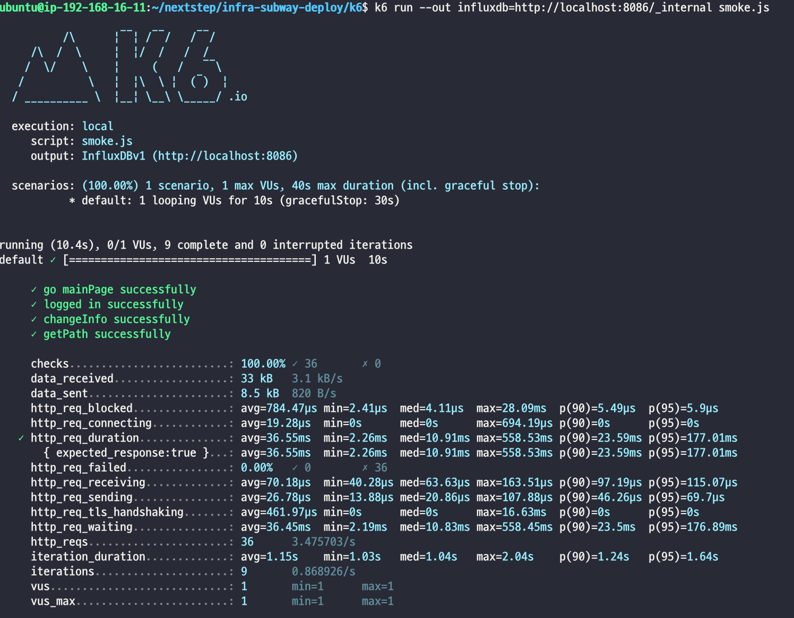
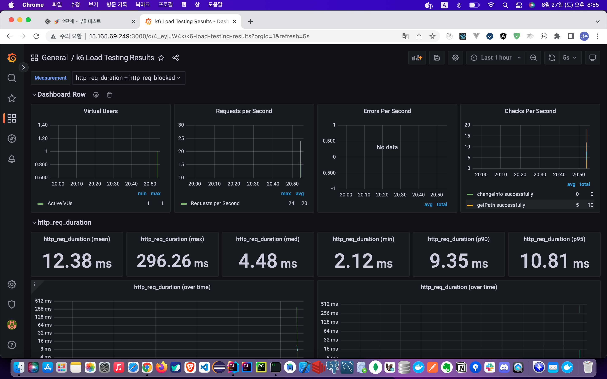
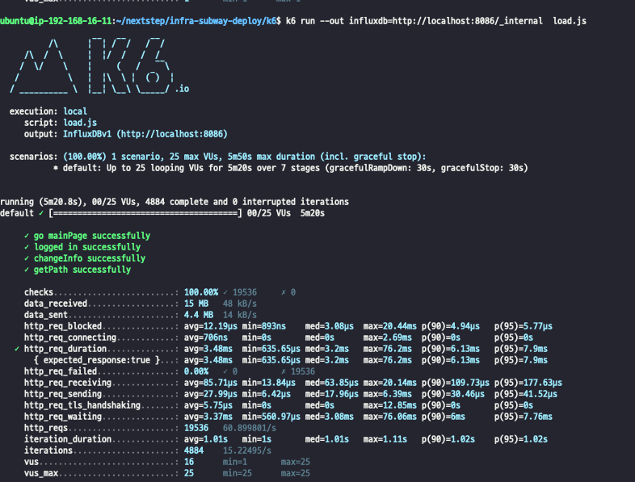
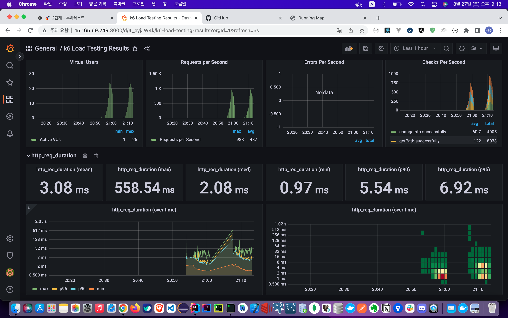

<p align="center">
    
</p>
<p align="center">
  
  
  <a href="https://edu.nextstep.camp/c/R89PYi5H" alt="nextstep atdd">
    
  </a>
  
</p>

<br>

# 인프라공방 샘플 서비스 - 지하철 노선도

<br>

## 🚀 Getting Started

### Install
#### npm 설치
```
cd frontend
npm install
```
> `frontend` 디렉토리에서 수행해야 합니다.

### Usage
#### webpack server 구동
```
npm run dev
```
#### application 구동
```
./gradlew clean build
```
<br>


### 1단계 - 웹 성능 테스트

1. 웹 성능 진단
   * [내 URL] https://sss-next-step.o-r.kr/
   * [서울 교통공사] www.seoulmetro.co.kr/kr/cyberStation.do
   * [네이버 지도] https://m.map.naver.com/subway/subwayLine.naver?region=1000
   * [카카오 맵] https://m.map.kakao.com/
   
### 용어

- First Contentful Paint (FCP) : 콘텐츠가 포함된 첫 페인트는 첫 번째 텍스트 또는 이미지가 표시되는 시간을 나타냅니다.
- Time to Interactive (TTI) : 사용할 수 있을 때까지 걸리는 시간은 완전히 페이지와 상호작용할 수 있게 될 때까지 걸리는 시간입니다.
- Speed Index (SI) : 속도 색인은 페이지 콘텐츠가 얼마나 빨리 표시되는지 보여줍니다.
- Total Blocking Time(TBT) : FCP와 상호작용 시간 사이의 모든 시간의 합으로 작업 지속 시간이 50ms를 넘으면 밀리초 단위로 표현됩니다.
- Largest Contentful Paint (LCP) : 콘텐츠가 포함된 최대 페인트는 최대 텍스트 또는 이미지가 표시되는 시간을 나타냅니다.
- Cumulative Layout Shift (CLS) : 누적 레이아웃 변경은 표시 영역 안에 보이는 요소의 이동을 측정합니다.

   
## webPageTest

### 용어

| site | First Byte | Start Render |  FCP   | Speed Index |   LCP   | CLS  |  TBT   | Total Bytes | 
| :----: | :----: | :---: |:------:|:-----------:|:-------:|:----:|:------:|:-----------:|
| 내 URL |  1.611s  | 8.5s | 8.469s |   8.528s    | 8.679s  | .058 |   0    |  2,462 kb   |
| 서울 교통공사 | 2.790s | 6.500S | 6.399S |   9.959S    | 6.401S  |  	0  | 8.108S |  1,064 KB   |
| 네이버 지도 | 1.332S |	3.600S | 3.567S |   7.348S    | 11.863S | .031 | .469S  |    988KB    |
| 카카오 맵 | 1.861S |	3.200S |	3.112S |	7.015S |	9.391S |	.004 |	.498S |	1,407KB |

## PageSpeed

1. MOBILE

| Site | SCORE |  FCP  | TTI   |   SI   |   TBT   |  LCP   |  CLS  |
| :----: | :----: |:-----:|:------|:------:|:-------:|:------:|:-----:|
| 내 URL | 33   | 14.6초 | 15.2초 | 14.6 초 | 500 밀리초 | 15.1 초 | 0.042 |
| 서울 교통공사 |  39   | 6.5초  | 8.5초  | 10.5초  | 490밀리초  |  6.9초  |   0   |
| 네이버 지도 |  58   | 2.2 초 | 5.9 초 | 7.2 초  | 250 밀리초 | 8.1 초  | 0.03  |
| 카카오 맵 |   71   | 1.7초  | 3.6초  |  6.3초  |  50밀리초  |  6.1초  | 0.005 |


2. PC

| Site | SCORE |  FCP  | TTI   |   SI   |   TBT   |  LCP   |  CLS  |
|:----------:|:-----:| :----: |:--------------------|:-----------:| :----: |:------------------------:|:-----------------------:|
|   내 URL    |  68   |         2.6 초        |        2.7 초        |      2.6 초       | 40 밀리초 |             2.7 초            |            0.004           |
|  서울 교통공사   |  59   | 1.4초 | 1.9초 | 4.1초 | 240밀리초 | 3.7초 | 0 |
|   네이버 지도   |   87  | 0.5초 | 0.6초 | 2.8초 | 0밀리초 | 1.7초 | 0.006 |
| 카카오 맵  |  91   | 0.5초 | 0.7초 | 2.4초 | 0밀리초 | 1.3초 | 0.039 |

---

1. 웹 성능예산은 어느정도가 적당하다고 생각하시나요

- 예산은 경쟁사 대비 최대 120% 전후 성능으로 예산을 산정합니다.

- LCP 는 1초~ 0.5초(PC 기준) 
- FCP 는 0.4 ~ 1초
- TTI 는 0.5 ~ 1.3초
- Lighthouse 80점 이상이 되어야 할것같습니다.


2. 웹 성능예산을 바탕으로 현재 지하철 노선도 서비스는 어떤 부분을 개선하면 좋을까요

- [ ] 텍스트 압축 사용
  - 네트워크 바이트를 최소화하기 위해 리소스를 압축(gzip, deflate, brotli)
- [ ] 사용 안하는 자바스크립트 줄인다.
  - /js/vendors.js(sss-next-step.o-r.kr)
  - /js/main.js(sss-next-step.o-r.kr)
- [ ] 렌더링을 블록하는 리소스를 제거한다.
  - /css?family=Roboto:100,300,400,500,700,900(fonts.googleapis.com)
  - /css/materialdesignicons.min.css(cdn.jsdelivr.net) 
- [ ] 콘텐츠가 포함된 최대 페인트 이미지 미리 로드
  - div.v-main__wrap > div.d-flex > div.text-center > img.main-logo
    

---

### 2단계 - 부하 테스트 
1. 부하테스트 전제조건은 어느정도로 설정하셨나요

- [X] 대상 시스템 범위 : WebServer, WAS, DB
- [X] 전제조건 및 목표값 정리

  |범주| 값 | 산출 기준 | 출처 |
    |-------|-------|------|---|
  |latency 목표|50ms 이하|목표값| |
  |하루평균 지하철 승차인원|440만|2021년 4월 서울 지하철 이용객수|https://www.bigdata-map.kr/datastory/traffic/seoul|
  |인당 1일평균 실행횟수|2.5|카카오지하철 기준 1일평균 실행횟수|https://ko.lab.appa.pe/2016-09/kakao-korea.html|
  |피크시간대 집중률|2.5|100만(피크시간대) / 38만(평균시간대)|https://www.bigdata-map.kr/datastory/traffic/seoul|
  |DAU|100만|지하철 종결자 기준 DAU|https://platum.kr/archives/61943|
  |1일 평균 rps|30|DAU * 1일평균 실행횟수 / 86,400|  |
  |1일 최대 rps|75|1일평균 rps * 피크시간대 집중률|  |
  |T|1.4|(4 * 0.1) + 1 (시나리오상 4번의 요청, Latency 목표 왕복 0.1sec, 지연시간 1sec)|  |
  |평균 VUser|10|(1일 평균 rps * T) / 요청 수|  |
  |최대 VUser|25|평균 VUser * 피크시간대 집중률|  |

- [X] Throughput 계산
  > Throughput : 1일 평균 rps ~ 1일 최대 rps
  >- 1일 사용자 수(DAU) x 1명당 1일 평균 접속 수 = 1일 총 접속 수
  >- 1일 총 접속 수 / 86,400 (초/일) = 1일 평균 rps
  >-  1일 평균 rps x (최대 트래픽 / 평소 트래픽) = 1일 최대 rps
    - 1일 평균 30 ~ 1일 최대 75
        - 100만 (DAU) * 2.5 (1명당 1일 평균 접속 수) = 250만 (1일 총 접속 수)
        - 250만 (1일 총 접속수) / 86,400 = 28.9 (1일 평균 rps)
        - 28.9 (1일 평균 rps) * (100만 (피크시간대 승객수) / 38만(평균시간대 승객수)) = 76 (1일 최대 rps)

2. Smoke, Load, Stress 테스트 스크립트와 결과를 공유해주세요

- smoke

```js
import http from 'k6/http';
import { check, group, sleep, fail } from 'k6';

export let options = {
  vus: 1, // 1 user looping for 1 minute
  duration: '10s',

  thresholds: {
    http_req_duration: ['p(99)<1500'], // 99% of requests must complete below 1.5s
  },
};

const BASE_URL = 'https://sss-next-step.o-r.kr/';
const USERNAME = 'tlstjdtn321@naver.com';
const PASSWORD = '1234';

export default function() {
  //메인 페이지
  mainPage()

  //로그인
  let token = login();

  //정보수정
  changeMyInfo(token);

  //경로탐색
  searchPath(10, 100)

  sleep(1);
}

function mainPage(){
  let mainRes = http.get(`${BASE_URL}`);
  check(mainRes, {
    'go mainPage successfully': (resp) => resp.status == 200
  });
}

function login(){
  var payload = JSON.stringify({
    email: `${USERNAME}`,
    password: `${PASSWORD}`
  });

  var params = {
    headers: {
      'Content-Type': 'application/json',
    },
  };

  let loginRes = http.post(`${BASE_URL}/login/token`, payload, params);

  check(loginRes, {
    'logged in successfully': (resp) => resp.json('accessToken') !== '',
  });

  return loginRes.json('accessToken');
}

function changeMyInfo(accessToken) {
  var payload = JSON.stringify({
    email: `${USERNAME}`,
    password: `${PASSWORD}`,
    age: 50
  });

  let params = {
    headers: {
      Authorization: `Bearer ${accessToken}`,
      'Content-Type': 'application/json',
    },
  };

  let changeInfoRes = http.put(`${BASE_URL}/members/me`, payload, params);
  check(changeInfoRes , {
    'changeInfo successfully': (response) => response.status === 200
  });
}

function searchPath(source, target){
  let pathRes = http.get(BASE_URL+'/path?source=' + source + '&target=' + target);
  check(pathRes, {
    'getPath successfully': (resp) => resp.status == 200
  } );
}
```




- load

```js
import http from 'k6/http';
import { check, sleep } from 'k6';

// 평균 UV - 10 , 최대 UV - 25
export let options = {
  stages: [
    { duration: '1m', target: 5 },
    { duration: '1m', target: 10 },
    { duration: '1m', target: 25 },
    { duration: '1m', target: 20 },
    { duration: '1m', target: 15 }
  ],

  thresholds: {
    http_req_duration: ['p(99)<1500'], // 99% of requests must complete below 1.5s
  },
};

const BASE_URL = 'https://sss-next-step.o-r.kr/';
const USERNAME = 'tlstjdtn321@naver.com';
const PASSWORD = '1234';

export default function ()  {
  //메인 페이지
  mainPage()

  //로그인
  let token = login();

  //정보수정
  changeMyInfo(token);

  //경로탐색
  searchPath(10, 100)

  sleep(1);
};

function mainPage(){
  let mainRes = http.get(`${BASE_URL}`);
  check(mainRes, {
    'go mainPage successfully': (resp) => resp.status == 200
  });
}

function login(){
  var payload = JSON.stringify({
    email: `${USERNAME}`,
    password: `${PASSWORD}`
  });

  var params = {
    headers: {
      'Content-Type': 'application/json',
    },
  };

  let loginRes = http.post(`${BASE_URL}/login/token`, payload, params);

  check(loginRes, {
    'logged in successfully': (resp) => resp.json('accessToken') !== '',
  });

  return loginRes.json('accessToken');
}

function changeMyInfo(accessToken) {
  var payload = JSON.stringify({
    email: `${USERNAME}`,
    password: `${PASSWORD}`,
    age: 50
  });

  let params = {
    headers: {
      Authorization: `Bearer ${accessToken}`,
      'Content-Type': 'application/json',
    },
  };

  let changeInfoRes = http.put(`${BASE_URL}/members/me`, payload, params);
  check(changeInfoRes , {
    'changeInfo successfully': (response) => response.status === 200
  });
}

function searchPath(source, target){
  let pathRes = http.get(BASE_URL+'/path?source=' + source + '&target=' + target);
  check(pathRes, {
    'getPath successfully': (resp) => resp.status == 200
  } );
}
```




- stress

```js
import http from 'k6/http';
import { check, sleep } from 'k6';

// 평균 rps - 30 , 최대 rps - 75
export let options = {
  stages: [
    { duration: '1m', target: 10 },
    { duration: '1m', target: 30 },
    { duration: '1m', target: 75 },
    { duration: '1m', target: 30 },
    { duration: '1m', target: 10 },
  ],

  thresholds: {
    http_req_duration: ['p(99)<1500'], // 99% of requests must complete below 1.5s
  },
};

const BASE_URL = 'https://sss-next-step.o-r.kr/';
const USERNAME = 'tlstjdtn321@naver.com';
const PASSWORD = '1234';

export default function ()  {
  //메인 페이지
  mainPage()

  //로그인
  let token = login();

  //정보수정
  changeMyInfo(token);

  //경로탐색
  searchPath(10, 100)

  sleep(1);
};

function mainPage(){
  let mainRes = http.get(`${BASE_URL}`);
  check(mainRes, {
    'go mainPage successfully': (resp) => resp.status == 200
  });
}

function login(){
  var payload = JSON.stringify({
    email: `${USERNAME}`,
    password: `${PASSWORD}`
  });

  var params = {
    headers: {
      'Content-Type': 'application/json',
    },
  };

  let loginRes = http.post(`${BASE_URL}/login/token`, payload, params);

  check(loginRes, {
    'logged in successfully': (resp) => resp.json('accessToken') !== '',
  });

  return loginRes.json('accessToken');
}

function changeMyInfo(accessToken) {
  var payload = JSON.stringify({
    email: `${USERNAME}`,
    password: `${PASSWORD}`,
    age: 50
  });

  let params = {
    headers: {
      Authorization: `Bearer ${accessToken}`,
      'Content-Type': 'application/json',
    },
  };

  let changeInfoRes = http.put(`${BASE_URL}/members/me`, payload, params);
  check(changeInfoRes , {
    'changeInfo successfully': (response) => response.status === 200
  });
}

function searchPath(source, target){
  let pathRes = http.get(BASE_URL+'/path?source=' + source + '&target=' + target);
  check(pathRes, {
    'getPath successfully': (resp) => resp.status == 200
  } );
}
```


---

### 3단계 - 로깅, 모니터링
1. 각 서버내 로깅 경로를 알려주세요

2. Cloudwatch 대시보드 URL을 알려주세요
