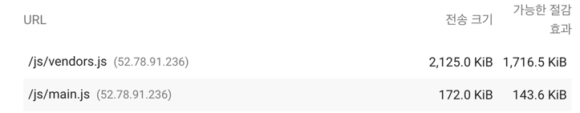
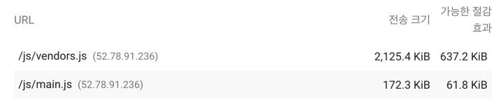
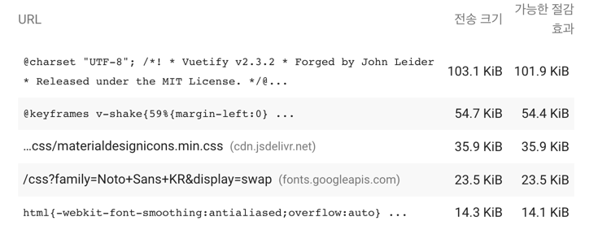
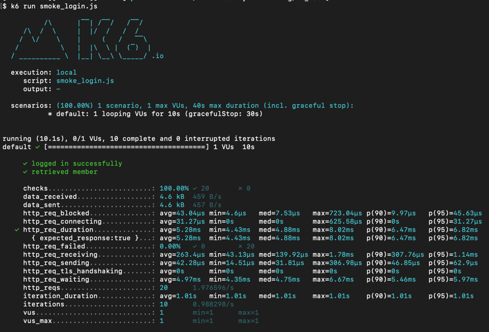
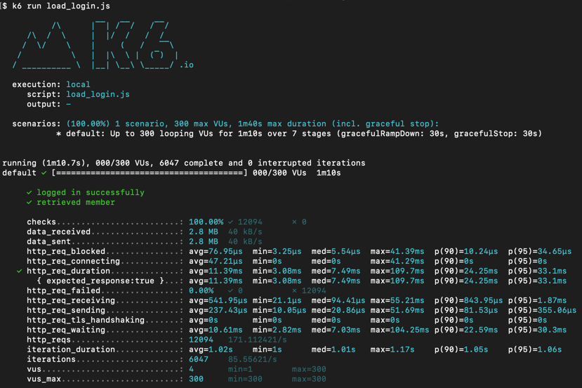
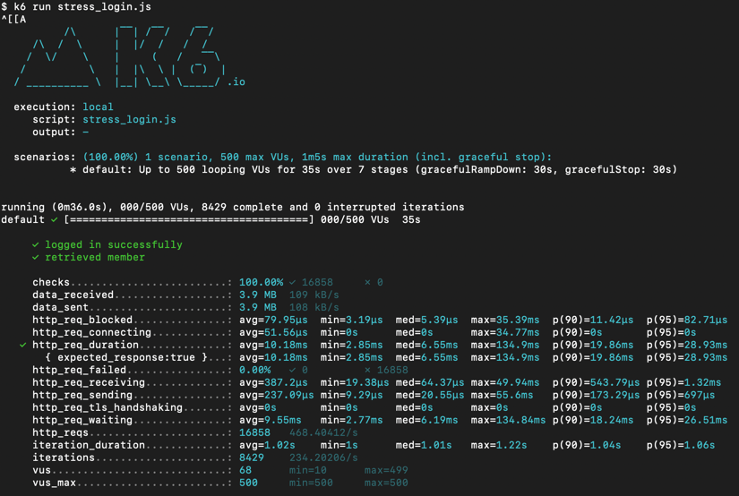

<p align="center">
    
</p>
<p align="center">
  
  
  <a href="https://edu.nextstep.camp/c/R89PYi5H" alt="nextstep atdd">
    
  </a>
  
</p>

<br>

# 인프라공방 샘플 서비스 - 지하철 노선도

<br>

## 🚀 Getting Started

### Install
#### npm 설치
```
cd frontend
npm install
```
> `frontend` 디렉토리에서 수행해야 합니다.

### Usage
#### webpack server 구동
```
npm run dev
```
#### application 구동
```
./gradlew clean build
```
<br>

## 미션

* 미션 진행 후에 아래 질문의 답을 작성하여 PR을 보내주세요.

### 1단계 - 인프라 운영하기
- 요구 사항
    - 로그 설정하기
        - Application Log 파일로 저장하기
            - 회원가입
            - 로그인
            - 최단거리 조회 
            - 기타 등등 이벤트에 로깅을 설정
        - Nginx Access Log 설정하기
    - Cloudwatch로 모니터링
        - Cloudwatch로 로그 수집하기
        - Cloudwatch로 메트릭 수집하기
    
- 서버 정보

- 대역 :
    - 외부망1 : 10.10.15.0/26
    - 외부망2 : 10.10.15.64/26
    - 내부망 : 10.10.15.128/27
    - 관리망 : 10.10.15.160/27

- 배포한 서비스의 공인 IP(혹은 URL)를 알려주세요
    - URL : http://dev.kwaktaemin-subway.kro.kr
-  베스천 서버에 접속을 위한 pem키는 [구글드라이브](https://drive.google.com/drive/folders/1dZiCUwNeH1LMglp8dyTqqsL1b2yBnzd1?usp=sharing)에 업로드해주세요
    - /pem/wootecam-pro-2/kwaktaemin-keypair.pem 공유

1. 각 서버내 로깅 경로를 알려주세요
   - App Log : /home/ubuntu/infra-subway-monitoring/app.log
   - Nginx Access : /var/log/nginx/access.log
   - Nginx Errors : /var/log/nginx/error.log


2. Cloudwatch 대시보드 URL을 알려주세요
   - https://ap-northeast-2.console.aws.amazon.com/cloudwatch/home?region=ap-northeast-2#dashboards:name=DASHBOARD-kwaktaemin
---

### 2단계 - 성능 테스트
1. 웹 성능예산은 어느정도가 적당하다고 생각하시나요
- 아래 비교 해본 경과 
- First Contentful Paint(FCP) : 3초 이내
- Largest Contentful Paint(LCP) : 3초 이내
- Cumulative Layout Shift(CLS)  : 1초 이내
- Speed Index : 3초 이내
- Time to Interactive : 10초 이내
- Total Bolcking Time : 500ms 이내
```
- 서브웨이
- First Contentful Paint(FCP) : 14.9s (문제)
- Largest Contentful Paint(LCP) : 15.6s (문제)
- Cumulative Layout Shift(CLS) : 0.047 (좋음)
- Speed Index : 14.9s (문제)
- Time to Interactive : 15.6s (문제)
- Total Blocking Time : 530ms (경고)
```
```
- 당근마켓 
- First Contentful Paint(FCP) : 1.3s (좋음)
- Largest Contentful Paint(LCP) : 1.5s (좋음)
- Cumulative Layout Shift(CLS) : 0 (좋음)
- Speed Index : 3.6s (경고)
- Time to Interactive : 7.7s (문제)
- Total Blocking Time : 210ms (경고)
```
```
- 인프런 
- First Contentful Paint(FCP) : 1.4s (좋음)
- Largest Contentful Paint(LCP) : 2.2s (좋음)
- Cumulative Layout Shift(CLS) : 0.07 (좋음)
- Speed Index : 21.6s (문제)
- Time to Interactive : 43.3s (문제)
- Total Blocking Time : 5.440ms (문제)
```
2. 웹 성능예산을 바탕으로 현재 지하철 노선도 서비스는 어떤 부분을 개선하면 좋을까요
- 텍스트 압축 사용
    
     
- 사용하지 않는 자바스크립트 줄이기
    
- 렌더링 차단 리소스 제거하기
    
- 사용하지 않는 CSS 줄이기
    

3. 부하테스트 전제조건은 어느정도로 설정하셨나요

- 예상 1일 사용자 수 (DAU) 
    - 회원가입 : 100만명
    - 100만명 / 30일 = 예상 3만명
    - DAU : 30000
- 피크 시간대의 집중률  
    - 아침 시간 : 7 - 8시 사이
    - 저녁 시간 : 6 - 7시 사이 
- 1명당 1일 평균 요청수 : 5번
- Throughput : 1일 평균 rps - 1일 최대 rps
    - 1일 사용자 수(DAU) * 1명 당 1일 평균 요청 수 = 1일 총 접속 수 
        - 1일 총 접속 수 : 30000 * 5 = 150000 (1일 총 접속 수)
    - 1일 총 접속 수 / 86400(초/일) = 1일 평균 rps
        - 150000 / 86400 = 약 1.73 (1일 평균 rps)
    - 1일 평균 rps * (최대 트래픽 / 평소 트래픽) = 1일 최대 rps 
        - 1.73 * (150000 / 30000) = 약 8.5rps (1일 최대 rps)
  
- 목표 값  
~~~
- 1일 총 접속 수 : 150000명
- 1일 평균 rps : 1.7rps
- 1일 최대 rps : 8.5rps
~~~
4. Smoke, Load, Stress 테스트 스크립트와 결과를 공유해주세요
- 로그인 페이지 테스트 (login/token)
    - Smoke
      
    - Load 
      
    - Stress
        
