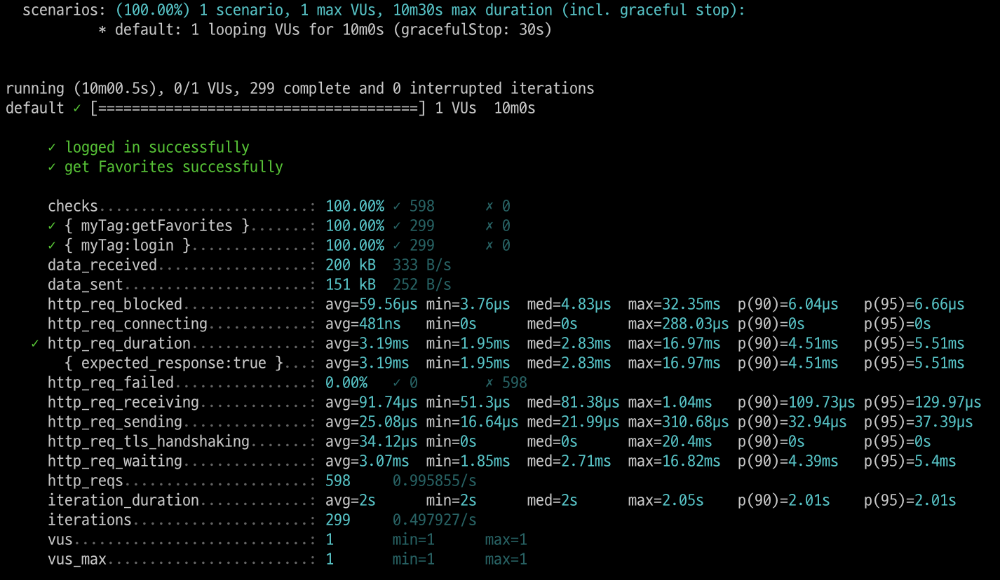
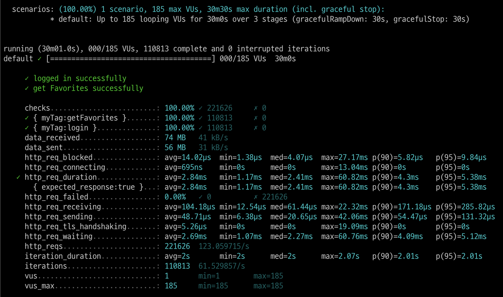
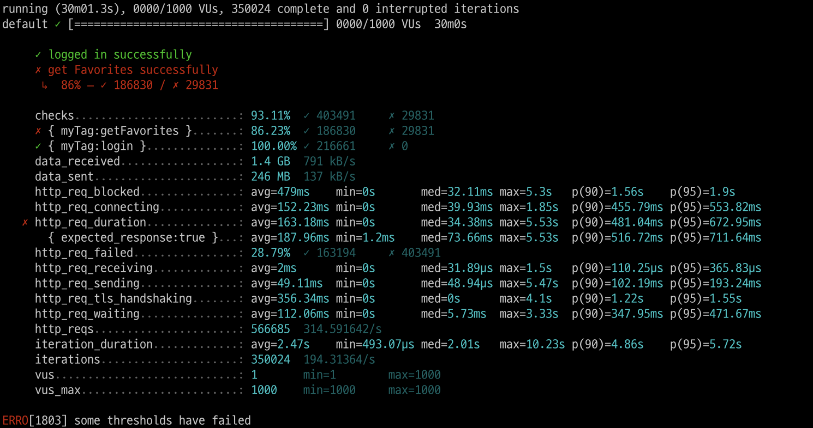
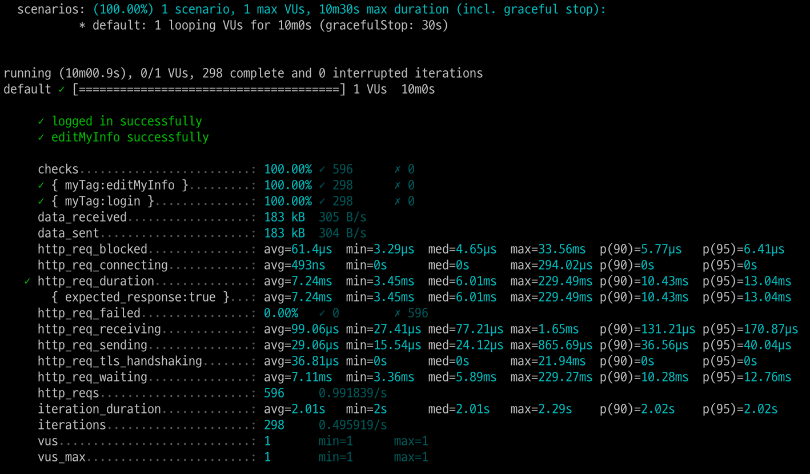
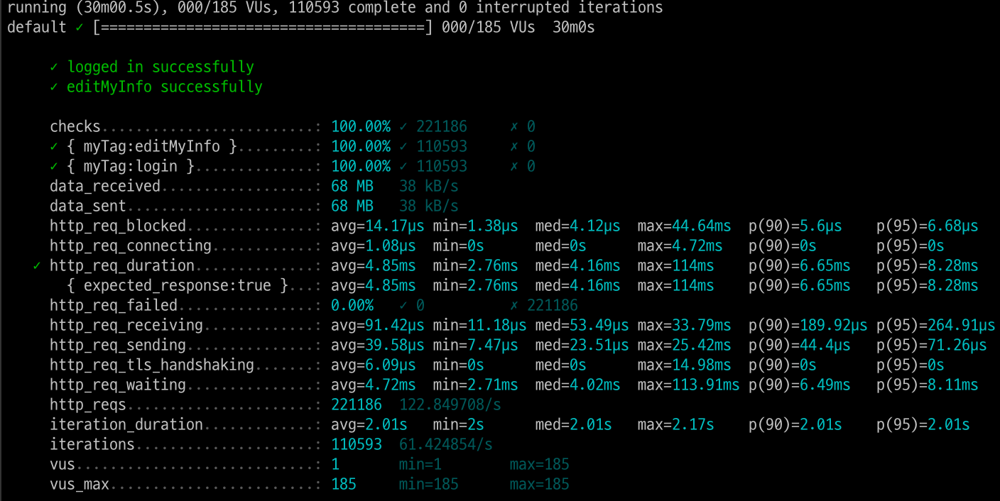
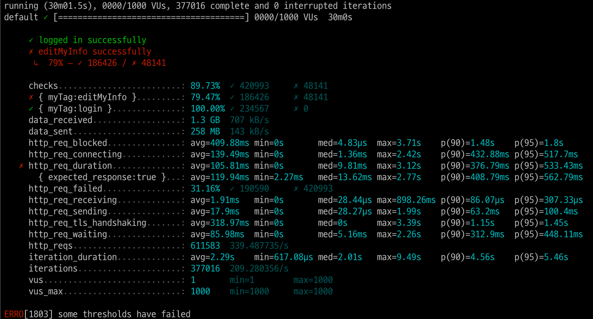
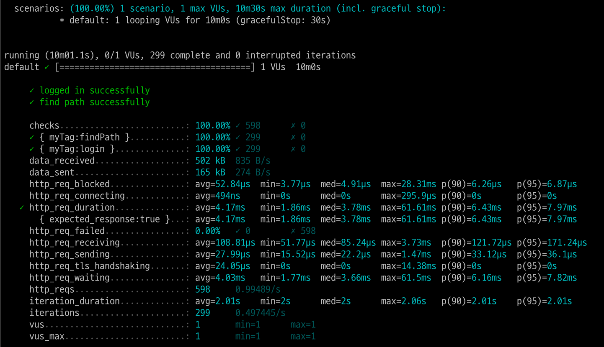
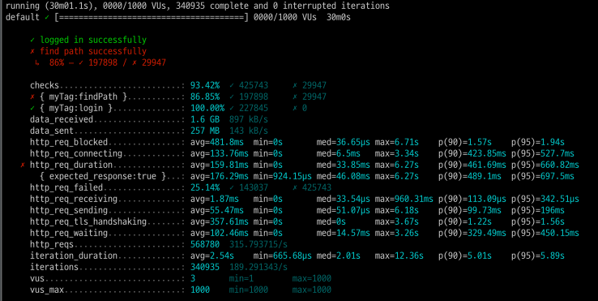

<p align="center">
    
</p>
<p align="center">
  
  
  <a href="https://edu.nextstep.camp/c/R89PYi5H" alt="nextstep atdd">
    
  </a>
  
</p>

<br>

# 인프라공방 샘플 서비스 - 지하철 노선도

<br>

## 🚀 Getting Started

### Install
#### npm 설치
```
cd frontend
npm install
```
> `frontend` 디렉토리에서 수행해야 합니다.

### Usage
#### webpack server 구동
```
npm run dev
```
#### application 구동
```
./gradlew clean build
```
<br>


### 1단계 - 웹 성능 테스트
1. 웹 성능예산은 어느정도가 적당하다고 생각하시나요
- pagespeed를 이용하여 사이트 성능 문제 진단했습니다. (https://pagespeed.web.dev/)

1.1. 데스크탑에서의 성능 

| Web             | FCP  | SI   | LCP   | TTI  | TBT  | CLS   | Total Score |  
|-----------------|------|------|-------|------|------|-------|-------------|  
| Naver Map(지하철)  | 0.5s | 2.2s | 1.7s  | 0.5s | 0ms  | 0.006 | 88          |  
| Kakao Map       | 0.5s | 2.1s | 1.0ms | 0.7s | 0ms  | 0.029 | 95          |  
| 서울교통공사          | 1.5s | 2.1s | 3.7s  | 2.0s | 40ms | 0     | 71          |  
| Running Map(자사) | 2.7s | 2.7s | 2.7s  | 2.7s | 40ms | 0.004 | 68          |  

1.2. 모바일에서의 성능

| Mobile          | FCP   | SI    | LCP   | TTI   | TBT   | CLS   | Total Score |  
|-----------------|-------|-------|-------|-------|-------|-------|-------------|
| Naver Map(지하철)  | 2.5s  | 8.0s  | 8.0s  | 6.7s  | 420ms | 0.03  | 49          |
| Kakao Map       | 1.7s  | 6.7s  | 5.2s  | 4.2s  | 80ms  | 0.005 | 72          |
| 서울교통공사          | 6.4s  | 7.9s  | 6.6s  | 8.4s  | 420ms | 0     | 43          |
| RunnaingMap(자사) | 14.6s | 14.6s | 15.1s | 15.1s | 510ms | 0.042 | 33          |

1.3 자사페이지 성능 예산

- pagespeed에 보통 기준에 최대한 맞추어서 예산을 작성하였습니다.

|           | FCP   | SI    | LCP   | TTI   | TBT   | CLS   | Total Score |  
|-----------------|-------|-------|-------|-------|-------|-------|-------------|
| RunnaingMap(자사) | 3.0s | 5.8s | 4.0s | 7.3s | 600ms | 0.25 | 50          |
- 우선순위 페이지 = https://sm9171.r-e.kr/path
  - 이유 : 최단경로를 구하는데 리소스를 많이 소모할것 같습니다.
- 우선순위 성능 = 속도지수(SI)
  - 이유 : 웹서비스의 컨탠츠 양이 적었고 페이지 전환 속도가 중요하게 생각되어서 속도지수를 선택했습니다.

2. 웹 성능예산을 바탕으로 현재 지하철 노선도 서비스는 어떤 부분을 개선하면 좋을까요
- pagespeed에 나온 추천과 진단을 참고해서 작성했습니다.
> 1. 텍스트 기반 리소스를 압축(gzip, deflate, brotli)하여 제공
> 2. 사용하지 않는 자바스크립트 줄이기
> 3. 네트워크 페이로드를 최소화하고 압축
>    1. 이미지에 대해 JPEG 또는 PNG 대신 WebP를 사용. 
>    2. JPEG 이미지의 압축 수준을 85로 설정.
> 4. 렌더링 차단 리소스 제거하기
> 5. 콘텐츠가 포함된 최대 페인트 이미지 미리 로드
> 6. 사용하지 않는 CSS 줄이기

---

### 2단계 - 부하 테스트 
1. 부하테스트 전제조건은 어느정도로 설정하셨나요
- 테스트 전제조건 정리
  - 대상 시스템 범위
    - 즐겨찾기 페이지
    - 개인정보 변경
    - 경로 조회
  - 목푯값 설정 (latency, throughput, 부하 유지기간)
    - latency (지연시간): 100ms
    - throughput(처리량) :
      - 하루 지하철 이용자 수 400만명으로 잡음
      - 출퇴근 해서 400 * 2 = 800만
      - 8000000 / 86,400 (초/일) = 92.6 rps(1일 평균rps)
      - 피크 시간대 집중률 = 10
      - 1일 최대 rps = 92.6 * 10 = 926 rps
    - 부하 유지기간 : 30분
  - 부하 테스트 시 저장될 데이터 건수 및 크기
    - http_req_duration = 200ms
    - T(VU iteration) = (2 * 0.2) = 0.4s
    - 목표 VUSER
      - 평균 (92.6 * 0.4) / 2 = 18.52
      - 최대 18.52 * 10 = 185.2
- 각 시나리오에 맞춰 스크립트 작성
  - 접속 빈도가 높은 페이지
    - 즐겨찾기 페이지
  - 데이터를 갱신하는 페이지
    - 마이페이지
  - 데이터를 조회하는데 여러 데이터를 참조하는 페이지
    - path 페이지- lineService, stationService, pathService 3개의 서비스를 참조한다.
2. Smoke, Load, Stress 테스트 스크립트와 결과를 공유해주세요
- 테스트 스크립트는 loadtest폴더 안에 있음.
- 접속 빈도가 높은 페이지(즐겨찾기 페이지)
  - Smoke 테스트 결과
  
  - Load 테스트 결과
  
  - Stress 테스트 결과
  
- 데이터를 갱신하는 페이지(내 정보 수정 페이지)
  - Smoke 테스트 결과
    
  - Load 테스트 결과
    
  - Stress 테스트 결과
    
- 데이터를 조회하는데 여러 데이터를 참조하는 페이지(경로탐색 페이지)
  - Smoke 테스트 결과
    
  - Load 테스트 결과
    
  - Stress 테스트 결과
    
---

### 3단계 - 로깅, 모니터링
1. 각 서버내 로깅 경로를 알려주세요
- /var/log/nginx/access.log
- /var/log/nginx/error.log

2. Cloudwatch 대시보드 URL을 알려주세요
- https://ap-northeast-2.console.aws.amazon.com/cloudwatch/home?region=ap-northeast-2#dashboards:name=sm9171-dashboard
