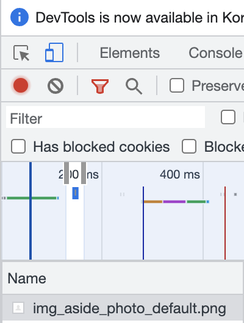
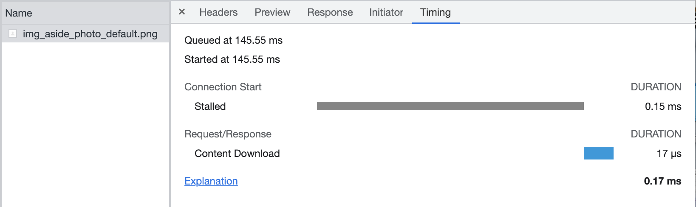
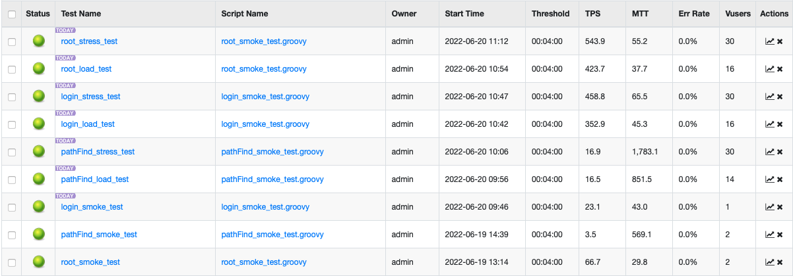
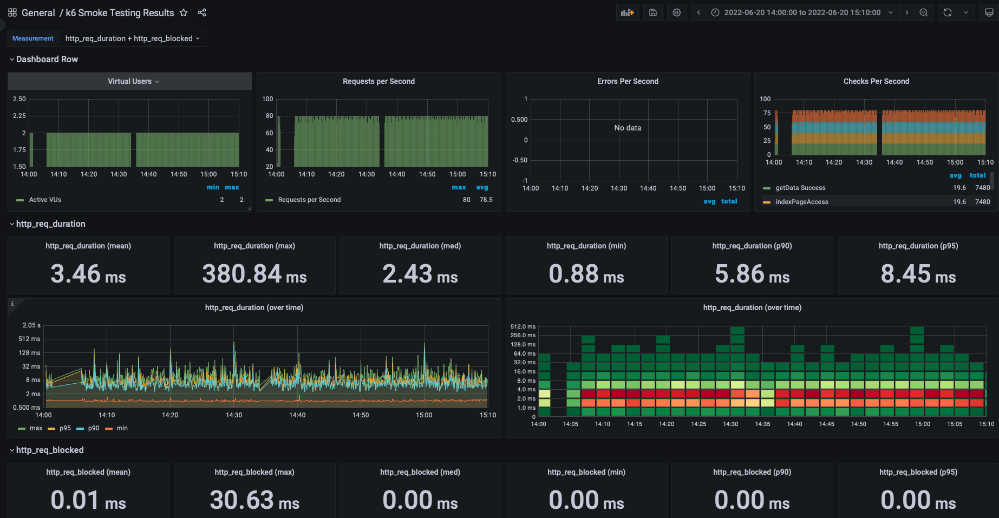
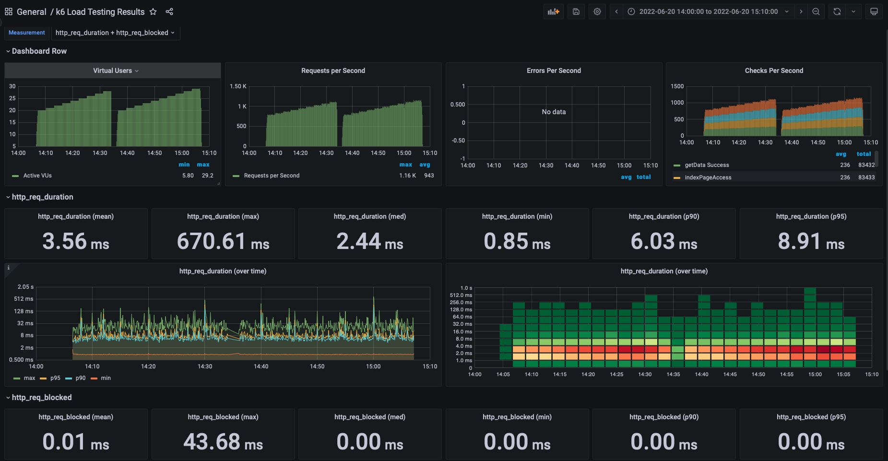
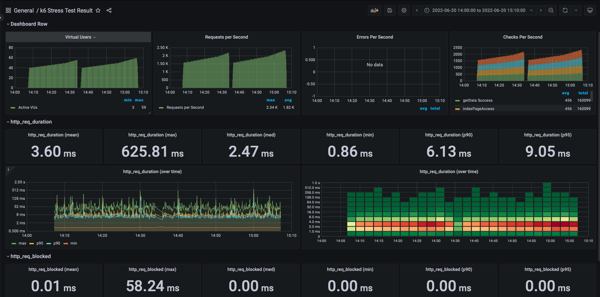

<p align="center">
    
</p>
<p align="center">
  
  
  <a href="https://edu.nextstep.camp/c/R89PYi5H" alt="nextstep atdd">
    
  </a>
  
</p>

<br>

# 인프라공방 샘플 서비스 - 지하철 노선도

<br>

## 🚀 Getting Started

### Install
#### npm 설치
```
cd frontend
npm install
```
> `frontend` 디렉토리에서 수행해야 합니다.

### Usage
#### webpack server 구동
```
npm run dev
```
#### application 구동
```
./gradlew clean build
```
<br>

### 0단계 - 학습 및 사전실습
1. 웹 성능 최적화 요소
 - TTI(Time TO Interactive) : 상호 작용까지 시간
   - 사용자가 상호작용 가능할때 까지 걸리는 시간
   - ~3.8sec : Green, 3.9 ~ 7.3sec : Yellow
 - FCP(First Contentful Paint) : 페이지 콘텐츠의 일부가 렌더링 시작될때까지 걸리는 시간 
   - ~1.8sec : Green, 1.9~3sec : yellow 
 - LCP(Largest Contentful Pain) : 페이지 콘텐츠중 가장큰 이미지 혹은 텍스트 블록의 렌더링까지 걸리는 시간
   - ~2.5sec : Green, 2.6~5.4sec : yellow
 - TBT(Total Blocking Time) : FCP 와 상호작용 사이의 시간 
   - ~200ms : Green, 200~600ms : yellow

2. 현재 서비스의 문제점(thread.dump를 통한 분석)
 - 현재 Lock을 서로 요구하며 DeadLock 걸린 쓰레드: "http-nio-8080-exec-1", "http-nio-8080-exec-4", "http-nio-8080-exec-8"
   - 발생 위치 (Lock 자원을 서로 요청하는중)
     - LineController.findLockLeft(LineController.java:76)
     - LineController.findLockLeft(LineController.java:78)
 - 무한루프를 진행하고있는 쓰레드 : "http-nio-8080-exec-5", "http-nio-8080-exec-6", "http-nio-8080-exec-7", "http-nio-8080-exec-9"
   - 발생 위치
     - LineController.java:105
   - CPU 점유 시간 
     - http-nio-8080-exec-5 : 7803113.23ms
     - http-nio-8080-exec-6 : 7579947.33ms
     - http-nio-8080-exec-7 : 7259964.67ms
     - http-nio-8080-exec-9 : 7596787.62ms
 - 다른 쓰레드들이 자원을 반납하지 않아 작업을 진행하지 못하는 쓰레드 : "http-nio-8080-exec-2", "http-nio-8080-exec-3", "http-nio-8080-exec-10"
   - 발생 위치 (남은 자원이 없어 대기중)
      - LineController.findLockLeft(LineController.java:76)
   - CPU 점유 시간(무한루프 진행중인 쓰레드들의 점유 시간보다 현저히 적은것을 확인 가능)
     - http-nio-8080-exec-2 : 90.03ms
     - http-nio-8080-exec-3 : 54.31ms
     - http-nio-8080-exec-10: 151.96

### 1단계 - 웹 성능 테스트
0. 경쟁사 조사

|  경쟁사 정보   | FCP(Sec) |LCP(Sec)|TTI(Sec)|TBT(mSec)|
|:---------:|:--------:|:---:|:---:|:---:|
| 서울교통공사/MB |   6.9    |7.0|9.3|1_180|
| 서울교통공사/PC |   1.6    |3.6|2.1|160|
|  네이버/MB   |   2.1    |7.9|6.7|300|
|  네이버/PC   |   0.5    |1.6|0.5|0|
|  카카오/MB   |   1.7    |6.3|4.3|90|
|  카카오/PC   |   0.5    |1.3|1.0|10|

주로 검색을 많은 서비스이므로, TTI가 적은 서비스가 가장 좋은 서비스 일것 같다.
PC와 Mobile의 속도 차이는, 네트워크 속도 차이 일것 같다.

- PC와 Mobile 속도 차이 이유
  - PC와 Mobile에서 첫번째 png파일이 들어오기까지, pc는 50ms, Mobile은 150ms가 걸린다.
<div>


</div>
 
  - 아래 사진을 보면 해당 png파일이 렌더링 될때까지 queue에 들어가있는 시간이 Mobile이 현저하게 높은데, 그 이유는 앞단에 데이터 로딩에 걸리는 시간때문이다.
<div>


</div>

---

1. 웹 성능예산은 어느정도가 적당하다고 생각하시나요
 - TTI <= 3Sec : 주로 검색을 위한 사이트이므로, 사용자의 상호작용까지 걸리는 시간이 작아야 한다. 
 - FCP <= 1Sec : 사용자가 웹이 정상적이라는것을 보여주기 위해, 첫 콘텐트가 렌더링 되는 시간을 최대한 짧게 해야한다.
 - TBT <= 1~2Sec

2. 웹 성능예산을 바탕으로 현재 지하철 노선도 서비스는 어떤 부분을 개선하면 좋을까요
 - 현재 https://jhsong2580.kro.kr/stations 의 성능

|          | FCP(Sec) | LCP(Sec) | TTI(Sec) | TBT(mSec) |
|:--------:|:--------:|:--------:|:--------:|:---------:|
| 현재노선도/PC |   2.9    |   2.9    |   4.5    |   1_450   |
| 현재노선도/Mb |   16.1   |   16.1    |   22.5   |   5_840   |
 - 개선 필요 사항 
   1) 텍스트 압축 사용 
      - 경쟁사는 데이터에 Gzip으로(Header의 Content-encoding으로 확인가능) 압축을 하여 client로 전달하지만, 현재 서비스는 일반 텍스트로 전달 
   2) 렌더링 차단 리소스 제거하기 
      - 렌더링이 되기 전 소스를 불러오는 단계에서, 저장된 css가 아닌, 외부에서 다운로드 받아 제공하는 css라 불러오는데 시간이 추가로 소요됨
      - 필수적이지 않다면 body로 css loading을 옮겨서 렌더링 차단을 방지하거나, 로컬에 다운로드 받고 제공을 해야함
   3) 사용하지 않는 js 제거
      - 사용하지 않는 js는 없으나, 텍스트 압축이 되어있지 않아 서버 -> 클라이언트로 전달시 속도가 느려짐 
      - 제거는 하지 않으나 압축하여 전달이 필요함 

### 2단계 - 부하 테스트 
1. 부하테스트 전제조건은 어느정도로 설정하셨나요
 - 대상 시스템 범위 : reverse proxy ~ was ~ DB 
 - 목표 값 설정
   - 1일 최대 RPS = DAU * (1명당 1일 평균 접속수) / 86400 * (최대트래픽 / 평소트래픽)
     - 1일 평균 rps : 500,000 * 4 / 86400 = 약 23 
     - 1일 최대 rps : 500,000 * 4 / 86400 * 1.875 = 약 43
     - Throughput : 23 ~ 43
       - DAU : 약 50만 / 일 
         - http://www.koreanclick.com/insights/newsletter_view.html?code=topic&id=563&page=1&utm_source=board&utm_medium=board&utm_campaign=topic&utm_content=20200220 
           - 네이버 지도 순 이용자 수(월별) 참조 
       - 1명당 1일 평균 접속수 : 4회
         - 출근, 퇴근, 개인업무 등
       - 최대트래픽 / 평소트래픽 : 1.875
         - https://www.bigdata-map.kr/datastory/traffic/seoul
           - 하루 평균 지하철,버스 승/하차 인원
             - peak(07 ~ 10 or 17 ~ 19) 평균 : 750,000
             - normal(11~13) 평균 : 400,000
   - T = (VU별 Request수) * Duration + (지연예상 시간)= 5 * 0.5 + 1= 3.5
     - VU별 Request = 5
       - src 지하철 검색
       - dst 지하철 검색
       - 최단 거리 조회 요청
       - 최단거리 상세조회요청
       - 최단거리 상세조회요청
     - Duration = 0.5(sec) 
       - Request 완료에 총 걸리는 시간(개인 PC 기준)
     - 지연예상 최대 시간 = 1(sec)
   - Vuser = (목표rps * T) / (VU별 Request수)
     - 43 * 3.5 / 5 = 약 30

 - 저장 데이터 
   - 노선 : 23개
   - 정류장 : 616개
   - 구간 : 340개

 - 시나리오 대상

 |  URI         | 시나리오 사유     | 시나리오 여부 |
 |:------------|:-------:|:--------:|
   | https://jhsong2580.kro.kr | 접속 빈도가 높음   |    O    |
   |https://jhsong2580.kro.kr/path | 접속 빈도가 높음   |  O|
   |https://jhsong2580.kro.kr/path | DB를 사용하는 기능 |  O|
   |https://jhsong2580.kro.kr/stations | DB를 사용하는 기능 |X|  
   |https://jhsong2580.kro.kr/sections | DB를 사용하는 기능 | X| 
   
   
2. Smoke, Load, Stress 테스트 스크립트와 결과를 공유해주세요
- 용어정리
  - Smoke Test
    - 최소한의 부하로 구성된 테스트로 테스트 시나리오에 오류가 있는지 없는지 확인
    - 최소 부하 상태에서 시스템에 오류가 발생하는지 확인
    - Vuser 1~2로 구성하여 테스트
  - Load Test
    - 서비스의 평소 트래픽과 최대 트래픽 상황에서 성능이 어떤지 확인
    - 애플리케이션 배포 및 인프라 변경(Scale out, Db Failover)시에 성능 변화 확인
    - 외부 요인(결제 등)에 따른 예외 상황 확인
  - Stress Test
    - 서비스가 극한의 상황에서 어떻게 동작하는지 확인
    - 장기간 부하 발생에 대한 한계치를 확인하고 기능이 정상 동작하는지 확인
    - 최대 사용자 또는 최대 처리량을 확인
    - 스트레스 테스트 이후 시스템이 수동 개입없이 복구되는지 확인

- nGrinder Test결과
  - script : readmeSource/loadTest/nGrinderTest/script/*
  - result
  - nGrinder
    

- k6 test 결과
  - Smoke test
    - script : readmeSource/loadTest/k6Test/smoke.js
    - result : http://3.35.223.220/d/bvXIAmq7z/k6-smoke-testing-results?orgId=1&from=1655701200000&to=1655705400000
      
  - Load test
      - script : readmeSource/loadTest/k6Test/load.js
      - result : http://3.35.223.220/d/080n0mqnz/k6-load-testing-results?orgId=1&from=1655701200000&to=1655705400000
        
  - Stress test
      - script : readmeSource/loadTest/k6Test/stress.js
      - result : http://3.35.223.220/d/TMFSAmq7k/k6-stress-test-result?orgId=1&from=1655701200000&to=1655705400000
        

  

---

### 3단계 - 로깅, 모니터링
1. 각 서버내 로깅 경로를 알려주세요

2. Cloudwatch 대시보드 URL을 알려주세요
