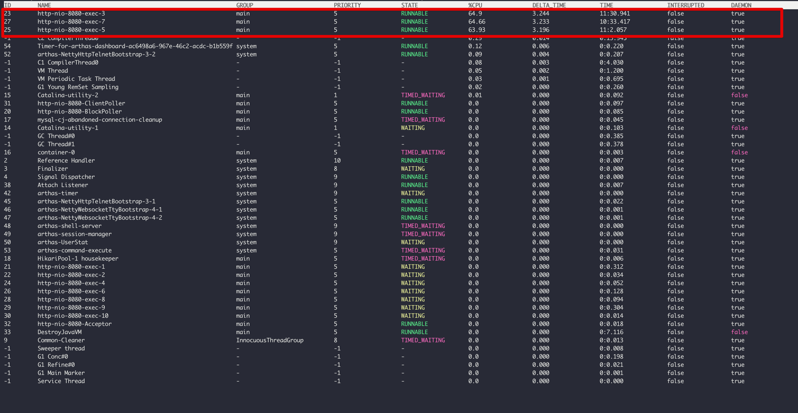
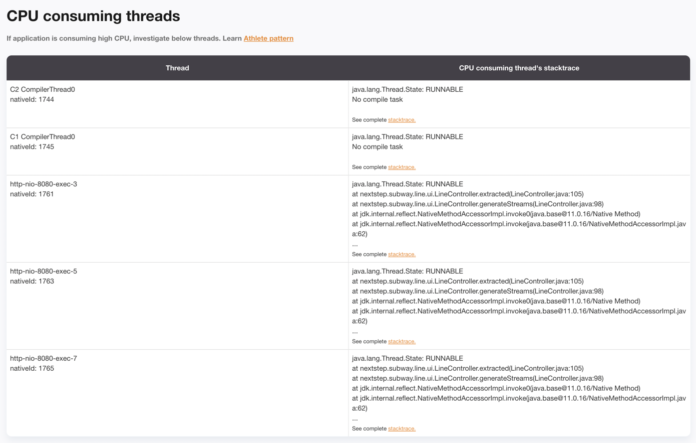
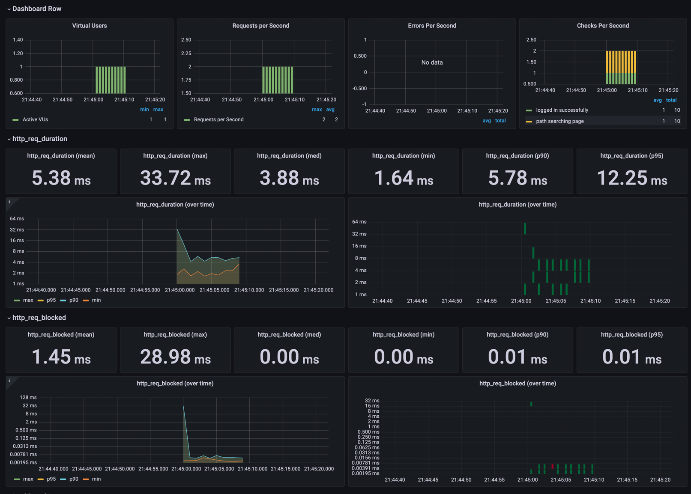
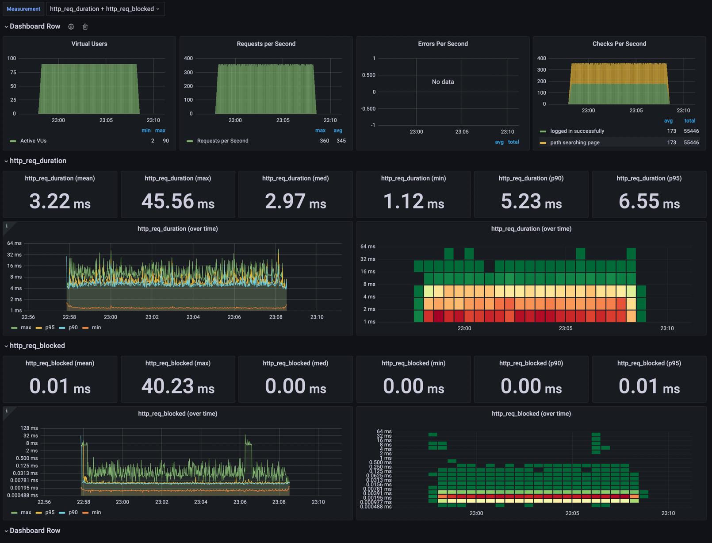
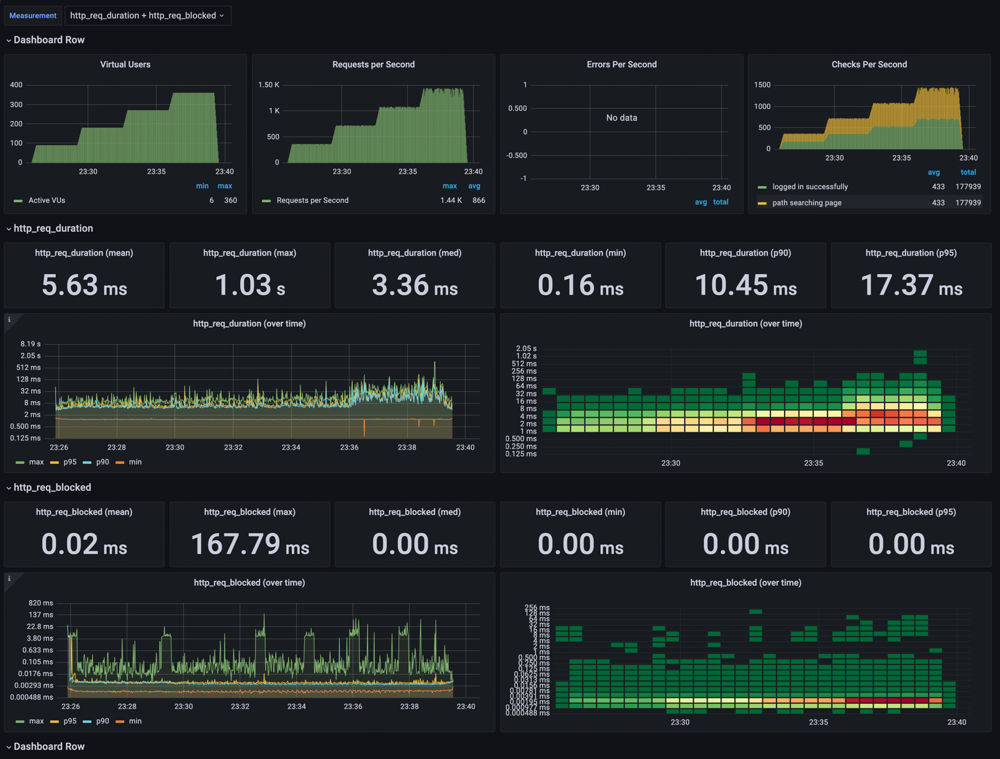

<p align="center">
    
</p>
<p align="center">
  
  
  <a href="https://edu.nextstep.camp/c/R89PYi5H" alt="nextstep atdd">
    
  </a>
  
</p>

<br>

# 인프라공방 샘플 서비스 - 지하철 노선도

<br>

## 🚀 Getting Started

### Install

#### npm 설치

```
cd frontend
npm install
```

> `frontend` 디렉토리에서 수행해야 합니다.

### Usage

#### webpack server 구동

```
npm run dev
```

#### application 구동

```
./gradlew clean build
```

<br>

### 1단계 - 웹 성능 테스트

#### Our Service

- wbluke-infraworkshop.kro.kr/path
    - 경로 조회 페이지를 기준으로 함

#### 경쟁사

- 서울교통공사 : http://www.seoulmetro.co.kr/kr/cyberStation.do
- 네이버지도 : https://m.map.naver.com/subway/subwayLine.naver?region=1000
- 카카오맵 : https://m.map.kakao.com/

#### WebPageTest

- First Byte
    - 웹 서버에서 받은 컨텐츠의 첫 번째 바이트가 도착한 시간
- Start Render
    - 화면에 무엇인가 표시된 첫 시점
- First Contentful Paint (FCP)
    - 첫 번째 텍스트 또는 이미지가 표시된 시간
- Speed Index
    - 페이지 콘텐츠가 얼마나 빨리 표시되는지
- Largest Contentful Paint (LCP)
    - 최대 텍스트 또는 이미지가 표시되는 시간
- Cumulative Layout Shift (CLS)
    - 표시 영역 안에 보이는 요소의 이동 측정
- Total Blocking Time (TBT)
    - FCP와 Time to Interactive 시간 사이의 모든 시간의 합
- Total Bytes

| site        | First Byte | Start Render |    FCP    | Speed Index |    LCP     |   CLS    |    TBT     | Total Bytes |
|:------------|:----------:|:------------:|:---------:|:-----------:|:----------:|:--------:|:----------:|:-----------:|
| Our Service | 1.599s(M)  |  9.000s(M)   | 8.937s(M) |  9.014s(M)  | 8.937s(L)  |   0(H)   | 0.160s(H)  |  2699KB(M)  |
| Seoulmetro  | 2.687s(M)  |  6.800s(M)   | 5.401s(M) | 12.781s(M)  | 12.538s(L) |   0(H)   | 8.271s(L)  |  1066KB(M)  |
| Naver map   | 1.327s(M)  |  3.600s(M)   | 3.594s(M) |  7.415s(M)  | 11.881s(L) | 0.031(H) | 0.534s(NI) |  988KB(M)   |
| Kakao map   | 1.913s(M)  |  3.200s(M)   | 3.205s(M) |  7.286s(M)  | 9.624s(L)  | 0.004(H) | 0.478s(NI) |  1406KB(M)  |

#### PageSpeed Insights

- First Contentful Paint (FCP)
    - 첫 번째 텍스트 또는 이미지가 표시된 시간
- Speed Index
    - 페이지 콘텐츠가 얼마나 빨리 표시되는지
- Largest Contentful Paint (LCP)
    - 최대 텍스트 또는 이미지가 표시되는 시간
- Time to Interactive
    - 완전히 페이지와 상호작용할 수 있게 되기까지 걸리는 시간
- Total Blocking Time (TBT)
    - FCP와 Time to Interactive 시간 사이의 모든 시간의 합
- Cumulative Layout Shift (CLS)
    - 표시 영역 안에 보이는 요소의 이동 측정

*Mobile*

| Performance |   FCP    | Speed Index |   LCP    | Time to Interactive |   TBT    |   CLS    |
|:-----------:|:--------:|:-----------:|:--------:|:-------------------:|:--------:|:--------:|
|    42(L)    | 16.3s(L) |  16.3s(L)   | 16.3s(L) |      17.0s(L)       | 210ms(M) | 0.004(H) |

- 추천
    - 텍스트 압축 사용(L)
    - 사용하지 않는 자바스크립트 줄이기(L)
    - 렌더링 차단 리소스 제거하기(L)
    - 사용하지 않는 CSS 줄이기(M)
- 진단
    - 효율적인 캐시 정책을 사용하여 정적인 에셋 제공하기(L)
    - 웹폰트가 로드되는 동안 텍스트가 계속 표시되는지 확인하기(L)
    - 이미지 요소에 width 및 height가 명시되어 있지 않습니다.(L)
    - FCP (3G)(L)
        - 35922ms
    - 기본 스레드 작업 최소화히기(M)
        - 2.9s
    - 자바스크립트 실행 시간 단축(M)
        - 1.9s
    - 네트워크 페이로드가 커지지 않도록 관리하기(M)
        - 총 크기 : 2,740KiB

*Desktop*

| Performance |   FCP   | Speed Index |   LCP   | Time to Interactive |   TBT   | CLS  |
|:-----------:|:-------:|:-----------:|:-------:|:-------------------:|:-------:|:----:|
|    65(M)    | 3.0s(L) |   3.0s(L)   | 3.0s(L) |       3.2s(M)       | 20ms(H) | 0(H) |

- 추천
    - 텍스트 압축 사용(L)
    - 사용하지 않는 자바스크립트 줄이기(M)
    - 렌더링 차단 리소스 제거하기(M)
- 진단
    - 효율적인 캐시 정책을 사용하여 정적인 에셋 제공하기(L)
    - 웹폰트가 로드되는 동안 텍스트가 계속 표시되는지 확인하기(L)
    - 이미지 요소에 width 및 height가 명시되어 있지 않습니다.(L)
    - 네트워크 페이로드가 커지지 않도록 관리하기(M)
        - 총 크기 : 2,740KiB

1. 웹 성능예산은 어느정도가 적당하다고 생각하시나요

- FCP 2.0초 미만
    - Kakao map 3.2s 대비 20% 이상의 성능 향상 목표
- LCP 2.5초 미만
    - 경쟁사 대비 가장 나은 지표로 측정되었으나, 측정 시도마다 다를 수 있고, 일반적으로 사용자 경험이 좋다고 알려져있는 수치로 목표 산정
- Speed Index 3.0초 미만
    - Kakao map 7.2s 대비 20% 이상의 성능 향상 목표
- Lighthouse 성능 감사 80점 이상

2. 웹 성능예산을 바탕으로 현재 지하철 노선도 서비스는 어떤 부분을 개선하면 좋을까요

- 텍스트 압축 사용
    - gzip 등으로 압축
    - `/js/vendors.js`, `/js/main.js`, `/stations`
- 사용하지 않는 자바스크립트 줄이기
    - `/js/vendors.js`, `/js/main.js`
- 렌더링 차단 리소스 제거하기
    - 중요한 JS/CSS를 인라인으로 전달하고 중요하지 않은 모든 JS/CSS를 지연하는 것이 좋음
    - `/css?family=Roboto:100,300,400,500,700,900 (fonts.googleapis.com)`
      , `...css/materialdesignicons.min.css (cdn.jsdelivr.net)`

---

### 2단계 - 부하 테스트

#### Arthas 실습



- 3개의 요청에 대해 높은 CPU, 수행시간.

#### Thread dump 분석



- 3개의 요청에 대해 높은 CPU


1. 부하테스트 전제조건은 어느정도로 설정하셨나요

- 네이버지도 DAU 5160만 (2018년 기준) - [뜨거운 여름, 사람들은 네이버 지도앱을 열었다](https://www.econovill.com/news/articleView.html?idxno=344370)
- 우리 서비스는 네이버지도의 10% 목표 : 516만
- 집중률 = (최대트래픽) / (평소트래픽) = 1,000,000 / 400,000 = 2.5
  - 정확한 예상 트래픽을 구하기 어려워 [데이터로 보는 서울시 대중교통 이용](https://www.bigdata-map.kr/datastory/traffic/seoul) 자료에서 '시간대별 평균 지하철, 버스 승/하차 인원'을 참조. 대략적인 비율을 계산.
- 1명당 1일 평균 접속 수 = 3회

- Throughput = 180 ~ 450 rps
  - 1일 사용자 수 = 5,160,000
  - 1일 총 접속 수 = 5,160,000 * 3 = 15,480,000
  - 1일 평균 rps = 15,480,000 / 86,400 = 약 180 rps
  - 1일 최대 rps = 180 rps * 2.5 = 450 rps

- VUser = 36 ~ 90
  - Latency = 0.1s
  - http_req_duration = 0.1 * 2 = 0.2s
  - T = (R * http_req_duration) = 3 * 0.2s = 0.6s
  - Average VUser = 180 * 0.6 / 3 = 36
  - Max VUser = 450 * 0.6 / 3 = 90

2. Smoke, Load, Stress 테스트 스크립트와 결과를 공유해주세요

- 경로 탐색 페이지를 타겟으로

> 스크립트는 `./scripts`에 두었습니다.

- smoke.js



- load.js



- stress.js




---

### 3단계 - 로깅, 모니터링

1. 각 서버내 로깅 경로를 알려주세요

2. Cloudwatch 대시보드 URL을 알려주세요
