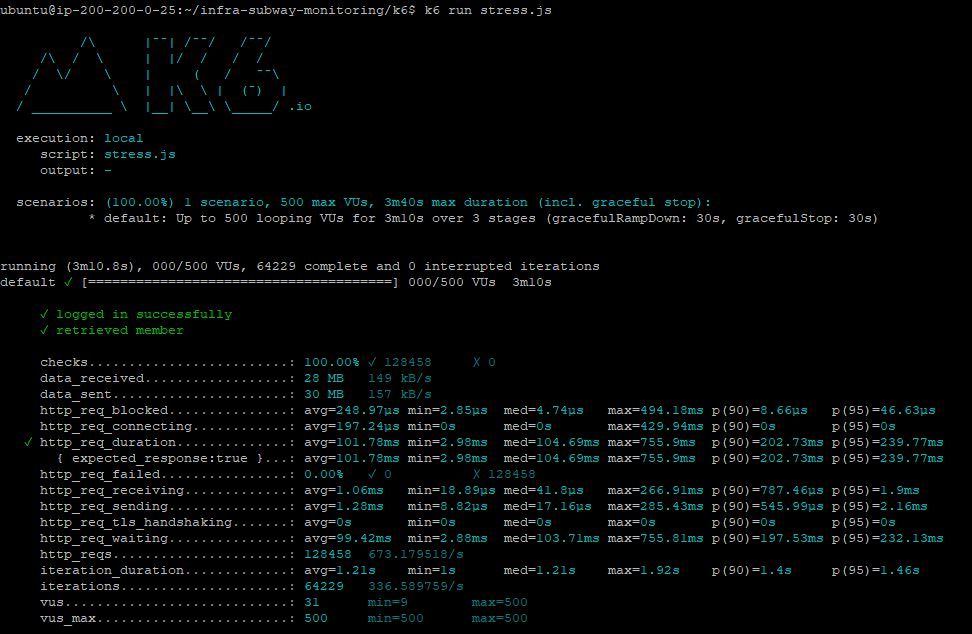
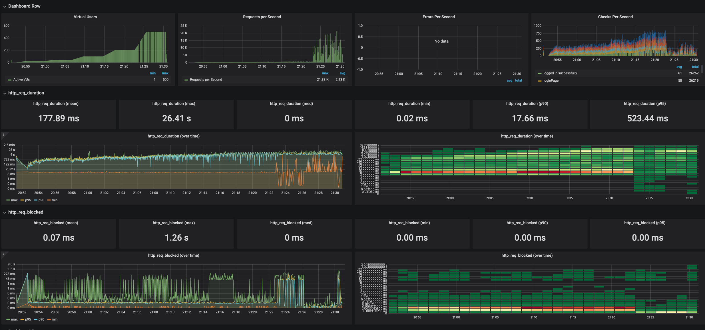
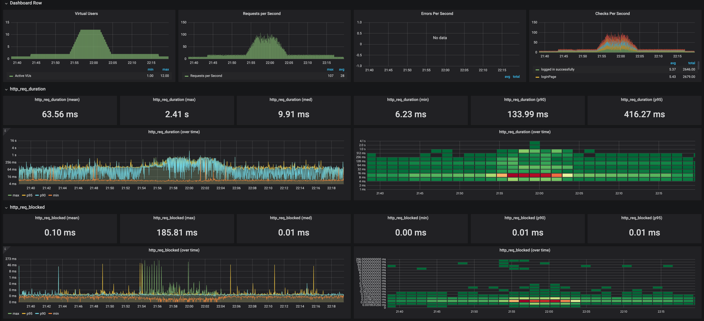

<p align="center">
    
</p>
<p align="center">
  
  
  <a href="https://edu.nextstep.camp/c/R89PYi5H" alt="nextstep atdd">
    
  </a>
  
</p>

<br>

# 인프라공방 샘플 서비스 - 지하철 노선도

<br>

## 🚀 Getting Started

### Install
#### npm 설치
```
cd frontend
npm install
```
> `frontend` 디렉토리에서 수행해야 합니다.

### Usage
#### webpack server 구동
```
npm run dev
```
#### application 구동
```
./gradlew clean build
```
<br>


### 1단계 - 성능 테스트
1. 웹 성능예산은 어느정도가 적당하다고 생각하시나요

- 성능예산 목표
    - 카카맵 수준인 FCP 0.6초
    - 페이지로드 2초 미만
    - TTI 3초 미만
- 측정결과
    - kakao map 메인
    

    - 실습 경로 페이지
    


2. 웹 성능예산을 바탕으로 현재 지하철 노선도 서비스는 어떤 부분을 개선하면 좋을까요
- gzip 압축 
    
    - 성능에 가장 많이 영향을 미치는 것으로 예측됨
- 캐시설정, 불필요한 파일 제거


---

### 2단계 - 부하 테스트 
1. 부하테스트 전제조건은 어느정도로 설정하셨나요
- 예상 서비스 규모 (참고 - [카카오 맵 MAU 649만](https://www.sedaily.com/NewsView/22OS78XL7P))
   - 카카오 맵의 1/2 수준인 `100,000 DAU` 를 목표
   - 1일 평균 접속 수 `5` 
     - 16년 기준 다음지도 평균 실행횟수 3.6 ([16년 다음지도 일 평균 실행 횟수](https://ko.lab.appa.pe/2016-09/kakao-korea.html))
     - 출/퇴근/맛집 탐색, 기타 용도 사용을 가정
   - 피크 시간대 집중룰 `10`  
     - 출퇴근 시간(08:00~10:00, 17:00~19:00)을 피크 시간대로 가정


- 대상 시스템 범위
  - nginx > tomcat(backend + frontend) > db


- 목푯값 설정
  - Throughput
    - DAU x 1명당 1일 평균 접속 수 = 100,000 * 5 = `500,000` 
    - 1일 총 접속 수 / 86,400 (초/일) = 500,000 / 86,400 = `5.78`
    - 1일 평균 rps x (최대 트래픽/평소트래픽) = 5.78 * (10/1) = `57.8`
  - Latency `100ms`
  - VUser
      - 시나리오 요청수 6개 `메인 - 로그인페이지 - 로그인요청 - 멤버 - 경로탐색 페이지 - 경로탐색요청` 
      - T = (6 * 0.2) = `1.2s` 
      - 평균 VUser (평균 rps * T) / 요청수 = (5.78 * 1.2) / 6 = `1.156`
      - 최대 VUser (최대 ros * T) / 요청수 = (57.8 * 1.2) / 6 = `11.56`


- 부하 테스트 시 저장될 데이터 건수 및 크기
  - 지하철 노선 `23`개
  - 지하철 구간 `340`개
  - 지하철 역 `617` 개


- 대상 페이지
  - 접속 빈도가 높은 페이지
    - `메인` https://minho-subway.p-e.kr
  - 데이터를 갱신하는 페이지
    - `로그인` https://minho-subway.p-e.kr/login
  - 데이터를 조회하는데 여러 데이터를 참조하는 페이지
    - `경로탐색` https://minho-subway.p-e.kr/path
    
2. Smoke, Load, Stress 테스트 스크립트와 결과를 공유해주세요

## Smoke테스트
- Smoke 테스트 결과
  ```
            /\      |‾‾| /‾‾/   /‾‾/
       /\  /  \     |  |/  /   /  /
      /  \/    \    |     (   /   ‾‾\
     /          \   |  |\  \ |  (‾)  |
    / __________ \  |__| \__\ \_____/ .io
  
    execution: local
       script: smoke.js
       output: -
  
    scenarios: (100.00%) 1 scenario, 1 max VUs, 1m0s max duration (incl. graceful stop):
             * default: 1 looping VUs for 30s (gracefulStop: 30s)
  
  
  running (0m33.1s), 0/1 VUs, 10 complete and 0 interrupted iterations
  default ✓ [======================================] 1 VUs  30s
  
       ✓ Main Page
       ✓ Login Page
       ✓ logged in successfully
       ✓ Path Page
       ✓ Request Path
  
       checks.........................: 100.00% ✓ 50       ✗ 0
       data_received..................: 77 kB   2.3 kB/s
       data_sent......................: 7.4 kB  222 B/s
       http_req_blocked...............: avg=836.44µs min=2µs    med=7µs    max=41.48ms  p(90)=10.1µs   p(95)=11µs
       http_req_connecting............: avg=136.92µs min=0s     med=0s     max=6.84ms   p(90)=0s       p(95)=0s
     ✓ http_req_duration..............: avg=60.16ms  min=7.47ms med=9.6ms  max=473.65ms p(90)=190.13ms p(95)=274.07ms
         { expected_response:true }...: avg=68.42ms  min=7.47ms med=9.29ms max=473.65ms p(90)=193.84ms p(95)=321.54ms
       http_req_failed................: 20.00%  ✓ 10       ✗ 40
       http_req_receiving.............: avg=93.58µs  min=45µs   med=92.5µs max=157µs    p(90)=123.3µs  p(95)=127.65µs
       http_req_sending...............: avg=37.86µs  min=7µs    med=31.5µs max=235µs    p(90)=52.1µs   p(95)=57.94µs
       http_req_tls_handshaking.......: avg=489.22µs min=0s     med=0s     max=24.46ms  p(90)=0s       p(95)=0s
       http_req_waiting...............: avg=60.03ms  min=7.31ms med=9.48ms max=473.49ms p(90)=189.98ms p(95)=273.92ms
       http_reqs......................: 50      1.510712/s
       iteration_duration.............: avg=3.3s     min=3.18s  med=3.25s  max=3.57s    p(90)=3.44s    p(95)=3.5s
       iterations.....................: 10      0.302142/s
       vus............................: 1       min=1      max=1
       vus_max........................: 1       min=1      max=1
  ```
- smoke 테스트 그라파나
  
- smoke 테스트 스크립트
  ```
  import http from 'k6/http';
  import {check, sleep} from 'k6';
  
  export let options = {
      vus: 1,
      duration: '30s',
  
      thresholds: {
          http_req_duration: ['p(99)<1500'], // 99% of requests must complete below 1.5s
      },
  };
  
  const BASE_URL = 'https://minho-subway.p-e.kr';
  const USERNAME = 'aa@aa.com';
  const PASSWORD = '1111';
  
  export default function () {
      // 메인 페이지
      requestGet('', 'mainPage');
  
      // 로그인 페이지 & 로그인 요청
      requestGet('login', 'loginPage');
      sleep(1);
      login(USERNAME, PASSWORD);
  
      // 경로 조회 페이지 & 경로조회
      requestGet('path', 'pathPage');
      sleep(1);
      requestGet('paths?source=2&target=59', 'requestPath')
  
      sleep(1);
  }
  
  function requestGet(path, desc) {
      const page = http.get(`${BASE_URL}/${path}`);
      const obj = {};
      obj[desc] = (resp) => resp.status === 200;
      check(page, obj);
  }
  
  function login() {
      const payload = JSON.stringify({
          email: USERNAME,
          password: PASSWORD,
      });
  
      const params = {
          headers: {
              'Content-Type': 'application/json',
          },
      };
  
      const loginRes = http.post(`${BASE_URL}/login/token`, payload, params);
      check(loginRes, {
          'logged in successfully': (resp) => resp.json('accessToken') !== '',
      });
  
      const authHeaders = {
          headers: {
              Authorization: `Bearer ${loginRes.json('accessToken')}`,
          },
      };
      const myObjects = http.get(`${BASE_URL}/members/me`, authHeaders).json();
      check(myObjects, {'retrieved member': (obj) => obj.id !== 0});
      sleep(1);
  }
  ```

## Stress 테스트  
- Stress 테스트 결과
  ```
  running (38m14.2s), 000/500 VUs, 767394 complete and 0 interrupted iterations
  default ✓ [======================================] 000/500 VUs  38m0s
  
       ✗ mainPage
        ↳  4% — ✓ 31228 / ✗ 736166
       ✗ loginPage
        ↳  4% — ✓ 31390 / ✗ 736004
       ✗ logged in successfully
        ↳  4% — ✓ 31498 / ✗ 735896
       ✓ retrieved member
       ✗ pathPage
        ↳  99% — ✓ 31253 / ✗ 225
       ✗ requestPath
        ↳  99% — ✓ 31203 / ✗ 275
  
       checks.........................: 7.84%   ✓ 188050      ✗ 2208566
       data_received..................: 250 MB  109 kB/s
       data_sent......................: 33 MB   14 kB/s
       http_req_blocked...............: avg=71.44µs  min=0s      med=0s       max=1.9s    p(90)=0s      p(95)=3µs
       http_req_connecting............: avg=18.88µs  min=0s      med=0s       max=1.21s   p(90)=0s      p(95)=0s
     ✗ http_req_duration..............: avg=98.89ms  min=0s      med=0s       max=40.94s  p(90)=0s      p(95)=18.06ms
         { expected_response:true }...: avg=1.26s    min=5.18ms  med=58.11ms  max=40.94s  p(90)=4.55s   p(95)=6.3s
       http_req_failed................: 92.15%  ✓ 2208586     ✗ 188050
       http_req_receiving.............: avg=5.16µs   min=0s      med=0s       max=26.31ms p(90)=0s      p(95)=41µs
       http_req_sending...............: avg=29.28µs  min=0s      med=0s       max=30.07s  p(90)=0s      p(95)=14µs
       http_req_tls_handshaking.......: avg=40.72µs  min=0s      med=0s       max=1.89s   p(90)=0s      p(95)=0s
       http_req_waiting...............: avg=98.86ms  min=0s      med=0s       max=30.05s  p(90)=0s      p(95)=17.86ms
       http_reqs......................: 2396636 1044.636222/s
       iteration_duration.............: avg=446.55ms min=95.95µs med=103.59ms max=51.83s  p(90)=185.1ms p(95)=228.43ms
       iterations.....................: 767394  334.488662/s
       vus............................: 13      min=1         max=500
       vus_max........................: 500     min=500       max=500
  ```
- Stress 테스트 그라파나
  
- Stress 테스트 스크립트
  ```
  import http from 'k6/http';
  import {check, sleep} from 'k6';
  
  export let options = {
      stages: [
          {duration: '2m', target: 20},
          {duration: '5m', target: 20},
          {duration: '2m', target: 40},
          {duration: '5m', target: 40},
          {duration: '3m', target: 100},
          {duration: '5m', target: 100},
          {duration: '3m', target: 200},
          {duration: '5m', target: 200},
          {duration: '3m', target: 500},
          {duration: '5m', target: 500},
      ],
  
      thresholds: {
          http_req_duration: ['p(99)<1500'], // 99% of requests must complete below 1.5s
      },
  };
  
  const BASE_URL = 'https://minho-subway.p-e.kr';
  const USERNAME = 'aa@aa.com';
  const PASSWORD = '1111';
  
  export default function () {
      // 메인 페이지
      requestGet('', 'mainPage');
  
      // 로그인 페이지 & 로그인 요청
      requestGet('login', 'loginPage');
      login(USERNAME, PASSWORD);
  
      // 경로 조회 페이지 & 경로조회
      requestGet('path', 'pathPage');
  
      requestGet('paths?source=2&target=59', 'requestPath')
  
  }
  
  function requestGet(path, desc) {
      const page = http.get(`${BASE_URL}/${path}`);
      const obj = {};
      obj[desc] = (resp) => resp.status === 200;
      check(page, obj);
  }
  
  function login() {
      const payload = JSON.stringify({
          email: USERNAME,
          password: PASSWORD,
      });
  
      const params = {
          headers: {
              'Content-Type': 'application/json',
          },
      };
  
      const loginRes = http.post(`${BASE_URL}/login/token`, payload, params);
      check(loginRes, {
          'logged in successfully': (resp) => resp.json('accessToken') !== '',
      });
  
      const authHeaders = {
          headers: {
              Authorization: `Bearer ${loginRes.json('accessToken')}`,
          },
      };
      const myObjects = http.get(`${BASE_URL}/members/me`, authHeaders).json();
      check(myObjects, {'retrieved member': (obj) => obj.id !== 0});
      sleep(1);
  }
  ```

## Load 테스트
- Load 테스트 결과
  ```
            /\      |‾‾| /‾‾/   /‾‾/
       /\  /  \     |  |/  /   /  /
      /  \/    \    |     (   /   ‾‾\
     /          \   |  |\  \ |  (‾)  |
    / __________ \  |__| \__\ \_____/ .io
  
    execution: local
       script: load.js
       output: InfluxDBv1 (http://52.78.136.247:8086)
  
    scenarios: (100.00%) 1 scenario, 12 max VUs, 41m30s max duration (incl. graceful stop):
             * default: Up to 12 looping VUs for 41m0s over 7 stages (gracefulRampDown: 30s, gracefulStop: 30s)
  
  
  running (41m02.9s), 00/12 VUs, 2796 complete and 0 interrupted iterations
  default ✓ [======================================] 00/12 VUs  41m0s
  
       ✓ mainPage
       ✓ loginPage
       ✓ logged in successfully
       ✓ pathPage
       ✓ requestPath
  
       checks.........................: 100.00% ✓ 13980    ✗ 0
       data_received..................: 20 MB   8.3 kB/s
       data_sent......................: 2.0 MB  795 B/s
       http_req_blocked...............: avg=100.59µs min=0s     med=6µs    max=185.8ms  p(90)=9µs      p(95)=10µs
       http_req_connecting............: avg=35.13µs  min=0s     med=0s     max=153.16ms p(90)=0s       p(95)=0s
     ✗ http_req_duration..............: avg=63.57ms  min=6.23ms med=9.91ms max=2.41s    p(90)=134.34ms p(95)=416.69ms
         { expected_response:true }...: avg=74.42ms  min=6.23ms med=9.7ms  max=2.41s    p(90)=187.23ms p(95)=529.65ms
       http_req_failed................: 20.00%  ✓ 2796     ✗ 11184
       http_req_receiving.............: avg=94.8µs   min=9µs    med=88µs   max=5.77ms   p(90)=132µs    p(95)=160µs
       http_req_sending...............: avg=31.33µs  min=2µs    med=28µs   max=1.18ms   p(90)=45µs     p(95)=51µs
       http_req_tls_handshaking.......: avg=48.65µs  min=0s     med=0s     max=176.05ms p(90)=0s       p(95)=0s
       http_req_waiting...............: avg=63.45ms  min=6.15ms med=9.79ms max=2.41s    p(90)=134.2ms  p(95)=416.58ms
       http_reqs......................: 13980   5.676327/s
       iteration_duration.............: avg=3.32s    min=3.09s  med=3.18s  max=5.52s    p(90)=3.67s    p(95)=3.72s
       iterations.....................: 2796    1.135265/s
       vus............................: 1       min=1      max=12
       vus_max........................: 12      min=12     max=12
  ```
- Load 테스트 그라파나
  
- Load 테스트 스크립트
  ```
  import http from 'k6/http';
  import {check, sleep} from 'k6';
  
  export let options = {
      stages: [
          {duration: '2m', target: 20},
          {duration: '5m', target: 20},
          {duration: '2m', target: 40},
          {duration: '5m', target: 40},
          {duration: '3m', target: 100},
          {duration: '5m', target: 100},
          {duration: '3m', target: 200},
          {duration: '5m', target: 200},
          {duration: '3m', target: 500},
          {duration: '5m', target: 500},
      ],
  
      thresholds: {
          http_req_duration: ['p(99)<1500'], // 99% of requests must complete below 1.5s
      },
  };
  
  const BASE_URL = 'https://minho-subway.p-e.kr';
  const USERNAME = 'aa@aa.com';
  const PASSWORD = '1111';
  
  export default function () {
      // 메인 페이지
      requestGet('', 'mainPage');
  
      // 로그인 페이지 & 로그인 요청
      requestGet('login', 'loginPage');
      login(USERNAME, PASSWORD);
  
      // 경로 조회 페이지 & 경로조회
      requestGet('path', 'pathPage');
  
      requestGet('paths?source=2&target=59', 'requestPath')
  
  }
  
  function requestGet(path, desc) {
      const page = http.get(`${BASE_URL}/${path}`);
      const obj = {};
      obj[desc] = (resp) => resp.status === 200;
      check(page, obj);
  }
  
  function login() {
      const payload = JSON.stringify({
          email: USERNAME,
          password: PASSWORD,
      });
  
      const params = {
          headers: {
              'Content-Type': 'application/json',
          },
      };
  
      const loginRes = http.post(`${BASE_URL}/login/token`, payload, params);
      check(loginRes, {
          'logged in successfully': (resp) => resp.json('accessToken') !== '',
      });
  
      const authHeaders = {
          headers: {
              Authorization: `Bearer ${loginRes.json('accessToken')}`,
          },
      };
      const myObjects = http.get(`${BASE_URL}/members/me`, authHeaders).json();
      check(myObjects, {'retrieved member': (obj) => obj.id !== 0});
      sleep(1);
  }
  ```
---

### 3단계 - 로깅, 모니터링
1. 각 서버내 로깅 경로를 알려주세요

2. Cloudwatch 대시보드 URL을 알려주세요
