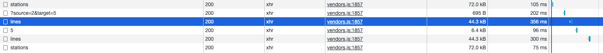

<p align="center">
    
</p>
<p align="center">
  
  
  <a href="https://edu.nextstep.camp/c/R89PYi5H" alt="nextstep atdd">
    
  </a>
  
</p>

<br>

# 인프라공방 샘플 서비스 - 지하철 노선도

<br>

## 🚀 Getting Started

### Install
#### npm 설치
```
cd frontend
npm install
```
> `frontend` 디렉토리에서 수행해야 합니다.

### Usage
#### webpack server 구동
```
npm run dev
```
#### application 구동
```
./gradlew clean build
```
<br>


### 1단계 - 웹 성능 테스트
1. 웹 성능예산은 어느정도가 적당하다고 생각하시나요
- 경쟁사와 성능 비교 

| 사이트          | FCP  | TTI  | SI   | TBT  | LCP  | CLS   |
|--------------|------|------|------|------|------|-------|
| infra-subway | 2.6s | 2.7s | 2.6s | 50ms | 2.7s | 0.004 |
| 서울교통공사       | 1.5s | 2.0s | 1.9s | 40ms | 1.9s | 0.001 |
| 네이버지도        | 0.5s | 0.6s | 2.1s | 0ms  | 1.4s | 0.006 |
| 카카오맵         | 0.5s | 0.7s | 2.3s | 0ms  | 1.4s | 0.03  |

- 목표 성능(경쟁사와 비교하여 평균치를 목표로 설정)

|     | FCP   | TTI  | SI   | TBT  | LCP  | CLS   |
|-----|-------|------|------|------|------|-------|
| 목표치 | 0.83s | 1.1s | 2.1s | 13ms | 1.5s | 0.001 |


2. 웹 성능예산을 바탕으로 현재 지하철 노선도 서비스의 서버 목표 응답시간 가설을 세워보세요.
- lines api 가 다른 api 에 비해 느려서 이 부분을 개선해보면 좋을것 같습니다.
- 

---

### 2단계 - 부하 테스트 
1. 부하테스트 전제조건은 어느정도로 설정하셨나요
- 목표 rps 구하기
  - 예상 DAU
    - https://www.similarweb.com/ 이사이트를 참고해서 MAU 값으로 계산했습니다. DAU 는 나오는 정보가 없었습니다. 😅
    - 네이버지도: 55만
    - 카카오지도: 19만
    - 경쟁사중에서 상대적으로 낮은 카카오지도의 20% 차이나지 않도록 목표 설정
    - 19 * 0.8 = 약 15만
  - 피크 시간대의 집중률
    - 출퇴근 시간대가 피크시간대로 평소대비 2배정도 트래픽이 발생할것으로 예상
    - 2.0
  - 1명당 1일 평균 접속수
    - 요청건수: 3
    - 출퇴근 왕복 이용: 2
    - 평균 접속수: 3 * 2 = 6
  - Throughput 계산
    - 1일 총 접속수: 550000 * 6 = 3300000
    - 1일 평균 rps: 3300000 / 86400 = 38
    - 1일 최대 rps: 38 * 2 = 76
- VUser 구하기
  - R: 3
  - http_req_duration: 0.3s
  - T: 3 * 0.3s + 1s = 1.9
  - 평균 VUser: (평균 rps * T) / R
    - 38 * 1.9 / 3 = 24
  - 최대 VUser: (최대 rps * T) / R
    - 76 * 1.9 / 3 = 48
  - latency: 0.3s

2. Smoke, Load, Stress 테스트 스크립트와 결과를 공유해주세요
- k6 폴더에 정리했습니다.

---

### 3단계 - 로깅, 모니터링
1. 각 서버내 로깅 경로를 알려주세요
- nginx: /var/log/nginx
- application: /home/ubuntu/nextstep/log

2. Cloudwatch 대시보드 URL을 알려주세요
- https://ap-northeast-2.console.aws.amazon.com/cloudwatch/home?region=ap-northeast-2#dashboards:name=bingbingpa
