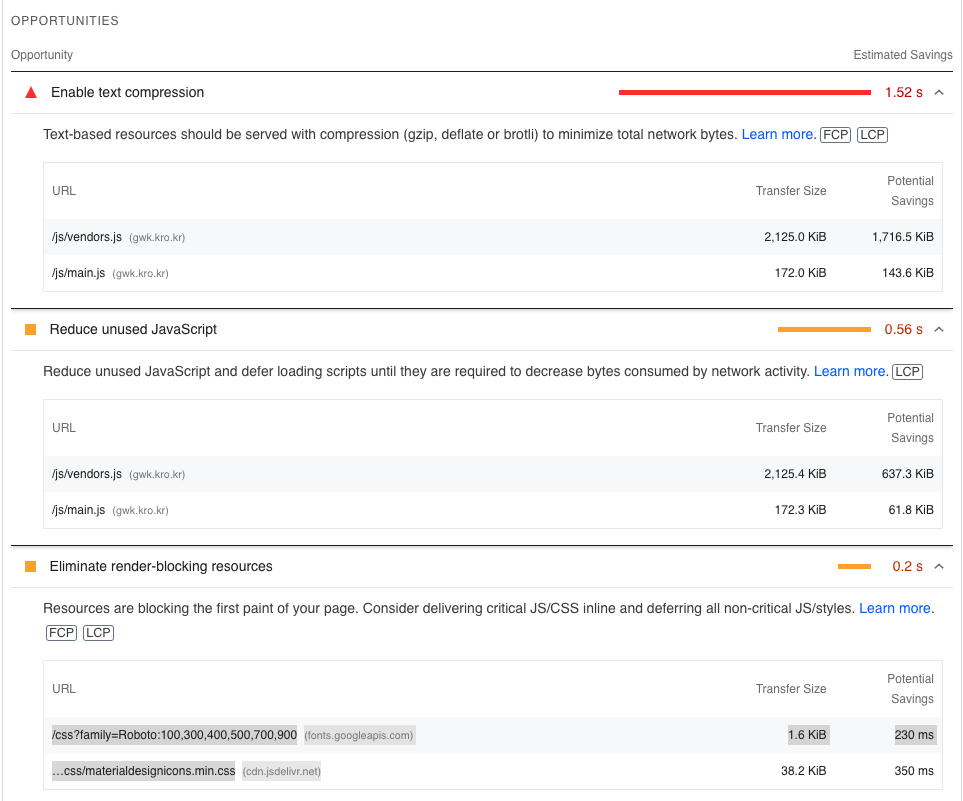
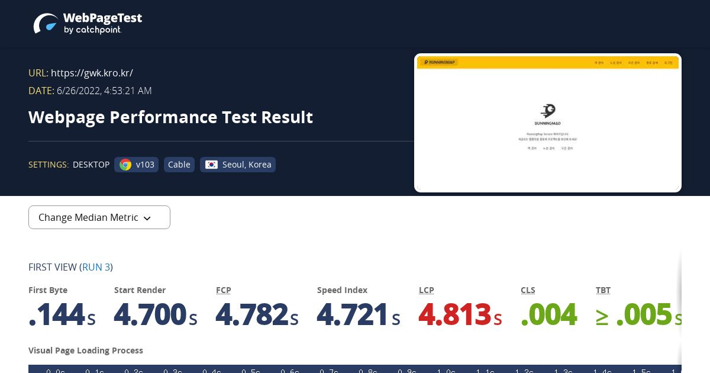

<p align="center">
    
</p>
<p align="center">
  
  
  <a href="https://edu.nextstep.camp/c/R89PYi5H" alt="nextstep atdd">
    
  </a>
  
</p>

<br>

# 인프라공방 샘플 서비스 - 지하철 노선도

<br>

## 🚀 Getting Started

### Install

#### npm 설치

```
cd frontend
npm install
```

> `frontend` 디렉토리에서 수행해야 합니다.

### Usage

#### webpack server 구동

```
npm run dev
```

#### application 구동

```
./gradlew clean build
```

<br>

### 1단계 - 웹 성능 테스트

1. 웹 성능예산은 어느정도가 적당하다고 생각하시나요

#### 경쟁사 분석

| Desktop      | FCP   | TTI   | SI    | TBT      | LCP   | CLS   |
| ------------ | ----- | ----- | ----- | -------- | ----- | ----- |
| 서울교통공사 | 1.4 s | 2.0 s | 2.0 s | 90 ms    | 3.7 s | 0     |
| 네이버지도   | 0.3 s | 5.0 s | 5.4 s | 1,270 ms | 2.5 s | 0.02  |
| 카카오맵     | 0.6 s | 2.5 s | 2.4 s | 410 ms   | 0.6 s | 0.018 |

| Mobile       | FCP   | TTI   | SI     | TBT    | LCP   | CLS   |
| ------------ | ----- | ----- | ------ | ------ | ----- | ----- |
| 서울교통공사 | 6.4 s | 8.5 s | 8.0 s  | 590 ms | 6.6 s | 0     |
| 네이버지도   | 2.1 s | 3.2 s | 15.3 s | 40 ms  | 4.5 s | 0.005 |
| 카카오맵     | 1.7 s | 4.1 s | 6.2 s  | 20 ms  | 6.2 s | 0.005 |

#### 성능 기준 설정

- 페이지로드 3초 미만
- TTI 5초 미만
- 압축된 리소스 크기 200KB 미만

2. 웹 성능예산을 바탕으로 현재 지하철 노선도 서비스는 어떤 부분을 개선하면 좋을까요

- 텍스트 기반 리소스는 (gzip, deflate, brotli)를 사용한다.
- 사용 안하는 자바스크립트 줄인다.
  - /js/vendors.js
  - /js/main.js
- 렌더링을 블록하는 리소스를 제거한다.
  - /css?family=Roboto:100,300,400,500,700,900
  - …css/materialdesignicons.min.css
- LCP 요소 이미지를 미리 로딩한다.
  - div.v-main\_\_wrap > div.d-flex > div.text-center > img.main-logo
    ``




### 2단계 - 부하 테스트

1. 부하테스트 전제조건은 어느정도로 설정하셨나요

2. Smoke, Load, Stress 테스트 스크립트와 결과를 공유해주세요

---

### 3단계 - 로깅, 모니터링

1. 각 서버내 로깅 경로를 알려주세요

2. Cloudwatch 대시보드 URL을 알려주세요
