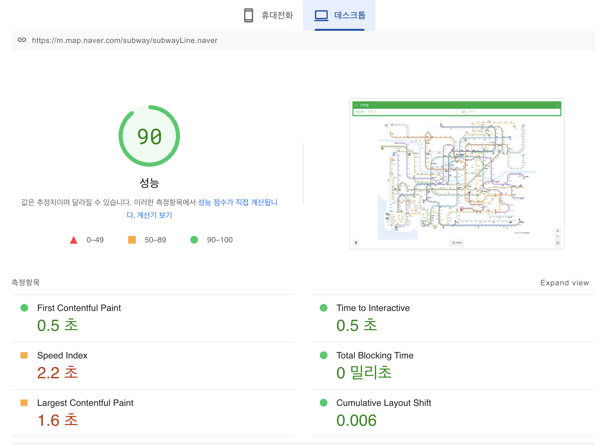
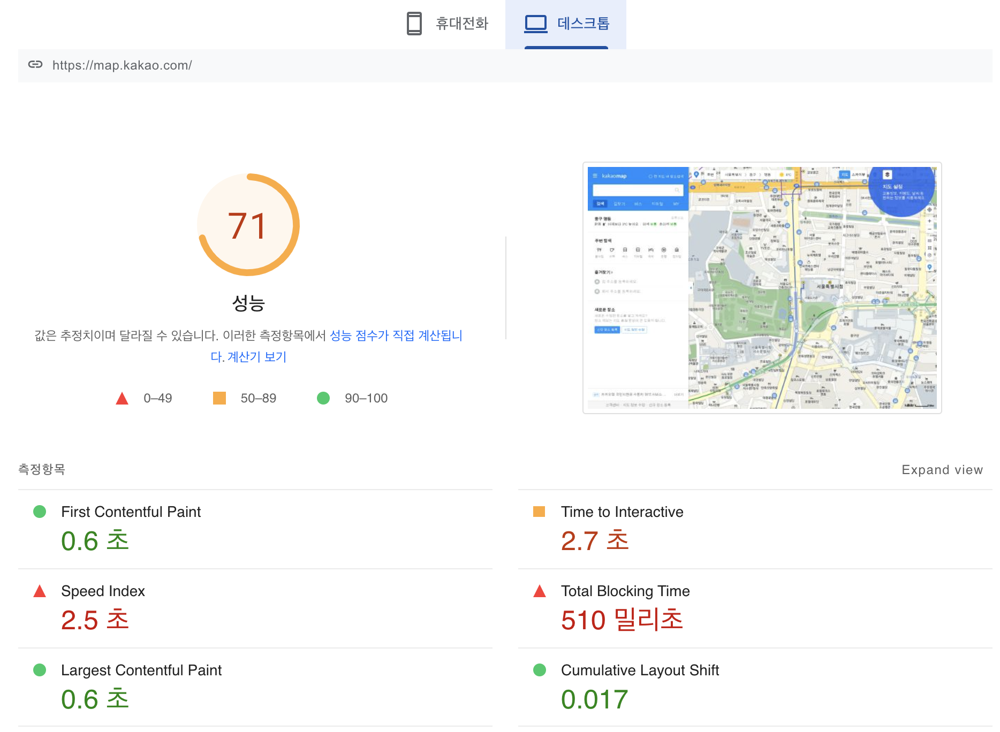
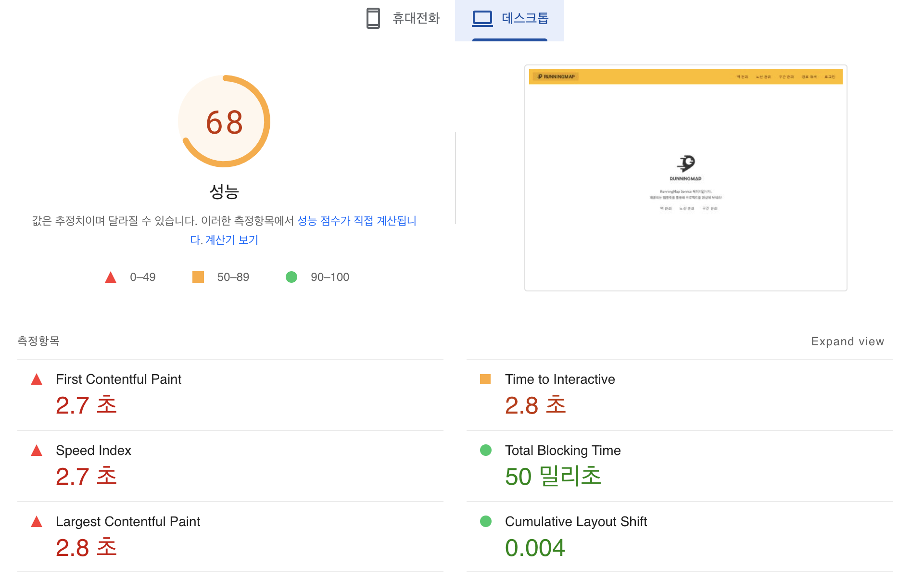
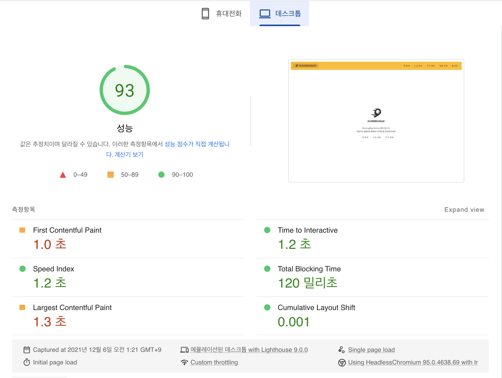
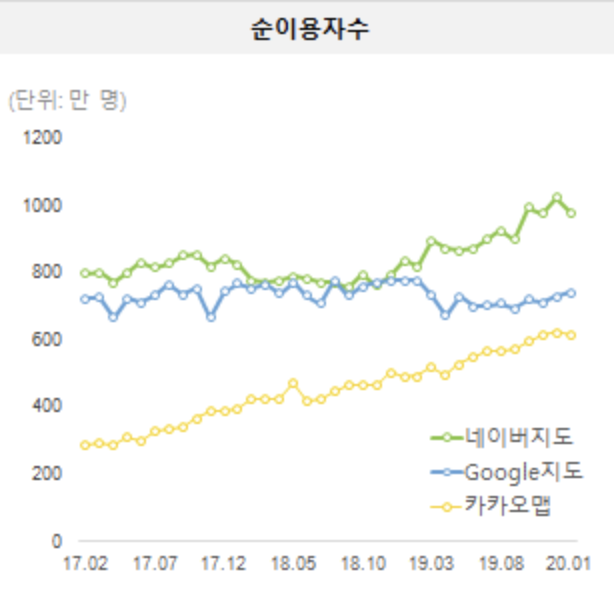

<p align="center">
    
</p>
<p align="center">
  
  
  <a href="https://edu.nextstep.camp/c/R89PYi5H" alt="nextstep atdd">
    
  </a>
  
</p>

<br>

# 인프라공방 샘플 서비스 - 지하철 노선도

<br>

## 🚀 Getting Started

### Install
#### npm 설치
```
cd frontend
npm install
```
> `frontend` 디렉토리에서 수행해야 합니다.

### Usage
#### webpack server 구동
```
npm run dev
```
#### application 구동
```
./gradlew clean build
```
<br>

## 미션

* 미션 진행 후에 아래 질문의 답을 작성하여 PR을 보내주세요.

### 1단계 - 인프라 운영하기
1. 각 서버내 로깅 경로를 알려주세요
  - bastion 서버
    - name : devyonghee-bastion
    - public ip: 3.36.132.241
    - private ip: 192.169.0.175
      
  - nginx
    - name: devyonghee-subway-reverse-proxy
    - public ip: 3.34.196.5
    - private ip: 192.169.0.61
    - log : /var/log/nginx
      
  - application
    - name: devyonghee-subway-service-web
    - public ip: 15.164.225.129
    - private ip: 192.169.0.158
    - log: /home/ubuntu/infra-subway-monitoring/log

2. Cloudwatch 대시보드 URL을 알려주세요
   
   https://ap-northeast-2.console.aws.amazon.com/cloudwatch/home?region=ap-northeast-2#dashboards:name=devyonghee-dashboard

---

### 2단계 - 성능 테스트
1. 웹 성능예산은 어느정도가 적당하다고 생각하시나요

목표를 잡기 전 비슷한 서비스의 타 사이트를 성능을 확인해봤습니다.

#### 네이버 지하철


#### 카카오맵



#### 현재 지하철 노선도 서비스



타 서비스를 참고하여 목표 점수를 잡았습니다.
다른 부족한 것들도 보였지만 First Contentful Paint, Largest Contentful Paint 개선이 시급해보였습니다.

68점에서 30% 이상 개선하여 88점 이상 향상하는 것이 목표입니다.

2. 웹 성능예산을 바탕으로 현재 지하철 노선도 서비스는 어떤 부분을 개선하면 좋을까요



- spring 의 compression 을 통해 정적 리소스 압축 
- spring 의 캐싱 기능을 이용하여 정적 리소스 캐싱
- 프론트엔드에서 필요한 소스만 가져오도록 `dynamic import` 적용
- `link` 태그에 `media` 를 지정해주면서 로드할 때 렌더링 차단 방지

68점에서 93점으로 약 36.7% 개선되었습니다.
적용한 방법 이외에도 CDN 적용, 이미지 용량 감소 등을 통해 추가 개선할 수 있다고 생각됩니다.


3. 부하테스트 전제조건은 어느정도로 설정하셨나요



카카오 네이버 한달 사용자 수 대략 800만명  
이 사용자 수보다 10% 정도 서비스를 이용한다고 가정  
(8,000,000 / 10) / 30 = 26666 -> 하루 이용자 25000명 

1일 사용자 수(DAU) : 25000
1명당 1일 평균 접속 수 : 5
1일 총 접속 수 : 25,000 * 5 = 125,000
1일 평균 rps : 75,000 / 86,400 = 1.44 -> 2
1일 최대 rps : 10

4. Smoke, Load, Stress 테스트 스크립트와 결과를 공유해주세요

### 접속 빈도가 높은 페이지 - 메인페이지

<details>
 <summary>smoke</summary>

```javascript
import http from 'k6/http';
import {check, sleep} from 'k6';

export let options = {
  vus: 2,
  duration: '10s',

  thresholds: {
    http_req_duration: ['p(99)<1000'],
  },
};

const BASE_URL = 'https://devyonghee.kro.kr';

export default function () {
  const mainResponse = http.get(`${BASE_URL}`);
  check(mainResponse, {
    'load main page': response => response.status === 200
  });
  sleep(1);
}

```

```
          /\      |‾‾| /‾‾/   /‾‾/   
     /\  /  \     |  |/  /   /  /    
    /  \/    \    |     (   /   ‾‾\  
   /          \   |  |\  \ |  (‾)  | 
  / __________ \  |__| \__\ \_____/ .io

  execution: local
     script: main-smoke.js
     output: -

  scenarios: (100.00%) 1 scenario, 2 max VUs, 40s max duration (incl. graceful stop):
           * default: 2 looping VUs for 10s (gracefulStop: 30s)


running (10.4s), 0/2 VUs, 20 complete and 0 interrupted iterations
default ✓ [======================================] 2 VUs  10s

     ✓ load main page

     checks.........................: 100.00% ✓ 20       ✗ 0  
     data_received..................: 35 kB   3.4 kB/s
     data_sent......................: 3.0 kB  288 B/s
     http_req_blocked...............: avg=17.61ms  min=3µs     med=6µs     max=176.21ms p(90)=17.61ms  p(95)=176.06ms
     http_req_connecting............: avg=646.89µs min=0s      med=0s      max=6.61ms   p(90)=632.2µs  p(95)=6.33ms  
   ✓ http_req_duration..............: avg=20.49ms  min=12.47ms med=19.82ms max=31.58ms  p(90)=26.67ms  p(95)=31.53ms 
       { expected_response:true }...: avg=20.49ms  min=12.47ms med=19.82ms max=31.58ms  p(90)=26.67ms  p(95)=31.53ms 
     http_req_failed................: 0.00%   ✓ 0        ✗ 20 
     http_req_receiving.............: avg=86.1µs   min=31µs    med=83.99µs max=168µs    p(90)=157.29µs p(95)=160.4µs 
     http_req_sending...............: avg=31.45µs  min=12µs    med=26µs    max=100µs    p(90)=42.4µs   p(95)=82.9µs  
     http_req_tls_handshaking.......: avg=16.86ms  min=0s      med=0s      max=168.68ms p(90)=16.85ms  p(95)=168.55ms
     http_req_waiting...............: avg=20.38ms  min=12.37ms med=19.73ms max=31.5ms   p(90)=26.56ms  p(95)=31.42ms 
     http_reqs......................: 20      1.922554/s
     iteration_duration.............: avg=1.04s    min=1.01s   med=1.02s   max=1.19s    p(90)=1.04s    p(95)=1.19s   
     iterations.....................: 20      1.922554/s
     vus............................: 2       min=2      max=2
     vus_max........................: 2       min=2      max=2
```
</details>

<details>
 <summary>load</summary>

```javascript
import http from 'k6/http';
import {check, sleep} from 'k6';

export const options = {
  stages: [
    {duration: '5s', target: 50},
    {duration: '10s', target: 100},
    {duration: '20s', target: 100},
    {duration: '10s', target: 0},
  ],
  thresholds: {
    http_req_duration: ['p(99)<1000'],
  },
};

const BASE_URL = 'https://devyonghee.kro.kr';

export default function () {
  const mainResponse = http.get(`${BASE_URL}`);
  check(mainResponse, {
    'load main page': response => response.status === 200
  });
  sleep(1);
}

```

```
          /\      |‾‾| /‾‾/   /‾‾/   
     /\  /  \     |  |/  /   /  /    
    /  \/    \    |     (   /   ‾‾\  
   /          \   |  |\  \ |  (‾)  | 
  / __________ \  |__| \__\ \_____/ .io

  execution: local
     script: main-load.js
     output: -

  scenarios: (100.00%) 1 scenario, 100 max VUs, 1m15s max duration (incl. graceful stop):
           * default: Up to 100 looping VUs for 45s over 4 stages (gracefulRampDown: 30s, gracefulStop: 30s)


running (0m45.9s), 000/100 VUs, 3368 complete and 0 interrupted iterations
default ✓ [======================================] 000/100 VUs  45s

     ✓ load main page

     checks.........................: 100.00% ✓ 3368      ✗ 0    
     data_received..................: 4.8 MB  105 kB/s
     data_sent......................: 415 kB  9.0 kB/s
     http_req_blocked...............: avg=1.1ms    min=1µs    med=6µs     max=232.2ms  p(90)=9µs     p(95)=19µs   
     http_req_connecting............: avg=333.22µs min=0s     med=0s      max=63.43ms  p(90)=0s      p(95)=0s     
   ✓ http_req_duration..............: avg=15.23ms  min=8.62ms med=12.71ms max=118.7ms  p(90)=23.22ms p(95)=26.82ms
       { expected_response:true }...: avg=15.23ms  min=8.62ms med=12.71ms max=118.7ms  p(90)=23.22ms p(95)=26.82ms
     http_req_failed................: 0.00%   ✓ 0         ✗ 3368 
     http_req_receiving.............: avg=75.74µs  min=24µs   med=68µs    max=2ms      p(90)=110µs   p(95)=128µs  
     http_req_sending...............: avg=27.29µs  min=7µs    med=25µs    max=326µs    p(90)=40µs    p(95)=49µs   
     http_req_tls_handshaking.......: avg=766.79µs min=0s     med=0s      max=217.51ms p(90)=0s      p(95)=0s     
     http_req_waiting...............: avg=15.13ms  min=8.53ms med=12.6ms  max=118.61ms p(90)=23.14ms p(95)=26.71ms
     http_reqs......................: 3368    73.320949/s
     iteration_duration.............: avg=1.01s    min=1s     med=1.01s   max=1.24s    p(90)=1.02s   p(95)=1.03s  
     iterations.....................: 3368    73.320949/s
     vus............................: 6       min=6       max=100
     vus_max........................: 100     min=100     max=100
```

</details>

<details>
 <summary>stress</summary>
 
```javascript
import http from 'k6/http';
import {sleep, check} from 'k6';

export const options = {
  stages: [
    {duration: '10s', target: 20},
    {duration: '10s', target: 50},
    {duration: '20s', target: 100},
    {duration: '10s', target: 150},
    {duration: '20s', target: 200},
    {duration: '10s', target: 100},
    {duration: '10s', target: 0},
  ],
  thresholds: {
    http_req_duration: ['p(99)<1000'],
  },
};

const BASE_URL = 'https://devyonghee.kro.kr';

export default function () {
  const mainResponse = http.get(`${BASE_URL}`);
  check(mainResponse, {
    'load main page': response => response.status === 200
  });
  sleep(1);
}
```

```
          /\      |‾‾| /‾‾/   /‾‾/   
     /\  /  \     |  |/  /   /  /    
    /  \/    \    |     (   /   ‾‾\  
   /          \   |  |\  \ |  (‾)  | 
  / __________ \  |__| \__\ \_____/ .io

  execution: local
     script: main-stress.js
     output: -

  scenarios: (100.00%) 1 scenario, 200 max VUs, 2m0s max duration (incl. graceful stop):
           * default: Up to 200 looping VUs for 1m30s over 7 stages (gracefulRampDown: 30s, gracefulStop: 30s)


running (1m31.0s), 000/200 VUs, 8617 complete and 0 interrupted iterations
default ✓ [======================================] 000/200 VUs  1m30s

     ✓ load main page

     checks.........................: 100.00% ✓ 8617     ✗ 0    
     data_received..................: 12 MB   133 kB/s
     data_sent......................: 1.0 MB  11 kB/s
     http_req_blocked...............: avg=946.48µs min=1µs    med=5µs     max=286.7ms  p(90)=11µs    p(95)=17µs   
     http_req_connecting............: avg=306.6µs  min=0s     med=0s      max=139.24ms p(90)=0s      p(95)=0s     
   ✓ http_req_duration..............: avg=17.46ms  min=7.79ms med=11.9ms  max=280.69ms p(90)=23.27ms p(95)=35.34ms
       { expected_response:true }...: avg=17.46ms  min=7.79ms med=11.9ms  max=280.69ms p(90)=23.27ms p(95)=35.34ms
     http_req_failed................: 0.00%   ✓ 0        ✗ 8617 
     http_req_receiving.............: avg=74.72µs  min=19µs   med=61µs    max=694µs    p(90)=133µs   p(95)=162µs  
     http_req_sending...............: avg=26.48µs  min=6µs    med=21µs    max=1.18ms   p(90)=45µs    p(95)=57µs   
     http_req_tls_handshaking.......: avg=631.36µs min=0s     med=0s      max=210.48ms p(90)=0s      p(95)=0s     
     http_req_waiting...............: avg=17.36ms  min=7.76ms med=11.79ms max=280.58ms p(90)=23.16ms p(95)=35.25ms
     http_reqs......................: 8617    94.72866/s
     iteration_duration.............: avg=1.01s    min=1s     med=1.01s   max=1.45s    p(90)=1.02s   p(95)=1.04s  
     iterations.....................: 8617    94.72866/s
     vus............................: 7       min=2      max=199
     vus_max........................: 200     min=200    max=200
```
</details>


### 데이터를 갱신하는 페이지 - 내 정보 수정

<details>
 <summary>smoke</summary>

```javascript
import http from 'k6/http';
import {check, sleep} from 'k6';

export let options = {
  vus: 2,
  duration: '10s',

  thresholds: {
    http_req_duration: ['p(99)<1000'],
  },
};


const BASE_URL = 'https://devyonghee.kro.kr';
const email = 'email@email.com';
const password = '123';
const params = {headers: {'Content-Type': 'application/json'}};
const loginPayload = JSON.stringify({email, password});

export default function () {
  const loginResponse = http.post(`${BASE_URL}/login/token`,
      loginPayload, params).json();
  check(loginResponse, {
    'logged in successfully': response => response.accessToken !== '',
  });

  const authHeaders = {
    headers: {
      Authorization: `Bearer ${loginResponse.accessToken}`,
      'Content-Type': 'application/json',
    }
  };
  const retrievedResponse = http.get(`${BASE_URL}/members/me`, authHeaders).json();
  check(retrievedResponse, {'retrieved member': obj => obj.id !== 0});

  const updatedResponse = http.put(`${BASE_URL}/members/me`,
      JSON.stringify({email, password, age: 10}), authHeaders);
  check(updatedResponse,
      {'updated member': response => response.status === 200}
  );
  sleep(1);
}

```

```

          /\      |‾‾| /‾‾/   /‾‾/   
     /\  /  \     |  |/  /   /  /    
    /  \/    \    |     (   /   ‾‾\  
   /          \   |  |\  \ |  (‾)  | 
  / __________ \  |__| \__\ \_____/ .io

  execution: local
     script: update-smoke.js
     output: -

  scenarios: (100.00%) 1 scenario, 2 max VUs, 40s max duration (incl. graceful stop):
           * default: 2 looping VUs for 10s (gracefulStop: 30s)


running (10.4s), 0/2 VUs, 18 complete and 0 interrupted iterations
default ✓ [======================================] 2 VUs  10s

     ✓ logged in successfully
     ✓ retrieved member
     ✓ updated member

     checks.........................: 100.00% ✓ 54       ✗ 0  
     data_received..................: 25 kB   2.4 kB/s
     data_sent......................: 18 kB   1.7 kB/s
     http_req_blocked...............: avg=7.13ms   min=2µs     med=4µs     max=192.5ms  p(90)=7µs     p(95)=11.19µs 
     http_req_connecting............: avg=522.66µs min=0s      med=0s      max=14.27ms  p(90)=0s      p(95)=0s      
   ✓ http_req_duration..............: avg=42.49ms  min=29.85ms med=41.28ms max=62.32ms  p(90)=52.03ms p(95)=56.93ms 
       { expected_response:true }...: avg=42.49ms  min=29.85ms med=41.28ms max=62.32ms  p(90)=52.03ms p(95)=56.93ms 
     http_req_failed................: 0.00%   ✓ 0        ✗ 54 
     http_req_receiving.............: avg=72.01µs  min=27µs    med=69.5µs  max=134µs    p(90)=110.4µs p(95)=112.04µs
     http_req_sending...............: avg=29.46µs  min=12µs    med=27µs    max=131µs    p(90)=39µs    p(95)=48.34µs 
     http_req_tls_handshaking.......: avg=6.54ms   min=0s      med=0s      max=176.87ms p(90)=0s      p(95)=0s      
     http_req_waiting...............: avg=42.39ms  min=29.76ms med=41.17ms max=62.25ms  p(90)=51.96ms p(95)=56.86ms 
     http_reqs......................: 54      5.211296/s
     iteration_duration.............: avg=1.15s    min=1.11s   med=1.12s   max=1.32s    p(90)=1.21s   p(95)=1.32s   
     iterations.....................: 18      1.737099/s
     vus............................: 2       min=2      max=2
     vus_max........................: 2       min=2      max=2

```
</details>

<details>
 <summary>load</summary>

```javascript
import http from 'k6/http';
import {check, sleep} from 'k6';

export const options = {
  stages: [
    {duration: '5s', target: 50},
    {duration: '10s', target: 100},
    {duration: '20s', target: 100},
    {duration: '10s', target: 0},
  ],
  thresholds: {
    http_req_duration: ['p(99)<1000'],
  },
};

const BASE_URL = 'https://devyonghee.kro.kr';
const email = 'email@email.com';
const password = '123';
const params = {headers: {'Content-Type': 'application/json'}};
const loginPayload = JSON.stringify({email, password});

export default function () {
  const loginResponse = http.post(`${BASE_URL}/login/token`,
      loginPayload, params).json();
  check(loginResponse, {
    'logged in successfully': response => response.accessToken !== '',
  });

  const authHeaders = {
    headers: {
      Authorization: `Bearer ${loginResponse.accessToken}`,
      'Content-Type': 'application/json',
    }
  };
  const retrievedResponse = http.get(`${BASE_URL}/members/me`, authHeaders).json();
  check(retrievedResponse, {'retrieved member': obj => obj.id !== 0});

  const updatedResponse = http.put(`${BASE_URL}/members/me`,
      JSON.stringify({email, password, age: 10}), authHeaders);
  check(updatedResponse,
      {'updated member': response => response.status === 200}
  );
  sleep(1);
}

```

```
          /\      |‾‾| /‾‾/   /‾‾/   
     /\  /  \     |  |/  /   /  /    
    /  \/    \    |     (   /   ‾‾\  
   /          \   |  |\  \ |  (‾)  | 
  / __________ \  |__| \__\ \_____/ .io

  execution: local
     script: update-load.js
     output: -

  scenarios: (100.00%) 1 scenario, 100 max VUs, 1m15s max duration (incl. graceful stop):
           * default: Up to 100 looping VUs for 45s over 4 stages (gracefulRampDown: 30s, gracefulStop: 30s)


running (0m45.5s), 000/100 VUs, 927 complete and 0 interrupted iterations
default ✓ [======================================] 000/100 VUs  45s

     ✓ logged in successfully
     ✓ retrieved member
     ✓ updated member

     checks.........................: 100.00% ✓ 2781      ✗ 0    
     data_received..................: 1.3 MB  28 kB/s
     data_sent......................: 907 kB  20 kB/s
     http_req_blocked...............: avg=1.23ms   min=1µs     med=4µs   max=196.01ms p(90)=9µs   p(95)=17µs 
     http_req_connecting............: avg=325.75µs min=0s      med=0s    max=20.95ms  p(90)=0s    p(95)=0s   
   ✗ http_req_duration..............: avg=930.84ms min=23.94ms med=1.05s max=3.57s    p(90)=1.34s p(95)=1.43s
       { expected_response:true }...: avg=930.84ms min=23.94ms med=1.05s max=3.57s    p(90)=1.34s p(95)=1.43s
     http_req_failed................: 0.00%   ✓ 0         ✗ 2781 
     http_req_receiving.............: avg=78.12µs  min=21µs    med=71µs  max=467µs    p(90)=125µs p(95)=144µs
     http_req_sending...............: avg=33.45µs  min=10µs    med=28µs  max=331µs    p(90)=51µs  p(95)=68µs 
     http_req_tls_handshaking.......: avg=902.37µs min=0s      med=0s    max=182.47ms p(90)=0s    p(95)=0s   
     http_req_waiting...............: avg=930.72ms min=23.79ms med=1.05s max=3.57s    p(90)=1.34s p(95)=1.42s
     http_reqs......................: 2781    61.123409/s
     iteration_duration.............: avg=3.79s    min=1.1s    med=4.11s max=7.24s    p(90)=4.94s p(95)=5.09s
     iterations.....................: 927     20.37447/s
     vus............................: 9       min=9       max=100
     vus_max........................: 100     min=100     max=100

```

</details>

<details>
 <summary>stress</summary>

```javascript
import http from 'k6/http';
import {check, sleep} from 'k6';

export const options = {
  stages: [
    {duration: '10s', target: 20},
    {duration: '10s', target: 50},
    {duration: '20s', target: 100},
    {duration: '10s', target: 150},
    {duration: '20s', target: 200},
    {duration: '10s', target: 100},
    {duration: '10s', target: 0},
  ],
  thresholds: {
    http_req_duration: ['p(99)<1000'],
  },
};


const BASE_URL = 'https://devyonghee.kro.kr';
const email = 'email@email.com';
const password = '123';
const params = {headers: {'Content-Type': 'application/json'}};
const loginPayload = JSON.stringify({email, password});

export default function () {
  const loginResponse = http.post(`${BASE_URL}/login/token`,
      loginPayload, params).json();
  check(loginResponse, {
    'logged in successfully': response => response.accessToken !== '',
  });

  const authHeaders = {
    headers: {
      Authorization: `Bearer ${loginResponse.accessToken}`,
      'Content-Type': 'application/json',
    }
  };
  const retrievedResponse = http.get(`${BASE_URL}/members/me`, authHeaders).json();
  check(retrievedResponse, {'retrieved member': obj => obj.id !== 0});

  const updatedResponse = http.put(`${BASE_URL}/members/me`,
      JSON.stringify({email, password, age: 10}), authHeaders);
  check(updatedResponse,
      {'updated member': response => response.status === 200}
  );
  sleep(1);
}
```

```
          /\      |‾‾| /‾‾/   /‾‾/   
     /\  /  \     |  |/  /   /  /    
    /  \/    \    |     (   /   ‾‾\  
   /          \   |  |\  \ |  (‾)  | 
  / __________ \  |__| \__\ \_____/ .io

  execution: local
     script: update-stress.js
     output: -

  scenarios: (100.00%) 1 scenario, 200 max VUs, 2m0s max duration (incl. graceful stop):
           * default: Up to 200 looping VUs for 1m30s over 7 stages (gracefulRampDown: 30s, gracefulStop: 30s)


running (1m30.2s), 000/200 VUs, 1808 complete and 0 interrupted iterations
default ✓ [======================================] 000/200 VUs  1m30s

     ✓ logged in successfully
     ✓ retrieved member
     ✓ updated member

     checks.........................: 100.00% ✓ 5424      ✗ 0    
     data_received..................: 2.5 MB  28 kB/s
     data_sent......................: 1.8 MB  20 kB/s
     http_req_blocked...............: avg=1.49ms   min=1µs     med=4µs   max=276.92ms p(90)=8µs   p(95)=14µs 
     http_req_connecting............: avg=580.27µs min=0s      med=0s    max=152.1ms  p(90)=0s    p(95)=0s   
   ✗ http_req_duration..............: avg=1.36s    min=21.03ms med=1.18s max=7.36s    p(90)=2.54s p(95)=2.63s
       { expected_response:true }...: avg=1.36s    min=21.03ms med=1.18s max=7.36s    p(90)=2.54s p(95)=2.63s
     http_req_failed................: 0.00%   ✓ 0         ✗ 5424 
     http_req_receiving.............: avg=71.06µs  min=19µs    med=68µs  max=304µs    p(90)=107µs p(95)=119µs
     http_req_sending...............: avg=31.84µs  min=7µs     med=29µs  max=201µs    p(90)=48µs  p(95)=58µs 
     http_req_tls_handshaking.......: avg=899.47µs min=0s      med=0s    max=186.15ms p(90)=0s    p(95)=0s   
     http_req_waiting...............: avg=1.36s    min=20.91ms med=1.18s max=7.36s    p(90)=2.54s p(95)=2.63s
     http_reqs......................: 5424    60.139303/s
     iteration_duration.............: avg=5.1s     min=1.06s   med=4.8s  max=13.58s   p(90)=8.63s p(95)=8.82s
     iterations.....................: 1808    20.046434/s
     vus............................: 10      min=2       max=200
     vus_max........................: 200     min=200     max=200

```
</details>

### 데이터를 조회하는데 여러 데이터를 참조하는 페이지 - 경로 찾기

<details>
 <summary>smoke</summary>

```javascript
import http from 'k6/http';
import {check, sleep} from 'k6';

export let options = {
  vus: 2,
  duration: '10s',

  thresholds: {
    http_req_duration: ['p(99)<1000'],
  },
};

const BASE_URL = 'https://devyonghee.kro.kr';
const PARAMS = {headers: {'Content-Type': 'application/json'}};

export default function () {
  const pathResponse = http.get(`${BASE_URL}/paths/?source=1&target=3`, PARAMS).json();
  check(pathResponse, {'find path': obj => obj.distance !== 0});
  sleep(1);
}

```

```
          /\      |‾‾| /‾‾/   /‾‾/   
     /\  /  \     |  |/  /   /  /    
    /  \/    \    |     (   /   ‾‾\  
   /          \   |  |\  \ |  (‾)  | 
  / __________ \  |__| \__\ \_____/ .io

  execution: local
     script: path-smoke.js
     output: -

  scenarios: (100.00%) 1 scenario, 2 max VUs, 40s max duration (incl. graceful stop):
           * default: 2 looping VUs for 10s (gracefulStop: 30s)


running (11.1s), 0/2 VUs, 20 complete and 0 interrupted iterations
default ✓ [======================================] 2 VUs  10s

     ✓ find path

     checks.........................: 100.00% ✓ 20       ✗ 0  
     data_received..................: 21 kB   1.9 kB/s
     data_sent......................: 4.1 kB  373 B/s
     http_req_blocked...............: avg=19.83ms  min=4µs     med=7µs     max=198.55ms p(90)=19.8ms   p(95)=197.98ms
     http_req_connecting............: avg=1.33ms   min=0s      med=0s      max=13.7ms   p(90)=1.29ms   p(95)=12.98ms 
   ✓ http_req_duration..............: avg=81.96ms  min=56.62ms med=74.48ms max=129.18ms p(90)=111.92ms p(95)=114.43ms
       { expected_response:true }...: avg=81.96ms  min=56.62ms med=74.48ms max=129.18ms p(90)=111.92ms p(95)=114.43ms
     http_req_failed................: 0.00%   ✓ 0        ✗ 20 
     http_req_receiving.............: avg=109.45µs min=46µs    med=98µs    max=324µs    p(90)=153µs    p(95)=195.75µs
     http_req_sending...............: avg=90.44µs  min=17µs    med=35µs    max=921µs    p(90)=73µs     p(95)=346.25µs
     http_req_tls_handshaking.......: avg=18.34ms  min=0s      med=0s      max=183.47ms p(90)=18.33ms  p(95)=183.34ms
     http_req_waiting...............: avg=81.76ms  min=56.48ms med=74.37ms max=128.99ms p(90)=111.74ms p(95)=113.43ms
     http_reqs......................: 20      1.809556/s
     iteration_duration.............: avg=1.1s     min=1.05s   med=1.07s   max=1.31s    p(90)=1.14s    p(95)=1.3s    
     iterations.....................: 20      1.809556/s
     vus............................: 2       min=2      max=2
     vus_max........................: 2       min=2      max=2

```
</details>

<details>
 <summary>load</summary>

```javascript
import http from 'k6/http';
import {check, sleep} from 'k6';

export const options = {
  stages: [
    {duration: '5s', target: 50},
    {duration: '10s', target: 100},
    {duration: '20s', target: 100},
    {duration: '10s', target: 0},
  ],
  thresholds: {
    http_req_duration: ['p(99)<1000'],
  },
};

const BASE_URL = 'https://devyonghee.kro.kr';
const PARAMS = {headers: {'Content-Type': 'application/json'}};

export default function () {
  const pathResponse = http.get(`${BASE_URL}/paths/?source=1&target=3`, PARAMS).json();
  check(pathResponse, {'find path': obj => obj.distance !== 0});
  sleep(1);
}
```

```
          /\      |‾‾| /‾‾/   /‾‾/   
     /\  /  \     |  |/  /   /  /    
    /  \/    \    |     (   /   ‾‾\  
   /          \   |  |\  \ |  (‾)  | 
  / __________ \  |__| \__\ \_____/ .io

  execution: local
     script: path-load.js
     output: -

  scenarios: (100.00%) 1 scenario, 100 max VUs, 1m15s max duration (incl. graceful stop):
           * default: Up to 100 looping VUs for 45s over 4 stages (gracefulRampDown: 30s, gracefulStop: 30s)


running (0m45.9s), 000/100 VUs, 964 complete and 0 interrupted iterations
default ✓ [======================================] 000/100 VUs  45s

     ✓ find path

     checks.........................: 100.00% ✓ 964       ✗ 0    
     data_received..................: 1.0 MB  22 kB/s
     data_sent......................: 200 kB  4.4 kB/s
     http_req_blocked...............: avg=3.97ms  min=2µs     med=7µs   max=209.35ms p(90)=25.03ms p(95)=29.91ms 
     http_req_connecting............: avg=1.11ms  min=0s      med=0s    max=22.29ms  p(90)=5.81ms  p(95)=9.28ms  
   ✗ http_req_duration..............: avg=2.66s   min=52.75ms med=3.25s max=8.69s    p(90)=3.97s   p(95)=4.06s   
       { expected_response:true }...: avg=2.66s   min=52.75ms med=3.25s max=8.69s    p(90)=3.97s   p(95)=4.06s   
     http_req_failed................: 0.00%   ✓ 0         ✗ 964  
     http_req_receiving.............: avg=86.64µs min=30µs    med=89µs  max=250µs    p(90)=120µs   p(95)=132.84µs
     http_req_sending...............: avg=37.97µs min=10µs    med=36µs  max=184µs    p(90)=57µs    p(95)=76µs    
     http_req_tls_handshaking.......: avg=2.83ms  min=0s      med=0s    max=194.63ms p(90)=17.43ms p(95)=20.41ms 
     http_req_waiting...............: avg=2.66s   min=52.67ms med=3.25s max=8.69s    p(90)=3.97s   p(95)=4.06s   
     http_reqs......................: 964     20.979561/s
     iteration_duration.............: avg=3.67s   min=1.05s   med=4.25s max=9.69s    p(90)=4.97s   p(95)=5.06s   
     iterations.....................: 964     20.979561/s
     vus............................: 6       min=6       max=100
     vus_max........................: 100     min=100     max=100

```

</details>

<details>
 <summary>stress</summary>

```javascript
import http from 'k6/http';
import {sleep, check} from 'k6';

export const options = {
  stages: [
    {duration: '10s', target: 20},
    {duration: '10s', target: 50},
    {duration: '20s', target: 100},
    {duration: '10s', target: 150},
    {duration: '20s', target: 200},
    {duration: '10s', target: 100},
    {duration: '10s', target: 0},
  ],
  thresholds: {
    http_req_duration: ['p(99)<1000'],
  },
};

const BASE_URL = 'https://devyonghee.kro.kr';
const PARAMS = {headers: {'Content-Type': 'application/json'}};

export default function () {
  const pathResponse = http.get(`${BASE_URL}/paths/?source=1&target=3`, PARAMS).json();
  check(pathResponse, {'find path': obj => obj.distance !== 0});
  sleep(1);
}
```

```
          /\      |‾‾| /‾‾/   /‾‾/   
     /\  /  \     |  |/  /   /  /    
    /  \/    \    |     (   /   ‾‾\  
   /          \   |  |\  \ |  (‾)  | 
  / __________ \  |__| \__\ \_____/ .io

  execution: local
     script: path-stress.js
     output: -

  scenarios: (100.00%) 1 scenario, 200 max VUs, 2m0s max duration (incl. graceful stop):
           * default: Up to 200 looping VUs for 1m30s over 7 stages (gracefulRampDown: 30s, gracefulStop: 30s)


running (1m30.9s), 000/200 VUs, 1837 complete and 0 interrupted iterations
default ✓ [======================================] 000/200 VUs  1m30s

     ✓ find path

     checks.........................: 100.00% ✓ 1837      ✗ 0    
     data_received..................: 2.0 MB  22 kB/s
     data_sent......................: 385 kB  4.2 kB/s
     http_req_blocked...............: avg=3.97ms  min=2µs     med=7µs   max=199.31ms p(90)=26.8ms  p(95)=31.17ms
     http_req_connecting............: avg=1.49ms  min=0s      med=0s    max=144.42ms p(90)=7.16ms  p(95)=10.31ms
   ✗ http_req_duration..............: avg=4.06s   min=49.36ms med=3.83s max=15.16s   p(90)=7.64s   p(95)=7.88s  
       { expected_response:true }...: avg=4.06s   min=49.36ms med=3.83s max=15.16s   p(90)=7.64s   p(95)=7.88s  
     http_req_failed................: 0.00%   ✓ 0         ✗ 1837 
     http_req_receiving.............: avg=87.68µs min=30µs    med=87µs  max=1.03ms   p(90)=124µs   p(95)=143µs  
     http_req_sending...............: avg=37.99µs min=9µs     med=36µs  max=238µs    p(90)=60µs    p(95)=80µs   
     http_req_tls_handshaking.......: avg=2.46ms  min=0s      med=0s    max=184.11ms p(90)=18.65ms p(95)=20.55ms
     http_req_waiting...............: avg=4.06s   min=49.27ms med=3.83s max=15.16s   p(90)=7.64s   p(95)=7.88s  
     http_reqs......................: 1837    20.208662/s
     iteration_duration.............: avg=5.06s   min=1.04s   med=4.84s max=16.16s   p(90)=8.65s   p(95)=8.88s  
     iterations.....................: 1837    20.208662/s
     vus............................: 7       min=2       max=200
     vus_max........................: 200     min=200     max=200

```
</details>
