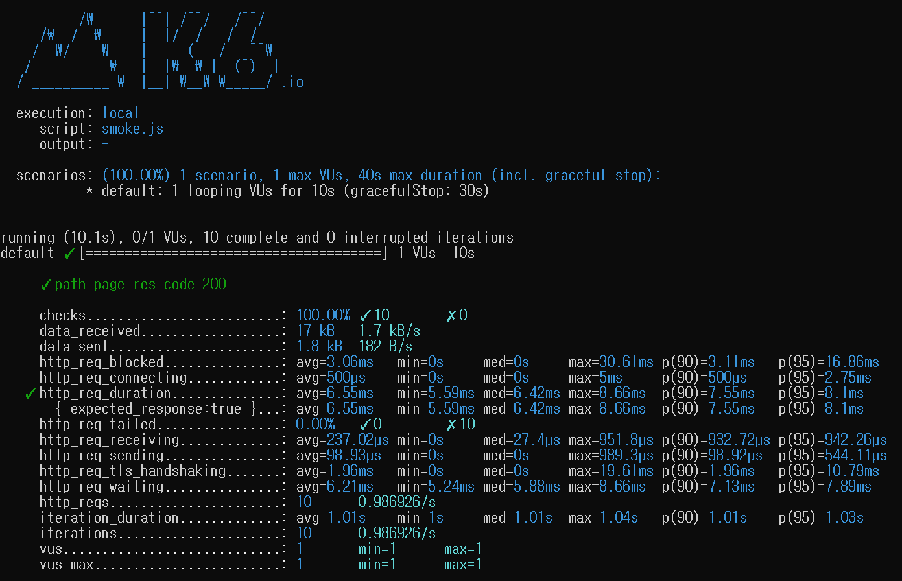
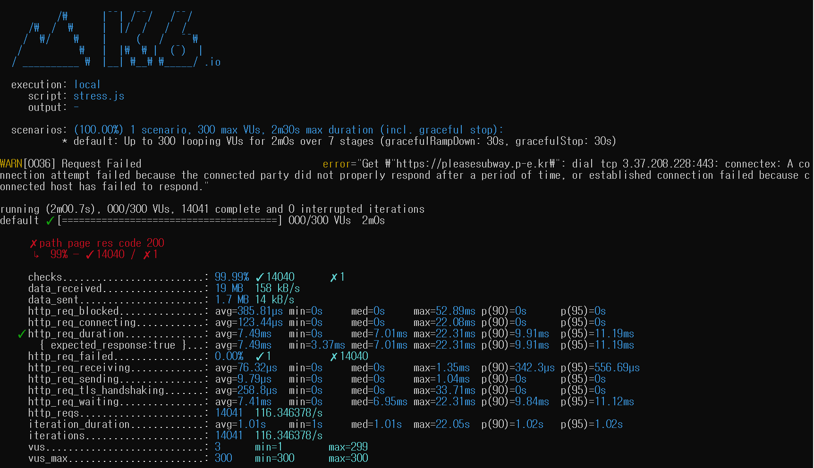
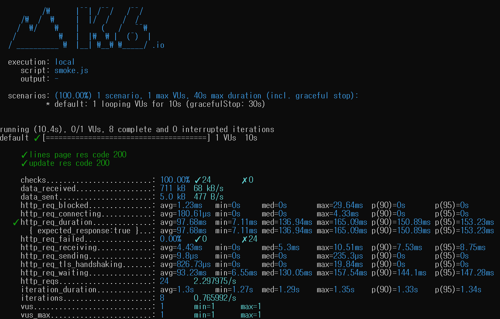
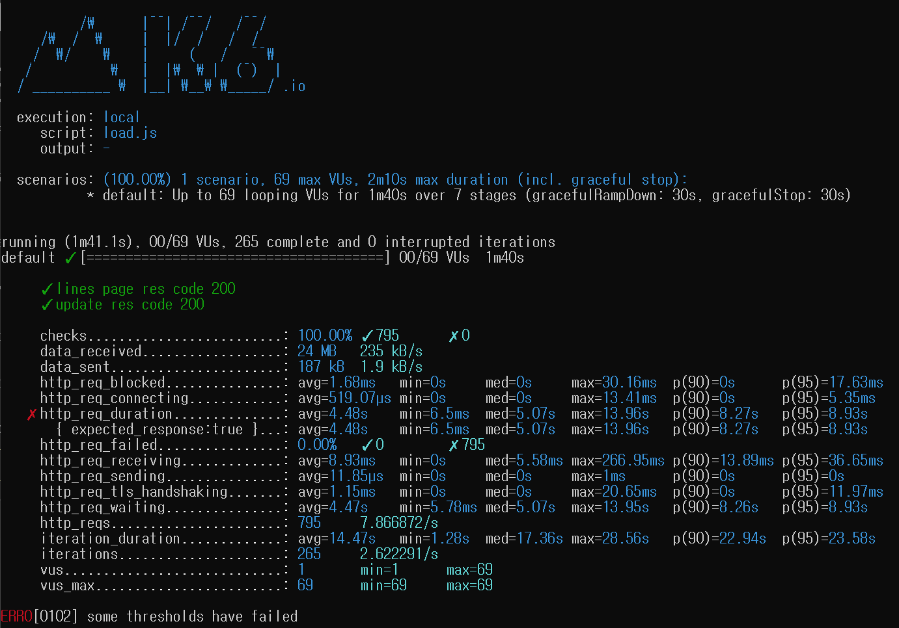
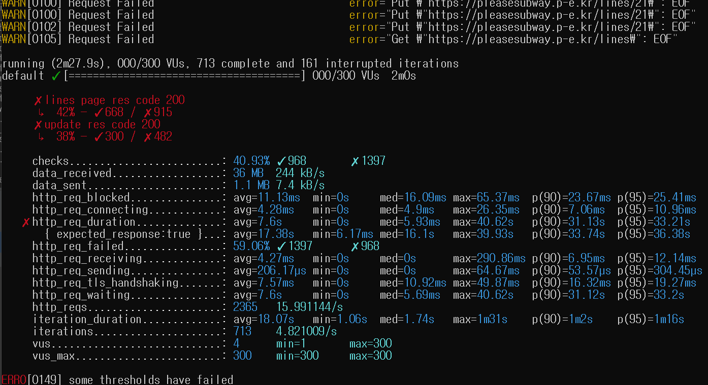
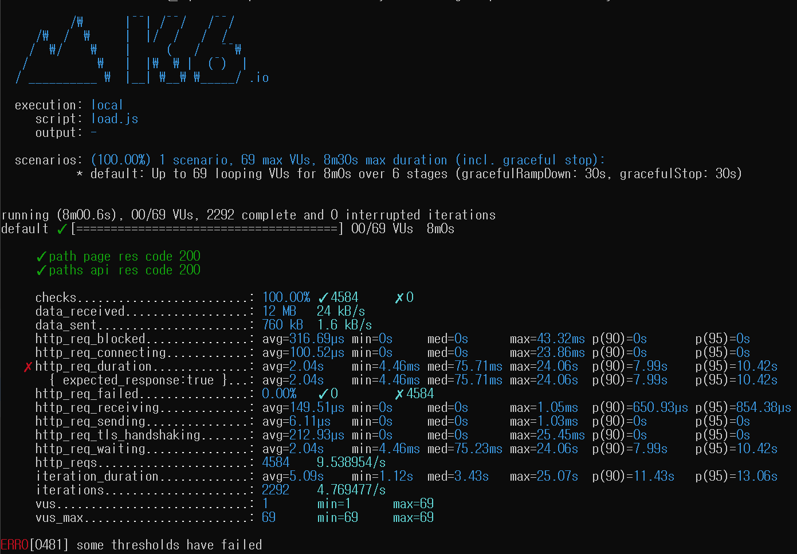
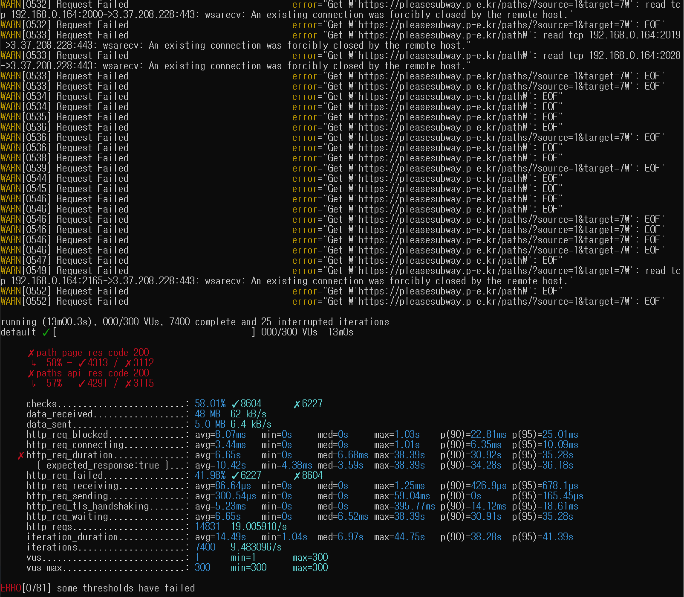

<p align="center">
    
</p>
<p align="center">
  
  
  <a href="https://edu.nextstep.camp/c/R89PYi5H" alt="nextstep atdd">
    
  </a>
  
</p>

<br>

# 인프라공방 샘플 서비스 - 지하철 노선도

<br>

## 🚀 Getting Started

### Install
#### npm 설치
```
cd frontend
npm install
```
> `frontend` 디렉토리에서 수행해야 합니다.

### Usage
#### webpack server 구동
```
npm run dev
```
#### application 구동
```
./gradlew clean build
```
<br>


### 1단계 - 성능 테스트
1. 웹 성능예산은 어느정도가 적당하다고 생각하시나요
   
   <br>
   (네이버 지하철 녹양 -> 신도림 길찾기)
   <br><br>
   
   <br>
   (Running map 경로검색 페이지)
```
FCP: 0.5초 이하
네이버 수준을 목표
```

2. 웹 성능예산을 바탕으로 현재 지하철 노선도 서비스는 어떤 부분을 개선하면 좋을까요
```
불필요한 파일 다운로드 제거, 캐싱 설정, gzip 압축
```

3. 부하테스트 전제조건은 어느정도로 설정하셨나요
```
DAU: 3,000,000 (1,000,000 * 3)
평균 rps: 34.6
최대 rps: 346
```

- 접속 빈도가 높은 페이지(https://pleasesubway.p-e.kr)
    - T: 0.1 (1 * 0.1)
    - 평균 VU: 3.45 (34.6 * 0.1 / 1)
    - 최대 VU: 34.5 (346 * 0.1 / 1)

- 데이터를 갱신하는 페이지(https://pleasesubway.p-e.kr/lines)
    - T: 0.6 (3 * 0.2)
    - 평균 VU: 6.92 (34.6 * 0.6 / 3)
    - 최대 VU: 69.2 (346 * 0.6 / 3)

- 데이터를 조회하는데 여러 데이터를 참조하는 페이지 (https://pleasesubway.p-e.kr/path)
    - T: 0.4 (2 * 0.2)
    - 평균 VU: 6.92 (34.6 * 0.4 / 2)
    - 최대 VU: 69.2 (346 * 0.4 / 2)

4. Smoke, Load, Stress 테스트 스크립트와 결과를 공유해주세요
  - 접속 빈도가 높은 페이지(https://pleasesubway.p-e.kr)
    - [Smoke](./k6/main/smoke.js)
      
    - [Load](./k6/main/load.js)
      
    - [Stress](./k6/main/stress.js)
      
  - 데이터를 갱신하는 페이지(https://pleasesubway.p-e.kr/lines)
    - [Smoke](./k6/lines/smoke.js)
      
    - [Load](./k6/lines/load.js)
      
    - [Stress](./k6/lines/stress.js)
      
  - 데이터를 조회하는데 여러 데이터를 참조하는 페이지 (https://pleasesubway.p-e.kr/path)
    - [Smoke](./k6/path/smoke.js)
      
    - [Load](./k6/path/load.js)
      
    - [Stress](./k6/path/stress.js)
      

---

### 2단계 - 화면 응답 개선하기
1. 성능 개선 결과를 공유해주세요 (Smoke, Load, Stress 테스트 결과)

2. 어떤 부분을 개선해보셨나요? 과정을 설명해주세요

---

### [추가] 로깅, 모니터링
1. 각 서버내 로깅 경로를 알려주세요

2. Cloudwatch 대시보드 URL을 알려주세요
