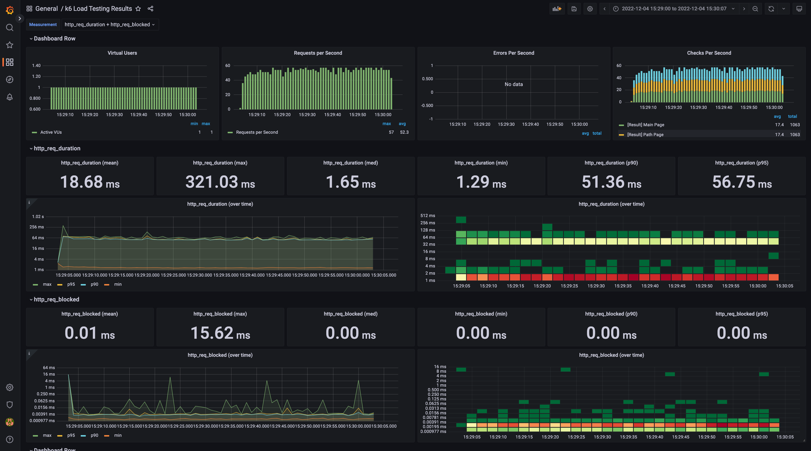
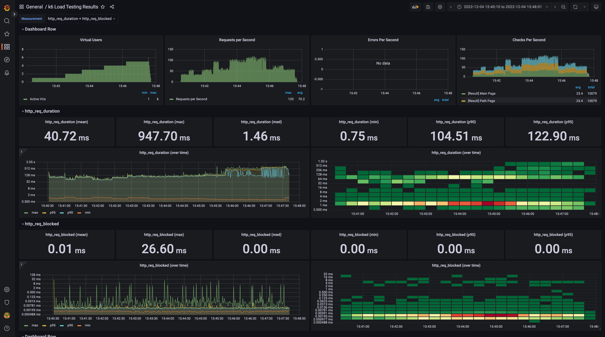
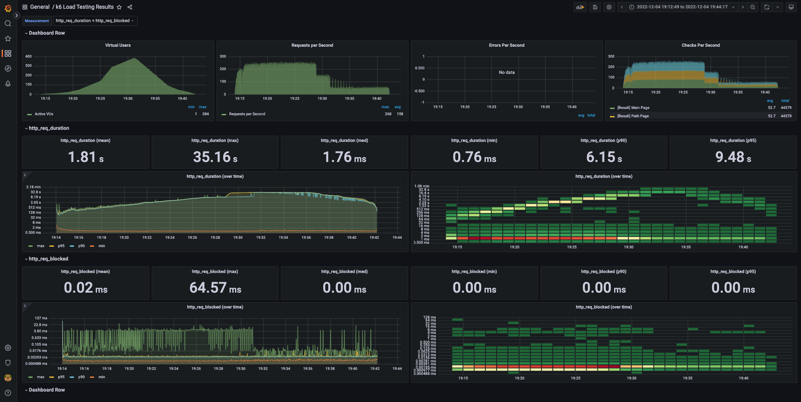
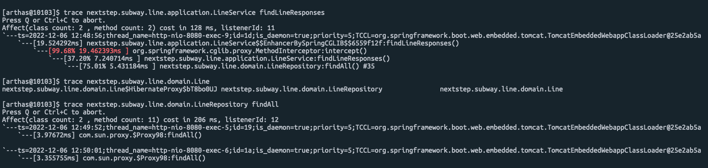
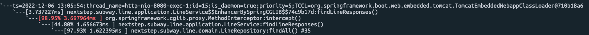

<p align="center">
    
</p>
<p align="center">
  
  
  <a href="https://edu.nextstep.camp/c/R89PYi5H" alt="nextstep atdd">
    
  </a>
  
</p>

<br>

# 인프라공방 샘플 서비스 - 지하철 노선도

<br>

## 🚀 Getting Started

### Install
#### npm 설치
```
cd frontend
npm install
```
> `frontend` 디렉토리에서 수행해야 합니다.

### Usage
#### webpack server 구동
```
npm run dev
```
#### application 구동
```
./gradlew clean build
```
<br>

### 1단계 - 웹 성능 테스트

- Running Map : https://ilmare-cbk-subway.kro.kr/

#### 경쟁사 성능 비교분석 (Mobile)

| 측정항목 | Running Map | 서울교통공사 | 네이버지도 | 카카오맵  |
|------|-------------|--------|-------|-------|
| FCP  | 15.1s       | 6.3s   | 2.2s  | 1.7s  |
| TTI  | 15.6s       | 8.3s   | 6.1s  | 5.2s  |
| SI   | 15.1s       | 9.5s   | 6.2s  | 7.7s  |
| TBT  | 460ms       | 680ms  | 290ms | 120ms |
| LCP  | 15.6s       | 6.6s   | 7.4s  | 5.5s  |
| CLS  | 0.042       | 0      | 0.03  | 0.005 |

#### 경쟁사 성능 비교분석 (Desktop)

| 측정항목 | Running Map | 서울교통공사 | 네이버지도 | 카카오맵  |
|------|-------------|--------|-------|-------|
| FCP  | 2.7s        | 1.5s   | 0.5s  | 0.5s  |
| TTI  | 2.8s        | 2.1s   | 0.5s  | 0.7s  |
| SI   | 2.7s        | 2.8s   | 2.4s  | 2.6s  |
| TBT  | 50ms        | 320ms  | 0ms   | 0ms   |
| LCP  | 2.8s        | 2.2s   | 1.4s  | 1.1s  |
| CLS  | 0.004       | 0.001  | 0.006 | 0.039 |

1. 웹 성능예산은 어느정도가 적당하다고 생각하시나요

- `CLS`는 성능 분석결과(Mobile, Desktop) 90~100점 (100점 기준) 사이의 결과값을 갖기 때문에 웹 성능예상 항목에서는 제외 했습니다.
- 사용자는 응답시간이 20% 이상일 때(유사 제품군과의 비교 시) 차이를 느끼므로 가장 빠른 경쟁사의 응답결과보다 20% 이상 차이나는 항목에 대해서 웹 성능예산 항목을 선정하였습니다.
- 3개의 경쟁사 중 `서울교통공사`가 전체적으로 가장 낮은 성능을 보여주고 있음으로 이를 제외한 `네이버지도`, `카카오맵` 두 결과값의 평균을 웹 성능예산으로 산정하였습니다.

#### CASE : Mobile

|       | FCP   | TTI   | SI    | TBT   | LCP   |
|-------|-------|-------|-------|-------|-------|
| AS-IS | 15.1s | 15.6s | 15.1s | 460ms | 15.6s |
| TO-BE | 1.95s | 5.65s | 6.95s | 205ms | 6.45s |

#### CASE : Desktop

|       | FCP  | TTI  | SI   | TBT  | LCP   |
|-------|------|------|------|------|-------|
| AS-IS | 2.7s | 2.8s | 2.7s | 50ms | 2.8s  |
| TO-BE | 0.5s | 0.6s | 2.5s | 0ms  | 1.25s |

2. 웹 성능예산을 바탕으로 현재 지하철 노선도 서비스의 서버 목표 응답시간 가설을 세워보세요.

- 텍스트 압축 사용
    - /js/vendors.js (전송크기: 2125kb -> 가능한 절감효과: 1716.5kb)
    - /js/main.js (전송크기: 172kb -> 가능한 절감효과: 143.6kb)
- 사용하지 않는 자바스크립트 줄이기
    - /js/vendors.js (전송크기: 2125kb -> 가능한 절감효과: 637.3kb)
    - /js/main.js (전송크기: 172kb -> 가능한 절감효과: 61.8kb)
- 효율적인 캐시 정책을 사용하여 정적인 애셋 제공하기
    - /js/vendors.js
    - /js/main.js
    - /images/main_logo.png
    - /images/logo_small.png
- 이미지 요소에 명시적인 너비 및 높이를 설정하여 레이아웃 변경 횟수를 줄이고 누적 레이아웃 변경을 개선

---

### 2단계 - 부하 테스트
```text
grafana url http://43.200.74.11:3000/ (자신의 공인 IP에 대해서만 3000 포트가 오픈된 상태)
계정 : 
- id : admin
- pw : admin1234
```
1. 부하테스트 전제조건은 어느정도로 설정하셨나요
2. Smoke, Load, Stress 테스트 스크립트와 결과를 공유해주세요

#### 대상 시스템 범위

- web server(nginx)
- web application server (tomcat)
- db (mysql)

#### 목표값 설정

- (참고) https://blog.naver.com/rkwkrhspm/222515422896
- 예상 1일 사용자 수 (DAU)
  - 경쟁사 (21년도 8월 기준, 간단하게 MAU/30일로 DAU 계산)
    - 네이버지도 MAU : 1,392만 -> 1,392만 / 30일 = 46.4만 (DAU)
    - 카카오맵 MAU : 729만 -> 729만 / 30일 = 24.3만 (DAU)
  - `예상 DAU = 10만명`
    - 네이버지도, 카카오맵 예상 DAU의 평균값에서 1/3 수준으로 가정
- 피크 시간대의 예상 집중률
  - 피크 시간대 : 07:00 ~ 10:00, 17:00 ~ 20:00 (출/퇴근 시간대로 가정)
  - 피크 시간대 집중률 = `2로 가정` (최대 트래픽 / 평소 트래픽)
    - (참고) https://insfiler.com/detail/rt_subway_time-0003
- 1명당 1일 평균 접속 혹은 요청수를 예상
  - 1명당 1일 평균 요청수 : `12번`
    - 메인 페이지 -> 로그인 페이지 -> 로그인 -> 로그인 사용자 조회 -> 경로검색 페이지 -> 경로검색 기능
    - 6번 요청 * 출/퇴근 2회 = `12번`
- Throughput : 1일 평균 rps ~ 1일 최대 rps
  - 1일 총 접속 수 = 100,000 * 12 = `1,200,000` (1일 사용자 수(DAU) x 1명당 1일 평균 접속 수)
  - 1일 평균 rps = 1,200,000 / 86,400 = `13.88` (1일 총 접속 수 / 86,400 (초/일))
  - 1일 최대 rps = 13.88 * 2 = `27.76` (1일 평균 rps x (최대 트래픽 / 평소 트래픽))
- VUser 구하기
  - T = (6 * 0.1(s)) + 1(s) = `1.6(s)` = (R * http_req_duration) (+ 1s)
    - T : a value larger than the time needed to complete a VU iteration
    - R : the number of requests per VU iteration
    - 사용자가 한 번 접속했을 때의 요청수를 6으로 설정 (1일 평균 요청수 = 12)
    - 내부망에서 테스트할 경우 예상 latency를 추가한다 (1s)
  - VUser(1일 평균 rps 기준) = (13.88 * 1.6) / 3 = `7(명)` = (목표 rps * T) / R

#### 부하 테스트 시 저장될 데이터 건수 및 크기

- 현재 구성된 데이터 건수
  - 지하철 노선 : 23개
  - 지하철 역 : 616개
  - 지하철 구간 : 340개
- 부하 테스트 시 메인페이지 및 경로 조회에 대해서 테스트를 진행할 예정이기 때문에 새롭게 저장될 데이터 건수 및 크기는 없음

#### 시나리오

- 메인 페이지 -> 로그인 페이지 -> 로그인 -> 로그인 사용자 조회 -> 경로검색 페이지 -> 경로검색

#### Smoke 테스트

<details>
<summary>smoke.js</summary>

```javascript
import http from 'k6/http';
import {check, group, sleep, fail} from 'k6';

export let options = {
  vus: 1, // 1 user looping for 1 minute
  duration: '60s',

  thresholds: {
    http_req_duration: ['p(99)<1500'], // 99% of requests must complete below 1.5s
  },
};

const BASE_URL = 'https://ilmare-cbk-subway.kro.kr';
const USERNAME = 'ilmare-cbk@runningmap.com';
const PASSWORD = '1234';

function mainPage() {
  let response = http.get(`${BASE_URL}`);
  check(response, {'[Result] Main Page': (response) => response.status === 200});
}

function loginPage() {
  let response = http.get(`${BASE_URL}/login`);
  check(response, {'[Result] Login Page': (response) => response.status === 200});
}

function login() {
  const payload = JSON.stringify({
    email: USERNAME,
    password: PASSWORD
  });

  const params = {
    headers: {'Content-Type': 'application/json'}
  };

  let response = http.post(`${BASE_URL}/login/token`, payload, params);
  check(response, {'[Result] Login': (response) => response.status === 200});

  return response.json('accessToken');
}

function me(accessToken) {
  let authHeaders = {
    headers: {
      Authorization: `Bearer ${accessToken}`
    }
  };

  let response = http.get(`${BASE_URL}/members/me`, authHeaders).json();
  check(response, {'[Result] me': (response) => response.id != 0});
}

function pathPage() {
  let response = http.get(`${BASE_URL}/path`);
  check(response, {'[Result] Path Page': (response) => response.status === 200});
}

function searchPath(accessToken) {
  let authHeaders = {
    headers: {
      Authorization: `Bearer ${accessToken}`
    }
  };

  let response = http.get(`${BASE_URL}/paths/?source=1&target=178`, authHeaders);
  check(response, {'[Result] Search Path': (response) => response.status === 200});
}

export default function () {
  mainPage();
  loginPage();
  const accessToken = login();
  me(accessToken);
  pathPage();
  searchPath(accessToken);
}
```

</details>

<details>
<summary>smoke 스크립트 실행 결과</summary>

```text

          /\      |‾‾| /‾‾/   /‾‾/
     /\  /  \     |  |/  /   /  /
    /  \/    \    |     (   /   ‾‾\
   /          \   |  |\  \ |  (‾)  |
  / __________ \  |__| \__\ \_____/ .io

  execution: local
     script: smoke.js
     output: InfluxDBv1 (http://localhost:8086)

  scenarios: (100.00%) 1 scenario, 1 max VUs, 1m30s max duration (incl. graceful stop):
           * default: 1 looping VUs for 1m0s (gracefulStop: 30s)


running (1m00.1s), 0/1 VUs, 502 complete and 0 interrupted iterations
default ✓ [======================================] 1 VUs  1m0s

     ✓ [Result] Main Page
     ✓ [Result] Login Page
     ✓ [Result] Login
     ✓ [Result] me
     ✓ [Result] Path Page
     ✓ [Result] Search Path

     checks.........................: 100.00% ✓ 3012     ✗ 0
     data_received..................: 3.7 MB  62 kB/s
     data_sent......................: 624 kB  10 kB/s
     http_req_blocked...............: avg=11.98µs  min=1.18µs   med=2.32µs   max=13.82ms  p(90)=3.48µs   p(95)=4.25µs
     http_req_connecting............: avg=951ns    min=0s       med=0s       max=938.6µs  p(90)=0s       p(95)=0s
   ✓ http_req_duration..............: avg=19.79ms  min=887.92µs med=4.03ms   max=534.68ms p(90)=85.41ms  p(95)=104.58ms
       { expected_response:true }...: avg=19.79ms  min=887.92µs med=4.03ms   max=534.68ms p(90)=85.41ms  p(95)=104.58ms
     http_req_failed................: 0.00%   ✓ 0        ✗ 3012
     http_req_receiving.............: avg=63.87µs  min=22.04µs  med=54.16µs  max=4.35ms   p(90)=88.51µs  p(95)=102.86µs
     http_req_sending...............: avg=17.35µs  min=6.2µs    med=12.73µs  max=813.69µs p(90)=25.13µs  p(95)=30.07µs
     http_req_tls_handshaking.......: avg=7.7µs    min=0s       med=0s       max=12.71ms  p(90)=0s       p(95)=0s
     http_req_waiting...............: avg=19.7ms   min=846.43µs med=3.95ms   max=534.58ms p(90)=85.28ms  p(95)=104.49ms
     http_reqs......................: 3012    50.13412/s
     iteration_duration.............: avg=119.66ms min=67.59ms  med=113.65ms max=576.87ms p(90)=156.07ms p(95)=176.29ms
     iterations.....................: 502     8.355687/s
     vus............................: 1       min=1      max=1
     vus_max........................: 1       min=1      max=1
```

</details>

<details>
<summary>smoke grafana 결과</summary>



</details>

#### Load 테스트

<details>
<summary>load.js</summary>

```javascript
import http from 'k6/http';
import {check, group, sleep, fail} from 'k6';

export let options = {
  stages: [
    {duration: '1m', target: 1},
    {duration: '2m', target: 2},
    {duration: '2m', target: 4},
    {duration: '2m', target: 7},
    {duration: '2m', target: 9},
    {duration: '4m', target: 11},
    {duration: '6m', target: 14},
    {duration: '4m', target: 11},
    {duration: '2m', target: 9},
    {duration: '2m', target: 7},
    {durtaion: '2m', target: 4},
    {duration: '2m', target: 2},
    {durtaion: '1m', target: 1},
    {duration: '10s', target: 0}, // ramp-down to 0 users
  ],
  thresholds: {
    http_req_duration: ['p(99)<1500'], // 99% of requests must complete below 1.5s
  },
};

const BASE_URL = 'https://ilmare-cbk-subway.kro.kr';
const USERNAME = 'ilmare-cbk@runningmap.com';
const PASSWORD = '1234';

function mainPage() {
  let response = http.get(`${BASE_URL}`);
  check(response, {'[Result] Main Page': (response) => response.status === 200});
}

function loginPage() {
  let response = http.get(`${BASE_URL}/login`);
  check(response, {'[Result] Login Page': (response) => response.status === 200});
}

function login() {
  const payload = JSON.stringify({
    email: USERNAME,
    password: PASSWORD
  });

  const params = {
    headers: {'Content-Type': 'application/json'}
  };

  let response = http.post(`${BASE_URL}/login/token`, payload, params);
  check(response, {'[Result] Login': (response) => response.status === 200});

  return response.json('accessToken');
}

function me(accessToken) {
  let authHeaders = {
    headers: {
      Authorization: `Bearer ${accessToken}`
    }
  };

  let response = http.get(`${BASE_URL}/members/me`, authHeaders).json();
  check(response, {'[Result] me': (response) => response.id != 0});
}

function pathPage() {
  let response = http.get(`${BASE_URL}/path`);
  check(response, {'[Result] Path Page': (response) => response.status === 200});
}

function searchPath(accessToken) {
  let authHeaders = {
    headers: {
      Authorization: `Bearer ${accessToken}`
    }
  };

  let response = http.get(`${BASE_URL}/paths/?source=1&target=178`, authHeaders);
  check(response, {'[Result] Search Path': (response) => response.status === 200});
}

export default function () {
  mainPage();
  loginPage();
  const accessToken = login();
  me(accessToken);
  pathPage();
  searchPath(accessToken);
}
```

</details>

<details>
<summary>load 스크립트 실행 결과</summary>

```text

          /\      |‾‾| /‾‾/   /‾‾/
     /\  /  \     |  |/  /   /  /
    /  \/    \    |     (   /   ‾‾\
   /          \   |  |\  \ |  (‾)  |
  / __________ \  |__| \__\ \_____/ .io

  execution: local
     script: load.js
     output: InfluxDBv1 (http://localhost:8086)

  scenarios: (100.00%) 1 scenario, 14 max VUs, 29m40s max duration (incl. graceful stop):
           * default: Up to 14 looping VUs for 29m10s over 12 stages (gracefulRampDown: 30s, gracefulStop: 30s)


running (29m10.2s), 00/14 VUs, 37082 complete and 0 interrupted iterations
default ✓ [======================================] 00/14 VUs  29m10s

     ✓ [Result] Main Page
     ✓ [Result] Login Page
     ✓ [Result] Login
     ✓ [Result] me
     ✓ [Result] Path Page
     ✓ [Result] Search Path

     checks.........................: 100.00% ✓ 222492     ✗ 0
     data_received..................: 277 MB  158 kB/s
     data_sent......................: 46 MB   26 kB/s
     http_req_blocked...............: avg=8.78µs   min=803ns    med=1.99µs   max=32.76ms p(90)=3.27µs   p(95)=3.91µs
     http_req_connecting............: avg=1.07µs   min=0s       med=0s       max=22.92ms p(90)=0s       p(95)=0s
   ✗ http_req_duration..............: avg=65.52ms  min=723.95µs med=2.64ms   max=5.1s    p(90)=170.61ms p(95)=298.36ms
       { expected_response:true }...: avg=65.52ms  min=723.95µs med=2.64ms   max=5.1s    p(90)=170.61ms p(95)=298.36ms
     http_req_failed................: 0.00%   ✓ 0          ✗ 222492
     http_req_receiving.............: avg=58.66µs  min=13.96µs  med=44.7µs   max=29.76ms p(90)=84.12µs  p(95)=100.26µs
     http_req_sending...............: avg=17.48µs  min=4.7µs    med=11.55µs  max=28.15ms p(90)=24µs     p(95)=28.93µs
     http_req_tls_handshaking.......: avg=4.64µs   min=0s       med=0s       max=31.86ms p(90)=0s       p(95)=0s
     http_req_waiting...............: avg=65.44ms  min=684µs    med=2.58ms   max=5.1s    p(90)=170.53ms p(95)=298.24ms
     http_reqs......................: 222492  127.121754/s
     iteration_duration.............: avg=393.95ms min=59.63ms  med=219.34ms max=5.74s   p(90)=467.89ms p(95)=2.17s
     iterations.....................: 37082   21.186959/s
     vus............................: 1       min=1        max=14
     vus_max........................: 14      min=14       max=14

ERRO[1751] some thresholds have failed
```

</details>

<details>
<summary>load grafana 결과</summary>



- Active VUser가 13에서 14(max)로 넘어가면서 설정했던 http_req_duration(1.5s)를 넘는 것을 확인함

</details>

#### Stress 테스트

<details>
<summary>stress.js</summary>

```javascript
import http from 'k6/http';
import {check, group, sleep, fail} from 'k6';

export let options = {
  stages: [
    {duration: '1m', target: 6},
    {duration: '2m', target: 12},
    {duration: '2m', target: 24},
    {duration: '2m', target: 48},
    {duration: '2m', target: 96},
    {duration: '2m', target: 144},
    {duration: '2m', target: 288},
    {duration: '2m', target: 336},
    {duration: '2m', target: 384},
    {duration: '2m', target: 288},
    {duration: '2m', target: 192},
    {duration: '2m', target: 96},
    {duration: '2m', target: 48},
    {duration: '2m', target: 24},
    {duration: '1m', target: 6},
    {duration: '10s', target: 0}, // ramp-down to 0 users
  ],
  thresholds: {
    http_req_duration: ['p(99)<1500'], // 99% of requests must complete below 1.5s
  },
};

const BASE_URL = 'https://ilmare-cbk-subway.kro.kr';
const USERNAME = 'ilmare-cbk@runningmap.com';
const PASSWORD = '1234';

function mainPage() {
  let response = http.get(`${BASE_URL}`);
  check(response, {'[Result] Main Page': (response) => response.status === 200});
}

function loginPage() {
  let response = http.get(`${BASE_URL}/login`);
  check(response, {'[Result] Login Page': (response) => response.status === 200});
}

function login() {
  const payload = JSON.stringify({
    email: USERNAME,
    password: PASSWORD
  });

  const params = {
    headers: {'Content-Type': 'application/json'}
  };

  let response = http.post(`${BASE_URL}/login/token`, payload, params);
  check(response, {'[Result] Login': (response) => response.status === 200});

  return response.json('accessToken');
}

function me(accessToken) {
  let authHeaders = {
    headers: {
      Authorization: `Bearer ${accessToken}`
    }
  };

  let response = http.get(`${BASE_URL}/members/me`, authHeaders).json();
  check(response, {'[Result] me': (response) => response.id != 0});
}

function pathPage() {
  let response = http.get(`${BASE_URL}/path`);
  check(response, {'[Result] Path Page': (response) => response.status === 200});
}

function searchPath(accessToken) {
  let authHeaders = {
    headers: {
      Authorization: `Bearer ${accessToken}`
    }
  };

  let response = http.get(`${BASE_URL}/paths/?source=1&target=178`, authHeaders);
  check(response, {'[Result] Search Path': (response) => response.status === 200});
}

export default function () {
  mainPage();
  loginPage();
  const accessToken = login();
  me(accessToken);
  pathPage();
  searchPath(accessToken);
}
```

</details>

<details>
<summary>stress 스크립트 실행 결과</summary>

```text

          /\      |‾‾| /‾‾/   /‾‾/
     /\  /  \     |  |/  /   /  /
    /  \/    \    |     (   /   ‾‾\
   /          \   |  |\  \ |  (‾)  |
  / __________ \  |__| \__\ \_____/ .io

  execution: local
     script: stress.js
     output: InfluxDBv1 (http://localhost:8086)

  scenarios: (100.00%) 1 scenario, 384 max VUs, 28m40s max duration (incl. graceful stop):
           * default: Up to 384 looping VUs for 28m10s over 16 stages (gracefulRampDown: 30s, gracefulStop: 30s)


running (28m10.1s), 000/384 VUs, 44047 complete and 33 interrupted iterations
default ✓ [======================================] 000/384 VUs  28m10s

     ✓ [Result] Main Page
     ✓ [Result] Login Page
     ✗ [Result] Login
      ↳  99% — ✓ 44074 / ✗ 6
     ✓ [Result] me
     ✓ [Result] Path Page
     ✗ [Result] Search Path
      ↳  99% — ✓ 44038 / ✗ 9

     checks.........................: 99.99% ✓ 264424     ✗ 15
     data_received..................: 330 MB 195 kB/s
     data_sent......................: 55 MB  33 kB/s
     http_req_blocked...............: avg=14.75µs  min=923ns    med=2.06µs  max=50.38ms p(90)=3.37µs  p(95)=4.02µs
     http_req_connecting............: avg=1.51µs   min=0s       med=0s      max=14.78ms p(90)=0s      p(95)=0s
   ✗ http_req_duration..............: avg=912.86ms min=709.84µs med=4.27ms  max=32.18s  p(90)=2.46s   p(95)=3.74s
       { expected_response:true }...: avg=910.6ms  min=709.84µs med=4.27ms  max=32.18s  p(90)=2.46s   p(95)=3.74s
     http_req_failed................: 0.00%  ✓ 23         ✗ 264416
     http_req_receiving.............: avg=58.86µs  min=13.81µs  med=46.47µs max=17.47ms p(90)=87.67µs p(95)=105.56µs
     http_req_sending...............: avg=17.83µs  min=4.8µs    med=12.37µs max=20.79ms p(90)=25.09µs p(95)=32µs
     http_req_tls_handshaking.......: avg=9.85µs   min=0s       med=0s      max=28.24ms p(90)=0s      p(95)=0s
     http_req_waiting...............: avg=912.78ms min=677.02µs med=4.18ms  max=32.18s  p(90)=2.46s   p(95)=3.74s
     http_reqs......................: 264439 156.464657/s
     iteration_duration.............: avg=5.45s    min=56.68ms  med=2.27s   max=1m13s   p(90)=10.37s  p(95)=24.86s
     iterations.....................: 44047  26.06196/s
     vus............................: 1      min=1        max=384
     vus_max........................: 384    min=384      max=384

ERRO[1691] some thresholds have failed
```

</details>

<details>
<summary>stress grafana 결과</summary>



- Active VUser 144 ~ 287에서 http_req_blocked max 값이 떨어지지 않고 있음.
- 이 부분에서 http request failed 를 추정해볼 수 있음.

</details>

---

### 3단계 - 로깅, 모니터링

<details>
<summary>애플리케이션 진단하기 실습을 진행해보고 문제가 되는 코드를 수정</summary>




- ec2 애플리케이션 서버에서 arthas 실행
  - `trace nextstep.subway.line.application.LineService findLineResponses` 통해 응답이 느린 부분 찾기

</details>

1. 각 서버내 로깅 경로를 알려주세요

- application log
  - file log : /home/ubuntu/nextstep/infra-subway-monitoring/log/file.log
  - json log : /home/ubuntu/nextstep/infra-subway-monitoring/log/json.log
  - console log : /home/ubuntu/nextstep/log.app.log
- nginx log
  - access log : /home/ubuntu/nextstep/log/nginx/access.log
  - error log : /home/ubuntu/nextstep/log/nginx/error.log

```shell
docker run -d -p 80:80 -p 443:443 --name proxy -v /home/ubuntu/nextstep/log/nginx:/var/log/nginx nextstep/reverse-proxy
```

2. Cloudwatch 대시보드 URL을 알려주세요

- https://ap-northeast-2.console.aws.amazon.com/cloudwatch/home?region=ap-northeast-2#dashboards:name=ilmare-cbk-dashboard
