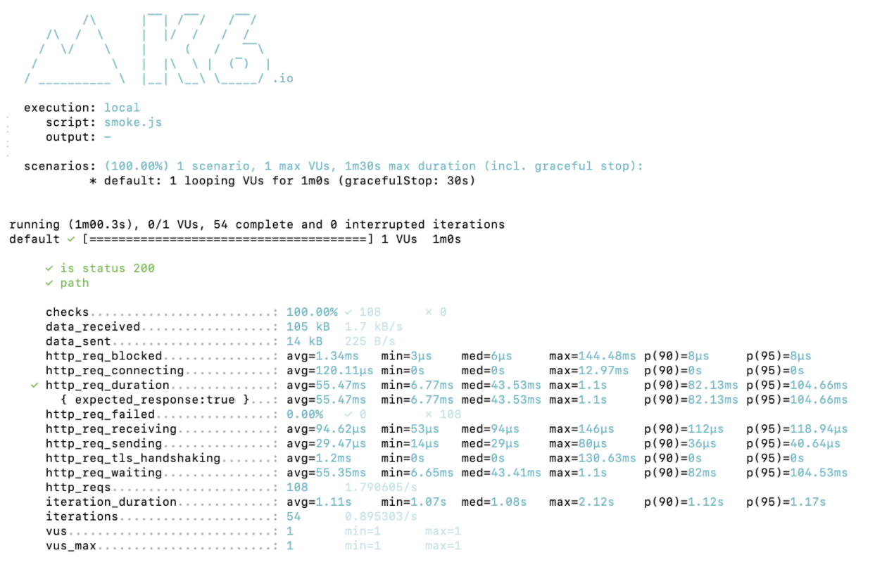
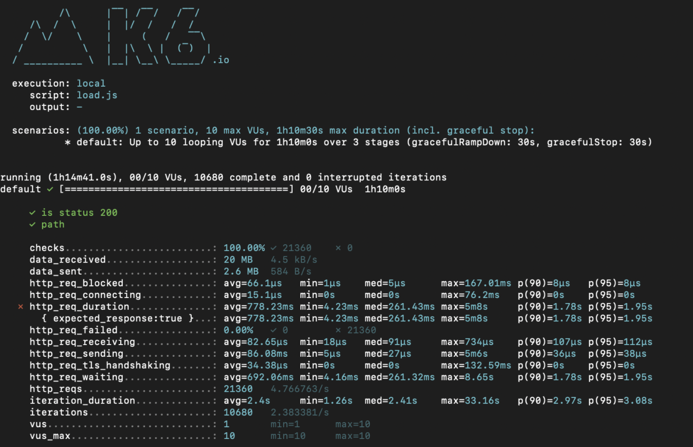
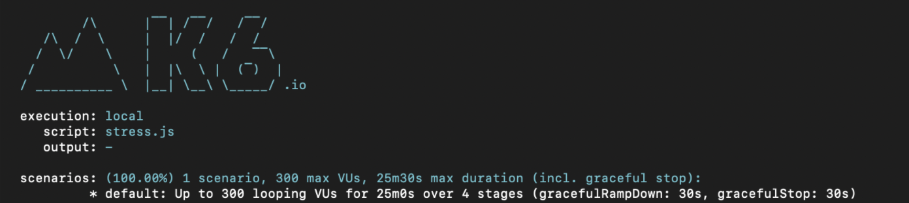
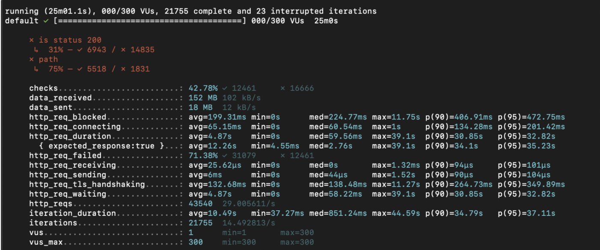

<p align="center">
    
</p>
<p align="center">
  
  
  <a href="https://edu.nextstep.camp/c/R89PYi5H" alt="nextstep atdd">
    
  </a>
  
</p>

<br>

# 인프라공방 샘플 서비스 - 지하철 노선도

<br>

## 🚀 Getting Started

### Install
#### npm 설치
```
cd frontend
npm install
```
> `frontend` 디렉토리에서 수행해야 합니다.

### Usage
#### webpack server 구동
```
npm run dev
```
#### application 구동
```
./gradlew clean build
```
<br>


### 1단계 - 성능 테스트
1. 웹 성능예산은 어느정도가 적당하다고 생각하시나요

&nbsp;&nbsp;&nbsp;<경쟁사 비교 후 웹 성능 개선 예산 짜기>

- Webpagetest (MOBILE chrome 4G Virginia, USA)

|  | guswnt.p-e.kr | map.kakao.com | map.naver.com |
| --- | --- | --- | --- |
| First Byte Time | 1809 ms | 3709 ms | 2753 ms |
| Keep-Alive Enabled | 100% | 88% | 100% |
| Compress Transfer | 22% | 94% | 100% |
| compress Image | 100% | 100% | 100% |
| Cache Static Content | 67% | 44% | 77% |

- pagespeed (mobile)

|  | guswnt.p-e.kr | map.kakao.com  | map.naver.com  |
| --- | --- | --- | --- |
| First Contentful Paint | 14.9s | 2.5s | 3.0 |
| Time to Interactive | 15.5s | 5.3s | 6.4 |
| Speed Index | 14.9s | 7.0s | 7.2 |
| Total Blocking Time | 600ms | 120ms | 250 |
| Largest Contentful Paint | 15.5s | 5.9s | 6.6 |
| Cumulative Layout Shift | 0.041 | 0.005 | 0.017 |

- desktop

|  | guswnt.p-e.kr | map.kakao.com  | map.naver.com  |
| --- | --- | --- | --- |
| First Contentful Paint | 2.7 | 0.6 초 | 0.6 초 |
| Time to Interactive | 2.8 초 | 2.7 초 | 3.3 초 |
| Speed Index | 2.7 | 2.4 초 | 2.8 초 |
| Total Blocking Time | 50 밀리초 | 800 밀리초 | 190 밀리초 |
| Largest Contentful Paint | 2.8 초 | 0.6 초 | 5.1 초 |
| Cumulative Layout Shift | 0.004 | 0.018 | 0 |

- First Contentful Paint 0.8초 이내로 줄이기
- mobile에서 Time to interactive 8초 이내로 줄이기
- Lighthouse 성능 감사에서 80점 이상 목표 (현재는 46점)
  <br/><br/><br/>

3. 웹 성능예산을 바탕으로 현재 지하철 노선도 서비스는 어떤 부분을 개선하면 좋을까요
- gzip
- image caching
- http2 적용
  <br/><br/><br/>
4. 부하테스트 전제조건은 어느정도로 설정하셨나요

   지하철 이용자 수 통계 https://www.bigdata-map.kr/datastory/traffic/seoul 를 참고하여 진행했습니다.  
   => 하루에 약 4백 4십만명이 지하철 탑승 → 이 중 20프로가 지하철 어플을 이용한다고 가정


- 1일 사용자 수(DAU) x 1명당 1일 평균 접속 수 = 1일 총 접속 수    
  880000 * 2 = 1760000


- 1일 총 접속 수 / 86,400 (초/일) = 1일 평균 rps  
  1760000 / 86400 =20


- 1일 평균 rps x (최대 트래픽 / 평소 트래픽) = 1일 최대 rps  
  20 * 3 = 60
  <br/><br/><br/>

4. Smoke, Load, Stress 테스트 스크립트와 결과를 공유해주세요
- Smoke test
  
  <br/><br/>
- load test
  
  <br/><br/>
- Stress test
  
  
  <br/><br/><br/>
---

### 2단계 - 화면 응답 개선하기
1. 성능 개선 결과를 공유해주세요 (Smoke, Load, Stress 테스트 결과)

2. 어떤 부분을 개선해보셨나요? 과정을 설명해주세요

---

### [추가] 로깅, 모니터링
1. 각 서버내 로깅 경로를 알려주세요

2. Cloudwatch 대시보드 URL을 알려주세요
