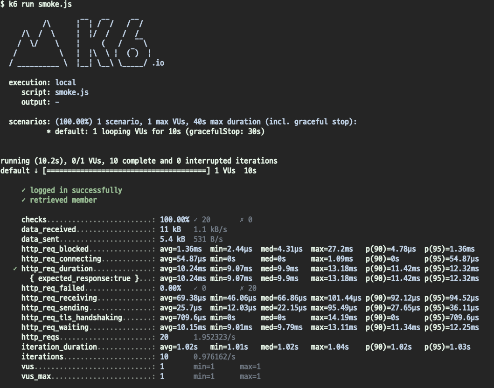
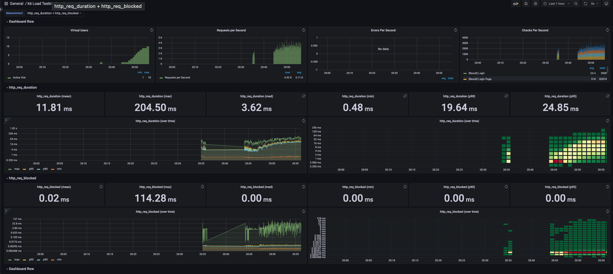
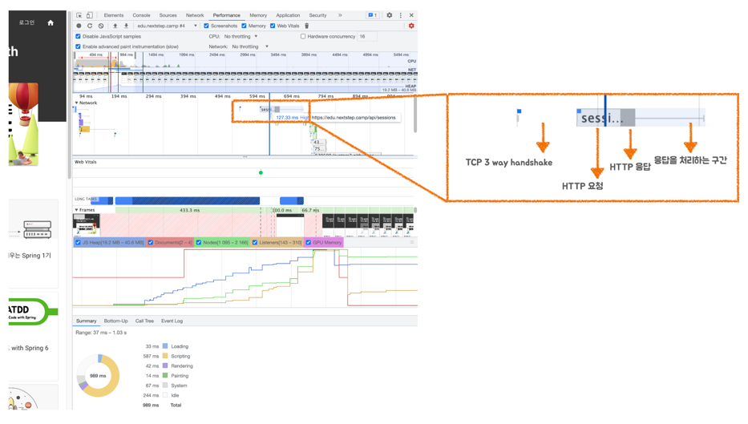
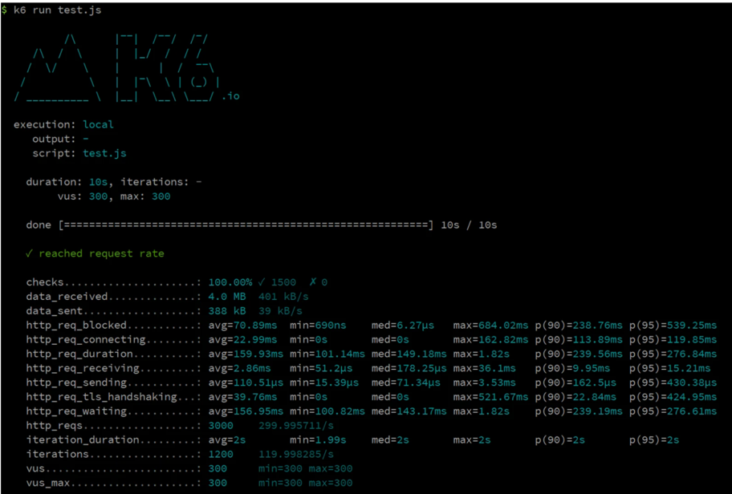
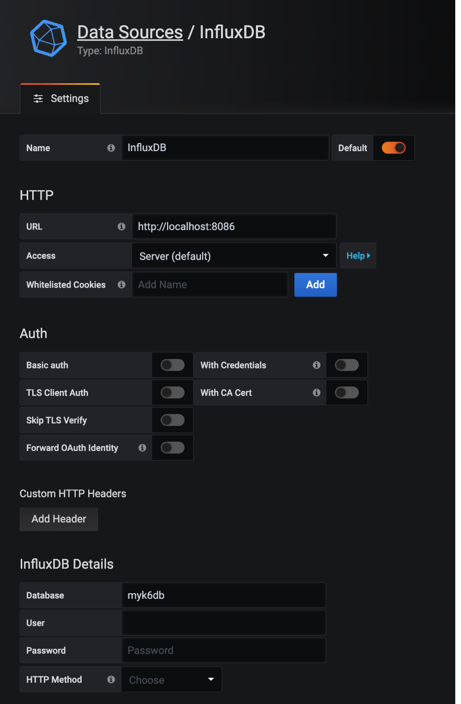
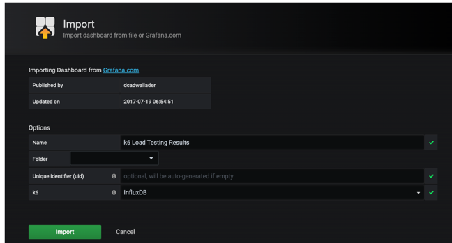
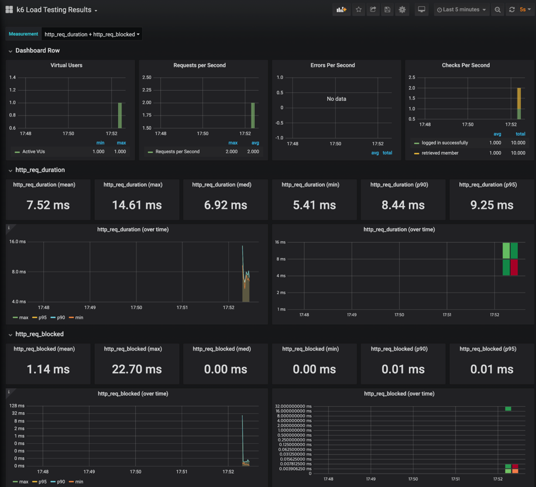
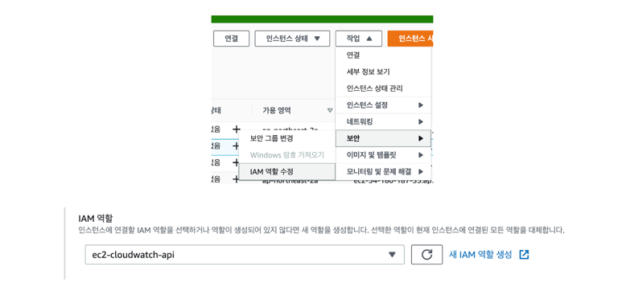
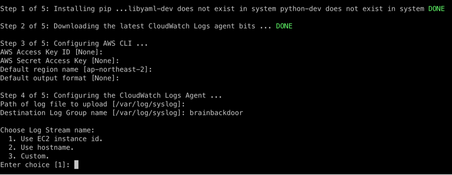
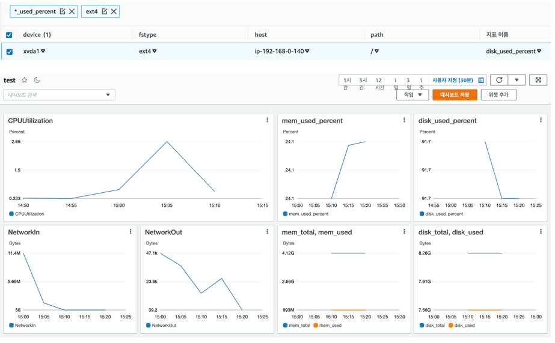

<p align="center">
    
</p>
<p align="center">
  
  
  <a href="https://edu.nextstep.camp/c/R89PYi5H" alt="nextstep atdd">
    
  </a>
  
</p>

<br>

# 인프라공방 샘플 서비스 - 지하철 노선도

<br>

## 🚀 Getting Started

### Install
#### npm 설치
```
cd frontend
npm install
```
> `frontend` 디렉토리에서 수행해야 합니다.

### Usage
#### webpack server 구동
```
npm run dev
```
#### application 구동
```
./gradlew clean build
```
<br>


### 1단계 - 웹 성능 테스트

- Running Map : https://yeojiin-subway.o-r.kr/

#### 경쟁사 성능 비교분석 (Mobile)

| 측정항목 | Running Map | 서울교통공사 | 네이버지도 | 카카오맵  |
|------|-------------|--------|-------|-------|
| FCP  | 8.540s      | 6.3s   | 2.2s  | 1.7s  |
| TTI  | 9.1s        | 8.3s   | 6.1s  | 5.2s  |
| SI   | 8.617s      | 9.5s   | 6.2s  | 7.7s  |
| TBT  | 8679ms      | 680ms  | 290ms | 120ms |
| LCP  | 8.679s      | 6.6s   | 7.4s  | 5.5s  |
| CLS  | 0.058       | 0      | 0.03  | 0.005 |

#### 경쟁사 성능 비교분석 (Desktop)

| 측정항목 | Running Map | 서울교통공사 | 네이버지도 | 카카오맵  |
|------|-------------|--------|-------|-------|
| FCP  | 5.935s      | 3.895s | 2.6s  | 1.7s  |
| TTI  | 6.2s        | 8.8s   | 6.1s  | 6.9s  |
| SI   | 5.9s        | 4.625s | 2.4s  | 4.4s  |
| TBT  | 60ms        | 1129ms | 0ms   | 0ms   |
| LCP  | 6.1s        | 5.824s | 6.9s  | 3.45s |
| CLS  | 0.004       | 0.001  | 0.006 | 0.04  |


1. 웹 성능예산은 어느정도가 적당하다고 생각하시나요
- `CLS`는 성능 분석결과(Mobile, Desktop) 90~100점 사이의 결과값이 나와 웹 성능 개선 대상에서는 제외했습니다. 
- TBT는 각각의 수치 편차가 크지 않을 경우 값이 작아져 성능과 큰 연관이 없다고 판단해 제외했습니다.
- 사용자는 비교 경쟁사와 20% 이상이 차이 날 경우 성능차이를 느끼기 때문에 이를 기준으로 개선 대상 항목을 정했습니다.
- 경장사 중 성능이 전테적으로 낮은 `서울교통공사`보다 높게, `네이버지도`와 `카카오맵`의 평군과 대비하여 20%로 목표를 설정합니다.
- 메인 페이지 진입 시 3초 안에 로딩을 목표로 한다 -> 사용자는 3초안에 로딩되지 않으면 떠난다

2. 웹 성능예산을 바탕으로 현재 지하철 노선도 서비스의 서버 목표 응답시간 가설을 세워보세요.
* 대상:  메인 페이지 기준
* 예상 방법: 텍스트 압축 사용
  - /js/vendors.js (전송크기: 2125kb -> 가능한 절감효과: 1716.5kb)
  - /js/main.js (전송크기: 172kb -> 가능한 절감효과: 143.6kb)
* 따라서 gzip 압축, 사용하지 않는 자바스크립트를 줄여 개선할 수 있을 것 같습니다.

---

### 2단계 - 부하 테스트 
1. 부하테스트 전제조건은 어느정도로 설정하셨나요
2. Smoke, Load, Stress 테스트 스크립트와 결과를 공유해주세요

```
grafana url: http://3.39.233.62:3000/ (자신의 공인 IP에 대해서만 3000 포트가 오픈된 상태)
계정 : 
- id : admin
- pw : admin1234
```

#### 대상 시스템 범위
- web server(nginx)
- web application server (tomcat)
- db (mysql)

#### 목표값 설정
- **예상 DAU: 10만명** -> 경쟁사 평균의 1/3 수준으로 설정
- DAU(예상 1일 사용자 수: MAU/30일)
  - 경쟁사 분석
    - 네이버지도 
      - MAU : 1,392만
      - DAU: 약 46.4만 
    - 카카오맵 
      - MAU : 729만 
      - DAU:  약 24.3만
      
- 사용률이 많은 시간의 예상 집중률
  - 사용률이 많은 시간대 : 07:00 ~ 9:00, 18:00 ~ 20:00
  - 피크 시간대 집중률: `2로 가정` (최대 트래픽 / 평소 트래픽)

- 1명당 1일 평균 접속 혹은 요청수를 예상
  - 1명당 1일 평균 요청수 : `6번`
    - 메인 페이지 접속 -> 경로검색 페이지 접속 -> 경로검색 기능
    - (메인 페이지 접속 횟수(1번) + 경로검색 페이지 접속 횟수(1번) + 경로검색(1번)) * 사용률이 많은 시간대(2번) = `6번`

- Throughput : 1일 평균 rps ~ 1일 최대 rps
  - 1일 총 접속 수 = 100,000 * 6 = `600,000` (1일 사용자 수(DAU) x 1명당 1일 평균 접속 수)
  - 1일 평균 rps = 600,000 / 86,400 = `6.94` (1일 총 접속 수 / 86,400 (초/일))
  - 1일 최대 rps = 6.94 * 2 = `13.88` (1일 평균 rps x (최대 트래픽 / 평소 트래픽))

- VUser 구하기
  - T = (3 * 0.1(s)) + 1(s) = `1.3(s)` = (R * http_req_duration) (+ 1s)
    - T : a value larger than the time needed to complete a VU iteration
    - R : the number of requests per VU iteration
    - 사용자가 한 번 접속했을 때의 요청수를 3으로 설정 (1일 평균 요청수 = 6)
    - 내부망에서 테스트할 경우 예상 latency를 추가한다 (1s)
  - VUser(1일 평균 rps 기준) = (6.94 * 1.3) / 3 = `3(명)` = (목표 rps * T) / R


#### 부하 테스트 시 저장될 데이터 건수 및 크기
- 현재 구성된 데이터 건수
  - 지하철 노선 : 23개
  - 지하철 역 : 616개
  - 지하철 구간 : 340개
- 부하 테스트 시 메인페이지 및 경로 조회에 대해서 테스트를 진행할 예정이기 때문에 새롭게 저장될 데이터 건수 및 크기는 없음

#### 시나리오
- 메인 페이지 접속 -> 경로 검색 페이지 접속 -> 겅로 검색 

#### Smoke Test
<details>
<summary> smoke.js </summary>

```javascript
import http from 'k6/http';
import {check, group, sleep, fail} from 'k6';

export let options = {
  vus: 1, // 1 user looping for 1 minute
  duration: '60s',

  thresholds: {
    http_req_duration: ['p(99)<1500'], // 99% of requests must complete below 1.5s
  },
};

const BASE_URL = 'https://yeojiin-subway.o-r.kr/';
const USERNAME = 'jylim@nextstep.com';
const PASSWORD = '1234';

function mainPage() {
  let response = http.get(`${BASE_URL}`);
  check(response, {'[Result] Main Page': (response) => response.status === 200});
}

function loginPage() {
  let response = http.get(`${BASE_URL}/login`);
  check(response, {'[Result] Login Page': (response) => response.status === 200});
}

function login() {
  const payload = JSON.stringify({
    email: USERNAME,
    password: PASSWORD
  });

  const params = {
    headers: {'Content-Type': 'application/json'}
  };

  let response = http.post(`${BASE_URL}/login/token`, payload, params);
  check(response, {'[Result] Login': (response) => response.status === 200});

  return response.json('accessToken');
}

function me(accessToken) {
  let authHeaders = {
    headers: {
      Authorization: `Bearer ${accessToken}`
    }
  };

  let response = http.get(`${BASE_URL}/members/me`, authHeaders).json();
  check(response, {'[Result] me': (response) => response.id != 0});
}

function pathPage() {
  let response = http.get(`${BASE_URL}/path`);
  check(response, {'[Result] Path Page': (response) => response.status === 200});
}

function searchPath(accessToken) {
  let authHeaders = {
    headers: {
      Authorization: `Bearer ${accessToken}`
    }
  };

  let response = http.get(`${BASE_URL}/paths/?source=1&target=178`, authHeaders);
  check(response, {'[Result] Search Path': (response) => response.status === 200});
}

export default function () {
  mainPage();
  loginPage();
  const accessToken = login();
  me(accessToken);
  pathPage();
  searchPath(accessToken);
}
```

</details>


<details>
<summary> smoke 테스트 결과 </summary>

```

          /\      |‾‾| /‾‾/   /‾‾/
     /\  /  \     |  |/  /   /  /
    /  \/    \    |     (   /   ‾‾\
   /          \   |  |\  \ |  (‾)  |
  / __________ \  |__| \__\ \_____/ .io

  execution: local
     script: smoke.js
     output: InfluxDBv1 (http://localhost:8086)

  scenarios: (100.00%) 1 scenario, 1 max VUs, 1m30s max duration (incl. graceful stop):
           * default: 1 looping VUs for 1m0s (gracefulStop: 30s)


running (1m00.0s), 0/1 VUs, 3900 complete and 0 interrupted iterations
default ✓ [======================================] 1 VUs  1m0s

     ✓ [Result] Main Page
     ✓ [Result] Login Page
     ✓ [Result] Login
     ✓ [Result] me
     ✓ [Result] Path Page
     ✗ [Result] Search Path
      ↳  0% — ✓ 0 / ✗ 3900

     checks.........................: 83.33% ✓ 19500      ✗ 3900
     data_received..................: 19 MB  316 kB/s
     data_sent......................: 4.7 MB 78 kB/s
     http_req_blocked...............: avg=6.89µs  min=1.5µs    med=2.61µs  max=29.22ms  p(90)=3.57µs  p(95)=4.18µs
     http_req_connecting............: avg=231ns   min=0s       med=0s      max=330.12µs p(90)=0s      p(95)=0s
   ✓ http_req_duration..............: avg=2.42ms  min=529µs    med=1.88ms  max=55.54ms  p(90)=4.5ms   p(95)=6.23ms
       { expected_response:true }...: avg=2ms     min=529µs    med=1.1ms   max=47.52ms  p(90)=3.45ms  p(95)=5.25ms
     http_req_failed................: 16.66% ✓ 3900       ✗ 19500
     http_req_receiving.............: avg=55.7µs  min=25.28µs  med=47.37µs max=29.33ms  p(90)=69.81µs p(95)=77.51µs
     http_req_sending...............: avg=15.11µs min=6.39µs   med=12.42µs max=8.27ms   p(90)=18.61µs p(95)=23.01µs
     http_req_tls_handshaking.......: avg=3µs     min=0s       med=0s      max=12.62ms  p(90)=0s      p(95)=0s
     http_req_waiting...............: avg=2.35ms  min=486.83µs med=1.82ms  max=55.45ms  p(90)=4.41ms  p(95)=6.13ms
     http_reqs......................: 23400  389.846775/s
     iteration_duration.............: avg=15.37ms min=8.26ms   med=12.43ms max=109.12ms p(90)=23.9ms  p(95)=30.79ms
     iterations.....................: 3900   64.974463/s
     vus............................: 1      min=1        max=1
     vus_max........................: 1      min=1        max=1

```


</details>


#### Load Test
<details>
<summary> load.js </summary>

```javascript
import http from 'k6/http';
import {check, group, sleep, fail} from 'k6';

export let options = {
  stages: [
    {duration: '1m', target: 1},
    {duration: '2m', target: 3},
    {duration: '4m', target: 6},
    {durtaion: '2m', target: 3},
    {durtaion: '1m', target: 1},
    {duration: '10s', target: 0}, // ramp-down to 0 users
  ],
  thresholds: {
    http_req_duration: ['p(99)<1500'], // 99% of requests must complete below 1.5s
  },
};

const BASE_URL = 'https://yeojiin-subway.o-r.kr/';

export function mainPage() {
  let response = http.get(`${BASE_URL}`);
  check(response, {'[Result] Main Page': (response) => response.status === 200});
}

export function pathPage() {
  let response = http.get(`${BASE_URL}/path`);
  check(response, {'[Result] Path Page': (response) => response.status === 200});
}

export function searchPath() {
  let response = http.get(`${BASE_URL}/paths/?source=1&target=178`);
  check(response, {'[Result] Search Path': (response) => response.status === 200});
}

export default function () {
  mainPage();
  pathPage();
  searchPath();
}
```
</details>


<details>
<summary> load 테스트 결과 </summary>

```
          /\      |‾‾| /‾‾/   /‾‾/
     /\  /  \     |  |/  /   /  /
    /  \/    \    |     (   /   ‾‾\
   /          \   |  |\  \ |  (‾)  |
  / __________ \  |__| \__\ \_____/ .io

  execution: local
     script: load.js
     output: InfluxDBv1 (http://localhost:8086)

  scenarios: (100.00%) 1 scenario, 6 max VUs, 7m40s max duration (incl. graceful stop):
           * default: Up to 6 looping VUs for 7m10s over 4 stages (gracefulRampDown: 30s, gracefulStop: 30s)

running (7m10.2s), 0/6 VUs, 1402 complete and 0 interrupted iterations
default ✓ [======================================] 0/6 VUs  7m10s

     ✓ [Result] Main Page
     ✓ [Result] Path Page
     ✓ [Result] Search Path

     checks.........................: 100.00% ✓ 4206     ✗ 0
     data_received..................: 7.7 MB  18 kB/s
     data_sent......................: 536 kB  1.2 kB/s
     http_req_blocked...............: avg=19.31µs  min=1.64µs   med=3.2µs    max=27.17ms p(90)=4.52µs   p(95)=5.12µs
     http_req_connecting............: avg=1.15µs   min=0s       med=0s       max=2.73ms  p(90)=0s       p(95)=0s
   ✗ http_req_duration..............: avg=293.95ms min=618.81µs med=1.33ms   max=1.99s   p(90)=1.23s    p(95)=1.39s
       { expected_response:true }...: avg=293.95ms min=618.81µs med=1.33ms   max=1.99s   p(90)=1.23s    p(95)=1.39s
     http_req_failed................: 0.00%   ✓ 0        ✗ 4206
     http_req_receiving.............: avg=96.04µs  min=32.5µs   med=73.52µs  max=7.17ms  p(90)=135.75µs p(95)=214.49µs
     http_req_sending...............: avg=19.08µs  min=7.01µs   med=14.29µs  max=6.14ms  p(90)=21.48µs  p(95)=27.35µs
     http_req_tls_handshaking.......: avg=10.28µs  min=0s       med=0s       max=23.71ms p(90)=0s       p(95)=0s
     http_req_waiting...............: avg=293.84ms min=542.2µs  med=1.24ms   max=1.99s   p(90)=1.23s    p(95)=1.39s
     http_reqs......................: 4206    9.776913/s
     iteration_duration.............: avg=882.44ms min=278.81ms med=859.64ms max=2.01s   p(90)=1.45s    p(95)=1.54s
     iterations.....................: 1402    3.258971/s
     vus............................: 1       min=1      max=6
     vus_max........................: 6       min=6      max=6

```


</details>


#### Stress Test
<details>
<summary> stress.js </summary>

```javascript
import http from 'k6/http';
import {check, group, sleep, fail} from 'k6';

export let options = {
  stages: [
    {duration: '1m', target: 6},
    {duration: '2m', target: 12},
    {duration: '2m', target: 24},
    {duration: '2m', target: 48},
    {duration: '2m', target: 96},
    {duration: '2m', target: 144},
    {duration: '2m', target: 288},
    {duration: '2m', target: 336},
    {duration: '2m', target: 384},
    {duration: '2m', target: 288},
    {duration: '2m', target: 192},
    {duration: '2m', target: 96},
    {duration: '2m', target: 48},
    {duration: '2m', target: 24},
    {duration: '1m', target: 6},
    {duration: '10s', target: 0}, // ramp-down to 0 users
  ],
  thresholds: {
    http_req_duration: ['p(99)<1500'], // 99% of requests must complete below 1.5s
  },
};

const BASE_URL = 'https://yeojiin-subway.o-r.kr/';

export function mainPage() {
  let response = http.get(`${BASE_URL}`);
  check(response, {'[Result] Main Page': (response) => response.status === 200});
}

export function pathPage() {
  let response = http.get(`${BASE_URL}/path`);
  check(response, {'[Result] Path Page': (response) => response.status === 200});
}

export function searchPath() {
  let response = http.get(`${BASE_URL}/paths/?source=1&target=178`);
  check(response, {'[Result] Search Path': (response) => response.status === 200});
}

export default function () {
  mainPage();
  pathPage();
  searchPath();
}
```
</details>


<details>
<summary> stress 테스트 결과 </summary>

```

          /\      |‾‾| /‾‾/   /‾‾/
     /\  /  \     |  |/  /   /  /
    /  \/    \    |     (   /   ‾‾\
   /          \   |  |\  \ |  (‾)  |
  / __________ \  |__| \__\ \_____/ .io

  execution: local
     script: stress.js
     output: InfluxDBv1 (http://localhost:8086)

  scenarios: (100.00%) 1 scenario, 384 max VUs, 28m40s max duration (incl. graceful stop):
           * default: Up to 384 looping VUs for 28m10s over 16 stages (gracefulRampDown: 30s, gracefulStop: 30s)
           
running (28m10.5s), 000/384 VUs, 76781 complete and 35 interrupted iterations
default ✓ [======================================] 000/384 VUs  28m10s

     ✗ [Result] Main Page
      ↳  13% — ✓ 10324 / ✗ 66492
     ✗ [Result] Path Page
      ↳  13% — ✓ 10474 / ✗ 66342
     ✗ [Result] Search Path
      ↳  9% — ✓ 7028 / ✗ 69753

     checks.........................: 12.07% ✓ 27826      ✗ 202587
     data_received..................: 145 MB 86 kB/s
     data_sent......................: 66 MB  39 kB/s
     http_req_blocked...............: avg=17.88ms  min=0s       med=0s      max=1.56s    p(90)=3.17ms   p(95)=142.56ms
     http_req_connecting............: avg=54.14ms  min=0s       med=41.8ms  max=668.93ms p(90)=123.42ms p(95)=154.62ms
   ✗ http_req_duration..............: avg=874.62ms min=0s       med=0s      max=43.86s   p(90)=13.35ms  p(95)=1.21s
       { expected_response:true }...: avg=3.24s    min=589.52µs med=15.81ms max=43.86s   p(90)=5.68s    p(95)=32.62s
     http_req_failed................: 87.92% ✓ 202587     ✗ 27826
     http_req_receiving.............: avg=632.49µs min=0s       med=0s      max=477.36ms p(90)=54.15µs  p(95)=79.76µs
     http_req_sending...............: avg=1.12ms   min=0s       med=0s      max=825.78ms p(90)=16.83µs  p(95)=235.65µs
     http_req_tls_handshaking.......: avg=13.19ms  min=0s       med=0s      max=1.43s    p(90)=0s       p(95)=101.03ms
     http_req_waiting...............: avg=872.87ms min=0s       med=0s      max=43.86s   p(90)=1.76ms   p(95)=1.19s
     http_reqs......................: 230413 136.296296/s
     iteration_duration.............: avg=3.14s    min=2.7ms    med=575.8ms max=48.04s   p(90)=3.14s    p(95)=32.16s
     iterations.....................: 76781  45.418296/s
     vus............................: 1      min=1        max=384
     vus_max........................: 384    min=384      max=384
```

[img.png](image/stress.png)

- Active VUser 144 ~ 287(6번째)에서 http_req_blocked max 값이 떨어지지 않고 있음.
- 이 부분에서 http request failed 를 추정해볼 수 있음.
</details>


---

### 3단계 - 로깅, 모니터링
1. 각 서버내 로깅 경로를 알려주세요

2. Cloudwatch 대시보드 URL을 알려주세요


---

### 🚀 1단계 - 웹 성능 테스트
<details>
<summary> </summary>

#### 요구사항
* 저장소를 활용하여 아래 요구사항을 해결합니다.
* README 에 있는 질문에 답을 추가한 후 PR을 보내고 리뷰요청을 합니다.

* [x] 웹 성능 예산 작성 후 서버 목표 응답시간 도출
  * 가설을 세우는 단계이므로, 정답은 없습니다. 주어진 정보를 바탕으로 나름의 논리만 세우면 됩니다. 서비스 오픈 등 여러 상황에선 주어진 정보가 제한적이라, 가설을 세우고 테스트하고 운영환경에서 검증해볼 수 밖에 없어요.

#### 힌트
1. 웹 성능 예산 작성하기
   WebPageTest, PageSpeed 등에서 테스트를 진행한 후, 웹 성능 예산을 작성합니다.
* 경쟁사 관련 자료   
  * 아래 자료를 참고하여 웹 성능 예산, 부하테스트 목푯값 등을 설계해보세요.
* 경쟁사   
  * 서울교통공사
  * 네이버지도
  * 카카오맵
* 언론보도
  * 데이터로보는 서울시 대중교통 이용
  * 카카오 모바일 APP 현황
  * 길찾기만 하루 1억건
  * 네이버 지도 MAU

2. 퍼포먼스 탭 활용하기

* 크롬 브라우저 도구를 활용하면, 퍼포먼스 탭에서 각 api별 요청 응답시간을 확인할 수 있어요. 웹 성능 예산에 영향을 주는 api 를 확인해보고, 가설을 세워보세요.

* 정량 기반(Quantity Based Metric) 예시
  * 메인 페이지의 모든 오브젝트 파일 크기는 10mb 미만으로 제한한다
  * 모든 웹 페이지의 각 페이지 내 포함된 자바스크립트 크기는 1mb 미만 이어야 한다.
  * 검색 페이지에는 2mb 미만의 이미지가 포함되어야 합니다.
* 시간 기반(Timing Based Metric) 예시
  * LTE 환경에서의 모바일 기기의 TTI:Time To Interactive는 5초 미만이어야 한다
  * DCL:Dom Content Loaded는 10초, FMP: First Meaningful Paint는 15초 미만이어야 한다
* 규칙 기반(Rule Based Metric) 예시
  * Lighthouse 성능 검사에서 80점 이상이어야 한다.


* FCP(First Contentful Paint) : 가장 첫번째 유의미한 콘텐츠(텍스트 or 이미지)가 표시되는 시간
* LCP(Large Contentful Paint) : 유의미한 콘텐츠(텍스트 or 이미지) 중 가장 큰 콘텐츠가 표시되는 시간
* TTI(Time To Interactive) : 사용자가 사이트와 완전히 상호작용 할 수 있을 때까지 걸리는 시간
* TBT(Total Blocking Time) : 상호작용이 불가능 했을 때의 시간
* CLS(Cumulative Layout Shift) : 표시 영역 안에 보이는 요소의 이동을 측정
* Speed Index : 페이지의 보이는 부분이 표시되는 평균 시간

</details>


---


### 🚀 2단계 - 부하테스트
<details>
<summary> </summary>

#### 요구사항
* [x] 부하 테스트
  * [x] 테스트 전제조건 정리
    * [x] 대상 시스템 범위
    * [x] 목푯값 설정 (latency, throughput, 부하 유지기간)
    * [x] 부하 테스트 시 저장될 데이터 건수 및 크기
  * [x] 아래 시나리오 중 하나를 선택하여 스크립트 작성
    * [x] 접속 빈도가 높은 페이지
    * [x] 데이터를 갱신하는 페이지
    * [x] 데이터를 조회하는데 여러 데이터를 참조하는 페이지
  * [x] Smoke, Load, Stress 테스트 후 결과를 기록

#### 힌트
부하테스트 소개
* k6 설치
```
  $ sudo apt-key adv --keyserver hkp://keyserver.ubuntu.com:80 --recv-keys C5AD17C747E3415A3642D57D77C6C491D6AC1D69
  $ echo "deb https://dl.k6.io/deb stable main" | sudo tee /etc/apt/sources.list.d/k6.list
  $ sudo apt-get update
  $ sudo apt-get install k6
 ```

* Smoke Test
```
  $ k6 run smoke.js
```

```
  # smoke.js
import http from 'k6/http';
import { check, group, sleep, fail } from 'k6';

export let options = {
  vus: 1, // 1 user looping for 1 minute
  duration: '10s',

  thresholds: {
    http_req_duration: ['p(99)<1500'], // 99% of requests must complete below 1.5s
  },
};

const BASE_URL = '[Target URL]';
const USERNAME = 'test id';
const PASSWORD = 'test password';

export default function ()  {

  var payload = JSON.stringify({
    email: USERNAME,
    password: PASSWORD,
  });

  var params = {
    headers: {
      'Content-Type': 'application/json',
    },
  };


  let loginRes = http.post(`${BASE_URL}/login/token`, payload, params);

  check(loginRes, {
    'logged in successfully': (resp) => resp.json('accessToken') !== '',
  });


  let authHeaders = {
    headers: {
      Authorization: `Bearer ${loginRes.json('accessToken')}`,
    },
  };
  let myObjects = http.get(`${BASE_URL}/members/me`, authHeaders).json();
  check(myObjects, { 'retrieved member': (obj) => obj.id != 0 });
  sleep(1);
};
```

```
xport let options = {
  stages: [
    { duration: '1m', target: 500 }, // simulate ramp-up of traffic from 1 to 100 users over 5 minutes.
    { duration: '2m', target: 500 }, // stay at 100 users for 10 minutes
    { duration: '10s', target: 0 }, // ramp-down to 0 users
  ],
  thresholds: {
    http_req_duration: ['p(99)<1500'], // 99% of requests must complete below 1.5s
    'logged in successfully': ['p(99)<1500'], // 99% of requests must complete below 1.5s
  },
};

```

** 테스트 설정값 구하기**   
**1. 목표 rps 구하기**
   a. 우선 예상 1일 사용자 수(DAU)를 정해봅니다.   
   b. 피크 시간대의 집중률을 예상해봅니다. (최대 트개픽 / 평소 트래픽)  
   c. 1명당 1일 평균 접속 혹은 요청수를 예상해봅니다.   
   d. 이를 바탕으로 Throughput을 계산합니다.   
* Throughput : 1일 평균 rps ~ 1일 최대 rps
  * 1일 사용자 수(DAU) x 1명당 1일 평균 접속 수 = 1일 총 접속 수
  * 1일 총 접속 수 / 86,400 (초/일) = 1일 평균 rps
  * 1일 평균 rps x (최대 트래픽 / 평소 트래픽) = 1일 최대 rps


** 2. VUser 구하기 **
 * Request Rate: measured by the number of requests per second (RPS)
 * VU: the number of virtual users
 * R: the number of requests per VU iteration
 * T: a value larger than the time needed to complete a VU iteration

```
T = (R * http_req_duration) (+ 1s) ; 내부망에서 테스트할 경우 예상 latency를 추가한다

VUser = (목표 rps * T) / R
```
가령, 두개의 요청 (R=2)이 있고, 왕복시간이 0.5s, 지연시간이 1초라고 가정할 때 (T=2), 계산식은 아래와 같다.   
VU = (300 * 2) / 2 = 300

** 3. 테스트 기간**
* 일반적으로 Load Test는 보통 30분 ~ 2시간 사이로 권장합니다. 부하가 주어진 상황에서 DB Failover, 배포 등 여러 상황을 부여하며 서비스의 성능을 확인합니다.

** 4.결과 화면 **



* 대시보드 구성
1. influx db 설치
   * influx db 는 8086 포트를 점유합니다.
```
$ sudo apt install influxdb
```   
2. grafana 설치
* grafana 는 3000 포트를 점유합니다.
* 따라서 보안그룹에서 자신의 IP 에 대해 3000 포트 open 정책을 추가합니다.
* 초기 비밀번호 : admin / admin
```
$ sudo apt install grafana
```

* ubuntu 20.04 인 경우
```
$ wget -q -O - https://packages.grafana.com/gpg.key | sudo apt-key add -
$ echo "deb https://packages.grafana.com/oss/deb stable main" | sudo tee -a /etc/apt/sources.list.d/grafana.list
$ sudo apt update
$ sudo apt install grafana
$ sudo service grafana-server start
```

3. grafana 설정
   configuration > datasource 메뉴에서 datasource 를 추가합니다.

* Dashboards > Import > Grafana.com Dashboard 항목에 2587을 입력하고, datasource 로 influxdb 를 설정한 후 import 합니다.
* https://grafana.com/grafana/dashboards/2587



4. 부하테스트
```
$ k6 run --out influxdb=http://localhost:8086/myk6db smoke.js
```




5. 명령어
- /var, /usr 부분에 로그가 대부분 남아지우는 것 추천
- 부하테스트 이후 로그가 용량을 전부 차지해 `write error in swap file` 등이 발생
```
sudo -s du -sh /var
sudo -s du -sh /usr
```

- /var 경로 정리
```
sudo -s du -h --max-depth=1
```

- 로그 위치로 가서 /home 위치에 백업
```
ex) 
mv debug.log /home/ubuntu/logBackup
```

- 백업 후 하나로 묶인 backup로그들을 나눠주기
```
split -l 300 jenkins.log part_jenkins
```
-> 바로 영역이 비워지지 않고, 실행되고 있는 부분을 종료하고 재시작해야 영역이 제대로 비워짐

참고: https://ipex.tistory.com/entry/CenetOS-cannot-create-temp-file-for-here-document-%EC%9E%A5%EC%B9%98%EC%97%90-%EB%82%A8%EC%9D%80-%EA%B3%B5%EA%B0%84%EC%9D%B4-%EC%97%86%EC%9D%8C-%EC%98%A4%EB%A5%98-%ED%98%84%EC%83%81
</details>

---

### 🚀 3단계 - 로깅, 모니터링
<details>
<summary> </summary>

#### 요구사항
* [ ] 애플리케이션 진단하기 실습을 진행해보고 문제가 되는 코드를 수정
* [ ] 로그 설정하기
* [ ] Cloudwatch로 모니터링

**로그 설정하기**
* [ ] Application Log 파일로 저장하기
  * 회원가입, 로그인 등의 이벤트에 로깅을 설정
  * 경로찾기 등의 이벤트 로그를 JSON으로 수집
* [ ] Nginx Access Log 설정하기

**Cloudwatch로 모니터링**
* [ ] Cloudwatch로 로그 수집하기
* [ ] Cloudwatch로 메트릭 수집하기
* [ ] USE 방법론을 활용하기 용이하도록 대시보드 구성

#### 힌트
#### A. 로깅
**주의점** 
* Avoid side effects
  * logging으로 인해 애플리케이션 기능의 동작에 영향을 미치지 않아야 합니다.
  * 예를 들어 logging하는 시점에 NullPointerException이 발생해 프로그램이 정상적으로 동작하지 않는 상황이 발생하면 안됩니다.
* Be concise and descriptive
  * 각 Logging에는 데이터와 설명이 모두 포함되어야 합니다.
* Log method arguments and return values
  * 메소드의 input과 output을 로그로 남기면 debugger를 사용해 디버깅하지 않아도 됩니다. 특히 debugger를 사용할 수 없는 상황에서는 상당히 유용하게 사용할 수 있습니다.
  * 이를 구현하려면 메소드 앞 부분과 뒷 부분에 지저분한 중복 코드가 계속해서 발생하는 상황이 발생하는데 이는 AOP를 통해 해결할 수 있습니다.
* Delete personal information
  * 로그에 사용자의 전화번호, 계좌번호, 패스워드, 주소, 전화번호와 같은 개인정보를 남기지 않습니다.

**logging level**   
Logging Level을 적절하게 나눠 구현하는 것이 신경쓰면서 개발해야 합니다.
* `ERROR` : 예상하지 못한 심각한 문제가 발생하여 즉시 조사해야 함
* `WARN`: 로직상 유효성 확인, 예상 가능한 문제로 인한 예외처리 등을 남김, 서비스는 운영될 수 있지만, 주의해야 함
* `INFO`: 운영에 참고할만한 사항으로, 중요한 비즈니스 프로세스가 완료됨
* `DEBUG` / `TRACE` : 개발 단계에서만 사용하고 운영 단계에서는 사용하지 않음
* 즉, DEBUG 레벨로 설정하면 DEBUG 레벨보다 높은 로그 레벨의 메시지가 모두(DEBUG, INFO, WARN, ERROR) 출력됩니다. ERROR 레벨로 설정하면 ERROR 레벨의 로그만 출력되는 방식으로 동작합니다.


**B. Application Log**
애플리케이션의 상태를 확인하기 위해서는 로그를 남기는 것이 중요합니다. **무엇을 로그로 남겨야 할지, 로그를 어떻게 관리해야 할지** 고민해보며 학습해보세요.
* https://docs.spring.io/spring-boot/docs/2.2.7.RELEASE/reference/html/spring-boot-features.html#boot-features-logging
* https://logback.qos.ch/documentation.html
* https://meetup.toast.com/posts/149

a. logback.xml을 작성합니다.
* logback의 기본 설정 파일은 logback.xml 입니다. logback 라이브러리는 classpath 아래에 위치하는 logback.xml을 기본으로 찾아봅니다.
```
<configuration debug="false">

    <!--spring boot의 기본 logback base.xml은 그대로 가져간다.-->
    <include resource="org/springframework/boot/logging/logback/base.xml" />
    <include resource="file-appender.xml" />

    <!--    logger name이 file일때 적용할 appender를 등록한다.-->
    <logger name="file" level="INFO" >
        <appender-ref ref="file" />
    </logger>
</configuration>    
```

```
    <property name="home" value="log/" />

    <!--  appender이름이 file인 consoleAppender를 선언  -->
    <appender name="file" class="ch.qos.logback.core.rolling.RollingFileAppender">
        <!--로깅이 기록될 위치-->
        <file>${home}file.log</file>
        <!--로깅 파일이 특정 조건을 넘어가면 다른 파일로 만들어 준다.-->
        <rollingPolicy class="ch.qos.logback.core.rolling.TimeBasedRollingPolicy">
            <fileNamePattern>${home}file-%d{yyyyMMdd}-%i.log</fileNamePattern>
            <timeBasedFileNamingAndTriggeringPolicy class="ch.qos.logback.core.rolling.SizeAndTimeBasedFNATP">
                <maxFileSize>15MB</maxFileSize>
            </timeBasedFileNamingAndTriggeringPolicy>
        </rollingPolicy>
        <!--   해당 로깅의 패턴을 설정   -->
        <encoder>
            <charset>utf8</charset>
            <Pattern>
                %d{yyyy-MM-dd HH:mm:ss.SSS} %thread %-5level %logger - %m%n
            </Pattern>
        </encoder>
    </appender>
```
* logger: 실제 로그 기능을 수행하는 객체로 각 Logger마다 Name을 부여하여 사용합니다.


**b. logback을 이용하여 logging을 찍어봅니다.**
```
    private static final Logger log = LoggerFactory.getLogger(Controller.class); 
    private static final Logger fileLogger = LoggerFactory.getLogger("file");
    
    ...
    log.error("An ERROR Message");
    fileLogger.info("파일 로깅 입니다.");
```

**c. JSON 로그를 사용한 이벤트 로그 수집**
* src/main/resources/logback.xml
```
<encoder class="net.logstash.logback.encoder.LogstashEncoder" >
    <includeContext>true</includeContext>
    <includeCallerData>true</includeCallerData>
    <timestampPattern>yyyy-MM-dd HH:mm:ss.SSS</timestampPattern>
    <fieldNames>
        <timestamp>timestamp</timestamp>
        <thread>thread</thread>
        <message>message</message>
        <stackTrace>exception</stackTrace>
        <mdc>context</mdc>
    </fieldNames>
</encoder>
```

```
dependencies {
    implementation("net.logstash.logback:logstash-logback-encoder:6.1")
}    
```

```
// static import net.logstash.logback.argument.StructuredArguments.kv
        log.info("{}, {}",
            kv("출발지", source.getName()),
            kv("도착지", target.getName())
        );
);
```

**C. Nginx Log**
* volume 옵션을 활용하여 호스트의 경로와 도커의 경로를 마운트합니다.
```
$ docker run -d -p 80:80 -v /var/log/nginx:/var/log/nginx nextstep/reverse-proxy
```

**D. 도커 상태 확인하기(cAdvisor 설치하기)**
```
docker run \
  --volume=/:/rootfs:ro \
  --volume=/var/run:/var/run:ro \
  --volume=/sys:/sys:ro \
  --volume=/var/lib/docker/:/var/lib/docker:ro \
  --volume=/dev/disk/:/dev/disk:ro \
  --publish=8080:8080 \
  --detach=true \
  --name=cadvisor \
  google/cadvisor:latest
```
Docker로 운영하는 경우 cAdvisor를 활용하여 간단한 모니터링이 가능합니다.
* 호스트 리소스 모니터링에 필요한 디렉토리를 볼륨으로 지정
  * 보안을 위해 읽기 전용으로 볼륨 지정
* 포트는 8080으로 오픈

**E. Cloudwatch로 수집하기**
- a. EC2에 IAM role 설정


- b. cloudwatch logs agent를 설치합니다.
```
$ curl https://s3.amazonaws.com/aws-cloudwatch/downloads/latest/awslogs-agent-setup.py -O

$ sudo python ./awslogs-agent-setup.py --region  ap-northeast-2
```

* `Access Key, Secret Key 등을 입력하지 마세요! IAM Role 설정으로 충분합니다.`

- c. 로그 수집
```
$ sudo vi /var/awslogs/etc/awslogs.conf

[/var/log/syslog]
datetime_format = %b %d %H:%M:%S
file = /var/log/syslog
buffer_duration = 5000
log_stream_name = {instance_id}
initial_position = start_of_file
log_group_name = [로그그룹 이름]

[/var/log/nginx/access.log]
datetime_format = %d/%b/%Y:%H:%M:%S %z
file = /var/log/nginx/access.log
buffer_duration = 5000
log_stream_name = access.log
initial_position = end_of_file
log_group_name = [로그그룹 이름]

[/var/log/nginx/error.log]
datetime_format = %Y/%m/%d %H:%M:%S
file = /var/log/nginx/error.log
buffer_duration = 5000
log_stream_name = error.log
initial_position = end_of_file
log_group_name = [로그그룹 이름]
```

```
$ sudo service awslogs restart
```
* `로그그룹 이름은 자신의 github id 로 지정합니다.`


- d. Metric 수집
* EC2 Metric 수집
```
$ wget https://s3.amazonaws.com/amazoncloudwatch-agent/ubuntu/amd64/latest/amazon-cloudwatch-agent.deb
$ sudo dpkg -i -E ./amazon-cloudwatch-agent.deb
```

```
# /opt/aws/amazon-cloudwatch-agent/bin/config.json
{
        "agent": {
                "metrics_collection_interval": 60,
                "run_as_user": "root"
        },
        "metrics": {
                "metrics_collected": {
                        "disk": {
                                "measurement": [
                                        "used_percent",
                                        "used",
                                        "total"
                                ],
                                "metrics_collection_interval": 60,
                                "resources": [
                                        "*"
                                ]
                        },
                        "mem": {
                                "measurement": [
                                        "mem_used_percent",
                                        "mem_total",
                                        "mem_used"
                                ],
                                "metrics_collection_interval": 60
                        }
                }
        }
}
```

```
$ sudo /opt/aws/amazon-cloudwatch-agent/bin/amazon-cloudwatch-agent-ctl -a fetch-config -m ec2 -s -c file:/opt/aws/amazon-cloudwatch-agent/bin/config.json
$ sudo /opt/aws/amazon-cloudwatch-agent/bin/amazon-cloudwatch-agent-ctl -m ec2 -a status
{
  "status": "running",
  "starttime": "2021-03-20T15:12:07+00:00",
  "configstatus": "configured",
  "cwoc_status": "stopped",
  "cwoc_starttime": "",
  "cwoc_configstatus": "not configured",
  "version": "1.247347.5b250583"
}
```
* 위젯 추가 > 유형으로 행 선택 > 원본데이터로 지표 선택 > CPU Utilization, Network In / Out, mem_used_percent, disk_used_percent 등을 추가


* Spring Actuator Metric 수집
```
dependencies {
    implementation("org.springframework.boot:spring-boot-starter-actuator")
    implementation("org.springframework.cloud:spring-cloud-starter-aws:2.2.1.RELEASE")
    implementation("io.micrometer:micrometer-registry-cloudwatch")
}    
```

```
cloud.aws.stack.auto=false  # 로컬에서 실행시 AWS stack autoconfiguration 수행과정에서 발생하는 에러 방지
cloud.aws.region.static=ap-northeast-2
management.metrics.export.cloudwatch.namespace=  # 해당 namespace로 Cloudwatch 메트릭을 조회 가능
management.metrics.export.cloudwatch.batch-size=20
management.endpoints.web.exposure.include=*
```
</details>
