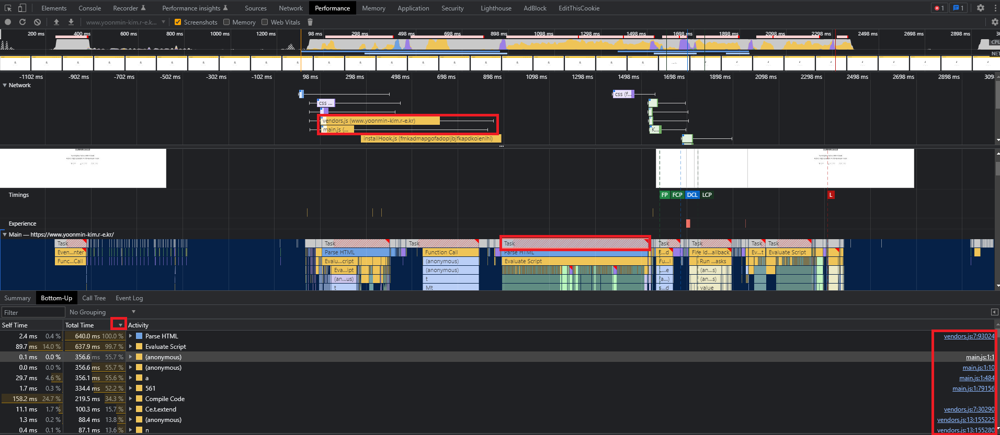
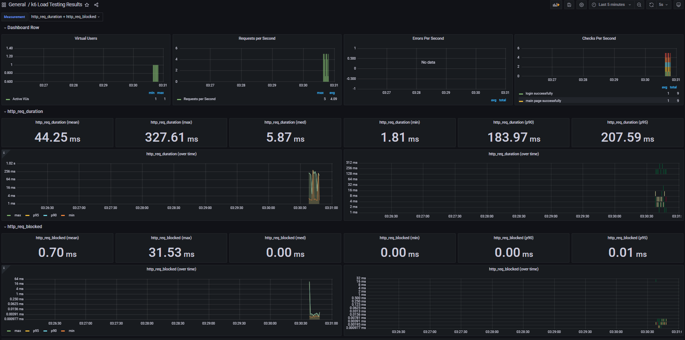
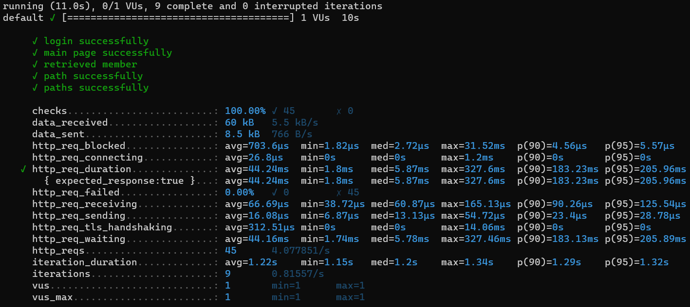
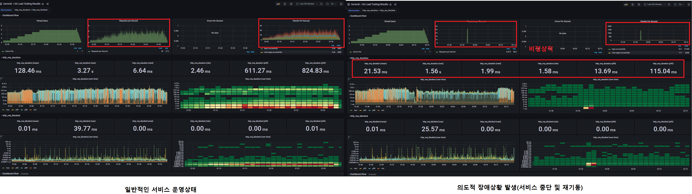
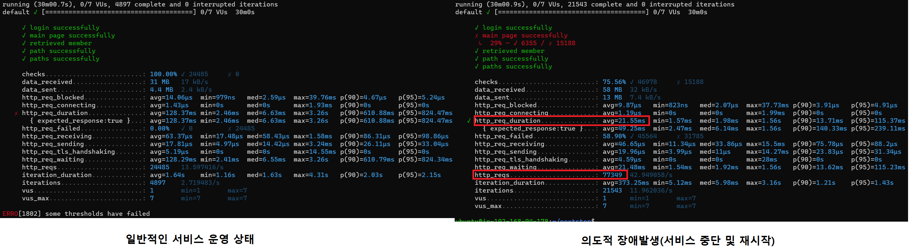
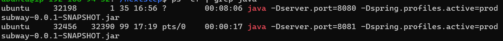
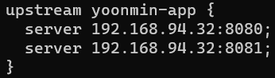
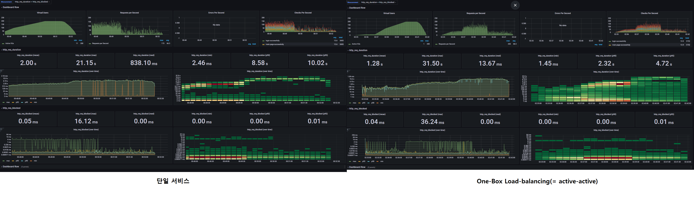
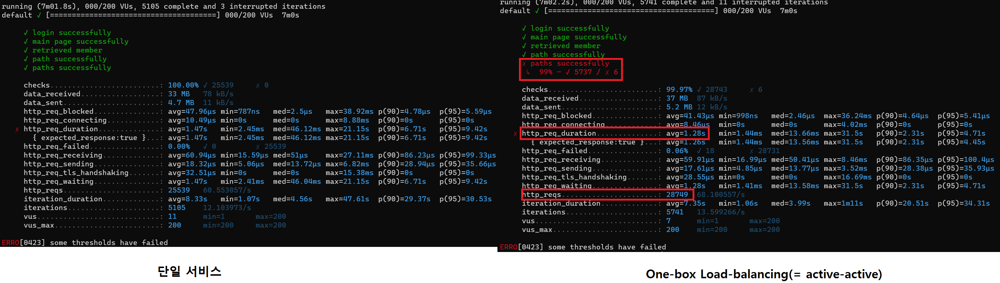

<p align="center">
    
</p>
<p align="center">
  
  
  <a href="https://edu.nextstep.camp/c/R89PYi5H" alt="nextstep atdd">
    
  </a>
  
</p>

<br>

# 인프라공방 샘플 서비스 - 지하철 노선도

<br>

## 🚀 Getting Started

### Install
#### npm 설치
```
cd frontend
npm install
```
> `frontend` 디렉토리에서 수행해야 합니다.

### Usage
#### webpack server 구동
```
npm run dev
```
#### application 구동
```
./gradlew clean build
```
<br>

### 1단계 - 웹 성능 테스트
1. 웹 성능예산은 어느정도가 적당하다고 생각하시나요

- 사용자가 경쟁사 서비스와 비교했을때 성능차이를 느끼지 않을 정도로 잡아야 한다고 생각합니다
- 사용자는 응답시간이 경쟁사 대비 20%이상의 차이를 느낄 경우 성능차이를 느낍니다
- 실제 운영서비스의 자원은 한정적이기 때문에 최소한 경쟁사와 20% 이상의 차이는<br>
  발생하지 않도록 잡아야 한다고 생각합니다

---

2. 웹 성능예산을 바탕으로 현재 지하철 노선도 서비스의 서버 목표 응답시간 가설을 세워보세요.

- `시간기반` 성능기준에 대한 목표설정을 진행하였습니다
- 경쟁사 평균값 대비 `FCP: 10.9 초`, `LCP: 7.9초` 의 차이가 발생했습니다
- 경쟁사 평균값의 +20%의 성능은 `FCP: 4.2 초`, `LCP: 8.5초` 이며
- RUNNINGMAP의 최소한의 목표값은 `FCP: -10.2 초`, `LCP: -6.5 초` 가 됩니다
- RUNNINGMAP 에서 위와 같은 목표를 달성하기 위해서 성능에 영향을 주는 자바스크립트의<br>
  파일 압축과 사용하지 않는 자바스크립트를 제거해야합니다

---

위와 같은 결과를 도출하기 위해 분석 한 내용은 다음과 같습니다

---

A. 예비 분석
- 사용자 트래픽은 메인페이지에 가장 많이 몰립니다
- 지하철 노선도는 데스크톱 보다는 모바일에서 사용량이 훨씬 많습니다
- PageSpeed 에 측정된 모바일 메인페이지 예상 절감치 Top3 지표로는 다음과 같습니다
    - 텍스트 압축 사용 (FCP, LCP)
    - 사용하지 않는 자바스크립트 줄이기(LCP)
    - 랜더링 차단 리소스 제거하기(FCP, LCP)

B. 경쟁사 분석
- 메인페이지
- 경쟁사 평균값 (FCP: 3.5초, LCP: 7.1초)

<table>
<tr>
    <td>(RUNNINGMAP)</td><td>(서울교통공사)</td><td>(네이버지도)</td><td>(카카오맵)</td>
</tr>

<tr>
    <td>
        FCP: 14.4초<br>
        LCP: 15.0초
    </td>
    <td>
        FCP: 6.8초<br>
        LCP: 7.1초
    </td>
    <td>
        FCP: 2.2초<br>
        LCP: 7.5초
    </td>
    <td>
        FCP: 1.7초<br>
        LCP: 6.8초
    </td>
</tr>
</table>

C. 퍼포먼스 확인
- FCP, LCP 성능저하의 주된 요인으로는 `main.js`, `vendors.js` 파일 처리이며
- `.js 파입의 압축`과 `사용하지 않는 자바스크립트를 줄이도록` 해야합니다

(그림1)

(그림2)


---

### 2단계 - 부하 테스트
1. 부하테스트 전제조건은 어느정도로 설정하셨나요

#### 대상 시스템 범위
* nginx(web), spring-boot(was), mysql(db)

#### 목푯값 설정 (latency, throughput, 부하 유지기간)

a. 예상 1일 사용자 수(DAU)
* 네이버지도 34만
* 카카오맵 24만
  * 이미 인기 있는 서비스가 있는만큼 DAU가 비슷할 순 없기 때문에 반절 이하로 예상
  * `RUNNINGMAP 10만`

b. 피크 시간대의 집중률 예상(최대 트래픽 / 평소 트래픽)
* `피크 시간대`인 08-09시, 18-19시 에는 `평소 트래픽의 1.5배`

c. 1명당 1일 평균 접속 혹은 요청수 예상
* 일평균 실행 횟수
  * 다음지도, 길찾기, 지하철, 버스 DaumMaps : 3.4
  * 카카오버스 : 3.5 , 카카오 지하철 : 3
* 하루에 최소 3.3 회의 접속수를 예상
* 5개의 기능 이용
* `16.5 개의 요청수 예상`

d. Throughput 계산
* `1일 총 접속 수` = 10만 x 16.5 = `165만`
* `1일 평균 rps` = 165만 / 86,400 = `19(rps)`
* `1일 최대 rps` = 19 x 2 = `38(rps)`

e. VUser 구하기
* R = 5
* T = (5 * 0.15) (+ 1s) = 1.75
* 1일 평균 기준 : 19 * 1.75 / 5 = `6.65(VUser)`
* 1일 최대 기준 : 38 * 1.75 / 5 = `13.3(VUser)`

#### 부하 테스트 시 저장될 데이터 건수 및 크기
* 노선: 23건
* 역: 616건
* 구간: 340건

2. Smoke, Load, Stress 테스트 스크립트와 결과를 공유해주세요

#### Smoke 테스트




#### Load 테스트
* 왼쪽은 일반적인 운영 상태이고 오른쪽은 의도적으로 장애 상황을 발생시켜 보았습니다
* 장애상황에서는 Request per Second와 Checks per Second가 비정상적으로 텅텅 비어있는것을 알 수 있습니다
* 또한, http_req_duration 값이 비정상적으로 매우 짧은 값을 나타내고 있습니다



* 마찬가지로 콘솔에서도 장애 상황에서는 iterations 이 비약적으로 높아지면서 http_reqs의 값이
정상적인 상황대비 3배 이상 높아진 것을 확인할 수 있었습니다
* 일반적인 운영상태에서 1802에러가 발생한 이유는 thresholds 값을 99퍼센트로 주었기 때문인데요. (너무 가혹한 평가 였나봅니다 ^^;)
* 장애상황에서는 95퍼로 낮춰보았는데 예상대로 some thresholds have failed 가 사라졌습니다 



#### Stress 테스트  
* Stress 테스트는 조금 재미난 방식으로 진행해 보았는데요 
* 일반적으로 다중화를 구성할 경우 각 서비스는 별도의 서버에서 운영합니다<br>
  지금과 같은 테스트 환경에서는 결과가 뻔하기 때문에, 
  * 오히려 하나의 서버에서 서비스를 다중화 구성 할 경우 결과가 어떨지 테스트해 보았습니다(one-box + active-active)

* 다음과 같이 8080, 8081 로 서비스를 띄워 놓은 상태에서 라운드로빈 방식으로 load-balancing 하였습니다




* 대시보드에서 눈에 띄는건 http_req_duration 이였습니다
* max 값은 오히려 높고 전반적인 속도는 향상된 것으로 보입니다



* 콘솔을 보니 좀 더 명확하게 그 이유를 알 수 있었는데요
* 다중화를 구성하다 보니 단순히 WEB-WAS 에서 처리가 가능한 부분에 대해서는 속도가 향상되었지만
* DB 와의 통신이 필요한 구간은 오히려 속도가 저하 된 것으로 확인됩니다
* 이는 전반적인 서비스 처리속도가 향상되었지만 DB의 부하가 증가되면서 발생 된 현상이라고 해석하였습니다
* 또한 하나의 서버에서 리소스를 나눠 사용하는 만큼 부하가 훨씬 커지게 될 경우 오히려 속도 저하가 발생하지
않을까 예상해 보았습니다



---

### 3단계 - 로깅, 모니터링
1. 각 서버내 로깅 경로를 알려주세요
* /home/ubuntu/nextstep/infra-subway-monitoring/log/
  * file.log
  * json.log
* /var/log/nginx/
  * access.log
  * error.log


2. Cloudwatch 대시보드 URL을 알려주세요
* https://ap-northeast-2.console.aws.amazon.com/cloudwatch/home?region=ap-northeast-2#dashboards:name=yoonmin-kim-dashboard
