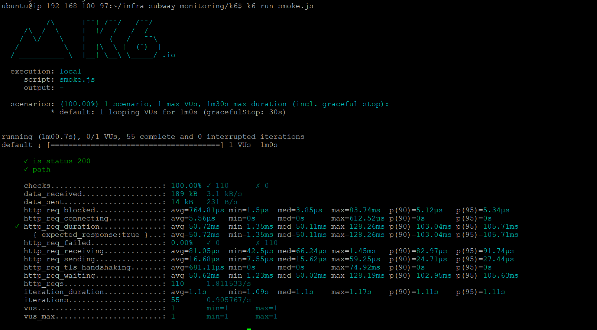
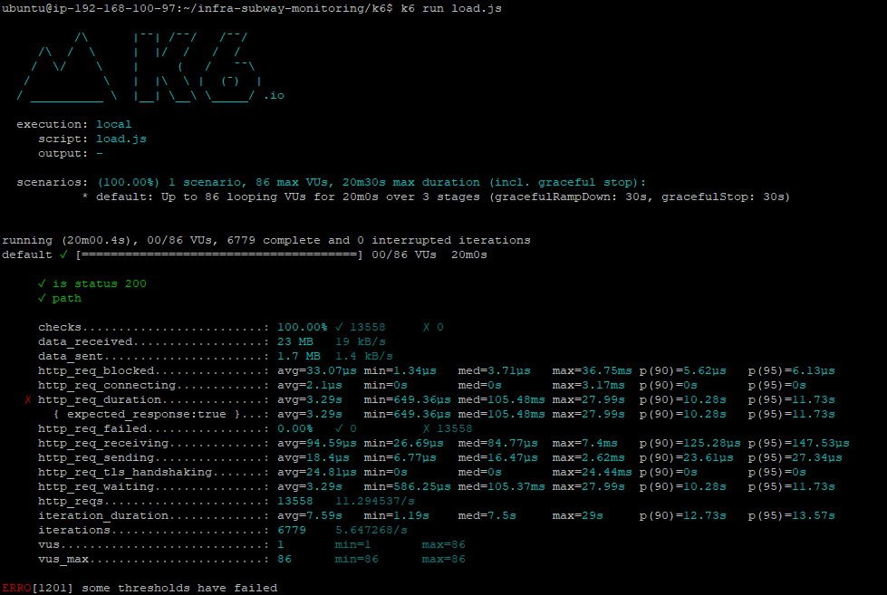
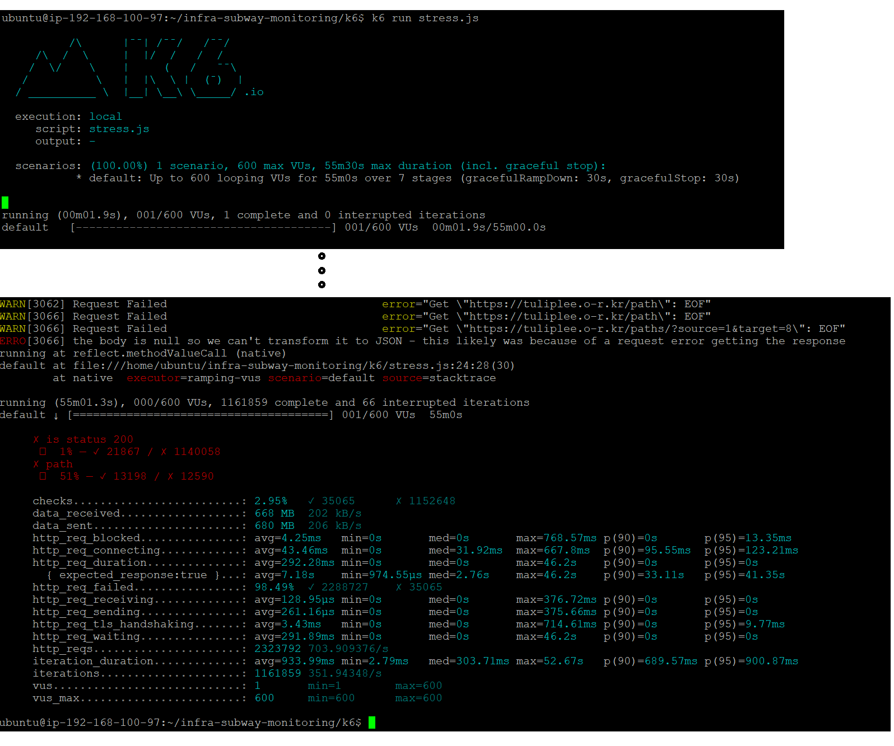
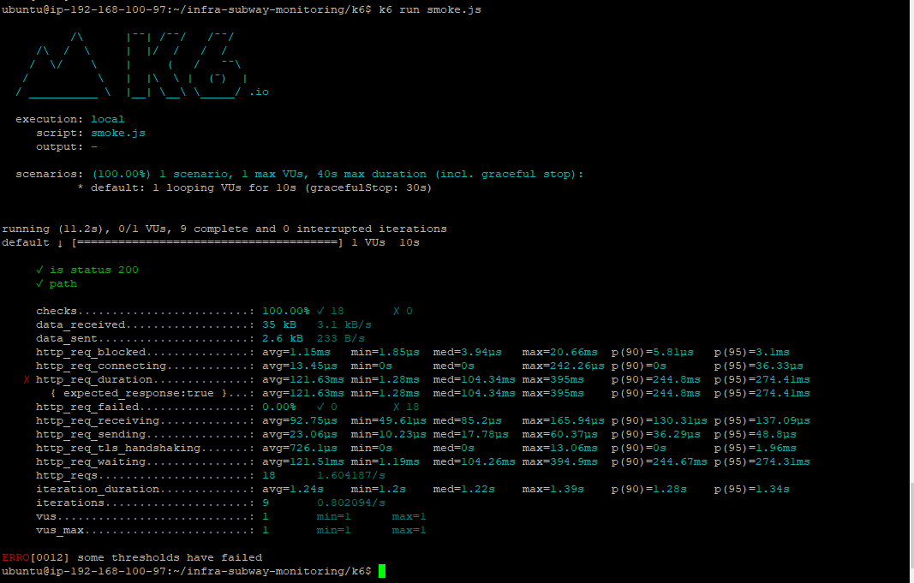
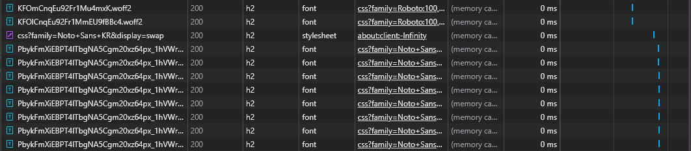
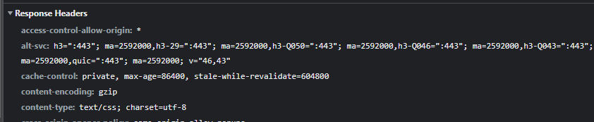
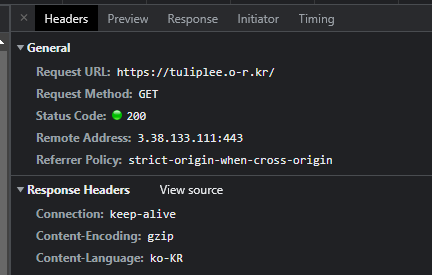

<p align="center">
    
</p>
<p align="center">
  
  
  <a href="https://edu.nextstep.camp/c/R89PYi5H" alt="nextstep atdd">
    
  </a>
  
</p>

<br>

# 인프라공방 샘플 서비스 - 지하철 노선도

<br>

## 🚀 Getting Started

### Install
#### npm 설치
```
cd frontend
npm install
```
> `frontend` 디렉토리에서 수행해야 합니다.

### Usage
#### webpack server 구동
```
npm run dev
```
#### application 구동
```
./gradlew clean build
```
<br>


### 1단계 - 성능 테스트
0. 참고 자료
- https://docs.google.com/spreadsheets/d/1W8s0nOR1V_gQTRg_lvffinkRIX2yqHnre8wTRJGqgBU/edit?usp=sharing

1. 웹 성능예산은 어느정도가 적당하다고 생각하시나요
- FCP가 2초를 넘기면 안된다
- Lighthouse 75점이상
- TTI는 5초를 넘기면 안된다.

2. 웹 성능예산을 바탕으로 현재 지하철 노선도 서비스는 어떤 부분을 개선하면 좋을까요
- 의도적인 sleep을 걷어내고, 이미지의 크기를 지정해서 로드하게 하여 이미지 로드 시간을 줄이고,
- 글씨체를 압축해서 보내서 로드시간을 줄인다.

3. 부하테스트 전제조건은 어느정도로 설정하셨나요
- 카카오맵==다음맵 하루 이용현황 https://ko.lab.appa.pe/2016-09/kakao-korea.html 를 참고하여 진행했습니다.  
  => 하루에 250만번이상이 카카오맵을 접속한다고 가정
  https://m.map.kakao.com/

- 1일 사용자 수(DAU) x 1명당 1일 평균 접속 수 = 1일 총 접속 수    
  2500000

  10분에 접속하는 사람의 수 -> 2,500,000 / (24 * 6) = 17,361


- 1일 총 접속 수 / 86,400 (초/일) = 1일 평균 rps  
  2500000 / 86400 = 28.9


- 1일 평균 rps x (최대 트래픽 / 평소 트래픽) = 1일 최대 rps  
  28.9 * 3 = 86.7

4. Smoke, Load, Stress 테스트 스크립트와 결과를 공유해주세요




---

### 2단계 - 화면 응답 개선하기
- [X] 모든 정적 자원에 대해 no-cache, private 설정을 하고 테스트 코드를 통해 검증합니다.
- [X] 확장자는 css인 경우는 max-age를 1년, js인 경우는 no-cache, private 설정을 합니다.
- Q. 모든 정적 자원에 대해 no-cache, no-store 설정을 한다. 가능한가요?
  <br>
  A. 가능하다. 하지만 이는 no-store의 옵션은 어떤 상황에서도 무조건 새로 요청하는 옵션인데 이는 데이터가 장시간 변화가 없더라도 이를 인지하지 못하고 새로 갱신하게 되는 문제를 초래하게 된다.
    <br>
    그리고 완전한 캐싱을 위해서라면 must-revalidate 옵션또한 추가하여 no-cache 정책을 프록시 서버에게 요청하여 프록시 서버가 오리진 서버에게 캐시가 유효한지 매번 질의하도록 하여야 한다.
  ```
  - max-age = n: 초 단위로 캐시 신선도를 설정한다. 예를 들어 60 * 60 = 3600을 입력하면 한 시간, 3600 * 24 = 86400을 입력하면 하루동안 캐시가 유지된다. 그 이후엔 서버에 요청한 뒤 304 응답을 받을 때에만 캐시를 이용한다.
  - no-cache: 캐시가 유효한지 확인하기 위해 매번 서버에 요청한다.
  - no-store: 어떤 요청도 캐시로 저장하지 않는다.
  ```

---

1. 성능 개선 결과를 공유해주세요 (Smoke, Load, Stress 테스트 결과)
   1. smoke<br>
     
   2. load<br>
      
   3. stress<br>
      

2. 어떤 부분을 개선해보셨나요? 과정을 설명해주세요
    ### 참고자료 : https://docs.google.com/spreadsheets/d/1W8s0nOR1V_gQTRg_lvffinkRIX2yqHnre8wTRJGqgBU/edit?usp=sharing
   1. Protocol http2로 개선<br>
      
   2. gzip 사용<br>
      
      
   3. Redis 사용
      1. feat: redis cache add to line, member, station
      2. stations cache add, path cache add

---

### [추가] 로깅, 모니터링
1. 각 서버내 로깅 경로를 알려주세요

2. Cloudwatch 대시보드 URL을 알려주세요
