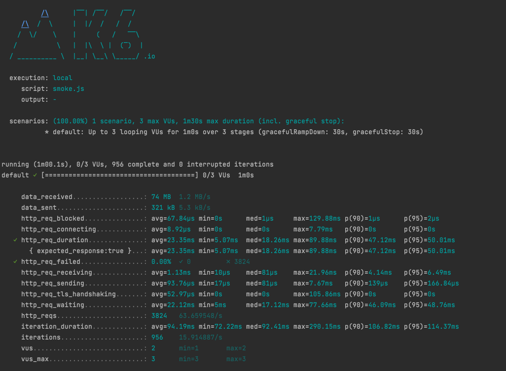
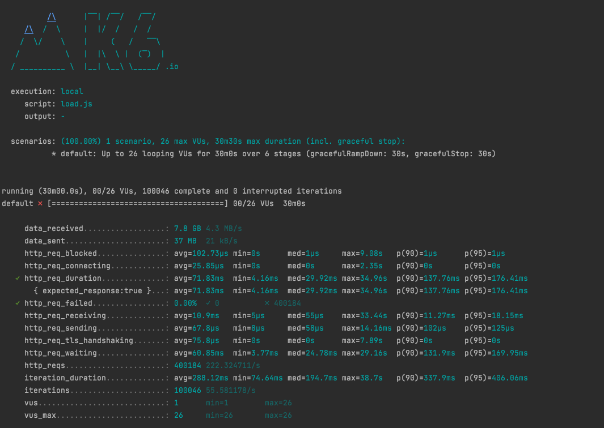
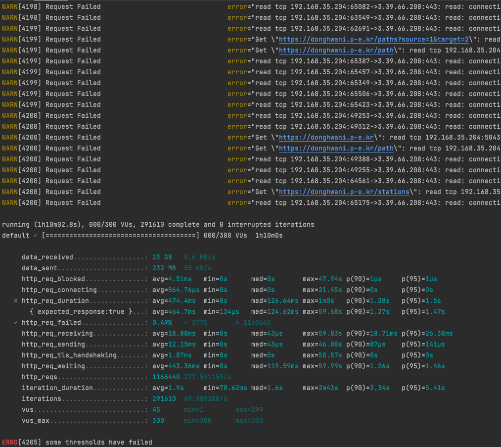

<p align="center">
    
</p>
<p align="center">
  
  
  <a href="https://edu.nextstep.camp/c/R89PYi5H" alt="nextstep atdd">
    
  </a>
  
</p>

<br>

# 인프라공방 샘플 서비스 - 지하철 노선도

<br>

## 🚀 Getting Started

### Install
#### npm 설치
```
cd frontend
npm install
```
> `frontend` 디렉토리에서 수행해야 합니다.

### Usage
#### webpack server 구동
```
npm run dev
```
#### application 구동
```
./gradlew clean build
```
<br>


### 1단계 - 성능 테스트
1. 웹 성능예산은 어느 정도가 적당하다고 생각하시나요
   - FCP/LCP는 모바일/데스크탑 환경에서 `1초 이내`
   - Speed Index `2초 이내`
   - Lighthouse 성능 감사에서 `90점 이상`


2. 웹 성능예산을 바탕으로 현재 지하철 노선도 서비스는 어떤 부분을 개선하면 좋을까요
   - keep-alive설정 (모바일 32점/ 데스크탑 67점)
   - gzip 적용 (모바일 48점 / 데스크탑 92점)
   - http2 적용 (모바일 48/ 데스크탑 94점)
    

3. 부하테스트 전제조건은 어느정도로 설정하셨나요   
 [데이터로보는 서울시 대중교통 이용](https://www.bigdata-map.kr/datastory/traffic/seoul) 기준으로 부하테스트 전제조건 설정
 - 1일 사용자 수 `4,500,000명`(DAU) 
 - 1명당 1일 평균 접속수 `2회` 
 - 1일 총 접속 수 `9,000,000회`
 - 1일 평균 rps = (1일 사용자수 / 86400) = `52rps`
 - T = 시나리오상 요청수 4회 * latency 목표값 0.2s = 0.8
 - VUser = 26
4. Smoke, Load, Stress 테스트 스크립트와 결과를 공유해주세요

- SMOKE  


- LOAD  


- STRESS  

---

### 2단계 - 화면 응답 개선하기
1. 성능 개선 결과를 공유해주세요 (Smoke, Load, Stress 테스트 결과)

2. 어떤 부분을 개선해보셨나요? 과정을 설명해주세요

---

### [추가] 로깅, 모니터링
1. 각 서버내 로깅 경로를 알려주세요

2. Cloudwatch 대시보드 URL을 알려주세요
