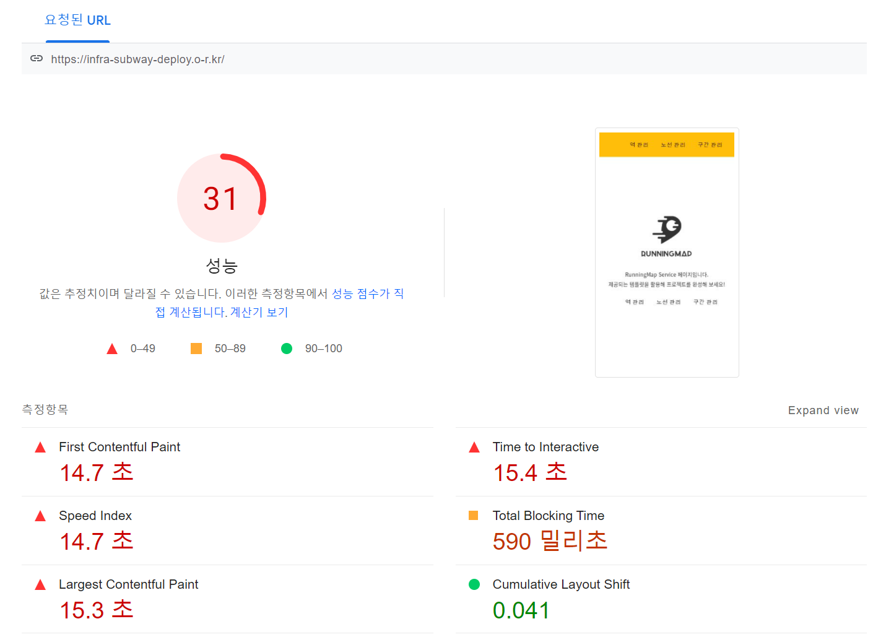
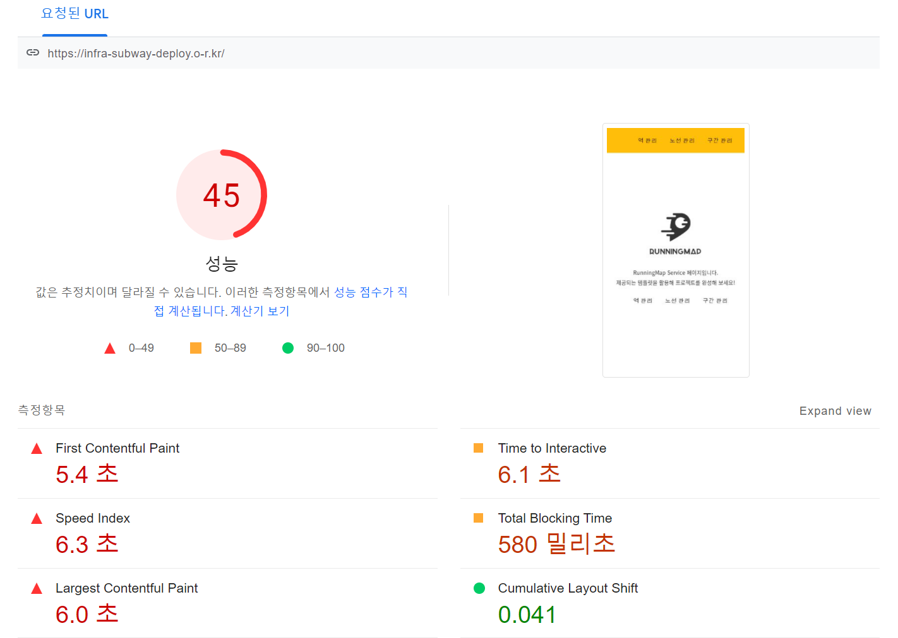
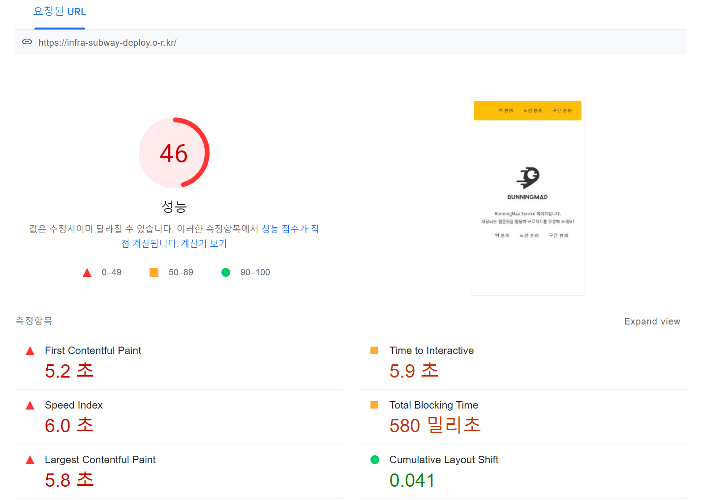

<p align="center">
    
</p>
<p align="center">
  
  
  <a href="https://edu.nextstep.camp/c/R89PYi5H" alt="nextstep atdd">
    
  </a>
  
</p>

<br>

# 인프라공방 샘플 서비스 - 지하철 노선도

<br>

## 🚀 Getting Started

### Install
#### npm 설치
```
cd frontend
npm install
```
> `frontend` 디렉토리에서 수행해야 합니다.

### Usage
#### webpack server 구동
```
npm run dev
```
#### application 구동
```
./gradlew clean build
```
<br>

## 미션

* 미션 진행 후에 아래 질문의 답을 작성하여 PR을 보내주세요.

### 1단계 - 인프라 운영하기
1. 각 서버내 로깅 경로를 알려주세요
    - 서버: EC2-livedetuc 
     (외부IP:13.209.211.203, 내부IP:192.168.11.57)
    - 로깅 경로: `/home/ubuntu/app/log`
    

2. Cloudwatch 대시보드 URL을 알려주세요
    - ```https://ap-northeast-2.console.aws.amazon.com/cloudwatch/home?region=ap-northeast-2#dashboards:name=DASHBOARD-livedetuc```

---

### 2단계 - 성능 테스트
1. 웹 성능예산은 어느정도가 적당하다고 생각하시나요

```aidl
A. 예비 분석
  1. 가장 중요한 페이지 판단
    - 접속 빈도가 높은 기능 : 메인, 로그인
    - DB를 사용하는 기능 : 길 찾기

  2. 내 웹페이지 성능 지표 ( https://infra-subway-deploy.o-r.kr/)
    - 참고 툴: PageSpeed 

    - 성능 점수                  : 31
    - First Contentful Paint    : 14.7 s
    - Time to Interactive       : 15.4 s
    - Speed Index               : 14.7 s
    - Total Blocking Time       : 590 ms
    - Largest Contentful Paint  : 15.3 s   
    - Cumulative Layout Shift   : 0.0041
```

```aidl
B. 경쟁사 분석 
  - 참고 툴: PageSpeed (https://developers.google.com/speed/pagespeed/insights/)

  1. 카카오 맵 (https://m.map.kakao.com/)
    - 성능 점수                  : 65
    - First Contentful Paint    : 2.5 s
    - Time to Interactive       : 5.2 s
    - Speed Index               : 7.1 s
    - Total Blocking Time       : 100 ms
    - Largest Contentful Paint  : 7.1 s   
    - Cumulative Layout Shift   : 0.005
    
  2. 네이버 지도 (https://m.map.naver.com/)
    - 성능 점수                  : 56
    - First Contentful Paint    : 2.9 s
    - Time to Interactive       : 5.8 s
    - Speed Index               : 7.5 s
    - Total Blocking Time       : 280 ms
    - Largest Contentful Paint  : 6.9 s   
    - Cumulative Layout Shift   : 0.017
```

```aidl
C. 성능 기준 설정
  1. 메인 홈페이지 
    - 페이지 로드 3초 미만 (3초 미만)
    - TTI 5초 미만
    - 압축된 리소스 최대 크기 200KB 미만
```

<br/>
2. 웹 성능예산을 바탕으로 현재 지하철 노선도 서비스는 어떤 부분을 개선하면 좋을까요

- [x] 텍스트 압축 사용
- [ ] 사용하지 않는 자바스크립트 줄이기
- [x] 렌더링 차단 리소스 제거하기


<br/>
3. 부하테스트 전제조건은 어느정도로 설정하셨나요

```
1.  대상 시스템 범위: application
```
```
2.  목표 rpc 구하기
 A) 1일 사용자 수 (DAU) : 1,000,000 (백만)
 B) 피크 시간대의 집중률  (최대 트개픽 / 평소 트래픽) : 3
 C) 1명당 1일 평균 접속 혹은 요청수 : 2
 D) Throughput: 23 ~ 69
  - 1일 총 접속수: 100만 * 2 = 200만
  - 1일 평균 rps: 200만 / 86400 = 23
  - 1일 최대 rps: 23 * 3 = 69

-------------------------------------------------------------
 A) 네이버 지도의 길 찾기만 하루 1억건 이라고 함.
소박하게 1% 사용자만 노려본다..
https://news.mt.co.kr/mtview.php?no=2021090916014079809

 B) 출퇴근 피크 시간대에 평소보다 3배 정도 더 트래픽이 있을 것으로 예상해본다.
```
```
3.  VUser 구하기
----------------------------------
T = (R * http_req_duration) (+ 1s)
VUser = (목표 rps * T) / R
----------------------------------
세개의 요청 (R=3) 이 있고 왕복 시간이 0.5s, 지연 시간이 0.3초라고 할 때
T = (3 * 0.5 s) + 0.3 s = 1.8 s
VUser_평균 = (23 * 1.8 s) / 3 = 14
VUser_최대 = (69 * 1.8 s) / 3 = 41
----------------------------------
```

```
4. 테스트 기간: 30분
```

<br/>
4. Smoke, Load, Stress 테스트 스크립트와 결과를 공유해주세요

- 시나리오: `메인페이지 - 로그인 - 길찾기`

  A. Smoke (k6/smoke.js) 테스트 결과
```aidl

          /\      |‾‾| /‾‾/   /‾‾/
     /\  /  \     |  |/  /   /  /
    /  \/    \    |     (   /   ‾‾\
   /          \   |  |\  \ |  (‾)  |
  / __________ \  |__| \__\ \_____/ .io

  execution: local
     script: smoke.js
     output: -

  scenarios: (100.00%) 1 scenario, 1 max VUs, 40s max duration (incl. graceful stop):
           * default: 1 looping VUs for 10s (gracefulStop: 30s)


running (10.2s), 0/1 VUs, 10 complete and 0 interrupted iterations
default ✓ [======================================] 1 VUs  10s

     ✓ get main page successfully
     ✓ logged in successfully
     ✓ found shortest path successfully

     checks.........................: 100.00% ✓ 30       ✗ 0
     data_received..................: 25 kB   2.5 kB/s
     data_sent......................: 8.0 kB  791 B/s
     http_req_blocked...............: avg=767.59µs min=4.26µs  med=4.72µs  max=22.86ms  p(90)=8.38µs   p(95)=8.42µs
     http_req_connecting............: avg=13.32µs  min=0s      med=0s      max=399.83µs p(90)=0s       p(95)=0s
   ✓ http_req_duration..............: avg=3.81ms   min=1.41ms  med=1.64ms  max=8.42ms   p(90)=8.35ms   p(95)=8.39ms
       { expected_response:true }...: avg=4.97ms   min=1.58ms  med=4.96ms  max=8.42ms   p(90)=8.39ms   p(95)=8.39ms
     http_req_failed................: 33.33%  ✓ 10       ✗ 20
     http_req_receiving.............: avg=90.45µs  min=55µs    med=84.77µs max=151.11µs p(90)=131.31µs p(95)=144.03µs
     http_req_sending...............: avg=23.94µs  min=16.05µs med=19.28µs max=82.15µs  p(90)=27.79µs  p(95)=47.63µs
     http_req_tls_handshaking.......: avg=519.59µs min=0s      med=0s      max=15.58ms  p(90)=0s       p(95)=0s
     http_req_waiting...............: avg=3.69ms   min=1.31ms  med=1.5ms   max=8.3ms    p(90)=8.23ms   p(95)=8.24ms
     http_reqs......................: 30      2.955144/s
     iteration_duration.............: avg=1.01s    min=1.01s   med=1.01s   max=1.03s    p(90)=1.01s    p(95)=1.02s
     iterations.....................: 10      0.985048/s
     vus............................: 1       min=1      max=1
     vus_max........................: 1       min=1      max=1


```

  B. Load (k6/load.js) 테스트 결과
```aidl

          /\      |‾‾| /‾‾/   /‾‾/
     /\  /  \     |  |/  /   /  /
    /  \/    \    |     (   /   ‾‾\
   /          \   |  |\  \ |  (‾)  |
  / __________ \  |__| \__\ \_____/ .io

  execution: local
     script: load.js
     output: -

  scenarios: (100.00%) 1 scenario, 41 max VUs, 30m30s max duration (incl. graceful stop):
           * default: Up to 41 looping VUs for 30m0s over 3 stages (gracefulRampDown: 30s, gracefulStop: 30s)


running (30m00.7s), 00/41 VUs, 54744 complete and 0 interrupted iterations
default ✓ [======================================] 00/41 VUs  30m0s

     ✓ get main page successfully
     ✓ logged in successfully
     ✓ found shortest path successfully

     checks.........................: 100.00% ✓ 164232    ✗ 0
     data_received..................: 115 MB  64 kB/s
     data_sent......................: 42 MB   23 kB/s
     http_req_blocked...............: avg=19.36µs  min=3.07µs   med=4.96µs  max=23.58ms p(90)=8.43µs   p(95)=10.42µs
     http_req_connecting............: avg=693ns    min=0s       med=0s      max=2.39ms  p(90)=0s       p(95)=0s
   ✓ http_req_duration..............: avg=4.19ms   min=888.37µs med=2.29ms  max=54.72ms p(90)=8.76ms   p(95)=9.96ms
       { expected_response:true }...: avg=5.21ms   min=888.37µs med=6.33ms  max=44.53ms p(90)=9.41ms   p(95)=10.64ms
     http_req_failed................: 33.33%  ✓ 54744     ✗ 109488
     http_req_receiving.............: avg=107.18µs min=22.51µs  med=52.66µs max=24.27ms p(90)=137.89µs p(95)=285.64µs
     http_req_sending...............: avg=43.84µs  min=10.74µs  med=17.58µs max=26.57ms p(90)=42.67µs  p(95)=82.87µs
     http_req_tls_handshaking.......: avg=4.9µs    min=0s       med=0s      max=16.65ms p(90)=0s       p(95)=0s
     http_req_waiting...............: avg=4.04ms   min=822.42µs med=2.12ms  max=44.44ms p(90)=8.6ms    p(95)=9.74ms
     http_reqs......................: 164232  91.202722/s
     iteration_duration.............: avg=1.01s    min=1s       med=1.01s   max=1.07s   p(90)=1.01s    p(95)=1.02s
     iterations.....................: 54744   30.400907/s
     vus............................: 1       min=1       max=41
     vus_max........................: 41      min=41      max=41


```

  C. Stress (k6/stress.js) 테스트 결과
```aidl

          /\      |‾‾| /‾‾/   /‾‾/
     /\  /  \     |  |/  /   /  /
    /  \/    \    |     (   /   ‾‾\
   /          \   |  |\  \ |  (‾)  |
  / __________ \  |__| \__\ \_____/ .io

  execution: local
     script: stress.js
     output: -

  scenarios: (100.00%) 1 scenario, 150 max VUs, 31m30s max duration (incl. graceful stop):
           * default: Up to 150 looping VUs for 31m0s over 7 stages (gracefulRampDown: 30s, gracefulStop: 30s)


running (31m00.9s), 000/150 VUs, 159078 complete and 0 interrupted iterations
default ✓ [======================================] 000/150 VUs  31m0s

     ✓ get main page successfully
     ✓ logged in successfully
     ✓ found shortest path successfully

     checks.........................: 100.00% ✓ 477234     ✗ 0
     data_received..................: 335 MB  180 kB/s
     data_sent......................: 122 MB  65 kB/s
     http_req_blocked...............: avg=22.52µs  min=3.09µs   med=4.87µs  max=65.4ms   p(90)=7.26µs   p(95)=9.99µs
     http_req_connecting............: avg=1.17µs   min=0s       med=0s      max=32.49ms  p(90)=0s       p(95)=0s
   ✓ http_req_duration..............: avg=5.06ms   min=873.35µs med=2.48ms  max=124.88ms p(90)=9.6ms    p(95)=12.99ms
       { expected_response:true }...: avg=6.12ms   min=873.35µs med=6.49ms  max=124.88ms p(90)=10.56ms  p(95)=14.55ms
     http_req_failed................: 33.33%  ✓ 159078     ✗ 318156
     http_req_receiving.............: avg=125.26µs min=20.65µs  med=50.53µs max=67.64ms  p(90)=135.39µs p(95)=305.33µs
     http_req_sending...............: avg=66.95µs  min=10.32µs  med=17.27µs max=70.69ms  p(90)=43.68µs  p(95)=103.73µs
     http_req_tls_handshaking.......: avg=5.85µs   min=0s       med=0s      max=42.37ms  p(90)=0s       p(95)=0s
     http_req_waiting...............: avg=4.86ms   min=811.71µs med=2.3ms   max=124.79ms p(90)=9.37ms   p(95)=12.57ms
     http_reqs......................: 477234  256.449537/s
     iteration_duration.............: avg=1.01s    min=1s       med=1.01s   max=1.21s    p(90)=1.02s    p(95)=1.03s
     iterations.....................: 159078  85.483179/s
     vus............................: 2       min=1        max=150
     vus_max........................: 150     min=150      max=150

```

<br/>
5. 웹 페이지 개선 내역

[ 개선 전 ]


[ 개선 후 - 텍스트(리소스) 압축 사용 ]


[ 개선 후 - 렌더링 차단 리소스 제거 ]

