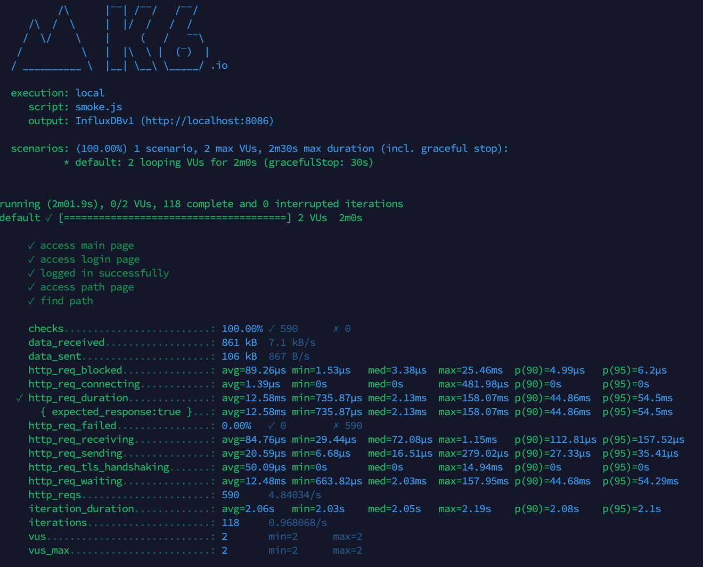
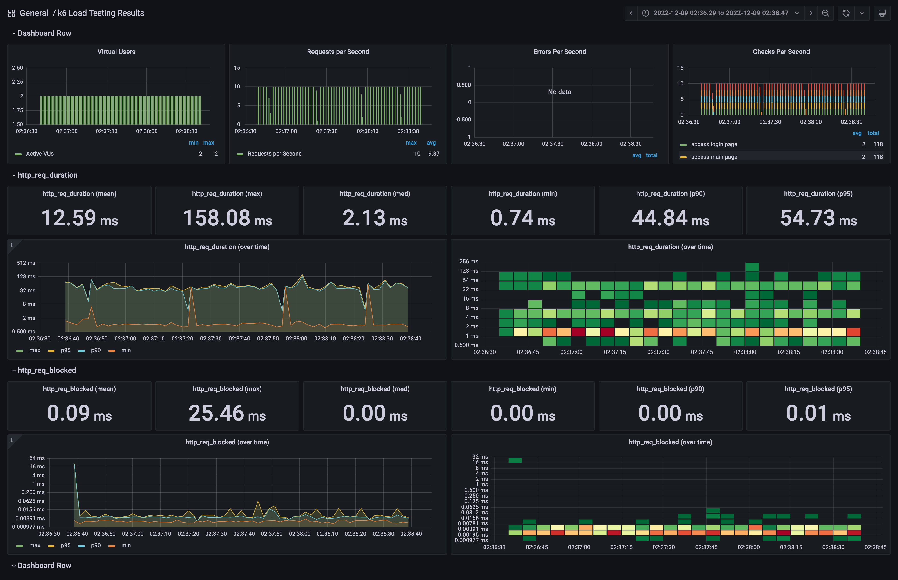
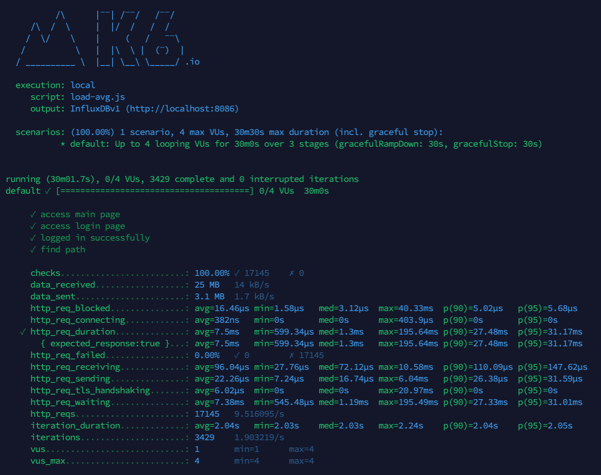
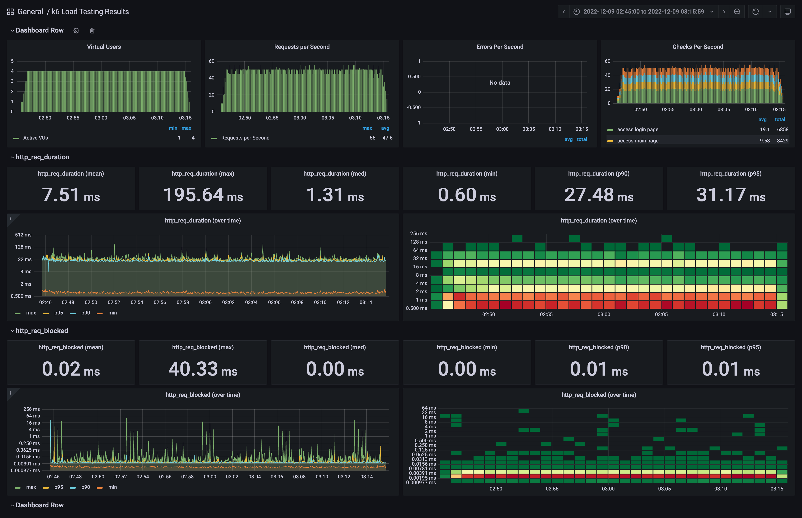
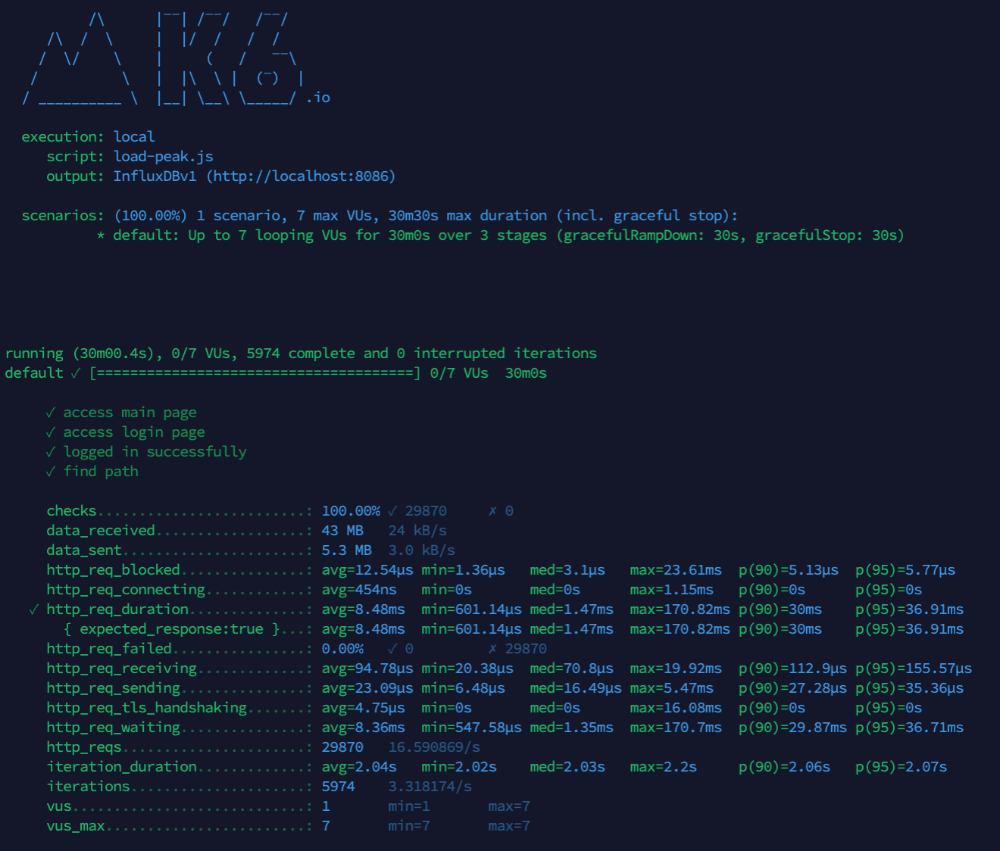
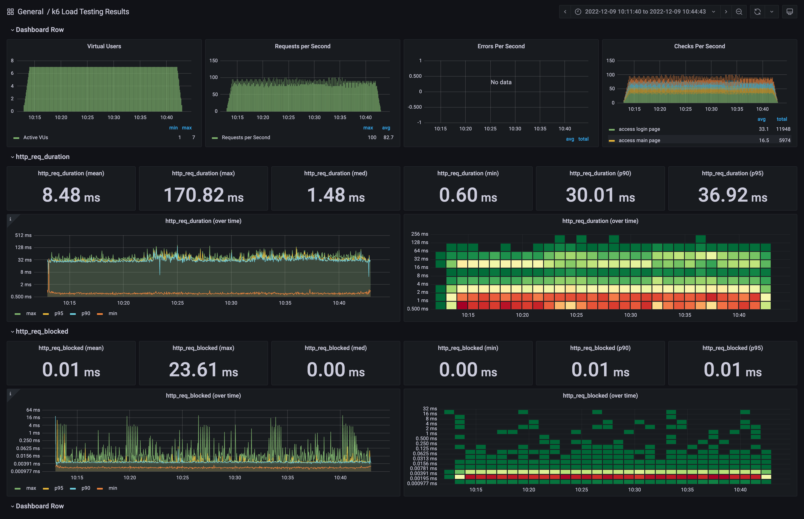
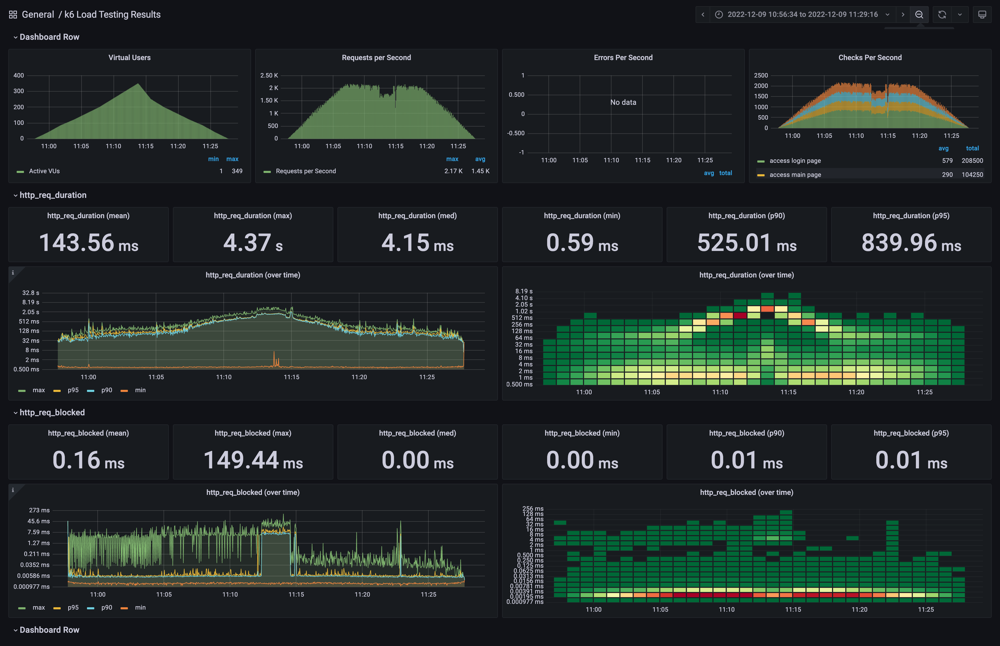
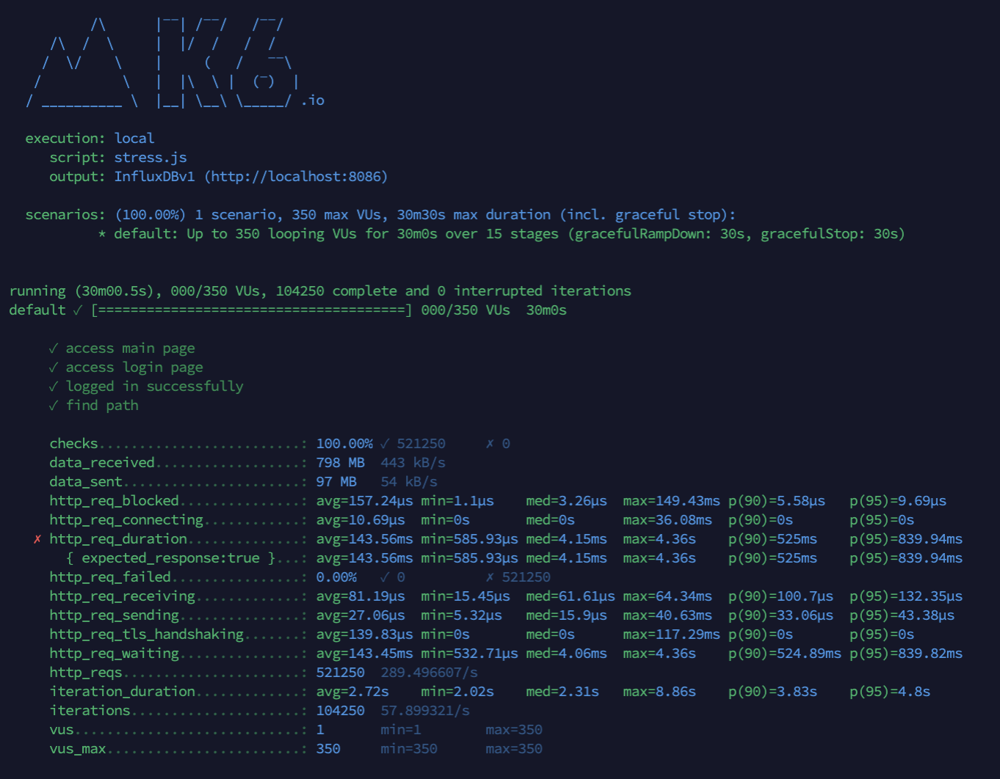

<p align="center">
    
</p>
<p align="center">
  
  
  <a href="https://edu.nextstep.camp/c/R89PYi5H" alt="nextstep atdd">
    
  </a>
  
</p>

<br>

# 인프라공방 샘플 서비스 - 지하철 노선도

<br>

## 🚀 Getting Started

### Install
#### npm 설치
```
cd frontend
npm install
```
> `frontend` 디렉토리에서 수행해야 합니다.

### Usage
#### webpack server 구동
```
npm run dev
```
#### application 구동
```
./gradlew clean build
```
<br>


### 1단계 - 웹 성능 테스트
- [pagespeed](https://pagespeed.web.dev/)

| 데스크탑 | RUNNINGMAP | 서울교통공사 | 네이버지도 | 카카오맵 | 경쟁사 평균 |
| --- | --- | --- | --- | --- | --- |
| FCP | 2.7s | 1.4s | 0.6s | 0.5s | 0.8s |
| TTI | 2.8s | 1.9s | 1.2s | 0.7s | 1.3s |
| SI | 2.7s | 2.0s | 2.1s | 2.3s | 2.1s |
| TBT | 80ms | 250ms | 40ms | 0ms | 97ms |
| LCP | 2.8s | 2.1s | 1.6s | 1.2s | 1.6s |
| CLS | 0.004 | 0.001 | 0.006 | 0.003 | 0.003 |
| 성능점수 | 68 | 73 | 90 | 92 | 85 |
- 비교항목
  - FCP(First Contentful Paint) - 첫 번째 텍스트 또는 이미지가 표시되는 시간
  - TTI (Time to Interactive) - 완전히 페이지와 상호작용할 수 있게 될 때까지 걸리는 시간
  - SI (Speed Index) - 페이지 콘텐츠가 얼마나 빨리 표시되는지
  - TBT (Total Blocking Time) - FCP와 TTI의 모든 시간의 합으로 사용자 입력으로부터 페이지가 응답하지 못하도록 차단된 총 시간
  - LCP (Largest Contentful Paint)- 최대 텍스트 또는 이미지가 표시되는 시간
  - CLS (Cumulative Layout Shift) - 표시 영역 안에 보이는 요소의 이동을 측정
--- 
1. 웹 성능예산은 어느정도가 적당하다고 생각하시나요
- 경쟁사 평균을 기준으로 사용자가 응답시간 차이를 인식하는 +20% 사이의 값을 적정 기준으로 잡을 수 있다고 생각합니다.

|  | 경쟁사 평균 | 경쟁사 평균 + 20% | RUNNINGMAP |
| --- | --- | --- | --- |
| FCP | 0.8s | 0.96s | 2.7s |
| TTI | 1.3s | 1.56s | 2.8s |
| SI | 2.1s | 2.52s | 2.7s |
| TBT | 97ms | 116ms | 80ms |
| LCP | 1.6s | 1.92s | 2.8s |
| CLS | 0.003 | 0.0036 | 0.004 |

- 경쟁사 평균대비 차이가 많은 항목인 FCP, TTI, LCP에 대한 성능 개선이 필요해 보입니다.
2. 웹 성능예산을 바탕으로 현재 지하철 노선도 서비스의 서버 목표 응답시간 가설을 세워보세요.

pagespeed의 추천사항을 적용하면 FCP와 LCP에 대한 성능 개선이 가능할 것으로 보이며, FCP와 LCP 개선시 TTI도 개선될 것으로 생각됩니다.
- 텍스트 압축 사용 : FCP, LCP - 1.48s
- 렌더링 차단 리소스 제거 FCP, LCP - 0.16s
- 사용하지 않는 자바스크립트 줄이기 LCP - 0.56s

위 개선사항을 모두 적용하면 아래 표의 응답시간을 얻을 것으로 기대됩니다.

| | 성능향상 범위 | 기대 응답시간 |
| --- |---| --- |
| FCP | -1.64s | 1.06s | 
| LCP | -2.2s | 0.6s | 
| TTI | -1.64s | 1.16s | 


---

### 2단계 - 부하 테스트 
1. 부하테스트 전제조건은 어느정도로 설정하셨나요
- 대상 시스템 범위
    - nginx(proxy) -> Spring Boot (was server) -> mysql(db)
- 목표값 설정
    1. 우선 예상 1일 사용자 수(DAU) 예상
        - 경쟁사의 DAU를 바탕으로 평균치를 설정(22년 10월 기준 / [비교사이트](https://www.similarweb.com/))
            - 네이버지도 : 530만(MAU) -> 17만(DAU)
            - 카카오지도 : 185만(MAU) -> 6만(DAU)
        - 목표 DAU -> `11.5만`
    2. 피크 시간대의 집중률을 예상 (최대 트개픽 / 평소 트래픽)
        - 대중교통 시간대별 이용률과 비슷하게 트래픽이 몰리것으로 예측해 시간대별 승하차 인원수를 바탕으로 예상([기준자료](https://insfiler.com/detail/rt_transit_time-0002?category=life))
        - 피크 시간대 : 18-19시 (전체 승하차의 9.2퍼센트)
        - 9.2 / 4.7 = `1.95`
    3. 1명당 1일 평균 접속 혹은 요청수를 예
        - 서비스 흐름 : 사이트 접속 -> 로그인 페이지 이동 -> 로그인 -> 경로 검색 페이지 이동 -> 경로 검색
        - 일 2회 접속 * 요청 5회 => `10회`
    4. 예상을 바탕으로 Throughput을 계산
        - 1일 총 접속 수 : 11.5 * 10  = 115만
        - 1일 평균 rps : 115만 / 86,400 = `13.3rps`
        - 1일 최대 rps : 13.3 * 1.95 = `25.935rps`
    5. Latency
        - `100ms`
    6. Vuser
        - R = `5`
        - T = (5 * 0.1) + 1 => `1.5`
        - 평균 VUser : (13.3 * 1.5) / 5 = 3.99 => `4`
        - 최대 VUSer : (25.935 * 1.5) /5 = 7.1859 => `7`
- 부하 테스트 시 저장될 데이터 건수 및 크기
    - Line : 13
    - Section : 340
    - Station : 616
    - Member : 1
2. Smoke, Load, Stress 테스트 스크립트와 결과를 공유해주세요
    - Smoke
      - [smoke.js](src/main/resources/docs/smoke/smoke.js)
      - 
      - 
    - Load
      - [load-avg.js](src/main/resources/docs/load/load-avg.js)
      - 
      - 
      - [load-peak.js](src/main/resources/docs/load/load-peak.js)
      - 
      - 
    - Stress
      - [stress.js](src/main/resources/docs/stress/stress.js)
      - 
      - 
---

### 3단계 - 로깅, 모니터링
1. 각 서버내 로깅 경로를 알려주세요

2. Cloudwatch 대시보드 URL을 알려주세요

---

# 🚀 1단계 - 웹 성능 테스트

## 요구사항
- [x] 웹 성능 예산 작성 후 서버 목표 응답시간 도출
  - 가설을 세우는 단계이므로, 정답은 없습니다. 주어진 정보를 바탕으로 나름의 논리만 세우면 됩니다. 서비스 오픈 등 여러 상황에선 주어진 정보가 제한적이라, 가설을 세우고 테스트하고 운영환경에서 검증해볼 수 밖에 없어요.

### 힌트 
1. 웹 성능 예산 작성하기
   WebPageTest, PageSpeed 등에서 테스트를 진행한 후, 웹 성능 예산을 작성합니다. 
- 경쟁사
  - 서울교통공사
  - 네이버지도
  - 카카오맵
---
# 🚀 2단계 - 부하테스트

## 요구사항
- [x] 부하 테스트
  - [x] 테스트 전제조건 정리
    - [x] 대상 시스템 범위
    - [x] 목푯값 설정 (latency, throughput, 부하 유지기간)
    - [x] 부하 테스트 시 저장될 데이터 건수 및 크기
- [x] 아래 시나리오 중 하나를 선택하여 스크립트 작성
  - [x] 접속 빈도가 높은 페이지
  - [x] 데이터를 갱신하는 페이지
  - [x] 데이터를 조회하는데 여러 데이터를 참조하는 페이지
- [x] Smoke, Load, Stress 테스트 후 결과를 기록

### 용어정리
- smoke 테스트
  - 최소한의 부하로 구성된 테스트로, 테스트 시나리오에 오류가 없는지 확인.
  - 최소 부하 상태에서 시스템에 오류 발생 확인
  - VUser를 1 ~ 2로 구성하여 테스트
- load 테스트
  - 서비스의 평소 트래픽과 최대 트래픽 상황에서 성능과 정상 동작 여부 확인
  - 애플리케이션 배포 및 인프라 변경(scale out, DB failover 등)시에 성능 변화 확인
  - 외부 요인(결제 등)에 따른 예외 상황을 확인
- stress 테스트
  - 극한 상황에서의 서비스 동작 확인
  - 장기간 부하 발생에 대한 한계치를 확인하고 기능이 정상 동작하는지 확인
  - 최대 사용자 또는 최대 처리량을 확인
  - 스트레스 테스트 이후 시스템이 수동 개입없이 복구되는지 확인
- http_req_duration
  - request 시작전 빈 TCP connection slot을 기다리면서 blocked된 시간
- http_req_blocked
  - 총 request 시간 `http_req_sending + http_req_waiting + http_req_receiving`와 같다.
---
# 🚀 3단계 - 로깅, 모니터링
## 요구사항
- [ ] 애플리케이션 진단하기 실습을 진행해보고 문제가 되는 코드를 수정
- [ ] 로그 설정하기
  - [ ] Application Log 파일로 저장하기
    - [ ] 회원가입, 로그인 등의 이벤트에 로깅을 설정
    - [ ] 경로찾기 등의 이벤트 로그를 JSON으로 수집
- [ ] Cloudwatch로 모니터링
  - [ ] Cloudwatch로 로그 수집하기
  - [ ] Cloudwatch로 메트릭 수집하기
  - [ ] USE 방법론을 활용하기 용이하도록 대시보드 구성
