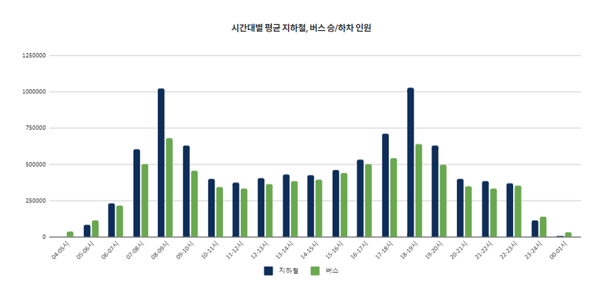
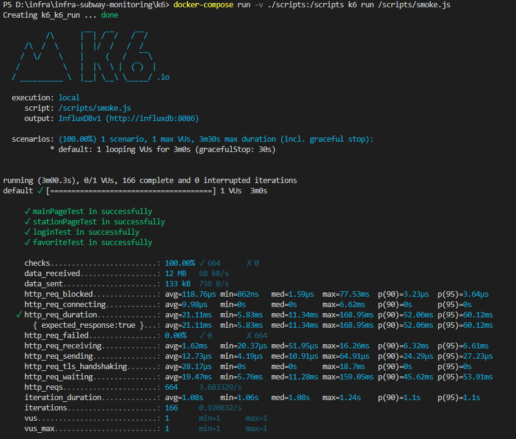
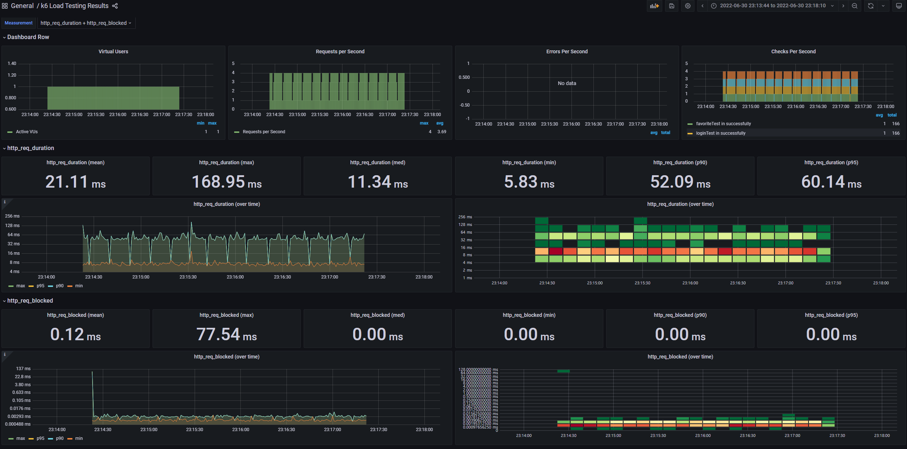
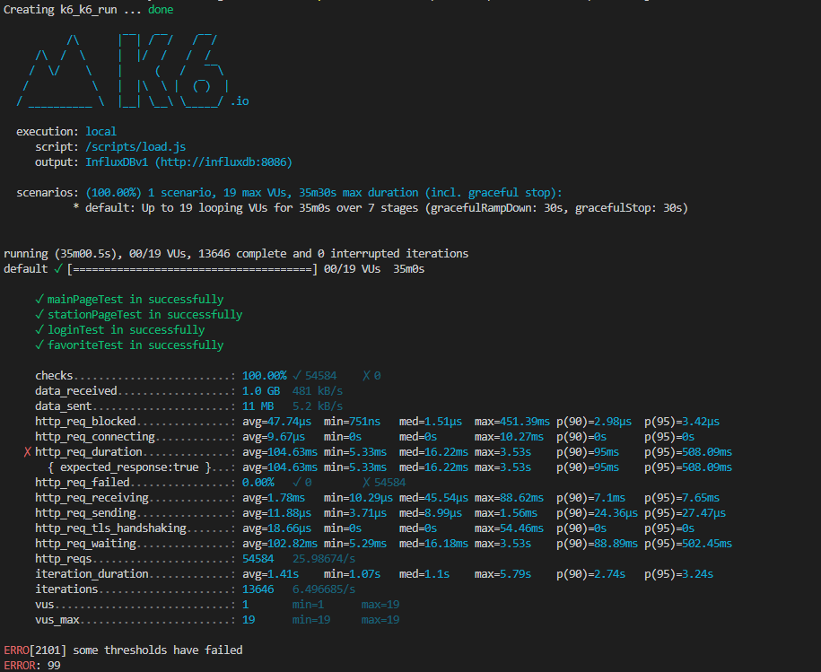
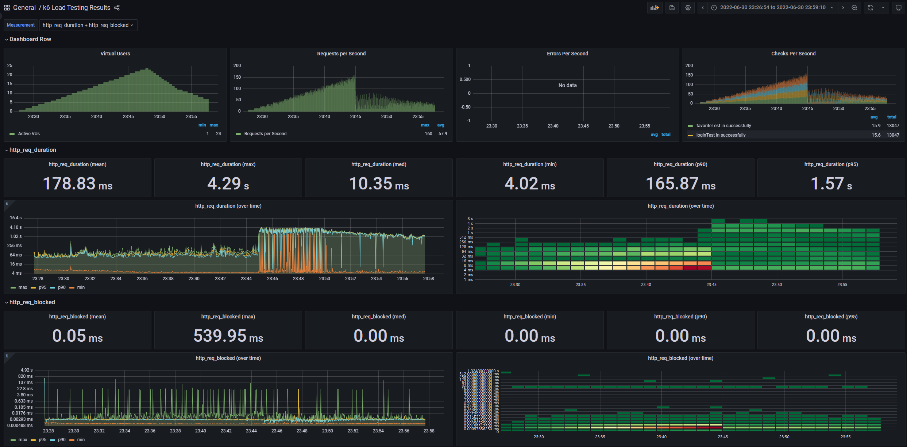
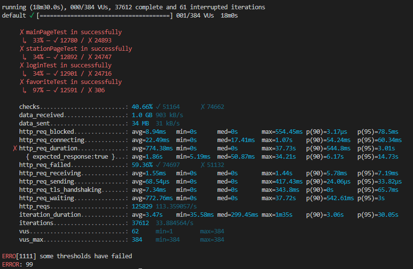
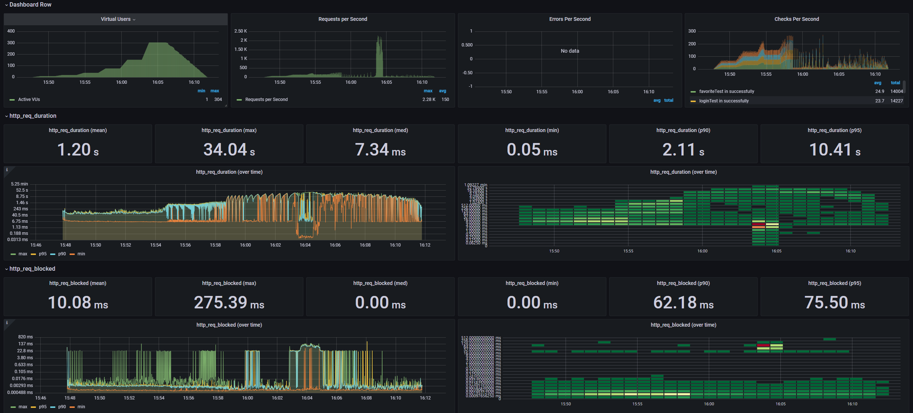

<p align="center">
    
</p>
<p align="center">
  
  
  <a href="https://edu.nextstep.camp/c/R89PYi5H" alt="nextstep atdd">
    
  </a>
  
</p>

<br>

# 인프라공방 샘플 서비스 - 지하철 노선도

<br>

## 🚀 Getting Started

### Install
#### npm 설치
```
cd frontend
npm install
```
> `frontend` 디렉토리에서 수행해야 합니다.

### Usage
#### webpack server 구동
```
npm run dev
```
#### application 구동
```
./gradlew clean build
```
<br>


### 1단계 - 웹 성능 테스트
1. 웹 성능예산은 어느정도가 적당하다고 생각하시나요

## 서울교통공사 사이버 스테이션

[http://www.seoulmetro.co.kr/kr/cyberStation.do](http://www.seoulmetro.co.kr/kr/cyberStation.do)

- FCP(First Contentful Paint): Mobile 6.4 / Desktop 1.5
- TTI(Time to Interactive): Mobile 8.4 / Desktop 2.0
- SP(Speed Index): Mobile 8.1 / Desktop 2.1
- TBT(Total Blocking Time): Mobile 530 ms / Desktop 60ms
- LCP(Largest Contentful Paint): Mobile 6.6 / Desktop 3.7
- CLS(Cumulative Layout Shift): Mobile 0 / Desktop 0
- 성능: Mobile 40 / Desktop 71

## 네이버 지도 지하철

[https://m.map.naver.com/subway/subwayLine.naver?region=1000](https://m.map.naver.com/subway/subwayLine.naver?region=1000)

- FCP(First Contentful Paint): Mobile 2.2 / Desktop 0.5
- TTI(Time to Interactive): Mobile 6.5 / Desktop 0.6
- SP(Speed Index): Mobile 5.4 / Desktop 2.1
- TBT(Total Blocking Time): Mobile 380 ms / Desktop 0ms
- LCP(Largest Contentful Paint): Mobile 8.2 / Desktop 1.7
- CLS(Cumulative Layout Shift): Mobile 0.03 / Desktop 0.006
- 성능: Mobile 55 / Desktop 90

## 카카오 맵

[https://m.map.kakao.com/](https://m.map.kakao.com/)

- FCP(First Contentful Paint): Mobile 1.7 / Desktop 0.5
- TTI(Time to Interactive): Mobile 4.2 / Desktop 0.7
- SP(Speed Index): Mobile 6.4 / Desktop 2.5
- TBT(Total Blocking Time): Mobile 70 ms / Desktop 0ms
- LCP(Largest Contentful Paint): Mobile 5.1 / Desktop 1.1
- CLS(Cumulative Layout Shift): Mobile 0.005 / Desktop 0.003
- 성능: Mobile 73 / Desktop 93

## RUNNINGMAP

[https://infra.koo.gg/](https://infra.koo.gg/)

- FCP(First Contentful Paint): Mobile 14.7 / Desktop 2.7
- TTI(Time to Interactive): Mobile 15.2 / Desktop 2.7
- SP(Speed Index): Mobile 14.7 / Desktop 2.7
- TBT(Total Blocking Time): Mobile 490 ms / Desktop 50ms
- LCP(Largest Contentful Paint): Mobile 15.2 / Desktop 2.7
- CLS(Cumulative Layout Shift): Mobile 0.041 / Desktop 0.004
- 성능: Mobile 33 / Desktop 68

## 목표

> RUNNINGMAP은 전반적으로 성능이 떨어지지만 이용자에게 정보를 제공하는것이 목적인 애플리케이션이라 FCP, LCP의 개선이 중요하다고 생각됩니다.

### FCP
- 3사를 비교했을때 카카오 맵이 Mobile 1.7 / Desktop 0.5로 제일 빠름.

### LCP
- 3사를 비교했을때 카카오 맵이 Mobile 5.1 / Desktop 1.1로 제일 빠름

2. 웹 성능예산을 바탕으로 현재 지하철 노선도 서비스는 어떤 부분을 개선하면 좋을까요

- 텍스트 기반 리소스를 압축(gzip, deflate, brotli)
- 렌더링을 Blocking하는 리소스 제거
- 사용하지 않는 CSS/JS 줄이기
- 웹 폰트 로드 중에 텍스트가 계속 보이도록 함
  - FOIT 방식이 아닌 FOUT 방식을 사용


---

### 2단계 - 부하 테스트 
1. 부하테스트 전제조건은 어느정도로 설정하셨나요

### 목푯 값 설정

**DAU 구하기**

- 카카오 지하철
    - [자료](https://ko.lab.appa.pe/2016-09/kakao-korea.html)
    - 500,000
- 지하철 종결자
    - [자료](https://platum.kr/archives/61943)
    - 1,200,000

**지하철 종결자 이용 기반 목푯값 설정**

- DAU = 1,200,000
- 1명당 1일 평균 접속 수 = 2 (출근, 퇴근)
- 1일 평균 rps = 27.77
- 피크시간대 집중율 = 2
    
    
    
- 1일 최대 rps = 55.55
- 요청수 : 3 (접속, 검색, 조회)
- Latency = 100 ms
- T = (4 * 0.1) + 1 = 1.4
- VUser
    - 평균 = (27.77 * 1.4) / 4 = 9
    - 최대 = (55.55 * 1.4) / 4 = 19

2. Smoke, Load, Stress 테스트 스크립트와 결과를 공유해주세요

## Smoke Test




## Load Test




## Stress Test




---

### 3단계 - 로깅, 모니터링
1. 각 서버내 로깅 경로를 알려주세요
- /home/ubuntu/infra-subway-monitoring/log/json.log
- /home/ubuntu/infra-subway-monitoring/log/file.log
- /var/log/nginx/access.log
- /var/log/nginx/error.log

2. Cloudwatch 대시보드 URL을 알려주세요
- https://ap-northeast-2.console.aws.amazon.com/cloudwatch/home?region=ap-northeast-2#dashboards:name=0n1dev-dashboard