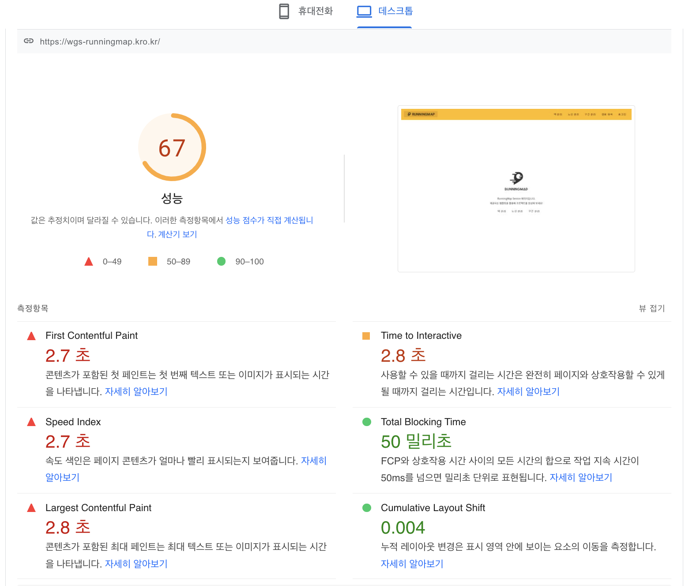
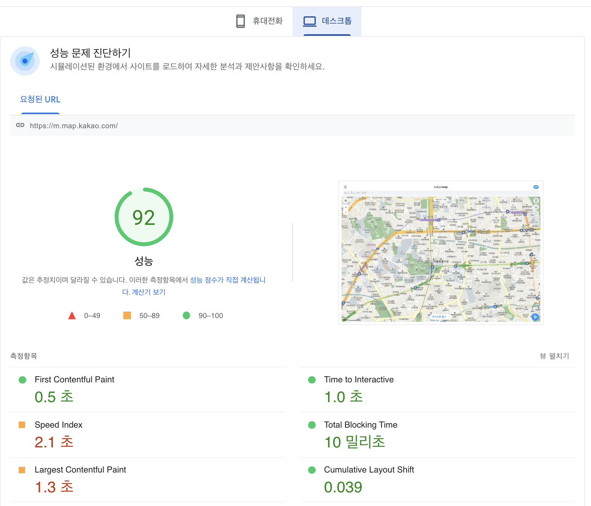
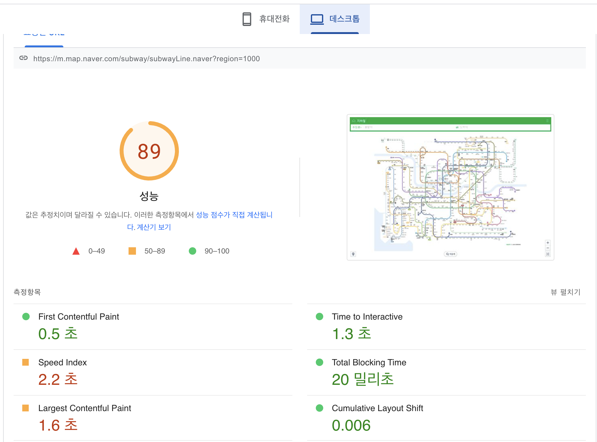
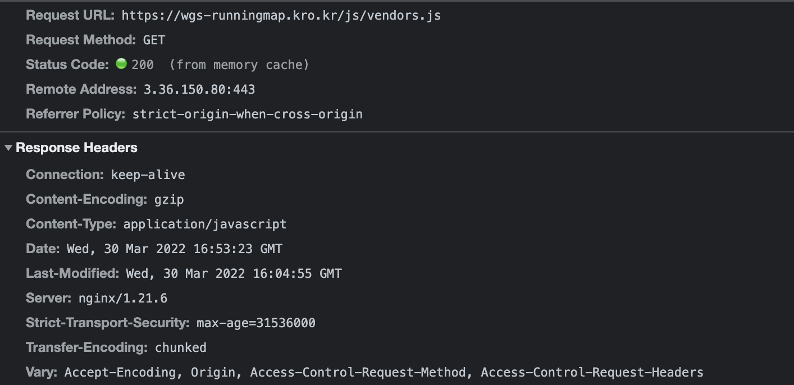

<p align="center">
    
</p>
<p align="center">
  
  
  <a href="https://edu.nextstep.camp/c/R89PYi5H" alt="nextstep atdd">
    
  </a>
  
</p>

<br>

# 인프라공방 샘플 서비스 - 지하철 노선도

<br>

## 🚀 Getting Started

### Install
#### npm 설치
```
cd frontend
npm install
```
> `frontend` 디렉토리에서 수행해야 합니다.

### Usage
#### webpack server 구동
```
npm run dev
```
#### application 구동
```
./gradlew clean build
```


### 1단계 - 성능 테스트
1. 웹 성능예산은 어느정도가 적당하다고 생각하시나요
   ### pagespeed를 이용한 성능 분
   
   
   

<ul>
   <li>FCP 0.5초 미만</li>
   <li>TTI 1.5초 미만</li>
   <li>LCP 1.3초 미만</li>
   <li>압축된 리소스 최대 크기 200KB 미만</li>
  </ul> 

2. 웹 성능예산을 바탕으로 현재 지하철 노선도 서비스는 어떤 부분을 개선하면 좋을까요
<ul>
   <li>FCP를 줄이기 위해 gzip 압축을 사용하면 좋을 것 같고, 사용하지 않는 자바스크립트는 줄이고 지연로을 고려하면 좋을 것 같습니다.</li>
 </ul>


3. 부하테스트 전제조건은 어느정도로 설정하셨나요
<ul>
<li> DAU = 1,930,000</li>
<li> 피크시간대 집중율 = 평소 트래픽 10배</li>
<li> 1명당 1일 평균 요청 수 = 2</li>
<li> latency 목표값 0.1s</li>
</ul>

<ul>
<li> 1일 총 접속수 = 1,930,000 * 2 = 3,860,000</li>
<li> 1일 평균 rps = 45</li>
<li> 1일 최대 rps = 450</li>
</ul>

### 로그인페이지 
- 시나리오상 요청 수 = 2
- T(목표 응답시간) = (2 * 0.1) + 0 = 0.2s
- 평균 트래픽 VUser = (45 * 0.2) / 2 = 4.5
- 최대 트래픽 VUser = (450 * 0.2) / 2 = 45

###노선관리 페이지 
- 시나리오상 요청 수 = 2
- T(목표 응답시간) = (2 * 0.1) + 0 = 0.2s
- 평균 트래픽 VUser = (45 * 0.2) / 2 = 4.5
- 최대 트래픽 VUser = (450 * 0.2) / 2 = 45

###경로검색 페이지 
- 시나리오상 요청 수 = 1
- T(목표 응답시간) = (1 * 0.1) + 0 = 0.1s
- 평균 트래픽 VUser = (45 * 0.1) / 1 = 4.5
- 최대 트래픽 VUser = (450 * 0.1) / 1 = 45

4. Smoke, Load, Stress 테스트 스크립트와 결과를 공유해주세요
- 접속 빈도가 높은 페이지 - 로그인 페이지 테스트 스크립트
   - [Smoke 테스트](./docs/login/js/login_smoke.js)
   - [Load 테스트](./docs/login/js/login_load.js)
   - [Stress 테스트](./docs/login/js/login_stress.js)
- 데이터를 갱신하는 페이지 - 노선관리 테스트 스크립트
   - [Smoke 테스트](./docs/line/js/line_smoke.js)
   - [Load 테스트](./docs/line/js/line_load.js)
   - [Stress 테스트](./docs/line/js/line_stress.js)
- 데이터를 조회하는데 여러 데이터를 참조하는 페이지 - 경로 검색 테스트 스크립트
   - [Smoke 테스트](./docs/path/js/path_smoke.js)
   - [Load 테스트](./docs/path/js/path_load.js)
   - [Stress 테스트](./docs/path/js/path_stress.js)


---

### 2단계 - 화면 응답 개선하기
1. 성능 개선 결과를 공유해주세요 (Smoke, Load, Stress 테스트 결과)
- 접속 빈도가 높은 페이지 - 로그인 페이지 테스트 결과
  - [Smoke 테스트](./docs/login/k6/Login_Smoke_Test_Result.md)
  - [Load 테스트](./docs/login/k6/Login_Load_Test_Result.md)
  - [Stress 테스트](./docs/login/k6/Login_Stress_Test_Result.md)
- 데이터를 갱신하는 페이지 - 노선관리 테스트 결과
  - [Smoke 테스트](./docs/line/k6/Line_Smoke_Test_Result.md)
  - [Load 테스트](./docs/line/k6/Line_Load_Test_Result.md)
  - [Stress 테스트](./docs/line/k6/Line_Stress_Test_Result.md)
- 데이터를 조회하는데 여러 데이터를 참조하는 페이지 - 경로 검색 테스트 결과
  - [Smoke 테스트](./docs/path/k6/Path_Smoke_Test_Result.md)
  - [Load 테스트](./docs/path/k6/Path_Load_Test_Result.md)
  - [Stress 테스트](./docs/path/k6/Path_Stress_Test_Result.md)

2. 어떤 부분을 개선해보셨나요? 과정을 설명해주세요
   1. 가장먼저 gzip과, http2 활성화를 진행했습니다.
      
      
   2. 두번째로는 캐시 설정을 진행하였고
   3. 마지막으로는 서버 3대로 스케일 아웃해 부하를 분산시켰습니다.
   4. line 관리에는 redis 캐시 설정을 추가적으로 작업했습니다.
   
- nginx.conf
   ```
   events {}

   http {
      gzip on; ## http 블록 수준에서 gzip 압축 활성화
      gzip_comp_level 9;
      gzip_vary on;
      
      ## Proxy 캐시 파일 경로, 메모리상 점유할 크기, 캐시 유지기간, 전체 캐시의 최대 크기 등 설정
      proxy_cache_path /tmp/nginx levels=1:2 keys_zone=mycache:10m inactive=10m max_size=200M;
      
      ## 캐시를 구분하기 위한 Key 규칙
      proxy_cache_key "$scheme$host$request_uri $cookie_user";
      
      upstream app {
         least_conn; ## 현재 connections이 가장 적은 server로 reqeust를 분배
         server 203.42.61.59:8080 max_fails=3 fail_timeout=3s;
         server 203.42.61.40:8080 max_fails=3 fail_timeout=3s;
         server 203.42.61.45:8080 max_fails=3 fail_timeout=3s;
      }
      
      # Redirect all traffic to HTTPS
      server {
         listen 80;
         return 301 https://$host$request_uri;
      }
      
      server {
          listen 443 ssl http2;
          ssl_certificate /etc/letsencrypt/live/wgs-runningmap.kro.kr/fullchain.pem;
          ssl_certificate_key /etc/letsencrypt/live/wgs-runningmap.kro.kr/privkey.pem;
      
          # Disable SSL
          ssl_protocols TLSv1 TLSv1.1 TLSv1.2;
      
          # 통신과정에서 사용할 암호화 알고리즘
          ssl_prefer_server_ciphers on;
          ssl_ciphers ECDH+AESGCM:ECDH+AES256:ECDH+AES128:DH+3DES:!ADH:!AECDH:!MD5;
      
          # Enable HSTS
          # client의 browser에게 http로 어떠한 것도 load 하지 말라고 규제합니다.
          # 이를 통해 http에서 https로 redirect 되는 request를 minimize 할 수 있습니다.
          add_header Strict-Transport-Security "max-age=31536000" always;
      
          # SSL sessions
          ssl_session_cache shared:SSL:10m;
          ssl_session_timeout 10m;
      
          location ~* \.(?:css|js|gif|png|jpg|jpeg)$ {
                  proxy_pass http://app;
      
                  ## 캐시 설정 적용 및 헤더에 추가
                  # 캐시 존을 설정 (캐시 이름)
                  proxy_cache mycache;
                  # X-Proxy-Cache 헤더에 HIT, MISS, BYPASS와 같은 캐시 적중 상태정보가 설정
                  add_header X-Proxy-Cache $upstream_cache_status;
                  # 200 302 코드는 20분간 캐싱
                  proxy_cache_valid 200 302 10m;
                  # 만료기간을 1 달로 설정
                  expires 1M;
                  # access log 를 찍지 않는다.
                  access_log off;
          }
      
          location / {
            proxy_pass http://app;
          }
      }
   }
   ```
---

### [추가] 로깅, 모니터링
1. 각 서버내 로깅 경로를 알려주세요

2. Cloudwatch 대시보드 URL을 알려주세요
