<p align="center">
    
</p>
<p align="center">
  
  
  <a href="https://edu.nextstep.camp/c/R89PYi5H" alt="nextstep atdd">
    
  </a>
  
</p>

<br>

# 인프라공방 샘플 서비스 - 지하철 노선도

<br>

## 🚀 Getting Started

### Install
#### npm 설치
```
cd frontend
npm install
```
> `frontend` 디렉토리에서 수행해야 합니다.

### Usage
#### webpack server 구동
```
npm run dev
```
#### application 구동
```
./gradlew clean build
```
<br>

## 미션

* 미션 진행 후에 아래 질문의 답을 작성하여 PR을 보내주세요.

### 1단계 - 인프라 운영하기
1. 각 서버내 로깅 경로를 알려주세요
- 서버 정보
  - Name : hongji3354-public-webservice
  - 인스턴스  ID : i-018f14b6a65263b5d
- Application Log : /home/ubuntu/infra-subway-monitoring/subway.log
- Nginx
  - Access Log : /var/log/nginx/access.log
  - Error Log : /var/log/nginx/error.log
2. Cloudwatch 대시보드 URL을 알려주세요
- https://ap-northeast-2.console.aws.amazon.com/cloudwatch/home?region=ap-northeast-2#dashboards:name=DASHBOARD-hongji3354

---

### 2단계 - 성능 테스트
1. 웹 성능예산은 어느정도가 적당하다고 생각하시나요

무조건 성능이 빠르기 보다 일반적인 웹 평균보다 빠르면서, Lighthouse의 Green 지표 안에만 들면 성능이 좋다고 판단하여 다음과 같은 예산을 잡았습니다.
- FCP : 1.8초
  - HTTP Archive에서 2017.04.15 ~ 2021.10.01 Top 1,000,000 Loading Speed에서 Desktop의 First Contentful Panit 중앙값은 2.1초이며, Lighthouse에서 빠름은 0~1.8초 입니다. 
  - 중앙값인 2.1초 보다 높으면서 Lighthouse에서 Green 지표의 마지막 노선이 1.8초 이기 때문에 1.8초로 예산을 잡았습니다.
- Speed Index : 3.4초
  - HTTP Archive에서 2017.04.15 ~ 2021.10.01 Top 1,000,000 Loading Speed에서 Desktop의 Speed Index 중앙값은 3.8초이며, Lighthouse에서 빠름은 0~3.4초 입니다.
  - 중앙값인 3.8초 보다 높으면서 Lighthouse에서 Green 지표의 마지막 노선이 3.4초 이기 때문에 3.4초로 예산을 잡았습니다.
- LCP : 2.5초
  - Lighthouse에서 빠름은 0~2.5초 입니다.
  - Lighthouse에서 Green 지표의 마지막 노선이 2.5초 이기 때문에 2.5초로 예산을 잡았습니다.

2. 웹 성능예산을 바탕으로 현재 지하철 노선도 서비스는 어떤 부분을 개선하면 좋을까요

gzip으로 컨텐츠 압축을 하여 FCP와 Speed Index의 속도를 개선해야 합니다.
- 압축 전 속도
  - 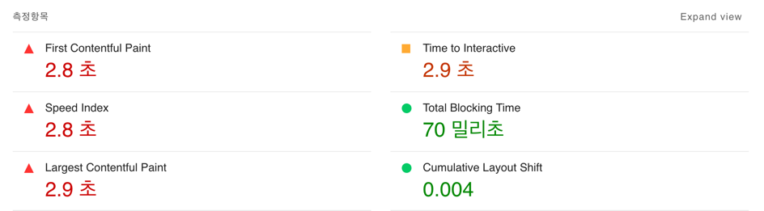
- 압축 후 속도
  - 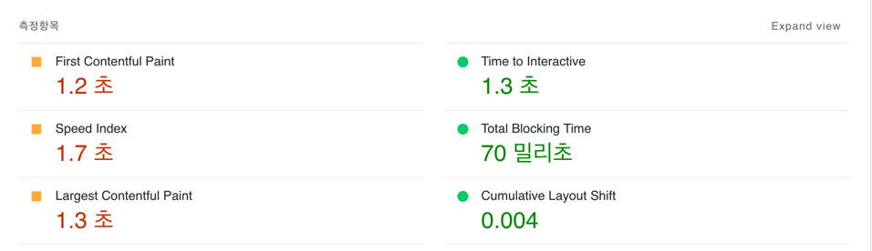

3. 부하테스트 전제조건은 어느정도로 설정하셨나요
- DAU : 55,000 (지하철 종결자의 DAU가 550,000이며 그 중 10%를 DAU로 설정)
- 피크 시간대 집중률 : 4
- 1명당 1일 평균 접속 혹은 요청수 : 9
  - 1명당 1일 평균 3번 접속하며 메인페이지와 경로검색 페이지 이동 및 경로검색해서 3회 요청하므로 1명당 일 평균 요청수는 9이다.
  - 3번 접속하는 이유는 왕복으로 인한 2번 접속 및 잠시 중간에 들려서 볼일을 본뒤 도착지로 가능 경우도 존재하기 때문이다.
- Throughtput
  - 1일 총 접속 수 : 55,000 * 9 = 495,000
  - 1일 평균 rps : 495,000 / 86400 = 5.72916667
  - 1일 평균 rps x (최대 트래픽 / 평소 트래픽) = 1일 최대 rps : 5.72916667 * 4 = 22.91666668
  - VU =  (23 * (3 * 0.5)) / 3 = 12

4. Smoke, Load, Stress 테스트 스크립트와 결과를 공유해주세요

테스트 스크립트는 **k6-script** 아래 있습니다.

- 접속 빈도가 높은 페이지 (메인페이지)
  - smoke
    - 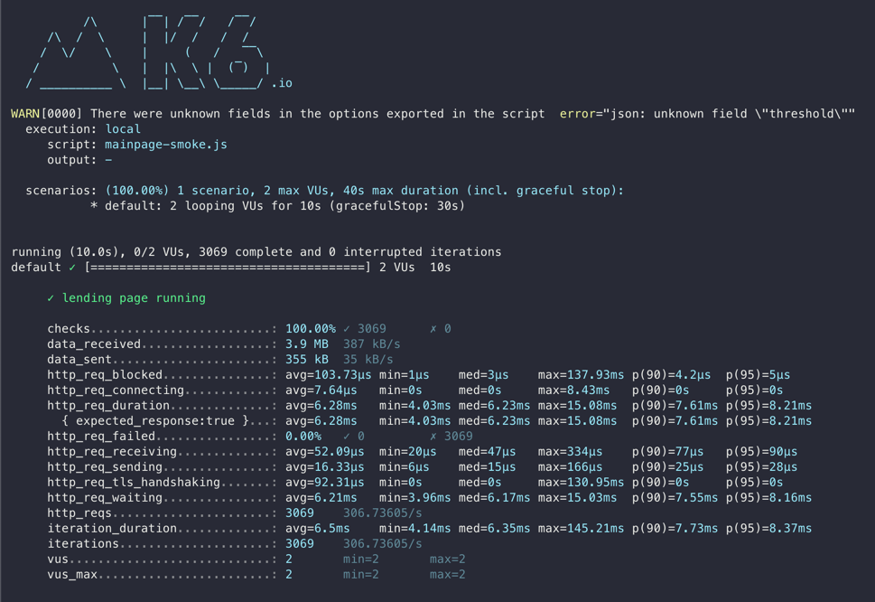
  - load
    - 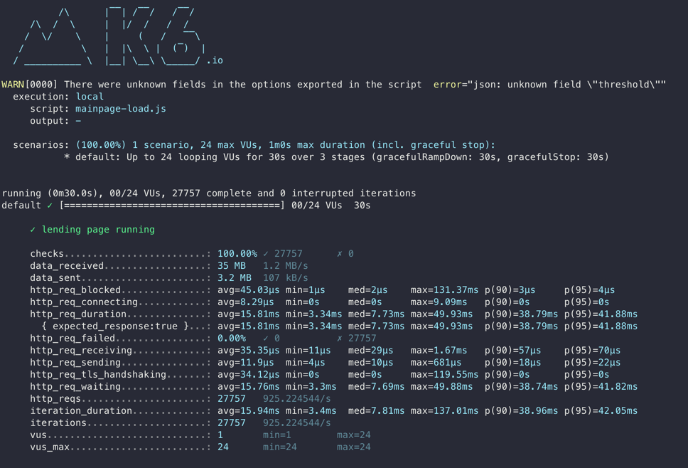
  - stress
    - 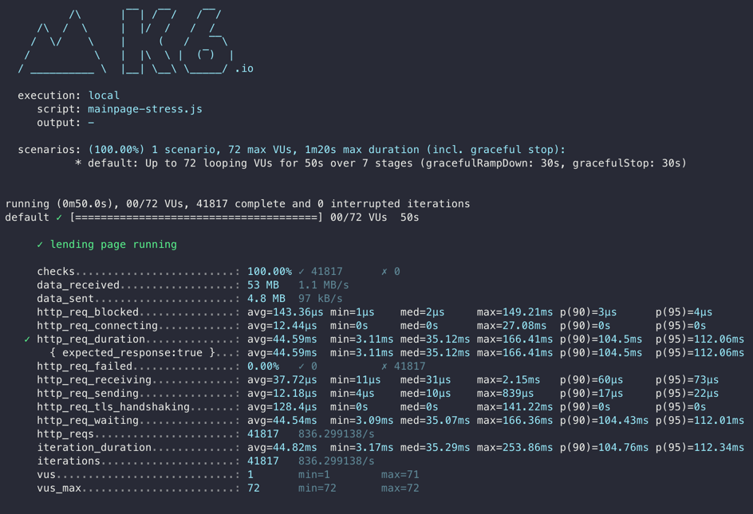
- 데이터를 갱신하는 페이지 (회원 정보 수정)
  - smoke
    - 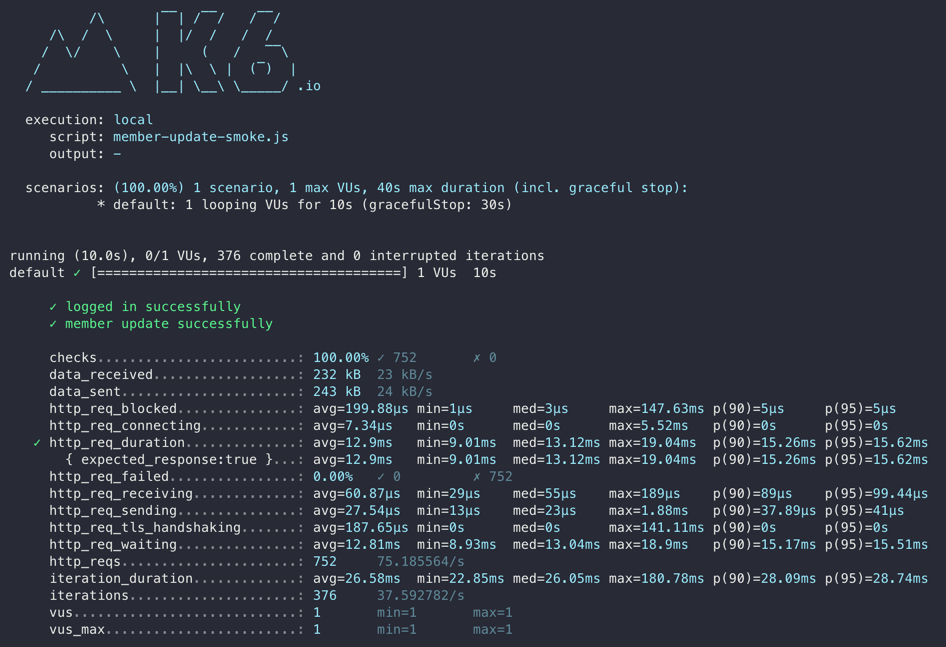
  - load
    - 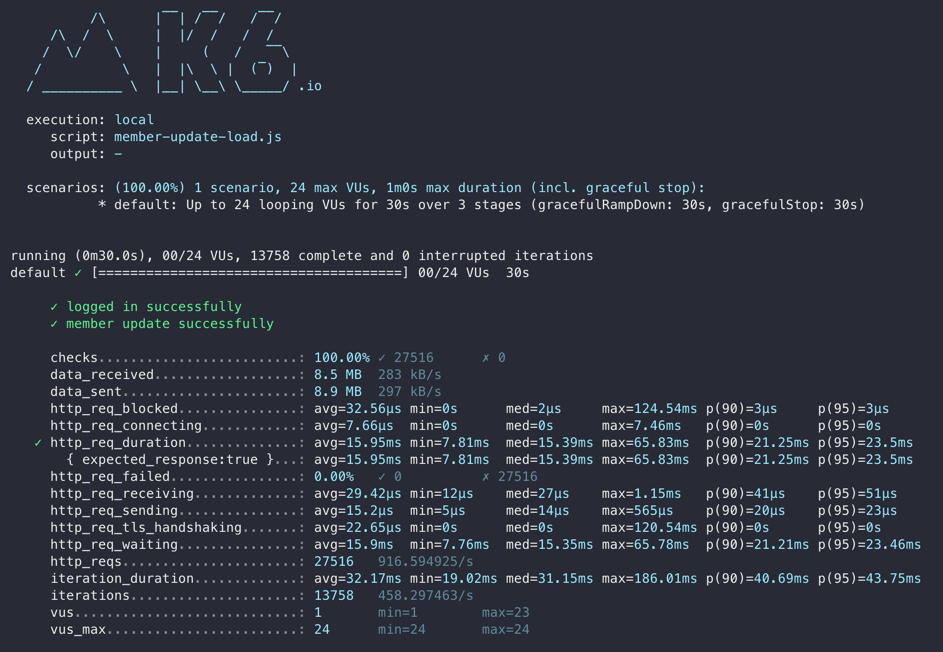
  - stress
    - 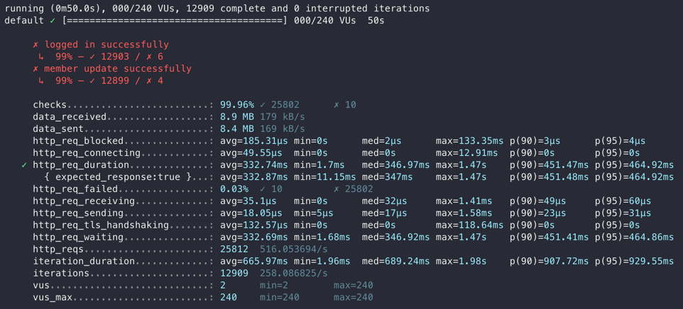
- 데이터를 조회하는데 여러 데이터를 참조하는 페이지 (구간 관리)
  - smoke
    - 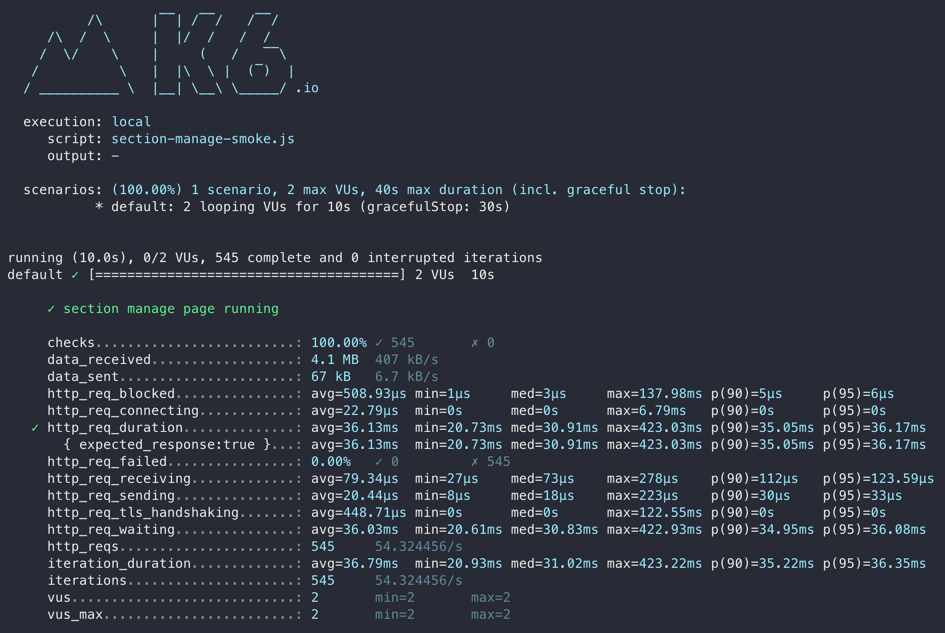
  - load
    - 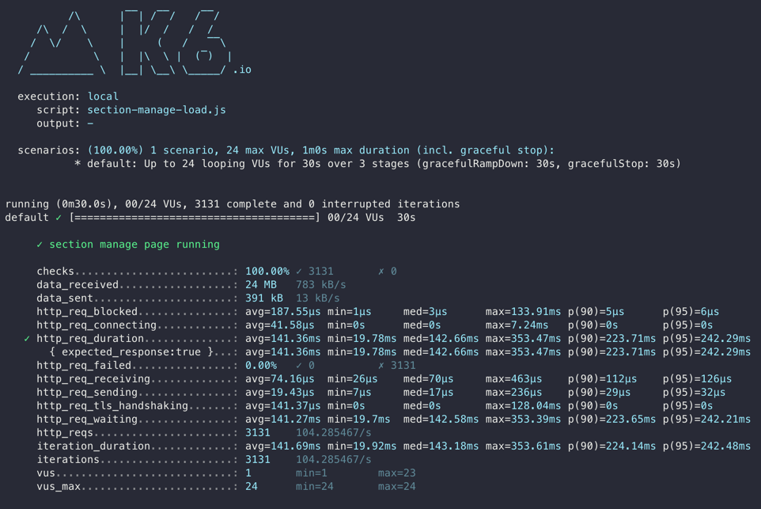
  - stress
    - 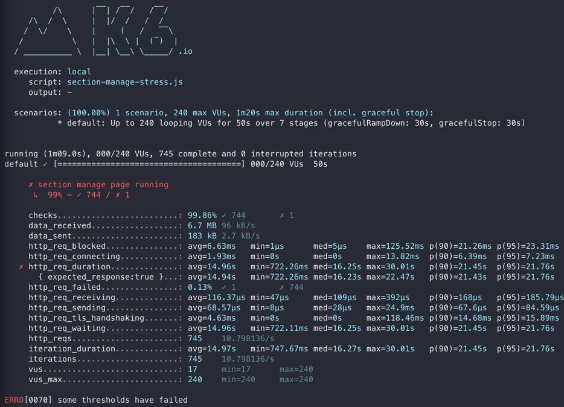
