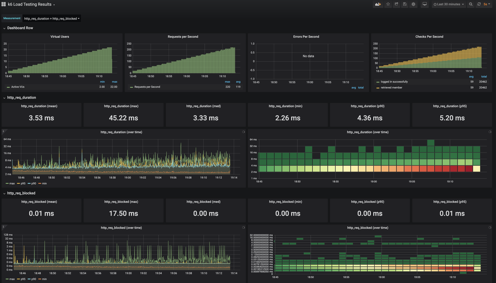
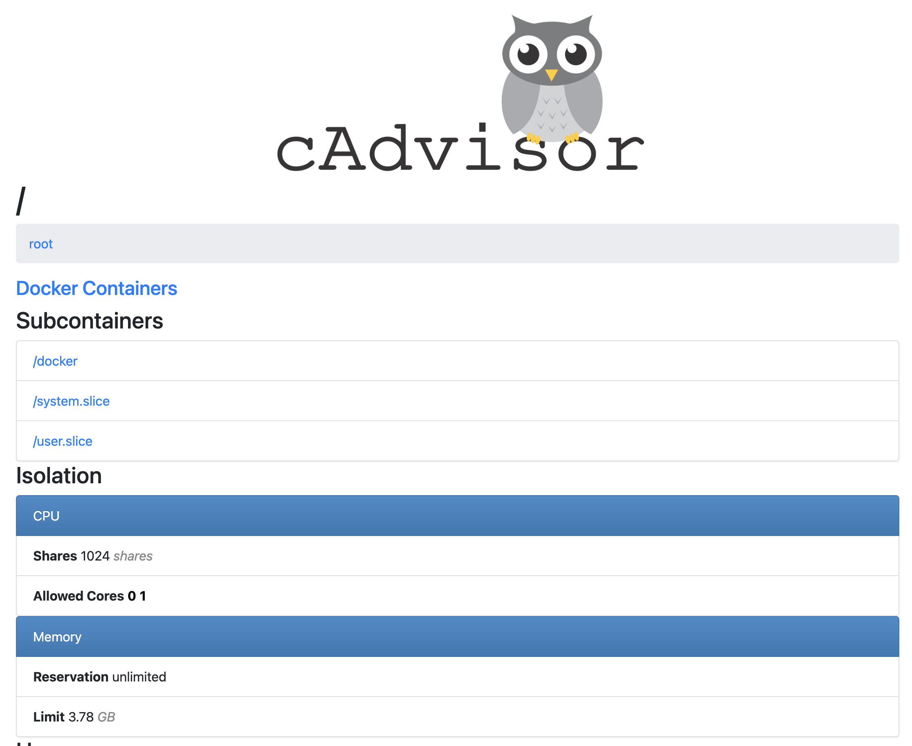
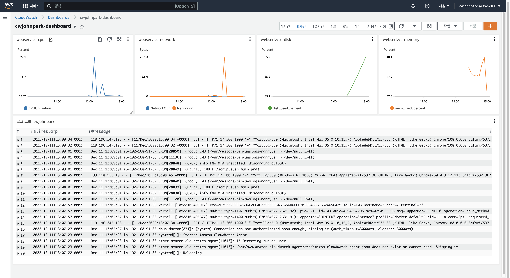

<p align="center">
    
</p>
<p align="center">
  
  
  <a href="https://edu.nextstep.camp/c/R89PYi5H" alt="nextstep atdd">
    
  </a>
  
</p>

<br>

# 인프라공방 샘플 서비스 - 지하철 노선도

<br>

## 🚀 Getting Started

### Install
#### npm 설치
```
cd frontend
npm install
```
> `frontend` 디렉토리에서 수행해야 합니다.

### Usage
#### webpack server 구동
```
npm run dev
```
#### application 구동
```
./gradlew clean build
```
<br>

## 웹 주소
- https://cwjonhpark-subway-px.o-r.kr/

### 1단계 - 웹 성능 테스트
1. 웹 성능예산은 어느정도가 적당하다고 생각하시나요

- 외부 자바스크립트 소스 파일은 1mb를 넘지 않아야 한다.
- 외부 자바스크립트 소스 파일 네트워크 시간은 100ms 미만이어야 한다.
- 3G 환경에서 FCP는 10초 미만이어야 한다.
- 웹브라우저 main thread 의 자바스크립트 소스 evaluation 시간은 1초 미만이어야 한다.
- TBT는 1초 미만이어야 한다.
- Lighthouse 의 Performance 점수가 90점 이상이어야 한다.

### 경쟁사 분석

|                 | FCP   | TTI   | SI    | TBT   | LCP   | CLS   |
|-----------------|-------|-------|-------|-------|-------|-------|
| **Running Map** | 13.8s | 14.9s | 14.4s | 410ms | 13.8s | 0.041 |
| 서울교통공사          | 8.7s  | 8.7s  | 33 s  | 0ms   | 9.1s  | 0     |
| 네이버 지도          | 2.2s  | 5.2s  | 3.0s  | 90ms  | 4.2s  | 0.005 |
| 카카오 지도          | 1.8s  | 7.7s  | 6.1s  | 40ms  | 5.5s  | 0.005 |


2. 웹 성능예산을 바탕으로 현재 지하철 노선도 서비스의 서버 목표 응답시간 가설을 세워보세요. 
- AS-IS: 15 s
- TO-BE: 1 s

### 서버 목표 응답시간 가설 근거
- 구글 폰트를 외부 CDN 이 아닌 자사의 정적 리소스 서버를 사용하여 1s 단축
- 자바스크립트 소스 파일을 gzip 으로 압축하여 클라이언트 단에 전송하여 10s 단축
- 사용하지 않는 자바스크립트 소스 코드를 제거하여 3s 단축
---

### 2단계 - 부하 테스트 

### 요구사항
#### 테스트 전제조건 정리
- 대상 시스템 범위
- 목푯값 설정 (latency, throughput, 부하 유지기간)
- 부하 테스트 시 저장될 데이터 건수 및 크기
- 아래 시나리오 중 하나를 선택하여 스크립트 작성
```markdown
1. 접속 빈도가 높은 페이지
2. 데이터를 갱신하는 페이지
3. 데이터를 조회하는데 여러 데이터를 참조하는 페이지
```
#### Smoke, Load, Stress 테스트 후 결과를 기록

---
## Answer
1. 부하테스트 전제조건은 어느정도로 설정하셨나요
### 목표 rps
- 예상 1일 사용자 수 
   - a. 1일 사용자 수(DAU): 100만 명 
   - b. 피크 시간대의 집중률(최대 트래픽 / 평소 트래픽): 5
   - c. 1명당 1일 평균 요청수: 2건
   - d. Throughput: 23 RPS(1일 평균) ~ 100 RPS(1일 최대)
### VUser
```markdown
Glossary
- Request Rate: measured by the number of requests per second (RPS)
- VU: the number of virtual users (VUser = (rps * T) / R)
- R: the number of requests per VU iteration
- T: a value larger than the time needed to complete a VU iteration (T = R * http_req_duration)
- Throughput : 1일 평균 rps ~ 1일 최대 rps
  - 1일 사용자 수(DAU) x 1명당 1일 평균 접속 수 = 1일 총 접속 수
  - 1일 총 접속 수 / 86,400 (초/일) = 1일 평균 rps
  - 1일 평균 rps x (최대 트래픽 / 평소 트래픽) = 1일 최대 rps
```
- T = (2 * 1s) + 1s = 4s
- VU = (2300 * 4s) / 2 = 2400 

2. Smoke, Load, Stress 테스트 스크립트와 결과를 공유해주세요

### Smoke
- VUser: 1
- Duration: 10m
- 99퍼센트 이상의 요청은 50ms 이내에 완료돼야 한다.
```json
{
  "vus": 1,
  "duration": "10m",

 "thresholds": {
    "http_req_duration": ["p(99)<50"]
 }
}
```
### 결과
```markdown
    ✓ logged in successfully
    ✓ retrieved member

    checks.........................: 100.00% ✓ 1126     ✗ 0
    data_received..................: 2.4 MB  3.9 kB/s
    data_sent......................: 481 kB  801 B/s
    http_req_blocked...............: avg=17.19ms  min=1.15µs  med=2.72µs  max=369.96ms p(90)=54.09ms  p(95)=100.78ms
    http_req_connecting............: avg=185.01µs min=0s      med=0s      max=15.05ms  p(90)=196.89µs p(95)=319.58µs
    ✗ http_req_duration..............: avg=15.9ms   min=2.29ms  med=9.65ms  max=1.38s    p(90)=28.66ms  p(95)=41.71ms
    { expected_response:true }...: avg=15.9ms   min=2.29ms  med=9.65ms  max=1.38s    p(90)=28.66ms  p(95)=41.71ms
    http_req_failed................: 0.00%   ✓ 0        ✗ 1126
    http_req_receiving.............: avg=47.39µs  min=26.41µs med=42.99µs max=631.06µs p(90)=58.19µs  p(95)=70.06µs
    http_req_sending...............: avg=21.35µs  min=6.68µs  med=14.89µs max=216.81µs p(90)=38.55µs  p(95)=44.39µs
    http_req_tls_handshaking.......: avg=16.98ms  min=0s      med=0s      max=369.73ms p(90)=53.31ms  p(95)=100.25ms
    http_req_waiting...............: avg=15.83ms  min=2.24ms  med=9.6ms   max=1.38s    p(90)=28.57ms  p(95)=41.65ms
    http_reqs......................: 1126    1.874138/s
    iteration_duration.............: avg=1.06s    min=1s      med=1.03s   max=2.89s    p(90)=1.15s    p(95)=1.21s
    iterations.....................: 563     0.937069/s
    vus............................: 1       min=1      max=1
    vus_max........................: 1       min=1      max=1
```


### Load
- VUser: 23
- Duration: 30m
- 99퍼센트 이상의 요청은 100ms 이내에 완료돼야 한다.

```json
{
  "stages": [
      { "duration": "30m", "target": 23 }
  ],
  "thresholds": {
    "http_req_duration": ["p(99)<100"]
  }
}
```

```markdown
     ✓ logged in successfully
     ✓ retrieved member

     checks.........................: 100.00% ✓ 41098     ✗ 0
     data_received..................: 15 MB   8.1 kB/s
     data_sent......................: 11 MB   6.1 kB/s
     http_req_blocked...............: avg=9.61µs  min=944ns   med=2.77µs  max=44.41ms  p(90)=4.9µs   p(95)=5.23µs
     http_req_connecting............: avg=367ns   min=0s      med=0s      max=400.52µs p(90)=0s      p(95)=0s
   ✓ http_req_duration..............: avg=3.52ms  min=2.26ms  med=3.32ms  max=45.22ms  p(90)=4.36ms  p(95)=5.19ms
       { expected_response:true }...: avg=3.52ms  min=2.26ms  med=3.32ms  max=45.22ms  p(90)=4.36ms  p(95)=5.19ms
     http_req_failed................: 0.00%   ✓ 0         ✗ 41098
     http_req_receiving.............: avg=48.73µs min=12.84µs med=44.98µs max=7.16ms   p(90)=65.11µs p(95)=73.34µs
     http_req_sending...............: avg=19.87µs min=5.31µs  med=17.74µs max=7.02ms   p(90)=30.79µs p(95)=38.31µs
     http_req_tls_handshaking.......: avg=3.93µs  min=0s      med=0s      max=31.98ms  p(90)=0s      p(95)=0s
     http_req_waiting...............: avg=3.45ms  min=2.22ms  med=3.24ms  max=45.12ms  p(90)=4.28ms  p(95)=5.11ms
     http_reqs......................: 41098   22.819538/s
     iteration_duration.............: avg=1s      min=1s      med=1s      max=1.06s    p(90)=1s      p(95)=1.01s
     iterations.....................: 20549   11.409769/s
     vus............................: 2       min=1       max=22
     vus_max........................: 23      min=23      max=23
```



### Stress
- VUser: 100~1000
- 99퍼센트 이상의 요청은 100ms 이내에 완료돼야 한다.

```json
{
  "stages": [
    { "duration": "2m", "target": 100 },
    { "duration": "1m", "target": 500 },
    { "duration": "30s", "target": 1000 },
    { "duration": "1m", "target": 500 },
    { "duration": "2m", "target": 100 }
  ],
  "thresholds": {
    "http_req_duration": ["p(99)<100"]
  }
}
```

```markdown
     ✗ logged in successfully
      ↳  97% — ✓ 110977 / ✗ 3115
     ✓ retrieved member

     checks.........................: 98.61% ✓ 221738     ✗ 3115
     data_received..................: 358 MB 916 kB/s
     data_sent......................: 86 MB  219 kB/s
     http_req_blocked...............: avg=42.88ms min=0s       med=2.37µs  max=1.26s    p(90)=167.12ms p(95)=275.15ms
     http_req_connecting............: avg=3.98ms  min=0s       med=0s      max=1.08s    p(90)=1.53ms   p(95)=14.14ms
   ✗ http_req_duration..............: avg=32.24ms min=0s       med=8.96ms  max=1.62s    p(90)=94.15ms  p(95)=155.86ms
       { expected_response:true }...: avg=32.44ms min=2.19ms   med=9.1ms   max=1.62s    p(90)=94.9ms   p(95)=156.25ms
     http_req_failed................: 1.47%  ✓ 3331       ✗ 221738
     http_req_receiving.............: avg=98.62µs min=0s       med=29µs    max=102.11ms p(90)=52.38µs  p(95)=92.46µs
     http_req_sending...............: avg=1.05ms  min=0s       med=12.46µs max=718.49ms p(90)=314.86µs p(95)=1.87ms
     http_req_tls_handshaking.......: avg=39.26ms min=0s       med=0s      max=943.05ms p(90)=143.12ms p(95)=254.3ms
     http_req_waiting...............: avg=31.09ms min=0s       med=8.76ms  max=1.62s    p(90)=90.73ms  p(95)=151.86ms
     http_reqs......................: 225069 575.673045/s
     iteration_duration.............: avg=1.12s   min=458.93µs med=1.02s   max=3.46s    p(90)=1.44s    p(95)=1.62s
     iterations.....................: 114092 291.820237/s
     vus............................: 92     min=1        max=1000
     vus_max........................: 1000   min=1000     max=1000

time="2022-12-09T11:07:23Z" level=error msg="some thresholds have failed"
```


---

### 3단계 - 로깅, 모니터링
#### 요구 사항
- 애플리케이션 진단하기 실습을 진행해보고 문제가 되는 코드를 수정
- 로그 설정하기
  - Application Log 파일로 저장하기
    - 회원가입, 로그인 등의 이벤트에 로깅을 설정
    - 경로찾기 등의 이벤트 로그를 JSON으로 수집
  - Nginx Access Log 설정하기
- Cloudwatch로 모니터링
  - Cloudwatch로 로그 수집하기
  - Cloudwatch로 메트릭 수집하기
  - USE 방법론을 활용하기 용이하도록 대시보드 구성

#### CAdvisor 적용


#### 과제
1. 각 서버내 로깅 경로를 알려주세요.
- nginx 로그 경로: `/var/log`
- application 로그 경로: `/home/ubuntu/nextstep/infra-subway-monitoring/log`
2. Cloudwatch 대시보드 URL을 알려주세요.
- https://ap-northeast-2.console.aws.amazon.com/cloudwatch/home?region=ap-northeast-2#dashboards:name=cwjohnpark-dashboard

