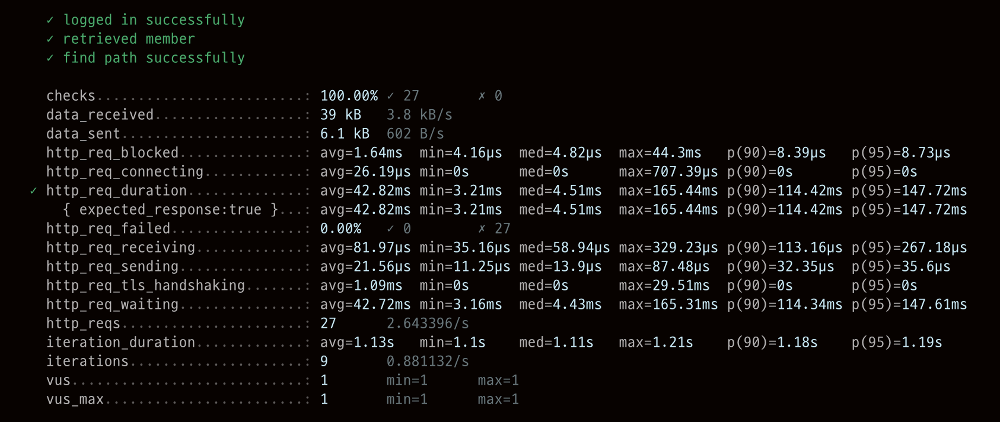
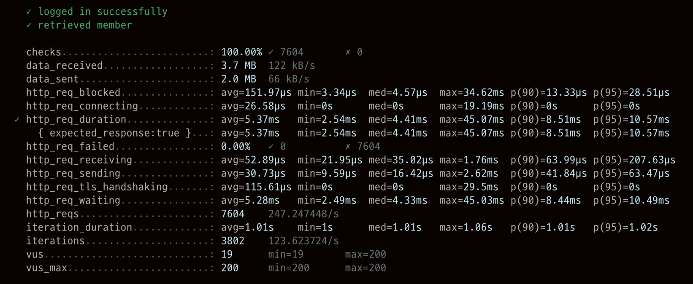
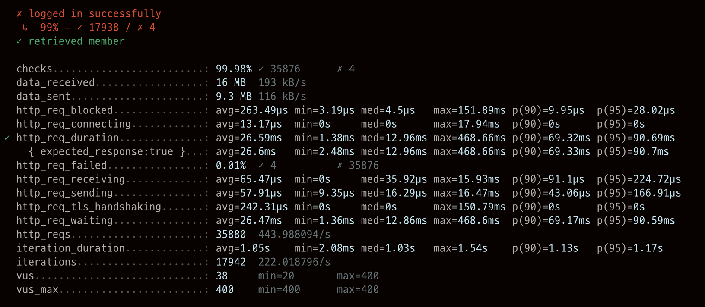
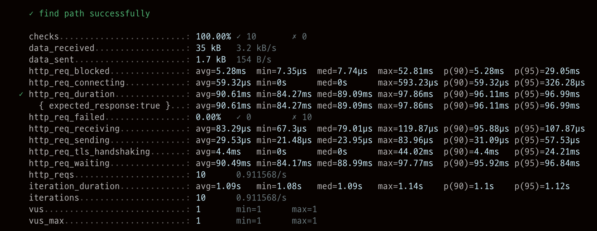
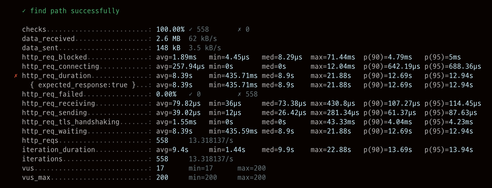
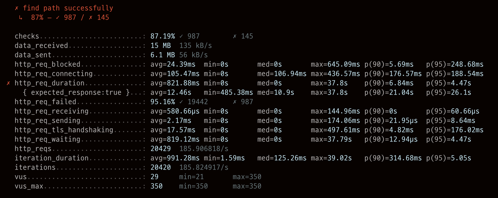

<p align="center">
    
</p>
<p align="center">
  
  
  <a href="https://edu.nextstep.camp/c/R89PYi5H" alt="nextstep atdd">
    
  </a>
  
</p>

<br>

# 인프라공방 샘플 서비스 - 지하철 노선도

<br>

## 🚀 Getting Started

### Install
#### npm 설치
```
cd frontend
npm install
```
> `frontend` 디렉토리에서 수행해야 합니다.

### Usage
#### webpack server 구동
```
npm run dev
```
#### application 구동
```
./gradlew clean build
```
<br>

## 미션

* 미션 진행 후에 아래 질문의 답을 작성하여 PR을 보내주세요.

### 1단계 - 인프라 운영하기
1. 각 서버내 로깅 경로를 알려주세요
   SYSLOG : /var/log/syslog
   NGINX ACCESS LOG : /var/log/nginx/access.log
   NGINX ERROR LOG : /var/log/nginx/error.log
   APP FILE LOG : /home/ubuntu/log/file.log
   APP JSON LOG : /home/ubuntu/log/json.log

2. Cloudwatch 대시보드 URL을 알려주세요
   URL : https://ap-northeast-2.console.aws.amazon.com/cloudwatch/home?region=ap-northeast-2#dashboards:name=DASHBOARD-dolilu

---

### 2단계 - 성능 테스트
1. 웹 성능예산은 어느정도가 적당하다고 생각하시나요
* 비교 사이트 : https://map.naver.com
* 비교 사이트 성능

|기기|FCP|TTI|SPEED INDEX|
|-----|-----|-----|-----|
|모바일|3.0초|5.8초|5.9초|
| PC |0.8초|3.2초|1.5초|

* 현 사이트 메인 페이지 성능

|기기|FCP|TTI|SPEED INDEX|
|-----|-----|-----|-----|
|모바일|15.4초|16.0초|16.0초|
| PC |2.7초|2.7초|2.8초|

* 현 사이트 경로 페이지 성능

|기기|FCP|TTI|SPEED INDEX|
|-----|-----|-----|-----|
|모바일|16.3초|17.2초|17.0초|
| PC |3.1초|3.2초|3.2초|

* 웹 성능 예산

|기기|FCP|TTI|SPEED INDEX|
|-----|-----|-----|-----|
|모바일|2.4초|4.5초|5.0초|
| PC |0.6초|2.5초|1.초|

비교 사이트 보다 로딩 시 읽어 오는 리소스가 적고 기능이 단순하여
사람들이 유의미한 차이로 느낀다는 20% 차이의 성능 예산을 잡았습니다.

#### 추가 자료

* gzip 적용 후현 사이트 메인 페이지 성능

|기기|FCP|TTI|SPEED INDEX|
|-----|-----|-----|-----|
|모바일|5.2초|6.0초|6.3초|
| PC |1.2초|1.3초|1.7초|

* gzip 적용 후 현 사이트 경로 페이지 성능

|기기|FCP|TTI|SPEED INDEX|
|-----|-----|-----|-----|
|모바일|7.1초|7.7초|7.4초|
| PC |1.5초|1.7초|2.1초|

2. 웹 성능예산을 바탕으로 현재 지하철 노선도 서비스는 어떤 부분을 개선하면 좋을까요

   * gzip 압축 적용 - 사이트 적용 해봄
   * 이미지 압축
   * 정적 컨텐츠 캐싱
   * CDN 적용 (cloudfront)
   * JS 지연 로딩 및 분리 가능한 파일 분리 및 불 필요한 JS 제거하여 필요한 위치에서만 로딩


3. 부하테스트 전제조건은 어느정도로 설정하셨나요
   * DAU 는 100만 (1000000)
   * 평균 접속 수 3 - 목적지에 가기 위하여 미리 한번, 왕복 이동 시 한번 씩 총 3번
   * 1일 평균 rps = 34.72
   * 최대 트래픽은 주말 피크 타임에 3배 정도 예상
   * 1일 최대 rps = 104.16
   
   
4. Smoke, Load, Stress 테스트 스크립트와 결과를 공유해주세요

   #### Login Test
   * Smoke Test
      * Test Result : rps 2.64, fail 0 %
        

   * Load Test
      * Test Result : rps 247.24, fail 0 %
        

   * Stress Test
      1. Test Result(Max 400) : rps 443.98, fail 0.01 %
         

      2. Test Result(Max 500) : rps 247.24, request fail 2.36 %, login fail 5%
         

   #### Path Test
   * Smoke Test
      * Test Result : rps 0.91, fail 0 %
        

   * Load Test
      * Test Result : rps 13.31, fail 0 %
        

   * Stress Test
      1. Test Result : rps 185.90, request fail 4.84 %, find path fail 13%
         


   ### Test 결과
   * 로그인의 경우 Max User가 400 부터 요청 에러 발생 시작, 500으로 늘어나면서 로그인 실패 (5%)
   * 경로 찾기의 경우 Max User가 260 부터 요청 에러 발생 시작, 300으로 늘어나면서 경로 찾기 실패 (13%)
   * 로그인의 rps가 목표치에 충분히 도달하나, 경로 찾기의 경우 Load rps가 상대적으로 낮음. 개선 작업 필요  
