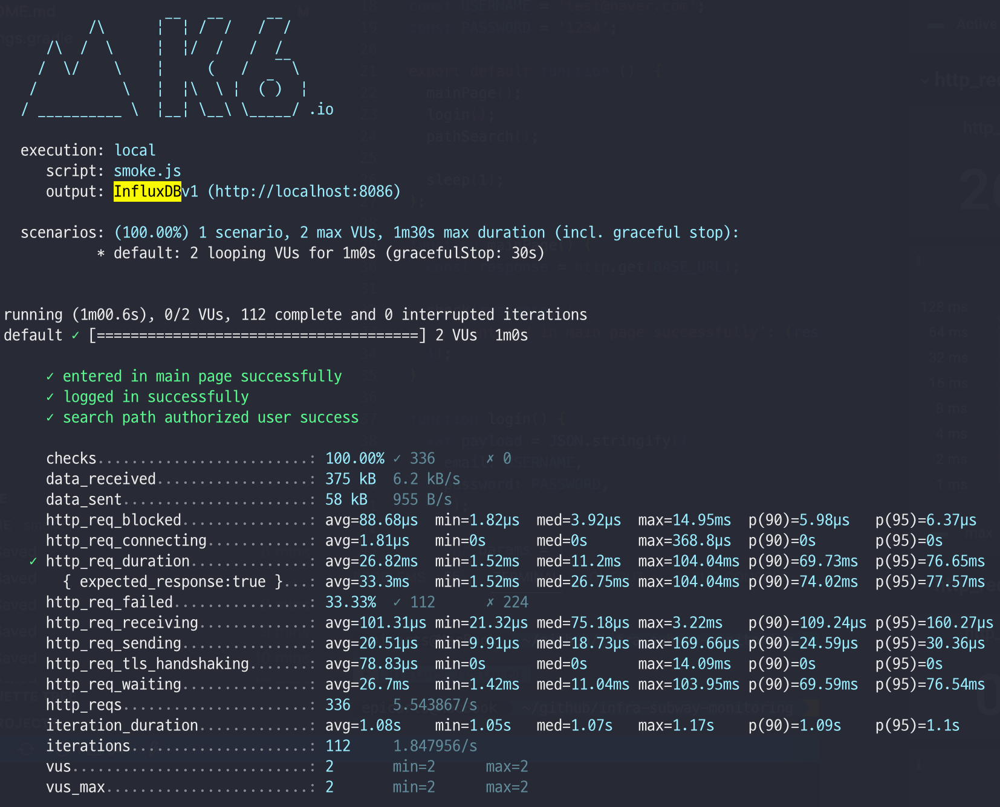
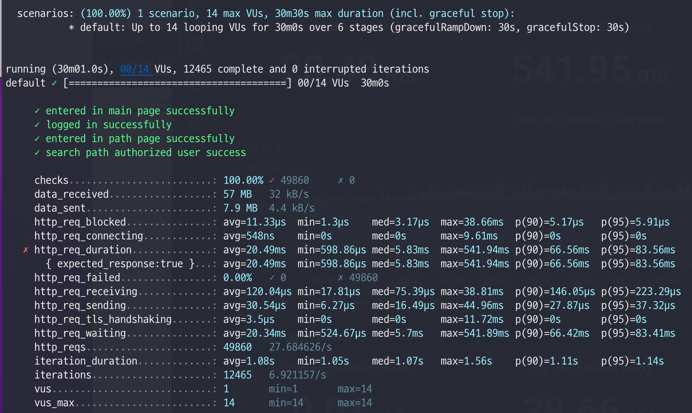
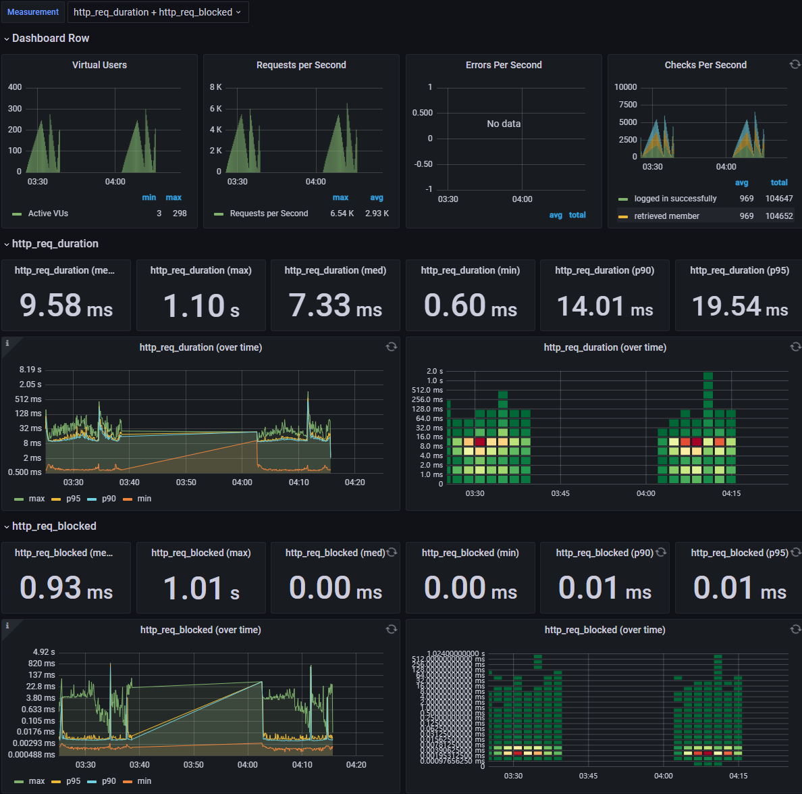

<p align="center">
    
</p>
<p align="center">
  
  
  <a href="https://edu.nextstep.camp/c/R89PYi5H" alt="nextstep atdd">
    
  </a>
  
</p>

<br>

# 인프라공방 샘플 서비스 - 지하철 노선도

<br>

## 🚀 Getting Started

### Install
#### npm 설치
```
cd frontend
npm install
```
> `frontend` 디렉토리에서 수행해야 합니다.

### Usage
#### webpack server 구동
```
npm run dev
```
#### application 구동
```
./gradlew clean build
```
<br>


### 1단계 - 웹 성능 테스트
1. 웹 성능예산은 어느정도가 적당하다고 생각하시나요

- 웹 성능 테스트

|                  | TTI | First Byte | Start Render | FCP    | [Speed Index](https://docs.webpagetest.org/metrics/speedindex/) | [LCP](https://www.webpagetest.org/vitals.php?test=220622_BiDc7X_EFY&run=2&cached=0#lcp) | [CLS](https://www.webpagetest.org/vitals.php?test=220622_BiDc7X_EFY&run=2&cached=0#cls) | [TBT](https://www.webpagetest.org/vitals.php?test=220622_BiDc7X_EFY&run=2&cached=0#tbt) | Total Bytes |
|------------------|-----|---------| ------ | ------ | ------------------------------------------------------------ | ------------------------------------------------------------ | ------------------------------------------------------------ | ------------------------------------------------------------ | ----------- |
| My 사이트           | 2.9 | 1.591   | 9.3  | 9.269  | 9.328 | 9.518  | 0.058  | 0.018 | 2,462  |
| 서울 교통 공사         | 2.0 | 1.603   | 5.9  | 5.894  | 9.839 | 5.897  | 0      | 8.787 | 1,064  |
| 네이버 지도           | 1.2 | 1.446   | 4    | 3.931  | 7.914 | 12.645 | 0.031  | 0.528 | 990    |
| 카카오맵             | 2.2 | 1.916   | 3.6  | 3.472  | 7.238 | 9.491  | 0.004  | 0.396 | 1,403  |


- 웹 성능 예산 결정

|                  | TTI | First Byte | Start Render | FCP    | [Speed Index](https://docs.webpagetest.org/metrics/speedindex/) | [LCP](https://www.webpagetest.org/vitals.php?test=220622_BiDc7X_EFY&run=2&cached=0#lcp) | [CLS](https://www.webpagetest.org/vitals.php?test=220622_BiDc7X_EFY&run=2&cached=0#cls) | [TBT](https://www.webpagetest.org/vitals.php?test=220622_BiDc7X_EFY&run=2&cached=0#tbt) | Total Bytes |
|------------------|-----|---------| ------ | ------ | ------------------------------------------------------------ | ------------------------------------------------------------ | ------------------------------------------------------------ | ------------------------------------------------------------ | ----------- |
| 네이버 지도, 카카오맵의 평균 | 1.7 | 1.681   | 3.8  | 3.7015 | 7.576 | 11.068 | 0.0175 | 0.462 | 1196.5 |
| 예산 설정            | 1.0 | 1.681   | 3.8  | 3.5 | 7.0 | 11.068 | 0.0175 | 0.462 | 1196.5 |

지표로 보았을 때 성능적인 측면은 카카오맵이 네이버 지도보다 조금 더 우세합니다. 
하지만 네이버 지도가 카카오맵보다 MAU가 높으므로 두 개의 웹사이트의 평균치를 고려하여 결정하였습니다.
(서울 교통 공사는 네이버 지도, 카카오맵 등 이미 상회하는 앱이 있기에 평균치 계산할 때 포함하지 않았습니다.)

따라서 `FCP`, `Speen Index`, `TTI` 부분을 개선해야 할 것으로 보입니다.
그중에서도 메인 페이지에서 제공하는 정보가 없는 경우에, 실제로 사용자가 사용할 수 있을때까지 걸리는 대기 시간인 
`TTI` 수치가 더 중요하므로 해당 값은 평균치보다 상회하는 값으로 결정하였습니다.  

[네이버와 카카오 MAU 비교 기사](https://www.techm.kr/news/articleView.html?idxno=73273)

2. 웹 성능예산을 바탕으로 현재 지하철 노선도 서비스는 어떤 부분을 개선하면 좋을까요

- 텍스트 압축
  - [참고](https://gitabout.com/18)

- 사용하지 않는 js 확인하기
- 이미지 요소 크기 지정 
- 캐시 사용가능한 부분에 대해 적용 

---

### 2단계 - 부하 테스트 
1. 부하테스트 전제조건은 어느정도로 설정하셨나요

- 예상 DAU: 500,000 
  - 카카오 지하철 기준으로 1/3으로 선정
- 피크 시간대의 집중률: 3
  - 지하철 시간대별 승객수를 기준으로 대략적으로 집중률 계산
  - [수도권 지하철 시간대별 승객 수(2호선)](https://insfiler.com/detail/rt_subway_time-0003) 
- 1명당 1일 평균 접속 수: 3 
  - 카카오 지하철 기준
- `Throughput`: 17.4 ~ 55
- `Latency`: 100ms 이하

2. Smoke, Load, Stress 테스트 스크립트와 결과를 공유해주세요
#### Smoke
- 경로: monitoring\smoke\smoke.js


#### Load
- 경로: monitoring\smoke\load.js


#### Stress
- 경로: monitoring\smoke\stress2.js


---

### 3단계 - 로깅, 모니터링
1. 각 서버내 로깅 경로를 알려주세요

2. Cloudwatch 대시보드 URL을 알려주세요
