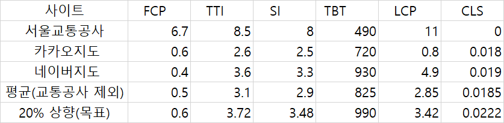

<p align="center">
    
</p>
<p align="center">
  
  
  <a href="https://edu.nextstep.camp/c/R89PYi5H" alt="nextstep atdd">
    
  </a>
  
</p>

<br>

# 인프라공방 샘플 서비스 - 지하철 노선도

<br>

## 🚀 Getting Started

### Install
#### npm 설치
```
cd frontend
npm install
```
> `frontend` 디렉토리에서 수행해야 합니다.

### Usage
#### webpack server 구동
```
npm run dev
```
#### application 구동
```
./gradlew clean build
```
<br>


### 1단계 - 웹 성능 테스트
1. 웹 성능예산은 어느정도가 적당하다고 생각하시나요

- 유독 느린 경쟁사는 제외
- 기본적으로 경쟁사들의 평균치 수준을 기준으로 하되,
- 20% 이상 차이가 나지 않고
- 가능한 한 FCP 3초, TTI 5초를 초과 하지 않는 수준


2. 웹 성능예산을 바탕으로 현재 지하철 노선도 서비스의 서버 목표 응답시간 가설을 세워보세요.

서울교통공사 기준 웹성능 지표에 따르면 개선 방안은 다음과 같습니다.

- 텍스트 압축
- 렌더링 차단 리소스
- 초기 서버 응답 시간 단축

위 사상을 개선한다면 속도는 적어도 아래 목표시간을 충족 할 수 있다고 보입니다.



---

### 2단계 - 부하 테스트 

- [X] 부하 테스트
    - [X] 테스트 전제조건 정리
        - [X] 대상 시스템 범위
        - [X] 목푯값 설정 (latency, throughput, 부하 유지기간)
        - [X] 부하 테스트 시 저장될 데이터 건수 및 크기
    - [X] 아래 시나리오 중 하나를 선택하여 스크립트 작성
        - [X] 접속 빈도가 높은 페이지
        - [X] 데이터를 갱신하는 페이지
        - [X] 데이터를 조회하는데 여러 데이터를 참조하는 페이지
    - [X] Smoke, Load, Stress 테스트 후 결과를 기록


1. 부하테스트 전제조건은 어느정도로 설정하셨나요

#### 대상 시스템 범위
- 메인페이지 이동
- 경로검색페이지 이동
- 경로 조회

#### 목푯값 설정 (latency, throughput, 부하 유지기간)

- 예상 DAU : 20만 
  - 네이버지도 약 34만, 카카오맵 약 24만
  - 최소조건으로 경쟁사중 상대적으로 낮은 카카오맵의 20% 이상 차이나지 않는 것을 목표
  - 24 * 0.8 = 약 20만
- 피크 시간대 집중률 : 3.5
  - 교통량 집중률 통계분석시 보통 k=2부터 k=5 로 클러스팅하여 산출함
  - 2~5 의 중간 수준으로 산출
- 1명 1일 평균 요청수 : 5 * 2 = 10
  - 기능당 요청건수 : 5 
  - 출퇴근 등 이동시 왕복 접속 2회
- throughput 계산
  - 1일 총 접속 수 : 20만 * 10 = 200만
  - 1일 평균 rps = 200만 / 86,400 (초/일) = 23.1 rps
  - 1일 최대 rps = 4.63 * 2 =46.2

- VUser
    - R: 5
    - http_req_duration: 0.2
    - T = (R * http_req_duration) (+ 1s) : 2
    - 평균 VUser = (평균 rps * T) / R = 23.1 * 2 / 5 = 9.2
    - 최대 VUser = (최대 rps * T) / R : 18.4
- latency
    - 200ms

2. Smoke, Load, Stress 테스트 스크립트와 결과를 공유해주세요

- K6폴더에 정리해 두었습니다.
---

### 3단계 - 로깅, 모니터링
1. 각 서버내 로깅 경로를 알려주세요

2. Cloudwatch 대시보드 URL을 알려주세요
