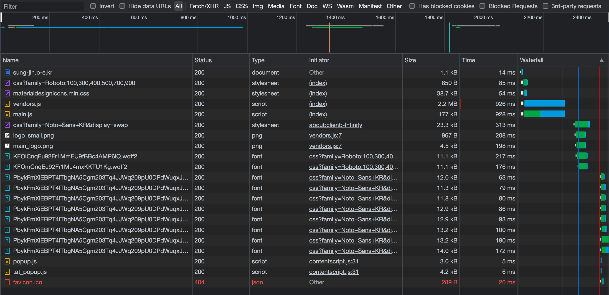

<p align="center">
    
</p>
<p align="center">
  
  
  <a href="https://edu.nextstep.camp/c/R89PYi5H" alt="nextstep atdd">
    
  </a>
  
</p>

<br>

# 인프라공방 샘플 서비스 - 지하철 노선도

<br>

## 🚀 Getting Started

### Install
#### npm 설치
```
cd frontend
npm install
```
> `frontend` 디렉토리에서 수행해야 합니다.

### Usage
#### webpack server 구동
```
npm run dev
```
#### application 구동
```
./gradlew clean build
```
<br>


### 1단계 - 웹 성능 테스트

1. 웹 성능예산은 어느정도가 적당하다고 생각하시나요
   
* [자사앱](https://sung-jin.p-e.kr/)
  
| 구분 | FCP | TTI | SI | TBT | LCP | CLS |
| --- | --- | --- | --- | --- | --- | --- |
| 모바일 | 14.4s | 15.1s | 14.4s | 0.660s | 15.1s | 0.047 |
| 데스크톱 | 2.7s | 2.8s | 2.7s | 0.07s | 2.8s | 0.003 |

* [서울교통공사](http://www.seoulmetro.co.kr/kr/cyberStation.do)

| 구분 | FCP | TTI | SI | TBT | LCP | CLS |
| --- | --- | --- | --- | --- | --- | --- |
| 모바일 | 14.8s | 15.5s | 14.8s | 0.7s | 15.4s | 0.042 |
| 데스크톱 | 1.6s | 2.2s | 2.5s | 0.25s | 3.5s | 0.014 |

* [네이버지도](https://m.map.naver.com/subway/subwayLine.naver?region=1000)

| 구분 | FCP | TTI | SI | TBT | LCP | CLS |
| --- | --- | --- | --- | --- | --- | --- |
| 모바일 | 2.0s | 6.5s | 4.6s | 0.24s | 7.6s | 0.03 |
| 데스크톱 | 0.5s | 0.7s | 2.0s | 0.01s | 1.6s | 0.006 |

* [카카오맵](https://m.map.kakao.com/)

| 구분 | FCP | TTI | SI | TBT | LCP | CLS |
| --- | --- | --- | --- | --- | --- | --- |
| 모바일 | 1.7s | 4.3s | 6.1s | 0.07s | 4.7s | 0.005 |
| 데스크톱 | 0.5s | 1.1s | 1.9s | 0.02s | 1.1s | 0.039 |

* 경사의 결과를 바탕으로 다음과 같은 목표로 정하였습니다.
    * FCP: 모바일 - 1.5s 이내 / 데스크톱 - 0.4s 이내
    * TTI: 모바일 - 4s 이내 / 데스크톱 - 0.6s 이내
    * SI: 모바일 - 5s 아내 / 데스크톱 - 2.0s 이내
    * TBT: 모바일 - 0.2s 이내 / 데스크톱 - 0.01s 이내
    * LCP: 모바일 - 7s 이내 / 데스크톱 - 1.5s 이내
    * CLS: 모바일 - 0.05 이내 / 데스크톱 - 0.01 이내
* 위와 같이 설정한 이유는 다음과 같습니다
    * 지하철 노선 조회/검색이 주 목표이므로 TTI 가 가장 중요하다고 생각합니다
    * 그 다음으로 사용자가 페이지에 접근하는데 첫 로드가 되는 속도도 중요하다고 생각하기 때문에 다음으로 중요하다고 생각합니다
    * 다른 경쟁사의 경우 지하철 뿐 아니라 여러 기능을 제공하고, 자사앱은 지하철 기능만 제공하므로 최소한 가장 중요한 FCP / TTI 는 더 효율이 좋아야 한다고 생각했습니다


2. 웹 성능예산을 바탕으로 현재 지하철 노선도 서비스는 어떤 부분을 개선하면 좋을까요

- 텍스트를 압축하여 사용
- js/css 최적화 하기
    * 사용하지 않는 js/css 다이어트
    * 렌더링 차단 리소스를 제거하여 중요한 js/css 를 인라인으로 전달
    * 중요하지 않은 js/css 는 지연하여 전달
- 효율적인 캐시 정책을 사용하여 정적인 애셋 제공
- 웹폰트가 로드되는 동안 텍스트 표시
- 모든 스크립트 파일은 1 MB 를 넘기지 않는다
  
- [링크](https://pagespeed.web.dev/report?url=https%3A%2F%2Fsung-jin.p-e.kr%2F&form_factor=mobile) 의 모바일은 75, 데스크톱은 90 을 넘어야 한다
    * 지하철 경로만 제공하므로, 지하철 기능 뿐 아니라 지도를 제공하는 경쟁사인 네이버(52/89), 카카오(67,92) 의 서비스보다는 높거나 비슷해야 한다고 생각합니다.
    * 특히, 해당 서비스 특성상 데스크톱보다는 모바일 위주이므로 모바일의 점수가 높아야 한다고 생각합니다.

#### 참고

* FCP(First Contentful Paint)
    * 콘텐츠가 포함된 첫 페인트
    * 첫 번째 텍스트 또는 이미지가 표시되는 시간
* TTI(Time to Interactive)
    * 사용할 수 있을 때까지 걸리는 시간
    * 완전히 페이지와 상호작용을 할 수 있게 될 때까지의 시간
* SI(Speed Index)
    * 속도 색인
    * 페이지 콘텐츠가 얼마나 빨리 표시되는가
* TBT(Total Blocking Time)
    * FCP 와 상호작용 시간 사이의 모든 시간의 합
* LCP(Largest Contentful Paint)
    * 콘텐츠가 포함된 최대 페인트
    * 최대 텍스트 또는 이미지가 표시되는 시간
* CLS(Cumulative Layout Shift)
    * 누적 레이아웃 변경
    * 표시 영역 안에 보이는 요소의 이동을 측정

---

### 2단계 - 부하 테스트

#### 요구사항

* 부하 테스트
    * 테스트 전제조건 정리
        * [x] 대상 시스템 범위
        * [x] 목푯값 설정 (latency, throughput, 부하 유지기간)
        * [x] 부하 테스트 시 저장될 데이터 건수 및 크기
    * 각 시나리오에 맞춰 스크립트 작성
        * [x] 접속 빈도가 높은 페이지
        * [ ] 데이터를 갱신하는 페이지
        * [ ] 데이터를 조회하는데 여러 데이터를 참조하는 페이지
    * [x] Smoke, Load, Stress 테스트 후 결과를 기록

1. 부하테스트 전제조건은 어느정도로 설정하셨나요

**수도권 지하철만 기준으로 진행한다**

- 대상 시스템 범위
    * 접속 빈도가 높은 기능
        1. 메인홈
        2. 경로검색
        3. 즐겨찾기
    * 데이터를 갱신하는 페이지
        1. 지하철역 관리
        2. 노선관리
        3. 구간관리
        4. 회원가입
        5. 즐겨찾기
    * 데이터를 조회하는데 여러 데이터를 참조하는 페이지
        1. 경로찾기

- 목표값 설정
    * DAU(Daily Active User) - 100만
        * 2021.08 안드로이드 지하철종결자(197만)/카카오지하철(164만) 을 기준으로 산정
        * 위 기준은 안드로이드 기준이므로 아이폰 사용자도 존재함
        * 안드로이드, 아이폰, 데스크톱, 기타 사용자를 기준으로 판단함
        * 기존에 자리잡혀있는 시장이며, 기존의 사용자를 끌여들이거나 새로운 사용자를 찾아야 하는 시스템이므로 초기 DAU 는 100 만으로 산정
        * 일정 수준 사용자가 확보되고 알려지면 폭발적으로 사용자가 늘어날 수 있음을 유의하고, 확장에 가능하도록 구현 및 시스템을 구축해야 함
    * traffic
        * 21.04 기준 하루 지하철 이용자 수(450만)
        * 가장 피크 시간대인 출/퇴근시의 지하철 이용자 수(각 100만)
        * 지하철 운행 시간(06-00) 시간별 평균 이용자 수: 450만 / 19 = 23.7
        * 피크 시간대의 집중률: 100만 / 23.7만 = 4.2
    * throughput
        * 1일 총 접속 수: DAU(100만) * 일평균 실행횟수(3) = 300만
        * 1일 평균 rps: 300만 / 86,400 = 34.7
        * 지하철 운행 시간(06-00) 평균 rps: 300만 / 68400 = 43.9
        * 1일 최대 rps: 43.9 * 4.2 = 184.4
    * latency
        * 50 ms 이하
    * **대부분 산정 기준이 2019 기준으로 되어있으므로, 수도권 인구 증가 등을 고려해야 한다**

- 부하 테스트 시 저장될 데이터 건수 및 크기(brainbackdoor/data-subway:0.0.1 기준)
    * 노선수: 23개
    * 역수: 616개
    * 노선수: 340개

2. Smoke, Load, Stress 테스트 스크립트와 결과를 공유해주세요

* 메인 페이지
    * [모니터링 스크립트](monitoring/frequent/main)
    * [모니터링 결과](monitoring/frequent/main/output)
* 경로찾기 페이지
    * [모니터링 스크립트](monitoring/frequent/findPath)
    * [모니터링 결과](monitoring/frequent/findPath/output)
* 즐겨찾기 페이지
    * [모니터링 스크립트](monitoring/frequent/favorite)
    * [모니터링 결과](monitoring/frequent/favorite/output)

#### 산정 근거

* [데이터로 보는 서울시 대중교통 이용](https://www.bigdata-map.kr/datastory/traffic/seoul)
    * 2021.04 서울시(960만) 기준 지하철 이용객은 450만
    * 지하철 이용객 중 가장 많이 이용하는 시간
        * 출근시간(08-09): 100만
        * 퇴근시간(18-19): 100만
        * 막차시간(22-01): 40만
            * 막차시간의 경우 평균적으로 이용객 수는 많지 않지만, 지하철 시스템 상 막차 시간대에 이용객 대비 많은 사용자가 시간과 경로를 알아보기 위해 이용할 것을 감안하여 실제 이용객보다 많은 트래픽이 예상됨
* [2016 기준 카카오 지하철](https://ko.lab.appa.pe/2016-09/kakao-korea.html)
    * MAU(Monthly Activity User): 100만
    * 일평균 실행횟수 3
* [2021.08 안드로이드 10세 이상 사용자 앱 사용 추정](https://blog.naver.com/rkwkrhspm/222515422896)
    * 네이버지도: 1392만
    * 티맵: 1020만
    * 카카오맵: 729만
    * 지하철종결자: 197만
    * 카카오지하철: 164만

---

### 3단계 - 로깅, 모니터링

#### 요구사항

* [x] 어플리케이션 진단하기 실습을 진행해보고 문제가 되는 코드 수정
* 로그 설정
    * [x] Application Log 파일로 저장
        * 회원가입/로그인 등의 이벤트에 로깅 설정
        * 경로찾기 등의 이벤트 로그를 JSON 으로 수집
    * [x] Nginx Access log 설정
* CloudWatch 모니터링
    * [x] Cloudwatch 로 로그 수집
    * [x] Cloudwatch 로 메트릭 수집
    * [x] USE 방법론을 활용하기 용이하도록 대시보드 구성
 
1. 각 서버내 로깅 경로를 알려주세요

* 다음과 같은 정보로 접속하시면 됩니다.
    * ssh -i [pem] bastion@3.38.112.79 -> ssh ubuntu@app
* Application Log 경로: /home/ubuntu/nextstep/infra-subway-monitoring
* Nginx Access Log 경로: /var/log/nginx

3. Cloudwatch 대시보드 URL을 알려주세요

https://ap-northeast-2.console.aws.amazon.com/cloudwatch/home?region=ap-northeast-2#dashboards:name=sung-jin-dashboard
