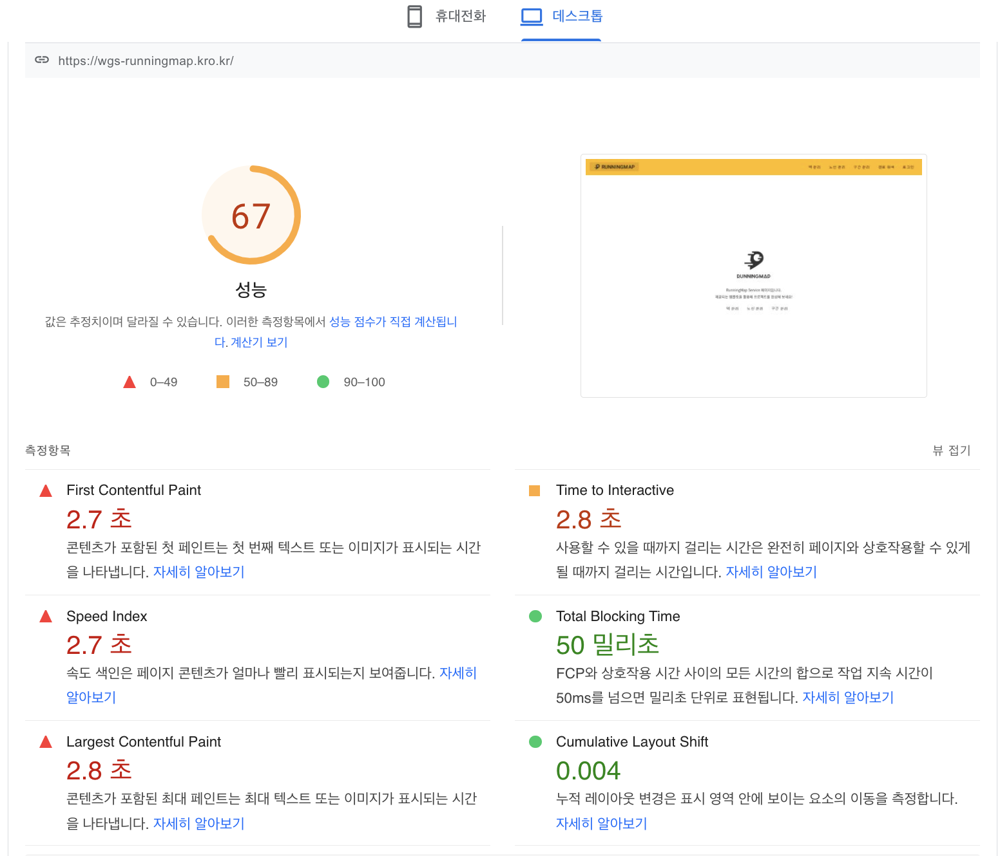
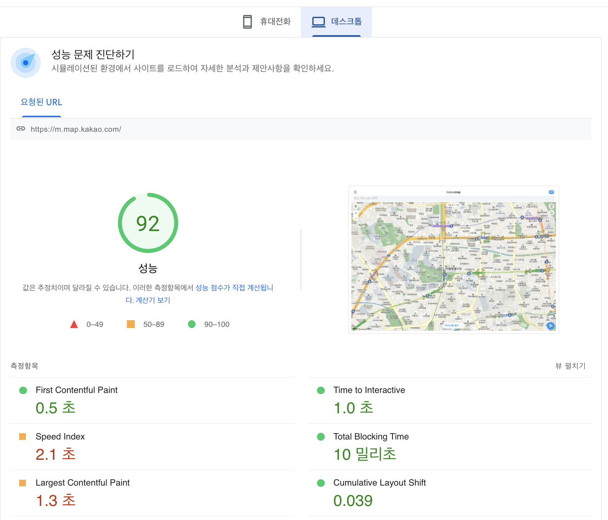
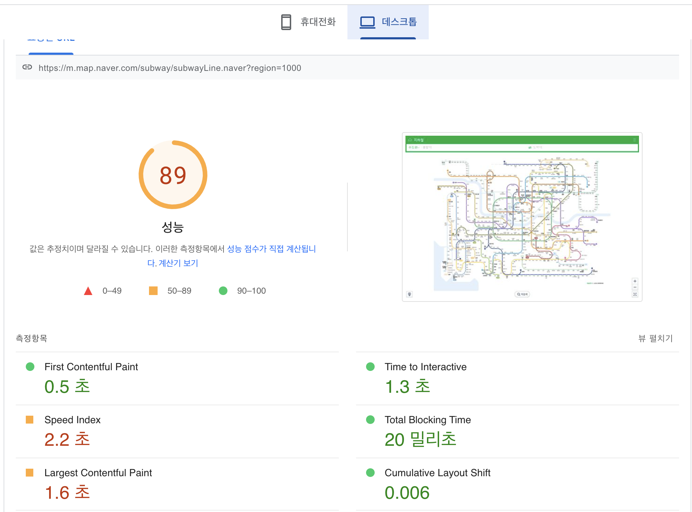

<p align="center">
    
</p>
<p align="center">
  
  
  <a href="https://edu.nextstep.camp/c/R89PYi5H" alt="nextstep atdd">
    
  </a>
  
</p>

<br>

# 인프라공방 샘플 서비스 - 지하철 노선도

<br>

## 🚀 Getting Started

### Install
#### npm 설치
```
cd frontend
npm install
```
> `frontend` 디렉토리에서 수행해야 합니다.

### Usage
#### webpack server 구동
```
npm run dev
```
#### application 구동
```
./gradlew clean build
```


### 1단계 - 성능 테스트
1. 웹 성능예산은 어느정도가 적당하다고 생각하시나요
   ### pagespeed를 이용한 성능 분
   
   
   

<ul>
   <li>FCP 0.5초 미만</li>
   <li>TTI 1.5초 미만</li>
   <li>LCP 1.3초 미만</li>
   <li>압축된 리소스 최대 크기 200KB 미만</li>
  </ul> 

2. 웹 성능예산을 바탕으로 현재 지하철 노선도 서비스는 어떤 부분을 개선하면 좋을까요
<ul>
   <li>FCP를 줄이기 위해 gzip 압축을 사용하면 좋을 것 같고, 사용하지 않는 자바스크립트는 줄이고 지연로을 고려하면 좋을 것 같습니다.</li>
 </ul>


3. 부하테스트 전제조건은 어느정도로 설정하셨나요
<ul>
<li> DAU = 1,930,000</li>
<li> 피크시간대 집중율 = 평소 트래픽 10배</li>
<li> 1명당 1일 평균 요청 수 = 2</li>
<li> latency 목표값 0.1s</li>
</ul>

<ul>
<li> 1일 총 접속수 = 1,930,000 * 2 = 3,860,000</li>
<li> 1일 평균 rps = 45</li>
<li> 1일 최대 rps = 450</li>
</ul>

### 로그인페이지 
- 시나리오상 요청 수 = 2
- T(목표 응답시간) = (2 * 0.1) + 0 = 0.2s
- 평균 트래픽 VUser = (45 * 0.2) / 2 = 4.5
- 최대 트래픽 VUser = (450 * 0.2) / 2 = 45

###노선관리 페이지 
- 시나리오상 요청 수 = 2
- T(목표 응답시간) = (2 * 0.1) + 0 = 0.2s
- 평균 트래픽 VUser = (45 * 0.2) / 2 = 4.5
- 최대 트래픽 VUser = (450 * 0.2) / 2 = 45

###경로검색 페이지 
- 시나리오상 요청 수 = 1
- T(목표 응답시간) = (1 * 0.1) + 0 = 0.1s
- 평균 트래픽 VUser = (45 * 0.1) / 1 = 4.5
- 최대 트래픽 VUser = (450 * 0.1) / 1 = 45

4. Smoke, Load, Stress 테스트 스크립트와 결과를 공유해주세요
- [접속 빈도가 높은 페이지 - 로그인 페이지 테스트 결과](LoginK6Test.md)
- [데이터를 갱신하는 페이지 - 노선관리 테스트 결과](LineK6Test.md)
- [데이터를 조회하는데 여러 데이터를 참조하는 페이지 - 경로 검색 테스트 결과](PathK6Test.md)


---

### 2단계 - 화면 응답 개선하기
1. 성능 개선 결과를 공유해주세요 (Smoke, Load, Stress 테스트 결과)

2. 어떤 부분을 개선해보셨나요? 과정을 설명해주세요

---

### [추가] 로깅, 모니터링
1. 각 서버내 로깅 경로를 알려주세요

2. Cloudwatch 대시보드 URL을 알려주세요
