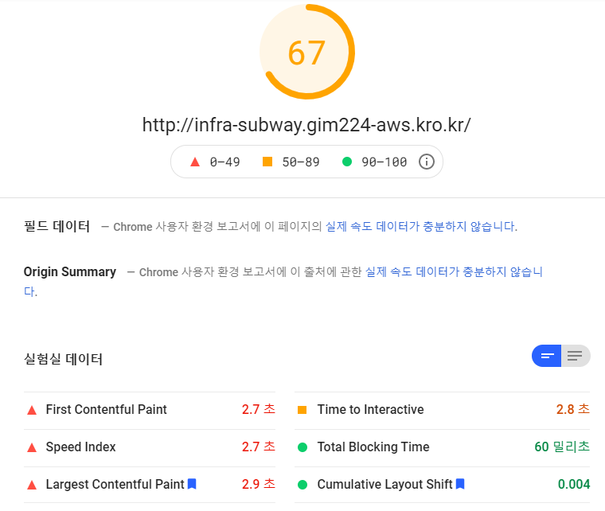
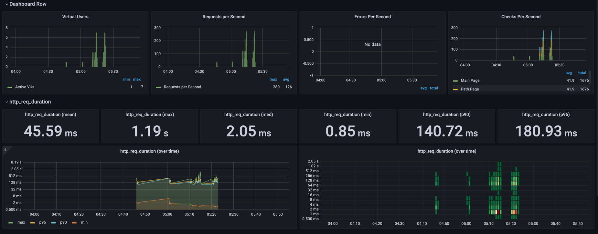

<p align="center">
    
</p>
<p align="center">
  
  
  <a href="https://edu.nextstep.camp/c/R89PYi5H" alt="nextstep atdd">
    
  </a>
  
</p>

<br>

# 인프라공방 샘플 서비스 - 지하철 노선도

<br>

## 🚀 Getting Started

### Install
#### npm 설치
```
cd frontend
npm install
```
> `frontend` 디렉토리에서 수행해야 합니다.

### Usage
#### webpack server 구동
```
npm run dev
```
#### application 구동
```
./gradlew clean build
```
<br>

## 미션

* 미션 진행 후에 아래 질문의 답을 작성하여 PR을 보내주세요.

### 1단계 - 인프라 운영하기
1. 각 서버내 로깅 경로를 알려주세요
   (public) 3.36.89.93 / 192-168-93-24 
   log : /infra-subway-monitoring/log
   nginx : /var/log/nginx/
2. Cloudwatch 대시보드 URL을 알려주세요
   https://ap-northeast-2.console.aws.amazon.com/cloudwatch/home?region=ap-northeast-2#dashboards:name=DASHBOARD-leechungsun

### 1단계 요구사항

#### 로깅 설정하기
-[ ] Application Log 파일로 저장하기
    * 회원가입, 로그인, 최단거리 조회 등의 이벤트에 로깅을 설정
-[ ] Nginx Access Log 설정하기

##### Cloudwatch로 모니터링
-[ ] Cloudwatch로 로그 수집하기
-[ ] Cloudwatch로 메트릭 수집하기

#### 구현
* build.gradle logback 추가
* console-appender.xml, json-appender.xml, file-appender.xml 추가
---

### 2단계 - 성능 테스트
1. 웹 성능예산은 어느정도가 적당하다고 생각하시나요
    * First Contentful Paint - mobile : 3초 미만 pc : 1초 미만 
    * ccs, js 파일 100 kib 미만
    * lighthouse 성능 점수 mobile : 50점 이상, pc : 60점 이상
    > 네이버 지하철 노선과 비교해봤을 때 적당하다고 생각한 수치입니다.

| 구분 | 지하철노선도 | 네이버지도 |
|:--------|:--------:|--------:|
| js (KIB) | 2,125 | 60~80 |
| css (KIB) | 50~10 | 40~50 |
| FCP(초) | M:15 P:2. | M:3 P:0.9 |
| LCP(초) | M:15 P:2.9 | M:7.9 P:2.7 |
| L.H점수 | M:32 P:65 | M:52 P:63 |

> 성능예산은 경쟁사보다 낮게 잡았고 그 이유는 경쟁사보다 페이지와 기능의 가짓수가 비교적 낮기 때문에 그 만큼 FCP와 LCP 가 낮아야 하고 
> js나 이미지파일 등의 사용자에게 빠른 리소스 제공과 요청에 대한 응답을 위해 측정한 예산입니다. 
2. 웹 성능예산을 바탕으로 현재 지하철 노선도 서비스는 어떤 부분을 개선하면 좋을까요
     * 웹 성능 테스트 결과 js 파일에서 부화가 많이 발생하여 로딩되는 작업시간이 오래리는 것으로 보입니다.
        * 사용하지 않는 js 파일들을 제거
        * 네트워크 통신 시에 js 파일을 압축하여 통신
        * 캐싱 시간 늘려 서버에 요청하는 횟수를 절감
    * 이미지의 명시적으로 사이즈를 지정하고 레이아웃이 자주 변경되는 횟수를 줄입니다.
3. 부하테스트 전제조건은 어느정도로 설정하셨나요
    - [ ] 테스트 전제조건 정리
        * 가상의 사용자를 300으로 지정 하면 Request Fail 오류가 발생하여 
    200 으로 설정했고, 30초 정도 노선을 조회하고 경로 조회하는데에 소모된다 예상했습니다.
    - [ ] 시나리오 스크립트 작성
        * 웹 어플리케이션의 목적에 맞게 노선을 조회하고 사용자의 경로조회가 가장
    빈도수가 높을 것이라 예상해 스크립트 작성은 로그인 -> 노선 조회 -> 경로 조회로 시나리오 스크림트를
          작성했습니다.
4. Smoke, Load, Stress 테스트 스크립트와 결과를 공유해주세요
* smoke test
```java
import http from 'k6/http';
import { check, group, sleep, fail } from 'k6';

export let options = {
  vus: 1, // 1 user looping for 1 minute
  duration: '10s',

  thresholds: {
    http_req_duration: ['p(99)<1500'], // 99% of requests must complete below 1.5s
  },
};

const BASE_URL = 'https://chungsun.kro.kr';
const USERNAME = 'cndtjs0218@naver.com';
const PASSWORD = '8513';

export default function ()  {
 
  var payload = JSON.stringify({
    email: USERNAME,
    password: PASSWORD,
  });

  var params = {
    headers: {
      'Content-Type': 'application/json',
    },
  };


  let loginRes = http.post(`${BASE_URL}/login/token`, payload, params);

  check(loginRes, {
    'logged in successfully': (resp) => resp.json('accessToken') !== '',
  });


  let authHeaders = {
    headers: {
      Authorization: `Bearer ${loginRes.json('accessToken')}`,
    },
  };
  let myObjects = http.get(`${BASE_URL}/members/me`, authHeaders).json();
  check(myObjects, { 'retrieved member': (obj) => obj.id != 0 });

  let line = 라인조회(loginRes, 1);

  구간조회(loginRes, 1);
  경로조회(loginRes, 1, 5);

  sleep(1);
};

export function 라인조회(loginRes, lineId) {
  let authHeaders = {
    headers: {
      Authorization: `Bearer ${loginRes.json('accessToken')}`,
    },
  };
  return http.get(`${BASE_URL}/lines/lineId`, authHeaders).json();
};

export function 구간조회(loginRes, lineId){
  let authHeaders = {
    headers: {
      Authorization: `Bearer ${loginRes.json('accessToken')}`,
    },
  };
  return http.get(`${BASE_URL}/lines/lineId/sections`, authHeaders).json();
};

export function 경로조회(loginRes, start, end){
  var path = JSON.stringify({
    source: start,
    target: end,
  });

  let authHeaders = {
    headers: {
      Authorization: `Bearer ${loginRes.json('accessToken')}`,
    },
  };
  return http.get(`${BASE_URL}/paths`, path, authHeaders).json();
};
```
---


* load test
```java
import http from 'k6/http';
import { check, group, sleep, fail } from 'k6';

export let options = {
    stages: [
        { duration: '15s', target: 200 },
        { duration: '30s', target: 200 },
        { duration: '15s', target: 0 }
    ],

    thresholds: {
        http_req_duration: ['p(99)<1500'],
    }
};

const BASE_URL = 'https://chungsun.kro.kr';
const USERNAME = 'cndtjs0218@naver.com';
const PASSWORD = '8513';

export default function ()  {
 
  var payload = JSON.stringify({
    email: USERNAME,
    password: PASSWORD,
  });

  var params = {
    headers: {
      'Content-Type': 'application/json',
    },
  };


  let loginRes = http.post(`${BASE_URL}/login/token`, payload, params);

  check(loginRes, {
    'logged in successfully': (resp) => resp.json('accessToken') !== '',
  });


  let authHeaders = {
    headers: {
      Authorization: `Bearer ${loginRes.json('accessToken')}`,
    },
  };
  let myObjects = http.get(`${BASE_URL}/members/me`, authHeaders).json();
  check(myObjects, { 'retrieved member': (obj) => obj.id != 0 });

  let line = 라인조회(loginRes, 1);

  구간조회(loginRes, 1);
  경로조회(loginRes, 1, 5);

  sleep(1);
};

export function 라인조회(loginRes, lineId) {
  let authHeaders = {
    headers: {
      Authorization: `Bearer ${loginRes.json('accessToken')}`,
    },
  };
  return http.get(`${BASE_URL}/lines/lineId`, authHeaders).json();
};

export function 구간조회(loginRes, lineId){
  let authHeaders = {
    headers: {
      Authorization: `Bearer ${loginRes.json('accessToken')}`,
    },
  };
  return http.get(`${BASE_URL}/lines/lineId/sections`, authHeaders).json();
};

export function 경로조회(loginRes, start, end){
  var path = JSON.stringify({
    source: start,
    target: end,
  });

  let authHeaders = {
    headers: {
      Authorization: `Bearer ${loginRes.json('accessToken')}`,
    },
  };
  return http.get(`${BASE_URL}/paths`, path, authHeaders).json();
};

```


* stress test
```java
import http from 'k6/http';
import { check, group, sleep, fail } from 'k6';

export let options = {
    stages: [
        { duration: '15s', target: 200 },
        { duration: '30s', target: 200 },
        { duration: '15s', target: 0 },
        { duration: '15s', target: 200 },
        { duration: '30s', target: 200 },
        { duration: '15s', target: 0 },
        { duration: '15s', target: 200 },
        { duration: '30s', target: 200 },
        { duration: '15s', target: 0 }
    ],

    thresholds: {
        http_req_duration: ['p(99)<1500'],
    }
};

const BASE_URL = 'https://chungsun.kro.kr';
const USERNAME = 'cndtjs0218@naver.com';
const PASSWORD = '8513';

export default function ()  {
 
  var payload = JSON.stringify({
    email: USERNAME,
    password: PASSWORD,
  });

  var params = {
    headers: {
      'Content-Type': 'application/json',
    },
  };


  let loginRes = http.post(`${BASE_URL}/login/token`, payload, params);

  check(loginRes, {
    'logged in successfully': (resp) => resp.json('accessToken') !== '',
  });


  let authHeaders = {
    headers: {
      Authorization: `Bearer ${loginRes.json('accessToken')}`,
    },
  };
  let myObjects = http.get(`${BASE_URL}/members/me`, authHeaders).json();
  check(myObjects, { 'retrieved member': (obj) => obj.id != 0 });

  let line = 라인조회(loginRes, 1);

  구간조회(loginRes, 1);
  경로조회(loginRes, 1, 5);

  sleep(1);
};

export function 라인조회(loginRes, lineId) {
  let authHeaders = {
    headers: {
      Authorization: `Bearer ${loginRes.json('accessToken')}`,
    },
  };
  return http.get(`${BASE_URL}/lines/lineId`, authHeaders).json();
};

export function 구간조회(loginRes, lineId){
  let authHeaders = {
    headers: {
      Authorization: `Bearer ${loginRes.json('accessToken')}`,
    },
  };
  return http.get(`${BASE_URL}/lines/lineId/sections`, authHeaders).json();
};

export function 경로조회(loginRes, start, end){
  var path = JSON.stringify({
    source: start,
    target: end,
  });

  let authHeaders = {
    headers: {
      Authorization: `Bearer ${loginRes.json('accessToken')}`,
    },
  };
  return http.get(`${BASE_URL}/paths`, path, authHeaders).json();
};

```

