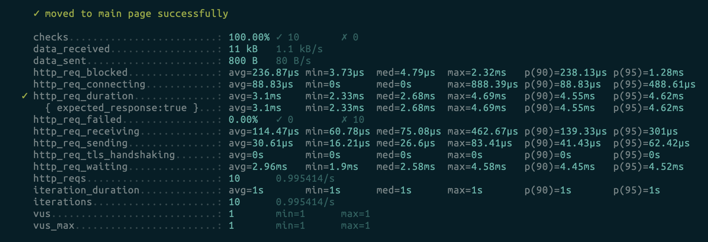
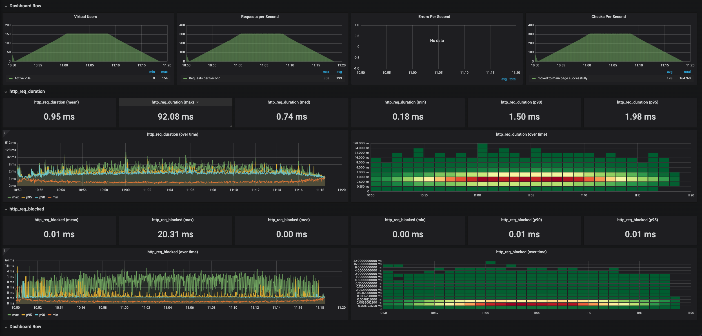
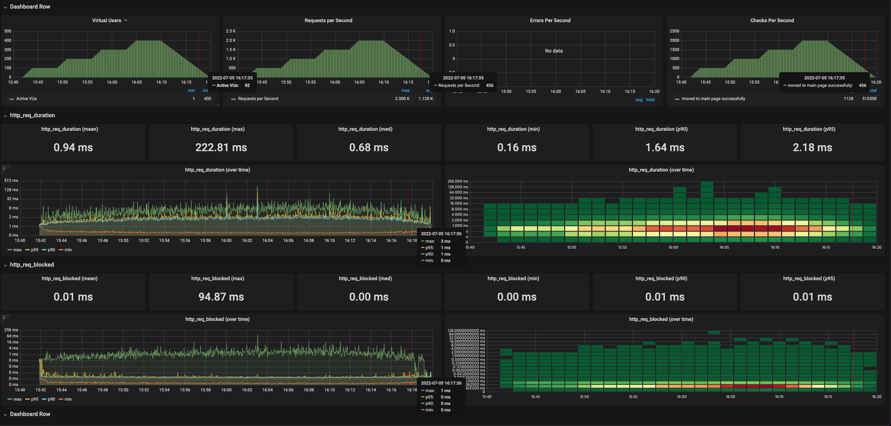
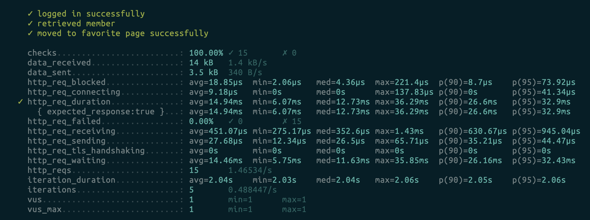
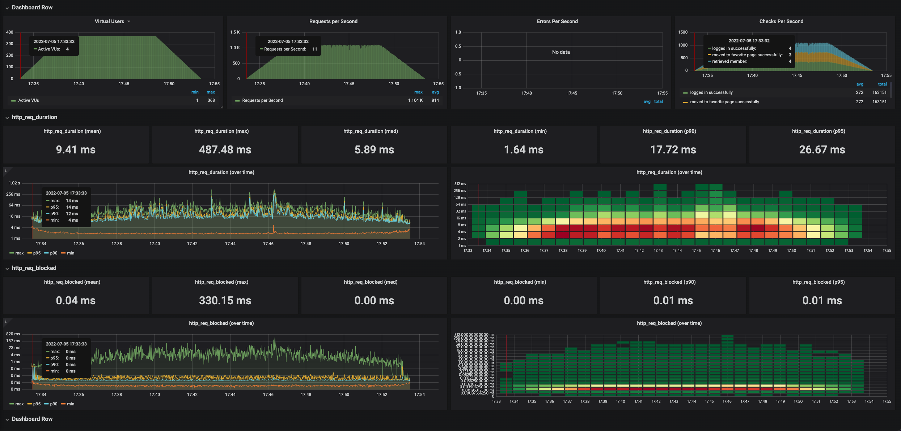
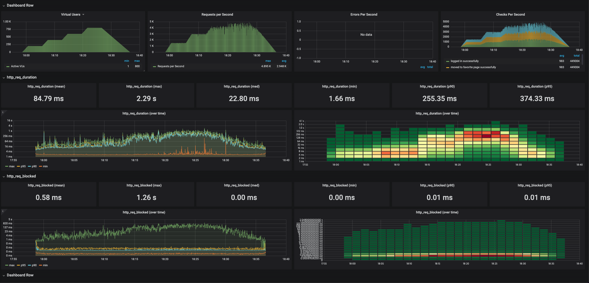
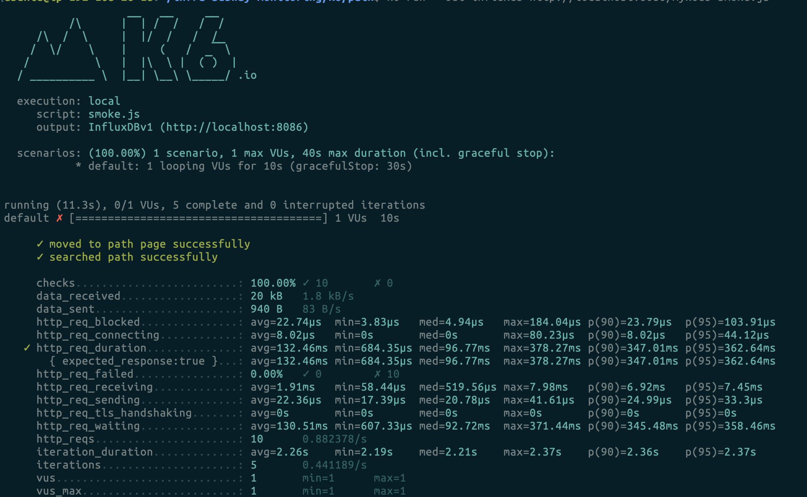
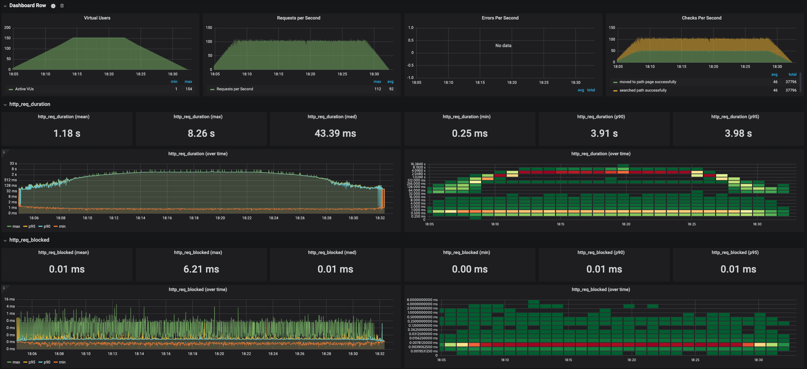

<p align="center">
    
</p>
<p align="center">
  
  
  <a href="https://edu.nextstep.camp/c/R89PYi5H" alt="nextstep atdd">
    
  </a>
  
</p>

<br>

# 인프라공방 샘플 서비스 - 지하철 노선도

<br>

## 🚀 Getting Started

### Install
#### npm 설치
```
cd frontend
npm install
```
> `frontend` 디렉토리에서 수행해야 합니다.

### Usage
#### webpack server 구동
```
npm run dev
```
#### application 구동
```
./gradlew clean build
```
<br>


### 1단계 - 웹 성능 테스트
1. 웹 성능예산은 어느정도가 적당하다고 생각하시나요

* 네이버 지도

|                          | 모바일(50점) | 데스크탑(88점) |
|--------------------------|----------|-----------|
| First Contentful Paint   | 2.2s     | 0.5s      |
| Time to Interactive      | 6.7s     | 0.5s      |
| Speed Index              | 5.1s     | 2.4s      |
| Total Blocking Time      | 610ms    | 0s        |
| Largest Contentful Paint | 8.4s     | 1.6s      |
| Cumulative Layout Shift  | 0.03     | 0.006     |

* 카카오 맵

|                          | 모바일(73점) | 데스크탑(91점) |
|--------------------------|----------|-----------|
| First Contentful Paint   | 1.7s     | 0.5s      |
| Time to Interactive      | 4.2s     | 0.7s      |
| Speed Index              | 6.6s     | 2.4s      |
| Total Blocking Time      | 60ms     | 0s        |
| Largest Contentful Paint | 5.0s     | 1.3s      |
| Cumulative Layout Shift  | 0.005    | 0.039     |

* 서울교통공사

|                          | 모바일(49점) | 데스크탑(67점) |
|--------------------------|----------|-----------|
| First Contentful Paint   | 6.6s     | 1.5s      |
| Time to Interactive      | 8.7s     | 2.0s      |
| Speed Index              | 11.3s    | 2.4s      |
| Total Blocking Time      | 900ms    | 150ms     |
| Largest Contentful Paint | 7.1s     | 3.7s      |
| Cumulative Layout Shift  | 0        | 0         |

* RunningMap

|                          | 모바일(33점) | 데스크탑(69점) |
|--------------------------|----------|-----------|
| First Contentful Paint   | 14.6s    | 2.6s      |
| Time to Interactive      | 15.2s    | 2.7s      |
| Speed Index              | 14.6s    | 2.6s      |
| Total Blocking Time      | 490ms    | 40ms      |
| Largest Contentful Paint | 15.1s    | 2.7s      |
| Cumulative Layout Shift  | 0.042    | 0.004     |

RunningMap의 핵심 기능은 경로 검색과 즐겨찾기라고 생각합니다. 사용자 입장에서는 원하는 역을 입력하고 결과를
조회하는 것이 주요 관심사기 때문에 Time to Interactive, First Contentful Paint,
Largest Contentful Paint 세 가지 지표가 중요하다고 판단했습니다. 

RunningMap이 경쟁사 대비 핵심 기능만 제공하는 라이트한 앱이면서 성능 개선을 진행한 이력이 없기 때문에
성능 개선의 폭이 클거라고 예상하고 경로 검색과 즐겨찾기 페이지의 웹 성능예산을 다음과 같이 설정했습니다.
경쟁사 기준으로 20% 성능 차이를 유지해야한다는 경험 법칙도 고려했습니다.

* 모바일 점수: 80점
* 데스크탑 점수: 80점
* Time to Interactive: 5s(모바일), 0.5s(데스크탑)
* First Contentful Paint: 2s(모바일), 0.5s(데스크탑)
* Largest Contentful Paint: 6s(모바일), 1.5s(데스크탑)

2. 웹 성능예산을 바탕으로 현재 지하철 노선도 서비스는 어떤 부분을 개선하면 좋을까요

* 텍스트 압축을 사용해서 네트워크로 전송되는 바이트를 줄입니다. ex) gzip
* HTML/CSS/JS와 같은 정적파일은 압축해서 네트워크로 전송되는 바이트를 줄입니다.
* 시간에 민감하지 않은 데이터는 브라우저 캐시를 이용해서 클라이언트 측에서 요청 빈도를 줄입니다. ex) 이미지 파일
* 요청이 잦은 경로 정보는 redis 등을 이용해 서버에 캐시해서 DB 쿼리수를 줄입니다. ex) 강남 <-> 이태원
* DB 인덱스를 통해 쿼리 수행시간을 줄일 수 있을지 살펴봅니다.

---

### 2단계 - 부하 테스트
1. 부하테스트 전제조건은 어느정도로 설정하셨나요

#### 테스트 대상
1. 홈 페이지
2. 경로찾기 페이지
3. 즐겨찾기 페이지

#### 전제 조건
* DAU(Daily Active User): 1,000,000명
* 1명당 1일 평균 접속 수: 2회
* 피크 시간 집중율(최대 트래픽 / 평소 트래픽): 10
* Network latency(일반적으로 50~100ms)
  * 100ms(0.1s) 가정

#### 목표값 설정
* 1일 총 접속수
  * DAU * 1명당 1일 평균 접속 수 
  * 1,000,000회 * 2 = 2,000,000회
* 1일 평균 rps 
  * 1일 총 접속수 / 86,400s
  * 2,000,000회 / 86,400s := 23rps
* 1일 최대 rps 
  * 1일 평균 rps * 피크시간 집중율
  * 23rps * 10 = 230rps
* Throughput
  * 1일 평균 rps ~ 1일 최대 rps
  * 23rps ~ 230rps
  
#### VUser 계산1 - 홈 페이지
* http_req_duration(Total time per request): 0.5s
* 목표 rps(= 1일 최대 rps)
  * 230rps
* R(Number of requests per VU iteration)
  * 시나리오: 홈 페이지 
  * R = 1request
* T(Value larger than the time needed to complete one VU iteration)
  * T > (R * http_req_duration) + (additional compensation for network latency if tested on same vpc)
  * T > (1 * 0.5s) + (1 * 0.1s) = 0.6s
* VU(Number of virtual users)
  * VU = (목표 rps * T) / R
  * VU = 230rps * 0.6s / 1request := 138

#### VUser 계산2 - 경로 조회 
* http_req_duration(Total time per request): 1s 
* 목표 rps(= 1일 최대 rps)
  * 230rps
* R(Number of requests per VU iteration)
  * 시나리오: 경로 조회 페이지 -> 경로 검색 결과 조회 
  * R = 2requests
* T(Value larger than the time needed to complete one VU iteration)
  * T > (R * http_req_duration) + (additional compensation for network latency if tested on same vpc)
  * T > (2 * 1s) + (2 * 0.1s) = 2.2s
* VU(Number of virtual users)
  * VU = (목표 rps * T) / R
  * VU = 230rps * 2.2s / 2requests := 253

#### VUser 계산3 - 즐겨 찾기
* http_req_duration(Total time per request): 1.5s
* 목표 rps(= 1일 최대 rps)
  * 230rps
* R(Number of requests per VU iteration)
  * 시나리오: 로그인 -> 내 정보 확인 -> 즐겨찾기 페이지
  * R = 3requests
* T(Value larger than the time needed to complete one VU iteration)
  * T > (R * http_req_duration) + (additional compensation for network latency if tested on same vpc)
  * T > (3 * 1.5s) + (3 * 0.1s) = 4.8s
* VU(Number of virtual users)
  * VU = (목표 rps * T) / R
  * VU = 230rps * 4.8s / 3requests := 368


2. Smoke, Load, Stress 테스트 스크립트와 결과를 공유해주세요

#### 홈 페이지
* Smoke

* Load

* Stress


#### 즐겨 찾기
* Smoke

* Load

* Stress


#### 경로 조회
* Smoke

* Load

* Stress

---

### 3단계 - 로깅, 모니터링
1. 각 서버내 로깅 경로를 알려주세요

2. Cloudwatch 대시보드 URL을 알려주세요
