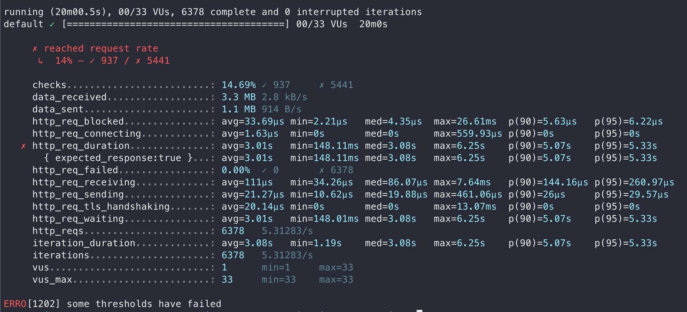
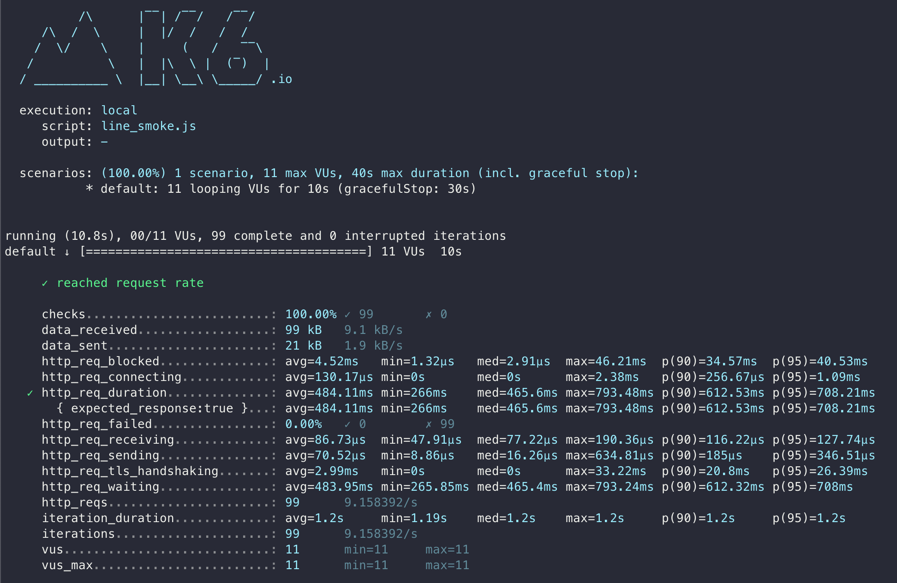
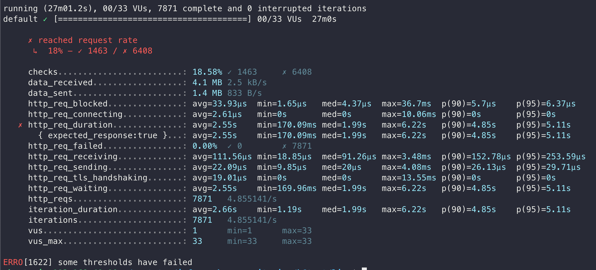
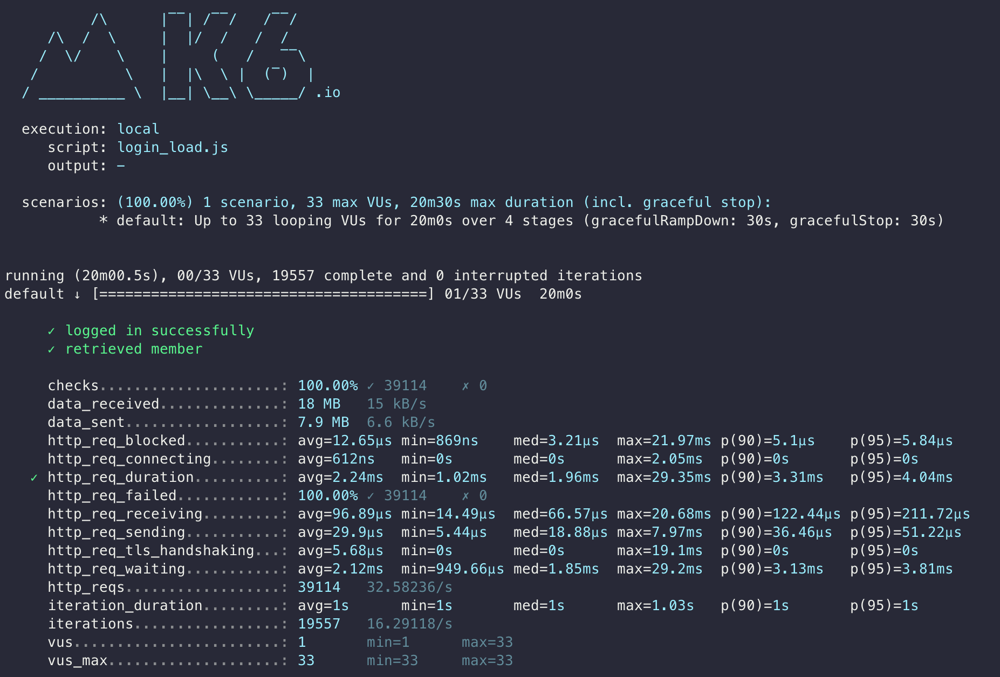
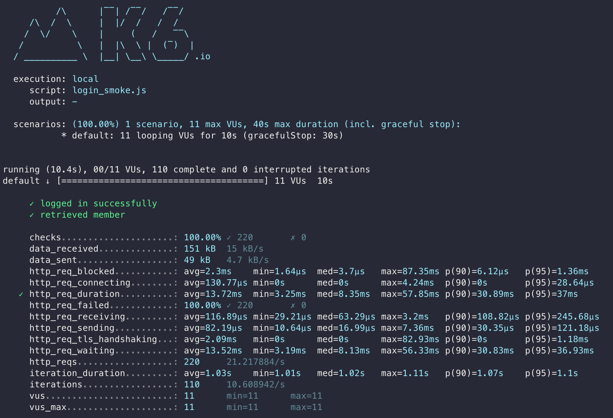
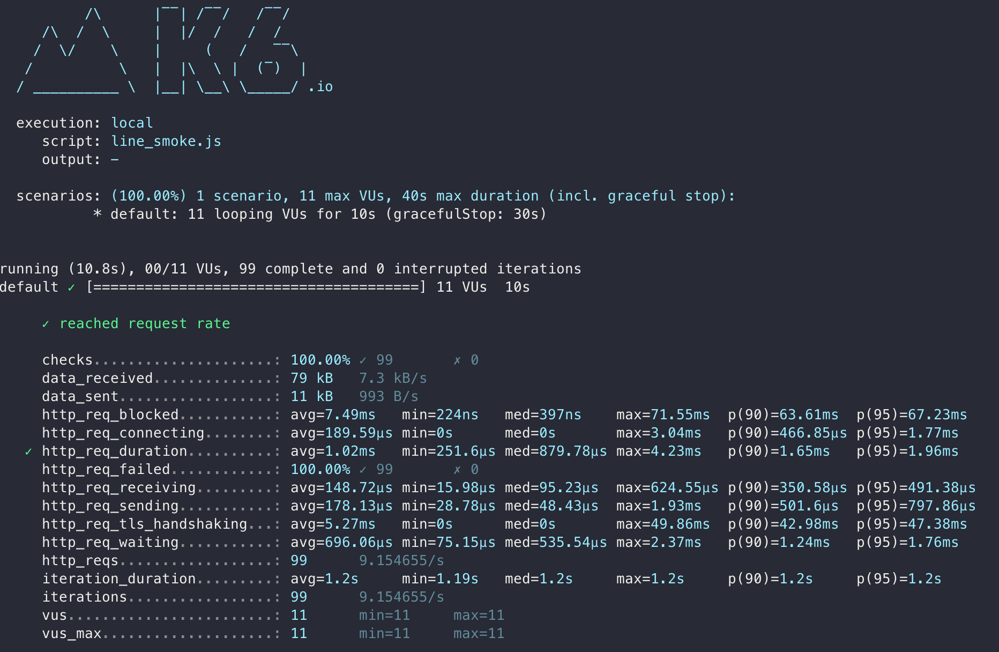
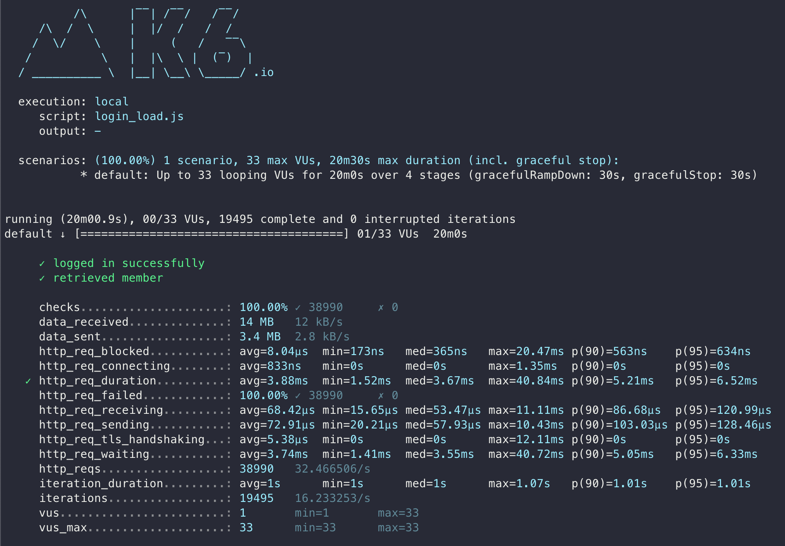
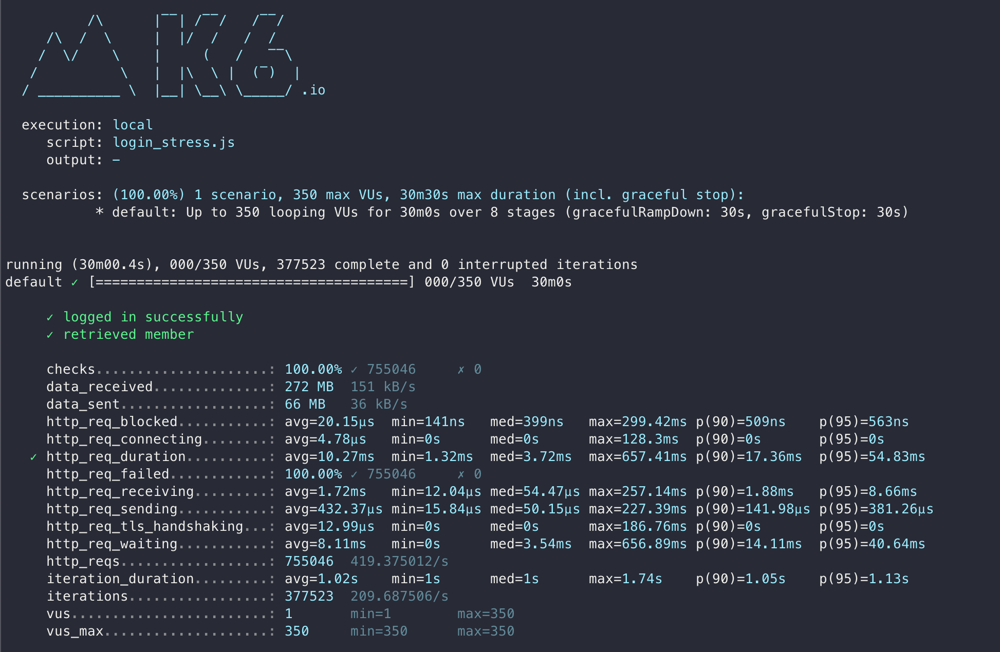
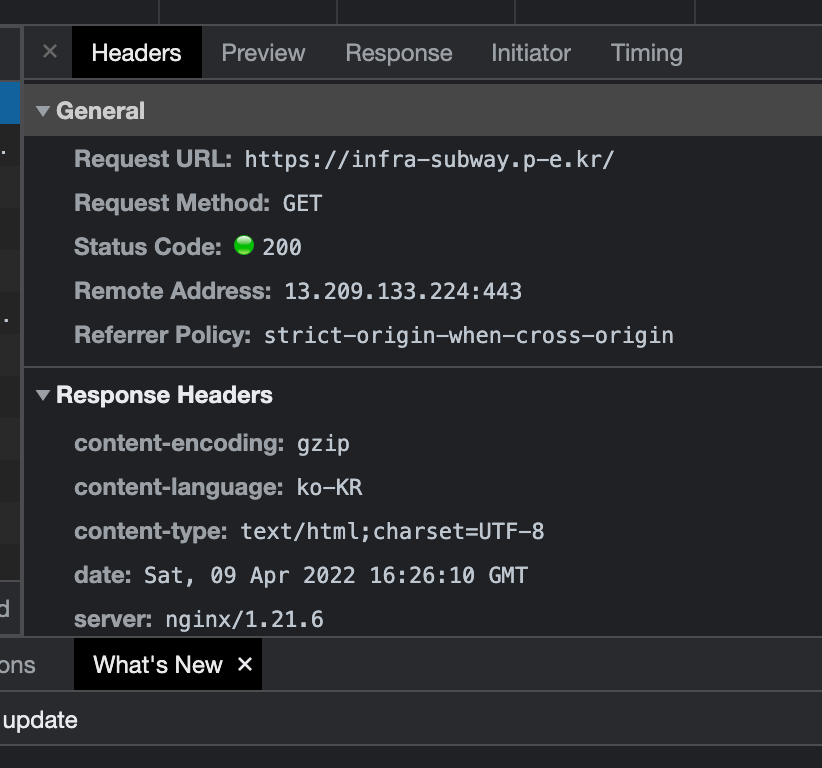
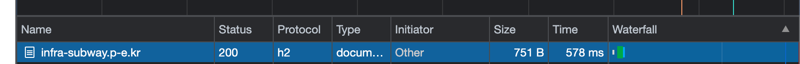

<p align="center">
    
</p>
<p align="center">
  
  
  <a href="https://edu.nextstep.camp/c/R89PYi5H" alt="nextstep atdd">
    
  </a>
  
</p>

<br>

# 인프라공방 샘플 서비스 - 지하철 노선도

<br>

## 🚀 Getting Started

### Install

#### npm 설치

```
cd frontend
npm install
```

> `frontend` 디렉토리에서 수행해야 합니다.

### Usage

#### webpack server 구동

```
npm run dev
```

#### application 구동

```
./gradlew clean build
```

<br>

### 1단계 - 성능 테스트

1. 웹 성능예산은 어느정도가 적당하다고 생각하시나요
    * | ENV             | FCP   | TTI   | SI    | TBT   | LCP  | CLS   |
                                                                                   |-------|-------|-------|-------|------|-------|---|
      | infra-subway(M) | 15.2s | 15.9s | 15.2s | 640ms | 15.8s | 0.042 |
      | infra-subway(D) | 2.7s  | 2.8s  | 2.7s  | 50ms  | 2.8s |0.004|
      | naver(M)          | 2s    | 6.2s  | 6.8s  | 180ms | 7.2s | 0.03    |
      | naver(D)          | 0.5s  | 0.5s  | 2.5s  | 0ms   | 1.5s | 0.006    |
    * 경쟁사 대비 20% 정도 향상되야 된다고 생각함.
        * | FCP  | TTI   | SI    | TBT   | LCP | CLS   |
                                                                                                                                         |-------|-------|-------|-----|-------|---|
          | 0.4s | 0.4s | 2s | 0ms | 1.2s | 0.0012 |

2. 웹 성능예산을 바탕으로 현재 지하철 노선도 서비스는 어떤 부분을 개선하면 좋을까요
    * 텍스트 기반 리소스를 압축(gzip, deflate, brotli)하여 제공
    * 사용하지 않는 자바스크립트 Lazy Loading
    * 랜더링 차단 리소스 제거하기

3. 부하테스트 전제조건은 어느정도로 설정하셨나요
    * DAU의 경우 21년 4월 지하철 이용자가 440만명 정도이고, 매년 이용자고 줄고 있기때문에 전체 이용자 수 400만명으로 잡았고, 그 중 10% 정도의 인원이 왕복으로 사용할 경우로 가정했다.
    * DAU * 1명당 1일 평균 접속수 = 1일 총 접속 수
        * 400,000 * 2 = 800,000
    * 1일 총 접속 수 / 86,000(초/일) = 1일 평균 rps
        * 800,000 / 86,000 = 9.3...
    * 1일 평균 rps x (최대 트래픽 / 평소 트래픽) = 1일 최대 rps
        * 9.3 * 3 = 27.9
    * VUser 계산
        * Login
            * T = (2 * 1.2) = 2.4
            * VUser = (9.3 * 2.4) / 2 = 11.16 (평균)
                * 33 (최대)
        * Path
            * T = (1 * 1.2) = 1.2
            * VUser = (9.3 * 1.2) / 1 = 11.16
                * 33 (최대)

4. Smoke, Load, Stress 테스트 스크립트와 결과를 공유해주세요
   
   

---

### 2단계 - 화면 응답 개선하기

1. 성능 개선 결과를 공유해주세요 (Smoke, Load, Stress 테스트 결과)
   
2. 어떤 부분을 개선해보셨나요? 과정을 설명해주세요
    1. gzip 적용 및 http2 프로토콜 적용
    2. 캐시설정
    3. Redis 적용
       

---

### [추가] 로깅, 모니터링

1. 각 서버내 로깅 경로를 알려주세요

2. Cloudwatch 대시보드 URL을 알려주세요
