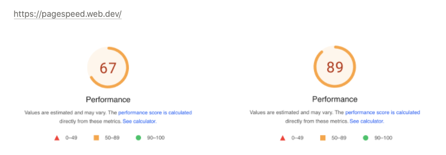
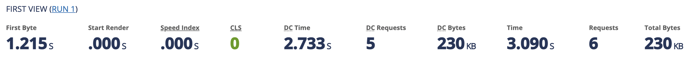

<p align="center">
    
</p>
<p align="center">
  
  
  <a href="https://edu.nextstep.camp/c/R89PYi5H" alt="nextstep atdd">
    
  </a>
  
</p>

<br>

# 인프라공방 샘플 서비스 - 지하철 노선도

<br>

## 🚀 Getting Started

### Install
#### npm 설치
```
cd frontend
npm install
```
> `frontend` 디렉토리에서 수행해야 합니다.

### Usage
#### webpack server 구동
```
npm run dev
```
#### application 구동
```
./gradlew clean build
```
<br>

## 미션

* 미션 진행 후에 아래 질문의 답을 작성하여 PR을 보내주세요.

### 1단계 - 인프라 운영하기
1. 각 서버내 로깅 경로를 알려주세요
- nginx 서버
  - `/var/log/syslog` 
  - `/var/logs/nginx/access.log`
  - `/var/logs/nginx/error.log`
- web 서버
  - `/log/file.log`

3. Cloudwatch 대시보드 URL을 알려주세요
- https://ap-northeast-2.console.aws.amazon.com/cloudwatch/home?region=ap-northeast-2#dashboards:name=bgpark82-dashboard


### 2단계 - 성능 테스트
1. 웹 성능예산은 어느정도가 적당하다고 생각하시나요
- 성능 퍼포먼스 점수 30% 개선 (pagespeed.web.dev 기준)

2. 웹 성능예산을 바탕으로 현재 지하철 노선도 서비스는 어떤 부분을 개선하면 좋을까요
- 정적 리소스 gzip 압축
  - 스프링부트의 compression 사용
  ```properties
  # 압축 사용
  server.compression.enabled=true 
  # 압축 적용할 mime 타입 지정
  server.compression.mime-types=application/json,application/xml,text/html,text/xml,text/plain,application/javascript,text/css
  # 응답의 크기가 1024를 넘어가면 gzip 압축 (기본값 2048)
  server.compression.min-response-size=1024
  ```
  - 출처 : https://gunju-ko.github.io/spring/spring-boot/2018/06/16/SpringBootCompression.html
- 정적 리소스 캐싱
  - 200, 203, 206 응답코드에 대한 브라우저 캐싱 적용
  ```properties
  spring.web.resources.cache.cachecontrol.max-age=31536000
  ```
  - 출처 : https://adunhansa.tistory.com/259
- render-blocking 리소스 제거
  - script
    - `defer` element 적용
    - HTML이 파싱되는 동안 백그라운드에서 script 파일을 다운로드
    ```javascript
    <script defer src="/js/main.js"></script>
    ```
  - style
    - css 파일 비동기적 다운로드
    ```javascript
    <link rel="stylesheet" href="/path/to/my.css" media="print" onload="this.media='all'">
    ```
  - 출처 : https://www.filamentgroup.com/lab/load-css-simpler/
- 결과
  - 67점 -> 89점 (약 30% 개선)
  
  

3. 부하테스트 전제조건은 어느정도로 설정하셨나요

4. Smoke, Load, Stress 테스트 스크립트와 결과를 공유해주세요
